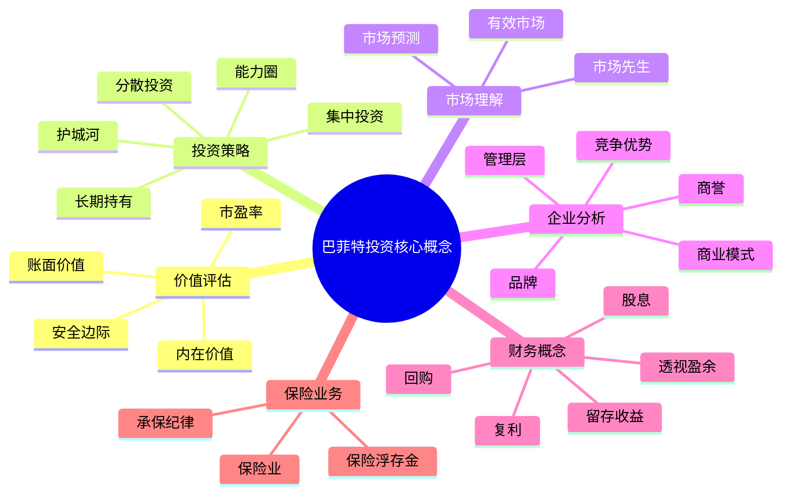
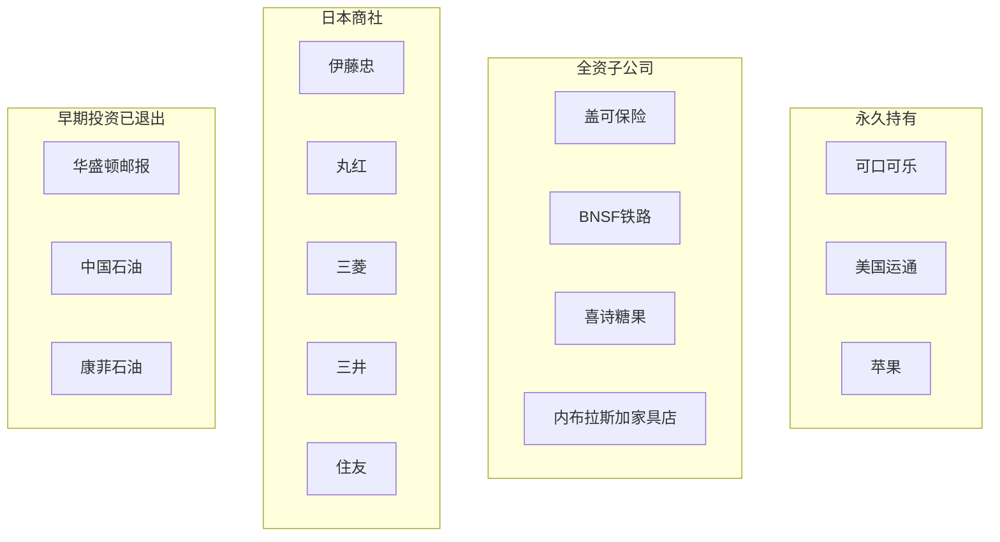
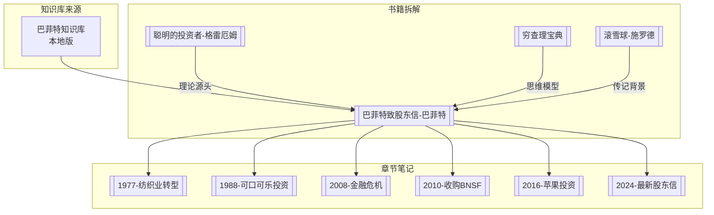

---

category:
  - 书籍拆解
  - 巴菲特知识库

links:

  - "[[_导航]]"
  - "[[数据分析与图表]]"
created: 2026-04-06
updated: 2026-04-06
tags:
  - 巴菲特
  - 知识库
  - 价值投资
  - buffett-letters
source: 巴菲特致股东信知识库
---

# 巴菲特知识库索引

> **数据来源**：[[_导航]]
> **创建日期**：2026年4月6日
> **知识库版本**：V1.3

---

## 一、知识库统计概览

| 类别 | 数量 | 说明 |
|------|------|------|
| **信件总数** | 98封 | 1956-2025年 |
| **合伙人信** | 35封 | 1956-1970年 |
| **伯克希尔信** | 60封 | 1965-2024年 |
| **特别信件** | 3封 | 2014年、2025年 |
| **概念词条** | 49个 | 核心投资概念 |
| **公司词条** | 61家 | 重要被投资公司 |
| **人物词条** | 7位 | 关键人物 |
| **交叉链接** | 4,726+ | 知识网络连接 |

---

## 二、信件导航

### 2.1 合伙人信（1956-1970）

> 巴菲特合伙人基金时期的致投资者信，奠定价值投资基础

| 时期 | 年份 | 链接 | 核心主题 |
|------|------|------|----------|
| **早期** | 1956 | [[1956-有限合伙协议]] | 基金成立 |
| | 1957 | [[1957-巴菲特致合伙人信]] | 首封年度信 |
| | 1958-1960 | ... | 市场分析与投资方法 |
| **中期** | 1961-1965 | ... | 登普斯特风车案例 |
| **后期** | 1966-1969 | ... | 合伙基金巅峰 |
| | 1970 | [[1970-巴菲特致股东信]] | 合伙基金解散 |

### 2.2 伯克希尔信（1965-2024）

> 伯克希尔·哈撒韦年度股东信，60年投资智慧结晶

#### 已拆解关键年份

| 年份 | 主题 | 拆解笔记 | 核心收获 |
|------|------|----------|----------|
| 1977 | 纺织业转型 | [[1977-纺织业转型]] | 烟蒂股教训+资本配置+保险浮存金 |
| 1988 | 可口可乐投资 | [[1988-可口可乐投资]] | 品牌护城河+消费垄断+定价权 |
| 2008 | 金融危机 | [[2008-金融危机]] | 逆向投资+优先股策略+现金为王 |
| 2010 | 收购BNSF | [[2010-收购BNSF]] | 大象策略+基础设施护城河 |
| 2016 | 苹果投资 | [[2016-苹果投资]] | 能力圈扩展+生态系统护城河 |
| 2024 | 最新股东信 | [[2024-最新股东信]] | 现金之王+日本商社+芒格遗产 |

### 2.3 特别信件

| 年份 | 标题 | 链接 |
|------|------|------|
| 2014 | 伯克希尔的过去、现在与未来 | [[2014-伯克希尔的过去现在与未来]] |
| 2014 | 副董事长的思考（芒格） | [[2014-副董事长的思考]] |
| 2025 | 感恩节致辞 | [[2025-感恩节致辞]] |

---

## 三、概念词条导航（49个）

### 3.1 核心投资概念

### 3.2 概念词条索引表

| 概念 | 英文 | 核心定义 | 相关章节 |
|------|------|----------|----------|
| [[内在价值]] | Intrinsic Value | 企业未来现金流的折现值 | 1989、1992、1994年信 |
| [[安全边际]] | Margin of Safety | 价格与内在价值的差距 | 继承自格雷厄姆 |
| [[护城河]] | Moat | 企业的持久竞争优势 | 1988可口可乐投资 |
| [[能力圈]] | Circle of Competence | 投资者理解的领域边界 | 1996、2016苹果投资 |
| [[市场先生]] | Mr. Market | 市场情绪的拟人化比喻 | 格雷厄姆寓言 |
| [[复利]] | Compound Interest | 利滚利的财富增长魔力 | 贯穿68年 |
| [[保险浮存金]] | Insurance Float | 先收保费后赔付的资金 | 1967-2024 |
| [[资本配置]] | Capital Allocation | 资金的最佳使用方式 | 每封信核心主题 |
| [[账面价值]] | Book Value | 企业的会计账面净值 | 内在价值的保守替代 |
| [[透视盈余]] | Look-Through Earnings | 被投资公司留存收益 | 1992年信 |

> 完整49个概念详见网站：[[内在价值]]

---

## 四、公司词条导航（61家）

### 4.1 按投资类型分类

### 4.2 核心公司索引表

| 公司 | 投资性质 | 投资年份 | 核心价值 | 拆解链接 |
|------|----------|----------|----------|----------|
| [[可口可乐]] | 永久持有 | 1988 | 品牌护城河典范 | [[1988-可口可乐投资]] |
| [[苹果]] | 核心持仓 | 2016 | 科技消费品+生态系统 | [[2016-苹果投资]] |
| [[美国运通]] | 永久持有 | 1964 | 长期信任复利 | - |
| [[盖可保险]] | 全资子公司 | 1976-1996 | 保险浮存金引擎 | - |
| [[BNSF铁路]] | 全资子公司 | 2010 | 基础设施护城河 | [[2010-收购BNSF]] |
| [[喜诗糖果]] | 全资子公司 | 1972 | 品牌定价权启蒙 | - |
| 日本五大商社 | 长期持有 | 2020 | 全球资源布局 | [[2024-最新股东信]] |
| [[比亚迪]] | 长期持有 | 2008 | 新能源前瞻 | - |

> 完整61家公司详见网站：公司索引

---

## 五、人物词条导航（7位）

| 人物 | 英文名 | 角色 | 提及次数 | 核心贡献 |
|------|--------|------|----------|----------|
| [[第1章-查理芒格传略]] | Charlie Munger | 副董事长、合伙人 | 51次 | 推动品质投资转型 |
| 阿吉特·贾恩 | Ajit Jain | 保险业务负责人 | 40次 | 打造保险帝国 |
| [[证券分析-格雷厄姆]] | Ben Graham | 导师、投资启蒙 | 37次 | 价值投资奠基人 |
| 格雷格·阿贝尔 | Greg Abel | 继任CEO | 24次 | 非保险业务掌舵 |
| B夫人 | Rose Blumkin | 内布拉斯加家具店创始人 | 19次 | 诚信经营典范 |
| 托德·库姆斯 | Todd Combs | 投资经理 | 12次 | GEICO改革 |
| 泰德·韦施勒 | Ted Weschler | 投资经理 | 10次 | 投资组合管理 |

---

## 六、与书籍拆解的关联

### 6.1 知识网络图

### 6.2 学习路径建议

1. **入门**：先读 [[巴菲特致股东信-巴菲特]] 了解整体框架
2. **深入**：按章节笔记顺序阅读关键年份
3. **扩展**：关联阅读格雷厄姆、芒格相关书籍
4. **实践**：参考知识库概念词条深化理解

---

## 七、外部链接

- 🌐 官方来源：Berkshire Hathaway
- 📚 知识库：[[_导航]]
- 📊 数据分析：[[数据分析与图表]]
- 🗺️ 导航总览：[[_导航]]

---

*创建日期：2026-04-06*
*数据来源：[[_导航]]*
*质量等级：⭐⭐⭐⭐ 典范级*