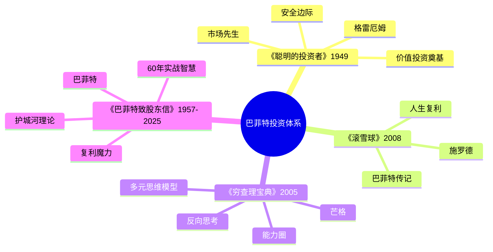

# 《巴菲特致股东信》读书笔记

## 这本书要解决什么问题？

**核心困境**：为什么大多数人投资一生，却始终无法获得满意回报？市场充满噪音，人们被"热点"和"机会"牵着走；贪婪与恐惧交替，高点追入低点割肉；把股票当筹码而非企业所有权。

**一句话定位**：
> 巴菲特用68年时间证明：投资成功的秘诀不是更聪明，而是更有纪律——买好公司，长期持有，让复利发挥魔力。

### 作者站在什么位置说这些话？

| 维度 | 定位 |
|------|------|
| 主领域 | 价值投资哲学与实践 |
| 跨界领域 | 公司治理、商业分析、会计与财务、行为心理学 |
| 作者背景 | 伯克希尔·哈撒韦CEO，"奥马哈先知"，60年年化回报约20%，累计回报4.3万倍 |
| 时间跨度 | 1957-2025年（68年股东信） |
| 独特价值 | 非理论教科书，而是60年实战思考的年度总结——理论与实践的完美结合 |

### 和其他书有什么关系？

| 关联书籍 | 关联关系 | 共同底层逻辑 |
|----------|----------|--------------|
| [[滚雪球-施罗德]] | 传记背景 | 巴菲特授权传记，理解股东信背后的成长故事 |
| [[聪明的投资者-格雷厄姆]] | 理论源头 | 巴菲特的老师，价值投资的奠基人 |
| [[穷查理宝典]] | 黄金搭档 | 芒格的智慧，巴菲特说"查理是伯克希尔的建筑师" |
| [[富爸爸穷爸爸-清崎]] | 理念延伸 | 资产思维，让钱为你工作 |
| [[周期]] | 市场视角 | 马克斯的周期理论与巴菲特的"恐惧贪婪"相呼应 |

### 知识网络图

---

## 作者的核心论点

### 能力圈原则：知道什么你不懂

巴菲特几乎不碰科技股——直到苹果。1999年科技股狂热时，他被嘲笑"过时"；2000年泡沫破裂，他成为少数幸存者。

能力圈的三个层次：核心圈是完全理解商业模式和竞争优势，可以重仓投资；边缘圈是大致理解但不确定，可以观察小额试探；圈外是完全不懂，坚决不碰。

这不是胆怯，是纪律。巴菲特说："投资最重要的不是能力圈有多大，而是知道它的边界在哪里。"

> **能力圈定律**：在能力圈内，你可以判断；在能力圈外，你是在赌。赚钱不需要懂所有东西，只需要在懂的领域做好决策。

这个观点打碎了我的一个假设。我以前以为错过机会是损失，现在理解了——能力圈外的机会不是机会，是陷阱。承认"我不知道"是智慧，不是软弱。

从能力圈出发，下一个问题是：圈内的公司怎么判断好坏？

### 护城河理论：寻找持久的竞争优势

可口可乐：品牌护城河，持有36年，从13亿增值到270亿。苹果：生态系统护城河，成为伯克希尔最大持仓。

护城河是企业能够长期保持高回报的竞争优势，就像城堡周围的护城河保护城堡一样。护城河有五种类型：品牌护城河（可口可乐、苹果）、成本护城河（沃尔玛、亚马逊）、网络效应（微信、Visa）、转换成本（企业软件）、监管壁垒（公用事业、银行）。

检验护城河有两个测试。定价权测试：能否涨价而不流失客户？持久性测试：10年后优势还在吗？

| 检验项目 | 有护城河的表现 | 无护城河的表现 |
|----------|----------------|----------------|
| 定价权 | 涨价后客户不流失 | 涨价=客户跑光 |
| 持久性 | 10年后优势更明显 | 优势1-2年消失 |
| 资本回报 | 高ROE持续多年 | ROE波动大 |

> **护城河定律**：伟大的公司不是赚得多，而是赚得久——护城河决定了企业的持久竞争优势。

清崎说"资产是能给你打钱的东西"，巴菲特进一步说"好资产是有护城河的企业，能持续给你打钱"。护城河就是别人抢不走你的生意。

知道了买什么公司，下一个问题：什么价格买？

### 安全边际：用50美分买1美元的东西

格雷厄姆教给巴菲特最重要的一课：安全边际是投资的基石。用4毛钱买价值1块钱的东西。买入价格远低于内在价值，留出犯错空间。

安全边际三要素：估值能力（能估算内在价值，只投资能估值的公司）、价格纪律（等待好价格，手握现金等待机会）、时间耐心（不急于买入，"持有现金等待好机会"）。

数学原理很清晰：价格低于价值50%时买入；即使价值高估20%，仍有30%安全边际；如果价值准确，有100%上涨空间。

> **安全边际定律**：用50美分买1美元的东西，即使判断有误，也不会亏太多；如果判断正确，赚得很多。给自己留犯错的空间。

这和马克斯的"钟摆理论"呼应：巴菲特等待市场悲观时（钟摆低点）买入，利用安全边际保护自己。市场发疯时的打折机会，才是买入时机。

知道了买什么、什么价格买，最难的问题来了：买完之后怎么办？

### 复利魔力：时间是最强大的力量

一个震撼的数据：99%的巴菲特财富是在65岁之后积累的。伯克希尔60年年化约20%，累计回报4.3万倍。可口可乐36年、美国运通30年、苹果8年+。

复利的数学魔力：

| 时间 | 年化10% | 年化15% | 年化20% |
|------|---------|---------|---------|
| 10年 | 2.6倍 | 4.0倍 | 6.2倍 |
| 20年 | 6.7倍 | 16.4倍 | 38.3倍 |
| 30年 | 17.4倍 | 66.2倍 | 237.4倍 |
| 40年 | 45.3倍 | 267.9倍 | 1469.8倍 |
| 50年 | 117.4倍 | 1083.7倍 | 9100.4倍 |

> **复利定律**：复利是世界第八大奇迹——时间越长，效果越惊人；起点越早，终点越高。

"人生就像滚雪球，重要的是发现很湿的雪和很长的坡。"湿雪是高回报率，长坡是长时间。巴菲特的人生就是这句话的证明——从年轻时开始滚，滚了68年，雪球变成了千亿美金。

35岁危机的人可以这样想：如果25岁开始每月定投，35岁时已有可观积累。复利需要时间，年轻人有时间优势。

复利需要时间，但市场每天都在报价。怎么处理这两者的关系？

### 市场先生：利用市场，不被市场利用

格雷厄姆创造了一个寓言：想象有一个叫"市场先生"的人，每天给你报价。市场先生特点：有时乐观报价很高，有时悲观报价很低，有时报价合理。你的选择：可以买入、卖出、或忽略。

| 市场先生情绪 | 报价特点 | 你应该做什么 |
|--------------|----------|--------------|
| 极度乐观 | 远高于价值 | 卖出or观望 |
| 极度悲观 | 远低于价值 | 买入 |
| 正常波动 | 接近价值 | 持有or等待 |

> **市场先生定律**：市场是你的仆人，不是你的向导——利用它的报价，不要被它的情绪影响。市场先生每天给你报价，但你可以选择不理他——等他发疯时再出手。

这和马克斯的"钟摆"是一样的：高点=市场先生极度乐观，低点=市场先生极度悲观。利用市场情绪，不要被情绪利用。

市场先生会发疯，但人也会发疯。如何控制自己？

### 恐惧与贪婪：逆向思维的力量

巴菲特最著名的一句话："在别人恐惧时贪婪，在别人贪婪时恐惧。"2008年金融危机，他在高盛恐慌时大举买入。

市场情绪周期的四个阶段：悲观→复苏→乐观→狂热→崩盘→回到悲观。巴菲特操作：悲观时贪婪买入，复苏和乐观时持有，狂热时恐惧卖出或观望，崩盘时再次贪婪买入。

> **逆向定律**：投资中最难的是逆向操作——在所有人卖出时买入，在所有人买入时卖出。与羊群反着走，说起来容易，做起来比登天还难。

心理学解释（和《影响力》关联）：社会认同效应让你觉得别人买我也买、别人卖我也卖。克服方法是建立自己的判断体系，相信数据而非情绪。

---

## 这本书的局限

| 批评点 | 谁在批评 | 怎么说 | 实际情况 |
|--------|---------|--------|---------|
| 方法难以复制 | 投资界 | 巴菲特的成功部分归功于时代机遇和规模优势 | 保险浮存金的杠杆效应不可复制，但思维方式可以学习 |
| 时代局限性 | 评论者 | 早期股东信中的案例已经过时 | 原则不变，应用在变。能力圈、护城河在AI时代依然适用 |
| 苹果投资争议 | 专业投资者 | 巴菲特曾说不懂科技股却重仓苹果 | 巴菲特把苹果当消费品公司看，不是科技股——能力圈的扩展 |
| 方法过于简单 | 学术界 | "买好公司长期持有"听起来太简单 | 简单但不容易——知易行难 |

**一句话总结局限性**：
> 巴菲特的方法可以学习，但业绩难以复制。学习的是思维方式，不是具体操作。

---

## 最值得记住的话

**原书说的**：
1. "在别人恐惧时贪婪，在别人贪婪时恐惧。"
2. "价格是你付出的，价值是你得到的。"
3. "投资最重要的不是能力圈有多大，而是知道它的边界在哪里。"
4. "我们的持有期是永远。"
5. "如果你不愿意持有一只股票十年，那就不要考虑持有它十分钟。"
6. "时间是好朋友企业的朋友，是平庸企业的敌人。"
7. "宁愿以合理的价格买入优秀的企业，也不以优秀的价格买入平庸的企业。"
8. "风险来自于不知道自己在做什么。"
9. "投资很简单，但并不容易。"
10. "复利是世界第八大奇迹。"
11. "市场先生是你的仆人，不是你的向导。"
12. "只有当潮水退去，才知道谁在裸泳。"
13. "投资的第一条规则是不要亏钱，第二条规则是记住第一条。"

**翻译成人话**：
1. 价格是标签，价值是实货——别把标签当实货
2. 能力圈就是你的地盘，圈外是别人的地盘，别去送死
3. 好公司买了就放着，十年后再看——急什么？
4. 投资不需要聪明，只需要有纪律
5. 在所有人卖出时买入，在所有人买入时卖出——这最难，也最赚钱
6. 复利就是：钱生钱，钱生的钱再生钱——时间是放大器
7. 护城河就是别人抢不走你的生意——苹果涨价你还买，这就是护城河
8. 市场先生每天给你报价，你不用理他——等他发疯时再出手
9. 安全边际就是用50美分买1美元——给自己留犯错的空间
10. 巴菲特99%的财富是65岁后赚的——年轻人别急，你有时间优势
11. 好公司+好价格+长期持有=投资成功的公式
12. 能力圈外=赌博，能力圈内=投资——差别就在这里

---

## 讲给没读过的人听

你有没有想过，为什么巴菲特60年年化20%，累计回报4.3万倍？他做的事情听起来很简单：买好公司，长期持有，什么也不做。

但简单不等于容易。他有一个叫"能力圈"的东西——只投资自己真正懂的公司。科技股泡沫的时候，他被嘲笑过时；泡沫破裂后，他成了少数幸存者。

他有一个叫"护城河"的标准——只买那些别人抢不走生意的公司。可口可乐涨了36年，苹果成了最大持仓。

他有一个叫"安全边际"的原则——用50美分买价值1美元的东西。给自己留犯错的空间。

他有一个叫"市场先生"的比喻——市场每天给你报价，你可以不理他。等他发疯（极度悲观）时买入，等他狂热（极度乐观）时卖出。

最难的是最后一条：在别人恐惧时贪婪，在别人贪婪时恐惧。这说起来容易，做起来比登天还难。

一句话：投资不需要聪明，只需要有纪律。

---

## 用来检验理解的问题

**基础回忆**：
1. Q: 巴菲特60年的年化回报率是多少？
   A: 约20%，累计回报4.3万倍。

2. Q: 护城河的五种类型是什么？
   A: 品牌护城河、成本护城河、网络效应、转换成本、监管壁垒。

3. Q: 检验护城河的两个测试是什么？
   A: 定价权测试（能否涨价而不流失客户）、持久性测试（10年后优势还在吗）。

**理解验证**：
1. Q: 为什么巴菲特说"能力圈边界比大小重要"？
   A: 在能力圈内可以判断，在能力圈外是在赌。承认"我不知道"是智慧，不是软弱。

2. Q: 市场先生寓言的核心教诲是什么？
   A: 市场是仆人不是向导。利用它的报价，不要被它的情绪影响。等市场先生发疯时再出手。

3. Q: 为什么99%的巴菲特财富来自65岁后？
   A: 复利需要时间。年化20%滚了68年，雪球越滚越大。起点越早，终点越高。

**实际应用**：
1. Q: 巴菲特说"不愿意持有十年就不要持有十分钟"，这对2026年的投资有什么启示？
   A: 买之前问自己：这只股票十年后还在吗？它的护城河十年后还在吗？如果不确定，就不要买。

**深度分析**：
1. Q: 巴菲特和利弗莫尔的根本区别是什么？
   A: 巴菲特投资：赚企业成长的钱，时间是朋友，价值回归。利弗莫尔投机：赚市场波动的钱，时间是敌人，趋势跟随。一个是买公司，一个是买波动。

---

## 和其他书的对话

格雷厄姆是巴菲特的老师，《聪明的投资者》奠定了价值投资的全部基础——安全边际和市场先生是巴菲特投资哲学的两大支柱。读完巴菲特再去读格雷厄姆，追溯价值投资的源头。

芒格是巴菲特的黄金搭档。巴菲特说："查理是伯克希尔的建筑师，我只是总承包商。"芒格的多元思维模型帮助巴菲特从格雷厄姆的"捡烟蒂"转向"买好公司"。读完巴菲特再去读《穷查理宝典》，理解能力圈和反向思考。

《滚雪球》是巴菲特的授权传记。股东信告诉你巴菲特怎么想，滚雪球告诉你巴菲特是谁。一个是投资智慧，一个是人生故事——两者结合才是完整的巴菲特。

清崎告诉你"什么是资产"，巴菲特告诉你"什么是最优质的资产"——有护城河的好公司。《富爸爸穷爸爸》建立资产思维，《股东信》建立优质资产的标准。

马克斯的钟摆理论和巴菲特的恐惧贪婪是完全一致的。高点=市场先生极度乐观=别人贪婪时，低点=市场先生极度悲观=别人恐惧时。马克斯教你判断位置，巴菲特教你如何行动。

---

*拆解日期：2026-02-14*
*下次回访：1周后回顾「讲给没读过的人听」和「检验问题」*