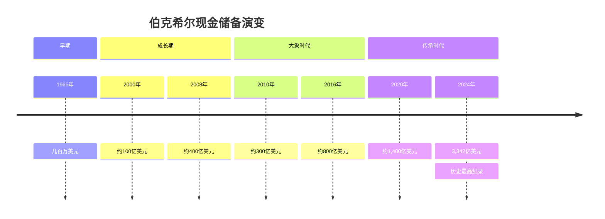
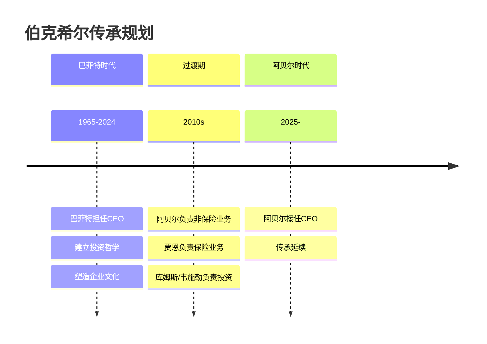
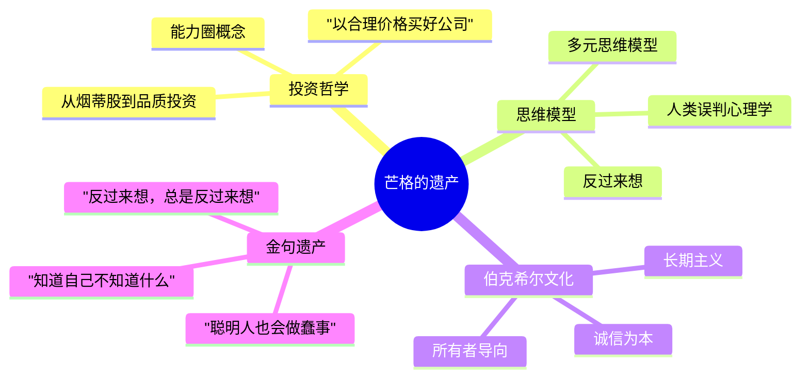
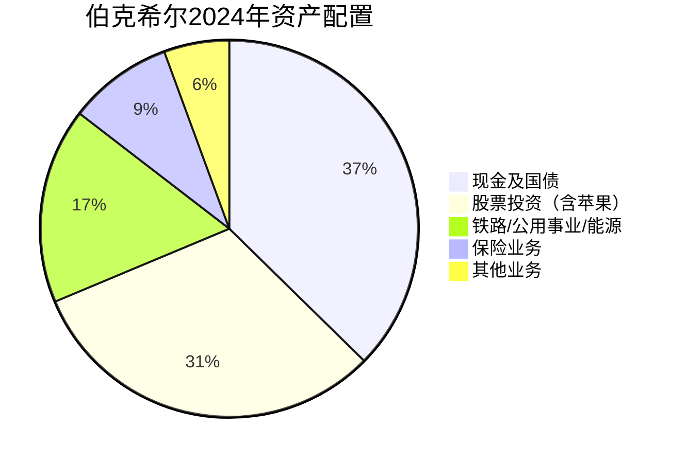
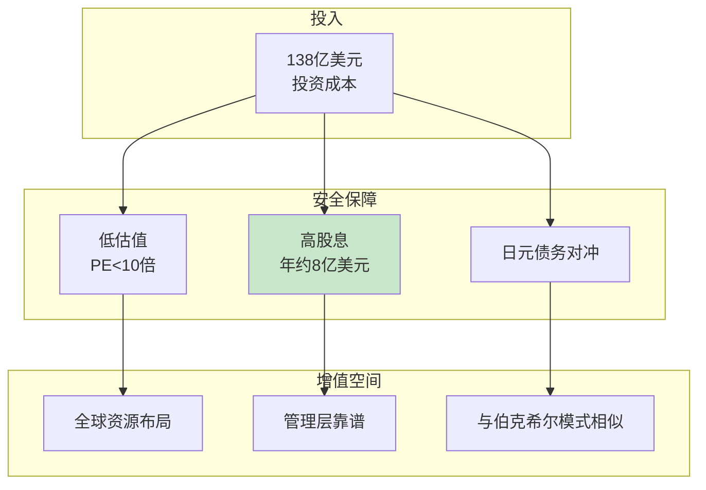

---

category:

chapter:
number: 2024
title: 最新股东信
links:

  - "[[2016-苹果投资]]"
  - "[[2008-金融危机]]"
created: 2026-04-06
tags:
  - 巴菲特
  - 价值投资
  - 日本商社
  - 传承
  - 现金储备
---

# 第2024年 最新股东信

## 一、章节定位

**全书位置**：68年股东信的"最新里程碑"，标志着伯克希尔进入传承时代。

**章节序列**：承接大象策略和科技消费品投资，开启全球布局与传承新篇章。

**一句话定位**：
> 这是巴菲特94岁的股东信——3340亿美元现金、日本五大商社、芒格的告别、阿贝尔的接班，一个时代的落幕与传承。

---

## 二、核心观点

### 观点1：现金之王——为什么持有3340亿美元现金

| 层次 | 内容 |
|------|------|
| **表层（案例）** | 2024年伯克希尔现金储备达到创纪录的3,342亿美元，同时大幅减持苹果股票。市场疑惑：为什么不投资？ |
| **中层（机制）** | 现金策略 = 等待更好的机会。巴菲特认为当前市场估值过高，找不到符合标准的投资标的。现金是危机时期的"期权"。 |
| **底层（规律）** | 现金定律：**当找不到好机会时，持有现金是最好的选择。** 不投资比投资错更好。 |

**现金储备历史对比**：

---

### 观点2：日本商社——全球化布局的新篇章

| 层次 | 内容 |
|------|------|
| **表层（案例）** | 巴菲特投资日本五大商社（伊藤忠、丸红、三菱、三井、住友），投入138亿美元，市值235亿美元，年股息收入约8亿美元。 |
| **中层（机制）** | 日本商社投资逻辑 = 低估值 + 高股息 + 全球资源布局 + 管理层靠谱。与伯克希尔模式相似，是"日本的伯克希尔"。 |
| **底层（规律）** | 全球配置定律：**在熟悉的领域寻找被低估的优质资产，不受地域限制。** 好公司不分国界。 |

**日本五大商社投资数据**：

| 商社 | 投资逻辑 | 特点 |
|------|----------|------|
| 伊藤忠 | 综合商社龙头 | 多元化经营 |
| 丸红 | 能源粮食巨头 | 资源布局 |
| 三菱 | 综合商社 | 全球网络 |
| 三井 | 能源金属 | 资源优势 |
| 住友 | 金融资源 | 综合发展 |

**日元债务对冲策略**：
- 借入日元债务，利息成本约1.35亿美元/年
- 股息收入约8.12亿美元/年
- 净收益约6.77亿美元/年
- 同时对冲汇率风险

---

### 观点3：传承与永恒——伯克希尔的制度设计

| 层次 | 内容 |
|------|------|
| **表层（案例）** | 2024年信中明确：格雷格·阿贝尔将接任CEO。巴菲特说："离格雷格接替我的日子不远了。" |
| **中层（机制）** | 传承设计 = 文化传承 + 制度保障 + 人才储备。伯克希尔的"所有者导向"文化已深入人心，超越任何个人。 |
| **底层（规律）** | 传承定律：**伟大的公司必须能超越创始人而存在。** 制度和文化比个人更重要。 |

**伯克希尔传承时间线**：

---

### 观点4：芒格的遗产——建筑师与总承包商

| 层次 | 内容 |
|------|------|
| **表层（案例）** | 2023年11月芒格去世，享年99岁。2024年股东信中，巴菲特深情缅怀这位"伯克希尔的建筑师"。 |
| **中层（机制）** | 芒格贡献 = 推动巴菲特从烟蒂股转向品质投资 + 多元思维模型 + "反过来想"的智慧。巴菲特说："查理是建筑师，我是总承包商。" |
| **底层（规律）** | 合伙定律：**伟大的成就需要伟大的伙伴。** 巴菲特+芒格是商业史上最成功的搭档之一。 |

**芒格的核心贡献**：

---

## 三、金句库

### 原书金句

1. "查理是伯克希尔的建筑师，我只是总承包商。"
2. "到了94岁，离格雷格接替我的日子不远了。"
3. "我们持有现金，因为我们找不到更好的投资。"
4. "日本五大商社的经营方式与伯克希尔颇为相似。"
5. "在2019至2023年间，我在信中使用了16次'错误'或'失误'这样的词。"

### 降维金句

1. "3340亿美元现金：巴菲特在等下一个2008年。"
2. "日本商社 = 日本的伯克希尔，巴菲特一看就懂。"
3. "芒格走了，但他留下的思维模型永存。"
4. "阿贝尔接班：巴菲特选了他，因为他最像巴菲特。"
5. "持有现金不是保守，是等待更好的机会。"
6. "日本五大商社：138亿美元投入，每年8亿美元股息，这就是价值投资。"
7. "承认错误的CEO：巴菲特5年说了16次'错误'，其他大公司一次都没说。"
8. "减持苹果不是不看好，是估值太高了。"
9. "传承不是传给一个人，是传给一种文化。"
10. "94岁的巴菲特：我该交棒了，但伯克希尔会一直走下去。"

## 四、当下映射

### 💰 财富应用

| 场景 | 具体行动 | 预期效果 | 风险提示 |
|------|----------|----------|----------|
| 现金管理 | 保持适当现金比例 | 危机时有子弹 | 机会成本 |
| 全球配置 | 关注日本、东南亚等低估市场 | 分散风险 | 汇率风险 |
| 传承规划 | 建立自己的投资系统 | 长期可持续 | 需要时间 |

### 💼 职场应用

| 场景 | 具体行动 | 能力要求 | 适用范围 |
|------|----------|----------|----------|
| 接班人培养 | 培养能够传承的团队 | 领导力 | 企业管理 |
| 制度建设 | 建立超越个人的系统 | 系统思维 | 组织发展 |
| 承认错误 | 公开承认并改正错误 | 诚实勇气 | 个人成长 |

### 🏠 生活应用

| 场景 | 具体行动 | 可行性 | 见效时间 |
|------|----------|--------|----------|
| 现金储备 | 保持6个月以上生活费 | 高 | 即时保障 |
| 全球视野 | 关注海外投资机会 | 中 | 长期 |
| 传承思维 | 把经验传承给下一代 | 中 | 长期 |

### 72小时行动计划

1. **今天**：检查你的现金比例，是否能在危机中"捡尸体"？
2. **本周**：研究日本五大商社的商业模式，理解巴菲特的投资逻辑
3. **本月**：写下你最重要的3条投资原则，作为你的"传承"

---

## 五、章节关联

### 向上关联 → 整书

- **贡献**：2024年信是68年股东信的最新篇章，体现了巴菲特投资哲学的延续与传承
- **位置**：传承时代的开启，为未来伯克希尔指明方向

### 横向关联 → 章节间

| 章节 | 关联类型 | 连接描述 |
|------|----------|----------|
| [[2008-金融危机]] | 现金策略延续 | 3340亿美元现金等待下一个危机 |
| [[2016-苹果投资]] | 减持vs持有 | 估值过高时减持的逻辑 |
| [[1988-可口可乐投资]] | 永久持有vs灵活调整 | 好公司但估值过高时可以减持 |

### 跨书关联 → 知识网络

| 书籍 | 概念 | 关系 | 备注 |
|------|------|------|------|
| [[穷查理宝典]] | 芒格遗产 | 纪念 | 建筑师的智慧永存 |
| [[周期]] | 市场周期 | 支持 | 高估值时期持有现金 |
| [[滚雪球-施罗德]] | 传记背景 | 延伸 | 传承故事的完整叙述 |

---

## 六、问答设计

### 记忆层

**Q1**: 2024年伯克希尔的现金储备是多少？
- **答案**: 3,342亿美元

**Q2**: 巴菲特投资了哪几家日本商社？
- **答案**: 伊藤忠、丸红、三菱、三井、住友（五大商社）

### 理解层

**Q3**: 为什么巴菲特持有这么多现金而不投资？
- **答案要点**: 找不到符合标准的投资标的；市场估值过高；等待更好的机会

**Q4**: 巴菲特为什么要减持苹果？
- **答案要点**: 估值过高，不是看空苹果，而是价格不划算

### 应用层

**Q5**: 普通投资者如何借鉴巴菲特的现金策略？
- **答案要点**: 保持一定现金比例；在市场高估时不勉强投资；等待更好的机会

**Q6**: 为什么巴菲特选择日本商社进行投资？
- **答案要点**: 低估值、高股息、管理层靠谱、与伯克希尔模式相似

### 分析层

**Q7**: 对比2008年和2024年巴菲特的现金策略，有什么变化？
- **答案要点**: 相同：等待机会；不同：2024年现金更多但市场尚未恐慌

### 评价层

**Q8**: 阿贝尔接任后，伯克希尔会有什么变化？
- **答案要点**: 投资哲学会延续；可能更注重运营而非股票投资；文化传承是关键

---

## 七、Mermaid图表

### 图1：2024年伯克希尔资产配置

### 图2：日本五大商社投资逻辑

---
