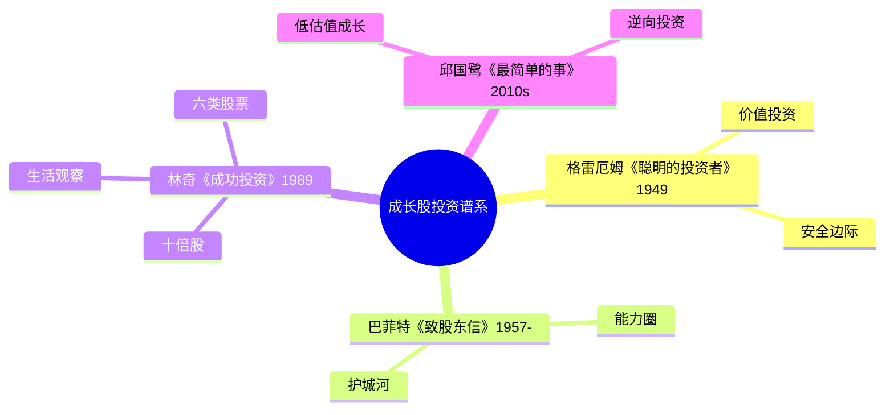

# 《彼得·林奇的成功投资》读书笔记

## 这本书要解决什么问题？

**核心困境**：华尔街分析师比你聪明吗？散户真的无法战胜专业机构吗？如何在茫茫股海中找到"十倍股"？

**一句话定位**：
> 你生活中的观察力，就是你击败华尔街机构的最大优势。

### 作者站在什么位置说这些话？

| 维度 | 定位 |
|------|------|
| 主领域 | 实战投资/成长股投资 |
| 跨界领域 | 行为金融学、消费者心理学 |
| 作者背景 | 传奇基金经理：麦哲伦基金13年年化回报率29.2%，基金从2000万增至140亿美元 |
| 与经典理论关系 | 继承格雷厄姆价值投资，但更强调成长股和实地调研 |

### 和其他书有什么关系？

| 关联书籍 | 关联关系 | 共同底层逻辑 |
|----------|----------|--------------|
| [[聪明的投资者-格雷厄姆]] | 继承+延伸 | 格雷厄姆强调"安全边际"，林奇强调"成长潜力"，都是基本面分析 |
| [[巴菲特致股东信-巴菲特]] | 互补视角 | 巴菲特"以合理价格买入优秀公司"，林奇"从生活中发现优秀公司" |
| [[滚雪球-施罗德]] | 同一时代 | 都讲述1970-1990年代美国投资黄金期 |
| [[投资中最简单的事-邱国鹭]] | 选股方法论 | 都强调"简单有效的投资方法"和"常识投资" |
| [[股票大作手回忆录-勒菲弗]] | 投资心理 | 都强调"独立思考"和"不盲从市场" |

### 知识网络图

---

## 作者的核心论点

### 业余投资者比华尔街更有优势

林奇管理的麦哲伦基金，13年年化回报率29.2%，基金规模从2000万美元增长至140亿美元，持有人超过100万人。这些数字本身已经足够震撼，但林奇真正想说的是：你也能做到。

为什么？因为业余投资者有一张华尔街分析师没有的底牌。你日常生活中第一时间接触新产品和新服务的时候，分析师还在等滞后的财报。你可以自由买入小盘股，不受规模限制；机构资金量大，根本投不进小公司。你没有季度考核压力，可以长期持有；基金经理被迫短期操作。你可以在无人关注的冷门角落寻找机会；机构只能盯着被分析师覆盖的热门股。

> **林奇优势定律**：信息优势 > 资金优势。散户虽钱少，但离消费者更近，这是机构无法比拟的优势。

下次遇到别人说"散户不可能战胜机构"，我不会再点头附和，而是想想林奇说的：你的优势不在办公室里，而在购物中心里、在你孩子的购物清单里、在你每天经过的店铺门前。

从个人优势出发，林奇自然要回答一个问题：你拿这种优势去找什么？

### 十倍股来自生活观察

林奇的妻子有一天买回"莱格斯"牌丝袜，林奇研究后买入，股价涨了6倍。他的女儿喜欢"L'Eggs"连裤袜，汉斯公司股价涨了10倍。妻子提到"唐肯甜甜圈"店铺总是爆满，投资回报可观。逛街看到"玩具反斗城"生意兴隆，果断买入。

这不是巧合。林奇发现十倍股的流程其实很朴素：日常生活中观察到异常火爆的产品或服务，然后研究公司基本面，看PEG是否小于1。如果符合就买入，不符合就放弃。

> **生活观察定律**：最好的投资机会不在华尔街的报告里，而在你家的购物中心、你的工作场所、你孩子的购物清单里。

用大白话说就是：十倍股不是在CNBC电视上找到的，而是在你太太的购物袋里找到的。你不需要成为华尔街专家，你只需要比你身边人多看一眼。

以前我认为十倍股藏在华尔街的报告里，现在理解了——最好的投资机会就在我太太的购物袋里、我孩子的玩具清单里。

但这还没完，作者进一步指出，光知道从哪里找还不够，你得知道找到的是什么类型的股票。

### 六种股票分类法：对症下药

林奇把股票分成六种类型，每种类型对应完全不同的投资策略。你不能用周期股的逻辑长期持有——会被套死；也不能用成长股的逻辑波段操作——会卖早。

缓慢增长型的公司增长率跟GDP差不多，主要靠收股息，预期收益5-10%。稳定增长型增长10-20%，获利30-50%可以考虑卖出。快速增长型增长20-30%以上，风险高但回报巨大——十倍股就藏在这里。周期型随经济周期波动，时机选择是关键。资产隐蔽型拥有被低估的资产，等待资产重估。转型困境型在扭亏为盈，博反转机会，高风险高回报。

> **分类投资定律**：你不能用周期股的逻辑长期持有（会被套），也不能用成长股的逻辑波段操作（会卖早）。先分类，再决策。

这个观点打碎了我的一个假设——我以前以为股票就是股票，买进去等涨就行。现在理解了：不同类型的股票需要完全不同的操作策略，混用就是自杀。

林奇自己就是用这套分类法管理麦哲伦基金的。他同时持有上千只股票，但每一只都清清楚楚地归入某个类别，按照对应策略操作。不是分散到乱，而是分类到精。

分类解决了"买什么"的问题，接下来要解决"买贵不贵"的问题。

### PEG估值法：比市盈率更科学

市盈率是投资中最常用的指标，但林奇认为它只说了一半的故事。市盈率20倍的公司贵不贵？如果增长率是20%，PEG等于1，合理估值。但如果增长率是40%，PEG只有0.5，那反而是低估。

PEG的公式很简单：市盈率除以增长率。PEG小于1是低估，等于1是合理，大于1是高估。关键洞察是：市盈率只是价格，增长率才是价值。用增长率修正后的市盈率，才是真实的估值。

> **PEG定律**：市盈率只是价格，增长率才是价值。用增长率修正后的市盈率，才是真实的估值。

2026年的AI公司市盈率可能50倍，但增长率80%，PEG只有0.6——用传统PE看是贵的，用PEG看是便宜的。反过来，银行市盈率5倍，但增长率3%，PEG反而高达1.7——低PE不一定是便宜。

这打碎了我对高市盈率的迷信——以前看到PE 50倍就觉得贵，现在会先问增长率是多少。高PE配上高增长，可能是便宜货。

知道了买什么、买贵不贵，最后一个问题：什么时候该警惕？

### 鸡尾酒会理论：市场情绪的反向指标

林奇在家里办鸡尾酒会，发现人们谈论的内容和股市周期密切相关。第一阶段，没人理他，都在聊牙医——无人关心股票，这正是底部，买入机会。第二阶段，有人问他"买基金危险吗"——开始谨慎讨论，上涨初期。第三阶段，大家都围着他推荐股票——热情高涨，顶部，准备卖出。第四阶段，陌生人给他推荐股票——人人都是股神，暴跌前夜。

> **情绪反向定律**：当所有人都谈论股票时，是顶部；当无人关心时，是底部。大众总是错的。

春节聚会亲戚都在问"买什么基金"，警惕，可能接近顶部。同事聚会没人聊股票都在聊裁员，机会，可能接近底部。出租车司机给你推荐股票，卖出信号。朋友说"股市是骗局再也不碰了"，买入信号。

下次遇到亲戚聚会都在聊股票，我不会再觉得是机会，而是警惕——这是顶部的信号，该考虑卖出了。

---

## 这本书的局限

| 批评点 | 谁在批评 | 怎么说 | 实际情况 |
|--------|---------|--------|---------|
| 时代局限性 | 投资界 | 1980年代的美国市场环境与2026年差异巨大 | 信息获取方式变了，但消费者优势的逻辑没变 |
| 方法过于简单化 | Moomoo等平台 | "逛商场找十倍股"在现代市场不现实 | 生活观察是起点不是终点，仍需深度研究 |
| 幸存者偏差 | 学术界 | 林奇的成功部分归功于时代红利 | 13年29.2%确实卓越，但可复制性存疑 |
| 小盘股优势减弱 | 专业投资者 | 如今机构也能通过ETF投资小盘股 | 散户的信息优势确实在缩小，但未消失 |

**一句话总结局限性**：
> 林奇的生活观察法作为投资起点依然有效，但从观察到决策之间的距离，比书中暗示的要远得多。

---

## 最值得记住的话

**原书说的**：
1. "投资你所知道的东西。"
2. "寻找十倍股的最佳地方就是从你家附近开始，在那里找不到就到大型购物中心去找。"
3. "股票不知道你持有它。"
4. "在股市中，最重要的不是智力，而是情绪稳定。"
5. "每当我听到人们说'这次不一样'时，我就知道危险即将来临。"
6. "散户的最大优势是距离消费者最近，而不是离华尔街最近。"
7. "如果你找不到一家有吸引力的公司，就把钱放在货币基金里，直到你找到为止。"
8. "不要在激动时做投资决策。"
9. "买股票的最佳时机是当大家都恐慌的时候。"
10. "我不是预言家，我只相信常识，而不相信预测。"

**翻译成人话**：
1. 你不需要成为华尔街专家，你只需要比你身边人多看一眼
2. 十倍股不是在CNBC电视上找到的，而是在你太太的购物袋里找到的
3. 机构分析师有300种股票要研究，你只需要研究你看到的3种
4. 你的优势是：你在购物中心，而他在办公室看财报
5. 不要追逐热点，要追你懂的东西
6. 当你的朋友开始给你推荐股票时，就是你要卖出的时候
7. 如果你找不到好公司，就别买，没人规定你必须满仓
8. 好公司+好价格+耐心=十倍股
9. 你不需要预测宏观经济，你只需要了解你买的公司
10. 投资最可怕的不是选错股，而是选对股后太早卖出

---

## 讲给没读过的人听

你有没有发现，每次股市大涨的时候你冲进去，大跌的时候你跑出来？林奇说，你其实比华尔街的基金经理有优势——不是因为你更聪明，而是因为你离消费者更近。

林奇的妻子买回一种丝袜，他研究了一下公司，买入，涨了6倍。女儿喜欢某个品牌的连裤袜，他跟踪那家公司，涨了10倍。他逛街看到甜甜圈店总是排队，投资，回报可观。他不需要看K线图、不需要听分析师电话会议，他只需要打开眼睛看身边发生了什么。

当然，光看到热闹不够。林奇教你两步：先看这是什么类型的公司（快速增长型最可能出十倍股），再看PEG是不是小于1（市盈率除以增长率）。两步都过关，就买；不过关，就等。

最关键的一句话：如果你找不到好公司，就别买。没人规定你必须满仓。

---

## 用来检验理解的问题

**基础回忆**：
1. Q: 林奇管理的麦哲伦基金年化回报率是多少？
   A: 29.2%，持续13年。

2. Q: 林奇将股票分为哪六种类型？
   A: 缓慢增长型、稳定增长型、快速增长型、周期型、资产隐蔽型、转型困境型。

3. Q: PEG的公式是什么？
   A: PEG = 市盈率 / 增长率。PEG < 1 表示低估。

**理解验证**：
1. Q: 为什么林奇说业余投资者比华尔街更有优势？
   A: 业余投资者离消费者更近，可以第一时间接触新产品；不受资金规模限制，可以投资小盘股；没有短期业绩压力，可以长期持有。

2. Q: 鸡尾酒会理论的四个阶段分别对应什么市场状态？
   A: 没人聊股票=底部；有人谨慎问=上涨初期；人人推荐股票=顶部；陌生人推荐=暴跌前夜。

3. Q: 为什么PEG比市盈率更科学？
   A: 因为市盈率只反映价格，没有考虑增长。两家公司PE都是20倍，增长率40%的公司PEG只有0.5，增长率20%的公司PEG是1。增长率才是价值。

**实际应用**：
1. Q: 你最近在生活中发现了什么"异常火爆"的产品或服务？用林奇的方法下一步该做什么？
   A: 先判断产品背后的公司是六种类型中的哪一种，然后研究基本面，计算PEG是否小于1。

**深度分析**：
1. Q: 林奇的生活观察法在2026年的AI时代还适用吗？
   A: 信息获取方式变了（社交媒体、APP数据），但核心逻辑没变——散户离消费者的距离依然比分析师近。不过需要警惕：生活观察是起点，不是终点。

---

## 和其他书的对话

格雷厄姆和林奇是价值投资的两代人。格雷厄姆教你"用50美分买1美元"，核心是安全边际。林奇在此基础上多走了一步——不仅买便宜的东西，还要买正在快速增长的东西。格雷厄姆找便宜货，林奇找成长股，但都坚持基本面分析。

巴菲特和林奇是同一时代的实战家，但视角互补。巴菲特说"以合理价格买入优秀公司"，强调能力圈和护城河。林奇说"从生活中发现优秀公司"，强调生活观察和实地调研。巴菲特重仓集中持有，林奇分散持有一千多只。一个像狙击手，一个像撒网捕鱼。

费雪和林奇都强调成长股投资和实地调研，但打法不同。林奇分散投资寻找十倍股，逛商场做调研，持有3-5年。费雪集中投资14只股票，用"闲聊法"做系统性访谈，持有8-30年。初学者可以先用林奇方法从生活中发现机会，再用费雪方法做系统深度验证。

勒菲弗和林奇都强调独立思考和不盲从市场，但本质不同。林奇投资：从生活中发现十倍股，赚企业成长的钱，时间是朋友。利弗莫尔投机：跟随市场趋势，赚市场波动的钱，时间是敌人。林奇适合大多数人，利弗莫尔适合少数专业人士。

---

*拆解日期：2026-02-14*
*下次回访：1周后回顾「讲给没读过的人听」和「检验问题」*
