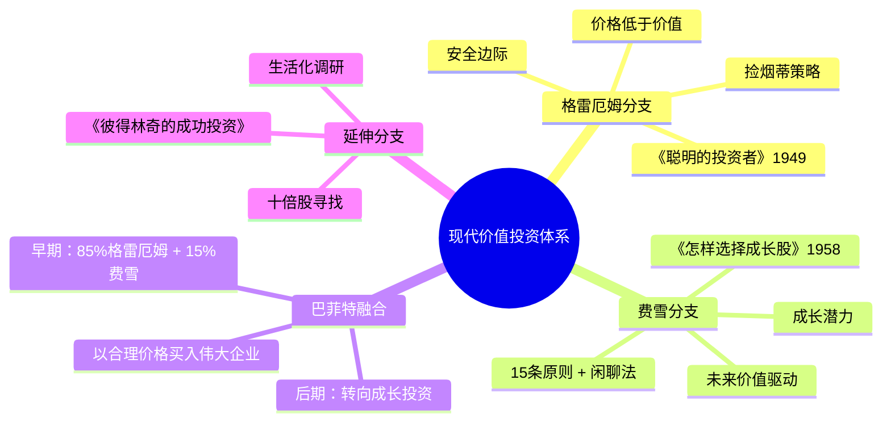

# 《怎样选择成长股》读书笔记

## 这本书要解决什么问题？

**核心困境**：传统价值投资关注"价格低于价值"，但如何找到那些能够持续增长、股价能翻几十倍的"成长型公司"？费雪用一生70年投资生涯，只买入14只股票，最短持有8-9年，最长达30年，最低回报7倍，最高收益数千倍。

**一句话定位**：
> 投资的真正艺术，不是捡烟蒂，而是找到那些能持续10年、20年成长的好公司，然后长期持有。

### 作者站在什么位置说这些话？

| 维度 | 定位 |
|------|------|
| 主领域 | 成长型价值投资 |
| 跨界领域 | 企业管理、市场调研、心理学（闲聊法） |
| 作者背景 | 成长股投资之父，与格雷厄姆并列为现代价值投资两大奠基人 |
| 理论地位 | 巴菲特"85%格雷厄姆+15%费雪"中的15% |
| 实战战绩 | 摩托罗拉21年19倍，德州仪器15年30倍 |

### 和其他书有什么关系？

| 关联书籍 | 关联关系 | 共同底层逻辑 |
|----------|----------|--------------|
| [[聪明的投资者-格雷厄姆]] | 对立/互补 | 安全边际vs成长潜力，共同点：长期主义 |
| [[巴菲特致股东信-巴菲特]] | 继承/融合 | 巴菲特早期85%格雷厄姆+15%费雪，后期转向成长投资 |
| [[彼得林奇的成功投资-彼得林奇]] | 互补视角 | 都强调成长股和调研，林奇分散十倍股vs费雪集中长期持有 |
| [[投资最重要的事-霍华德·马克斯]] | 互补视角 | 马克斯讲周期思维，费雪讲持续增长 |

### 知识网络图

---

## 作者的核心论点

### 便宜不是价值，成长才是

费雪一生只买入14只股票。摩托罗拉持有21年，股价上涨19倍。德州仪器持有15年，获利超过30倍。每只股票持有8-30年。这是什么样的耐心？

格雷厄姆教的是"捡烟蒂"——找到价格低于价值的公司，买入等待价值回归。费雪教的是"种树"——找到能持续10年、20年成长的公司，买入等待果实长大。

两种方法的本质区别在于：格雷厄姆看的是当下资产价值，费雪看的是未来成长价值。格雷厄姆用财务指标筛选，费雪用定性原则判断。格雷厄姆追求安全边际，费雪追求增长潜力。

这个观点打碎了我对"价值投资"的假设。我以前觉得便宜才是价值，现在意识到：便宜的公司可能只是便宜的陷阱。烟蒂股没有未来。真正的价值，在于一家公司10年后值多少钱。

> **费雪复利定律**：找到一家能持续10-20年成长的公司，以合理价格买入并长期持有，复利效应会让你获得惊人的收益。

下次看到便宜的公司不涨，我不会再抱怨"市场不识货"，而是问：这家公司10年后还会在吗？它的成长潜力在哪里？

确定了找什么，接下来是：怎么找？

### 15条原则：识别伟大公司的体检表

费雪提出了著名的"15条原则"，满足得越多，公司越好。这些原则分为四大类：

**产品与业务（3条）**：市场潜力是否足够大？现有产品增长潜力耗尽时，管理层是否决心开发新产品？研发投入是否与公司规模匹配？

**销售与财务（3条）**：销售能力是否高于行业平均？利润率是否够高且能维持？成本控制是否有效？

**管理层素质（9条——最核心）**：劳资关系是否和谐？高管之间关系是否良好？管理是否有深度？财务数据是否真实透明？是否有一些行业特性值得关注？采取长期还是短期视野？融资策略是否避免过度稀释股权？管理阶层是否报喜不报忧？诚信正直态度是否毋庸置疑？

费雪的独特之处在于：与格雷厄姆、巴菲特不同，他未强调"护城河"或"竞争壁垒"。相反，他强调企业要敢于投入研发、开发新产品。优秀的管理层+持续投入=动态的护城河。

> **费雪管理定律**：在快速变化的商业世界中，真正的护城河不是现有资产，而是优秀管理层持续创新的能力。

原来管理层的人品比产品的护城河更重要。第14条"坦诚披露"和第15条"诚信正直"是底线——好公司会自己告诉你真相，坏公司才会遮遮掩掩。当管理层开始报喜不报忧，就该卖出了。

这打碎了我对"财务数据最重要"的迷信。原来财报只是公司想让你看到的一面，真正决定公司命运的，是管理层是不是正直的人。一个不诚实的管理层，再好看的财报也是假的。

有了原则，还需要一套方法去验证。费雪发明了著名的"闲聊法"。

### 闲聊法：像侦探一样调研企业

财报告诉你过去发生了什么，但你要知道的是未来会发生什么。费雪的方法是：找公司的各类相关者"闲聊"，获得比财报更真实、更深层的公司信息。

访谈对象包括：竞争对手（了解相对优劣势）、供应商（了解产品竞争力和付款情况）、顾客（了解真实使用体验）、销售人员（了解市场推广效果）、研发人员（了解技术实力）、离职员工（了解内部问题，需交叉验证）、行业工会（了解行业趋势）、银行客户经理（了解财务状况）。

费雪的经典访谈问题是："有什么事情是贵公司正在做，而您的竞争对手还没有做的？"这个问题能看出产品区分度、行业竞争格局、管理层水平、进取精神。

闲聊法的核心技巧是"机智地提出问题"和"交叉对比多个来源"。离职员工可能带偏见，竞争对手可能贬低，所以要兼听则明、偏信则暗。

> **费雪调研定律**：财报只告诉你"是什么"，闲聊法告诉你"为什么"和"会怎样"。

财报是化妆后的照片，闲聊法是卸妆后的真容。普通投资者怎么调研公司？找同行聊、找供应商聊、找客户聊。AI时代调研方法在变，但本质不变：穿透表象，理解真实。

下次遇到财报漂亮的公司，我不会只看数字就买入，而是先问：我能找到竞争对手、供应商、客户来交叉验证吗？如果只能依赖财报，那我的信息来源就太单一了。

---

## 这本书的局限

| 批评点 | 谁在批评 | 怎么说 | 实际情况 |
|--------|---------|--------|---------|
| 成长股估值难 | 实战投资者 | 未来成长难以量化，容易买贵 | 费雪强调"合理价格"，不是任意价格 |
| 需要大量时间 | 普通投资者 | 闲聊法需要大量调研时间 | 可以简化应用，聚焦核心原则 |
| 历史案例有限 | 学者 | 摩托罗拉、德州仪器已成历史 | 原则本身可以应用于新时代公司 |
| 过于依赖管理层 | 批评者 | 管理层可能变化，难以预测 | 费雪强调持续跟踪，管理层变质就卖出 |
| 集中持仓风险高 | 风险管理者 | 14只股票过于集中 | 费雪认为深度研究后集中更安全 |

> 费雪的方法适合有时间和能力深度调研的投资者，普通投资者可以借鉴核心原则，但不必完全复制14只集中持仓的模式。

---

## 最值得记住的话

**原书说的**：
1. "投资的本质是预测一家公司未来能值多少钱。"
2. "我需要的是巨大的报酬，为此我愿意等待。"
3. "当现存的有吸引力的产品线的成长潜力快要利用殆尽之际，公司管理层是否有决心继续开发新的产品或制程，来进一步提升公司的业务潜力。"
4. "有什么事情是贵公司正在做，而您的竞争对手还没有做的？"
5. "大多数人，尤其是当他们认为自己所说的话不会招来危害时，总爱畅谈他们所投身的领域，甚至无所拘束地评论他们的及竞争者。"

**翻译成人话**：
1. 便宜不是价值，成长才是
2. 捡烟蒂只能饱腹，种树才能吃一辈子果实
3. 财务报表告诉你过去，闲聊法告诉你未来
4. 管理层是公司的灵魂，人品决定最终结果
5. 找到一只好公司，然后耐心地等它长大
6. 不要只看价格，要看这家公司10年后值多少钱
7. 好公司会自己告诉你真相，坏公司才会遮遮掩掩
8. 复利的力量在于时间和耐心
9. 买入伟大公司，然后忘掉它，直到公司变坏
10. 管理层的人品比产品的护城河更重要

---

## 讲给没读过的人听

你有没有想过，为什么有些人买股票能赚几十倍？

费雪的方法跟大多数人想的完全不同。他一生只买入14只股票，每只持有8到30年。摩托罗拉持有21年，股价上涨19倍。他的逻辑很简单：找到那些能持续10年、20年成长的好公司，买入然后等待。

格雷厄姆教的是"捡烟蒂"——便宜的公司可能被低估，买入等价值回归。费雪教的是"种树"——找到好树苗，浇水等待果实长大。两种方法都是价值投资，但一个看当下，一个看未来。

费雪怎么判断公司好不好？他有15条原则，其中9条关于管理层。人品正直、坦诚披露、长期视野——这些比财务数据更重要。财报是化妆后的照片，你需要闲聊法看卸妆后的真容：找竞争对手聊、找供应商聊、找客户聊。兼听则明。

最重要的教训是：不要问我该买什么股票，问我这家公司10年后还会在吗？

---

## 用来检验理解的问题

**基础回忆**：
1. Q: 费雪一生买了几只股票？持有周期多长？
   A: 14只股票。最短8-9年，最长30年。

2. Q: 15条原则中占比最大的是哪一类？
   A: 管理层素质，占9条。最核心的是诚信正直和坦诚披露。

3. Q: 什么是"闲聊法"？
   A: 通过访谈竞争对手、供应商、顾客等获取真实信息，交叉验证判断公司质量。

**理解验证**：
1. Q: 费雪和格雷厄姆的根本分歧是什么？
   A: 格雷厄姆看当下资产价值（价格低于价值），费雪看未来成长价值（未来价值高于当前价格）。

2. Q: 为什么费雪强调"管理层的人品"比"护城河"更重要？
   A: 在快速变化的世界，静态护城河会失效，只有优秀管理层持续创新才能建立动态护城河。

3. Q: 什么时候应该卖出？
   A: 当管理层变质（不再坦诚、不再正直）或公司成长潜力耗尽。

**实际应用**：
1. Q: 用15条原则评估一家你熟悉的AI公司。
   A: 聚焦第14、15条：管理层是否报喜不报忧？诚信是否毋庸置疑？再看第1条：市场潜力是否足够大？

2. Q: 作为普通投资者，如何简化应用闲聊法？
   A: 线上社群、知乎、公众号都是信息来源。找到竞争对手讨论、供应商评价、客户真实反馈。

**深度分析**：
1. Q: 巴菲特为什么说85%格雷厄姆+15%费雪？
   A: 早期巴菲特偏安全边际，后期转向"以合理价格买入伟大企业"——这是费雪思想。两套方法的融合才是完整的价值投资。

2. Q: 费雪和林奇的区别？
   A: 林奇分散（十倍股）、费雪集中（14只）；林奇3-5年持有、费雪8-30年；林奇生活化调研、费雪系统访谈。

---

## 和其他书的对话

格雷厄姆和费雪是价值投资的两个源头。格雷厄姆教你捡烟蒂，费雪教你种树。格雷厄姆关注价格是否低于价值，费雪关注未来价值能否高于当前价格。巴菲特是两者的融合体——早期85%格雷厄姆的保守，后期15%费雪的成长。关联金句："你一直在用格雷厄姆的方法买费雪的股票，难怪越抄底越亏。"

巴菲特的书信里能清楚看到费雪的影响。早期他捡烟蒂，后来他开始说"以合理价格买入伟大企业"。这就是费雪的思想。巴菲特从费雪那里学到了：关注管理层素质、长期持有、动态护城河。如果你读完格雷厄姆觉得"安全边际就够了"，你需要读费雪补上"成长"这一块。

林奇和费雪都强调成长股和调研，但打法不同。林奇从生活中发现机会，逛商场、观察产品，分散投资十倍股。费雪系统访谈竞争对手、供应商，集中持有14只。林奇的方法更适合初学者——从熟悉的公司开始；费雪的方法更适合进阶者——深度研究后的集中持仓。可以先用林奇方法选股，再用费雪方法深度验证。

霍华德·马克斯讲周期，费雪讲持续增长。马克斯说钟摆永远摆动，高点卖低点买。费雪说如果公司能持续成长，你不需要操心钟摆。两者不矛盾：马克斯帮你判断市场整体时机，费雪帮你选具体的成长标的。

---

*拆解日期：2026-02-15*
*下次回访：1周后回顾「讲给没读过的人听」和「检验问题」*