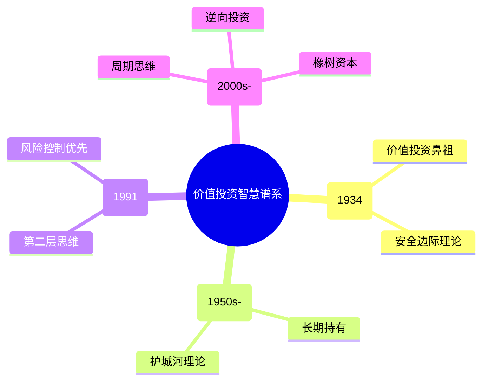

# 《投资最重要的事》拆解记录

## 这本书要解决什么问题？

**核心困境**：为什么大多数投资者无法战胜市场？因为他们停留在"第一层思维"——看到好公司就买，听到坏消息就卖。霍华德·马克斯说，投资成功的关键不是比别人更聪明，而是比别人想得更深。

**一句话定位**：
> 投资不是预测未来，而是第二层思维——在别人贪婪时恐惧，在别人恐惧时贪婪。

### 作者站在什么位置说这些话？

| 维度 | 定位 |
|------|------|
| 主领域 | 价值投资哲学 |
| 跨界领域 | 行为金融学、风险管理、周期理论 |
| 作者背景 | 橡树资本董事长，管理超1000亿美元，2008年危机中通过逆向投资获利 |
| 历史语境 | 巴菲特评价他的备忘录"我会第一时间打开"。马克斯站在实战投资者的位置，输出的是从数十年市场搏杀中提炼的思维框架 |

### 和其他书有什么关系？

| 关联书籍 | 关联关系 | 共同底层逻辑 |
|----------|----------|--------------|
| [[周期-霍华德·马克斯-拆解记录]] | 同一作者 | 《周期》讲市场规律，本书讲投资思维，姊妹篇关系 |
| [[穷查理宝典-查理·芒格-拆解记录]] | 互补思维 | 芒格的"多元思维模型"约等于马克斯的"第二层思维" |
| [[聪明的投资者-格雷厄姆-拆解记录]] | 理论继承 | 格雷厄姆的价值投资是马克斯第二层思维的实战应用 |
| [[证券分析-格雷厄姆-拆解记录]] | 理论深化 | 安全边际约等于价格远低于价值时的第二层思维机会 |

### 知识网络图

---

## 作者的核心论点

### 第二层思维：投资成功的分水岭

第一层思维："这是一家好公司，股票会涨，买入！"第二层思维："这是一家好公司，但大家都认为它好，股价已透支未来三年增长，卖出。"

大多数投资者停留在第一层，所以无法战胜市场。马克斯在2008年金融危机中做了教科书级的演示：所有人都在抛售，第一层思维说"金融危机，快逃"，第二层思维说"市场过度恐慌，优质资产被错杀，这是十年一遇的机会"。结果橡树资本大举买入，获得巨额收益。

在AI时代，信息获取零成本，第一层思维已完全失效。所有人都能看到"AI是未来"，但第二层思维会追问：这个预期是否已经反映在股价中？

> **马克斯定律**：市场有效的假设是错误的。市场在大多数时候接近有效，但在极端情绪下完全无效——而正是这些时刻，决定了你一生的投资回报。

这个观点打碎了我对"聪明就能赚钱"的迷信。投资不需要你比所有人都聪明，只需要你比多数人想得更深一层。关键不是信息，是对信息的理解。

但光想得深还不够。想得再深，如果一次亏光，就没有机会了。

### 风险控制优先：不是赚最多，而是亏最少

大多数投资者问："这只股票能涨多少？"优秀投资者问："这只股票可能亏多少？"

一次50%的亏损需要100%的涨幅才能回本。所以避免亏损比追求收益更重要。这不是保守，是数学。马克斯说："你无法预测，但你可以做准备。"

> **风险铁律**：风险不是波动，而是本金永久性亏损的可能性。一次50%的亏损需要100%的涨幅才能回本——所以避免亏损比追求收益更重要。

以前我以为投资高手是那些能预测未来的人，现在意识到这完全错了。真正的投资高手是那些活下来的人——不在于你赚多少次，在于你一次都没亏光。

控制住风险之后，下一个问题是：时机。

### 钟摆定律：市场情绪永远在摆动

2000年互联网泡沫：人人谈论互联网，没人看市盈率。2008年金融危机：人人恐慌，优质资产被抛售。2021年元宇宙炒作：历史重演。

马克斯用"钟摆"来描述市场情绪：永远在极端乐观和极端悲观之间摆动。钟摆到达最高点时，你必须卖出；到达最低点时，你必须买入。大多数人的问题：在最高点最乐观，在最低点最悲观。

> **钟摆定律**：市场情绪永远在极端乐观和极端悲观之间摆动。钟摆到达最高点时，你必须卖出；到达最低点时，你必须买入。大多数人的问题：在最高点最乐观，在最低点最悲观。

下次遇到市场暴跌，我不会再恐慌割肉，而是先问：钟摆现在在哪个位置？如果接近极端悲观，那可能正是机会。知道自己在哪里，比知道要去哪里更重要。

---

## 这本书的局限

| 批评点 | 谁在批评 | 怎么说 | 实际情况 |
|--------|---------|--------|---------|
| 过于定性 | 量化投资者 | 缺乏可量化的指标和模型 | 马克斯提供的是思维框架，不是操作手册 |
| 逆向操作说易行难 | 实战投资者 | 知道要逆向≠敢逆向 | 心理障碍确实存在，需要反复练习 |
| 只适合大资金 | 散户 | 橡树资本的策略个人无法复制 | 第二层思维和风险控制原则普适 |
| 忽视成长投资 | 成长派投资者 | 过于强调安全边际，错过高成长 | 两种风格不矛盾，可以互补 |

> 马克斯的第二层思维是投资认知的基础训练。但仅有思维还不够，还需要具体的行业知识、财务分析能力，以及最重要的——在极端时刻敢于行动的勇气。

---

## 最值得记住的话

**原书说的**：
1. "你的投资目标不是达到平均水平，你想要的是超越平均水平。因此，你的思维必须比别人更好——更强有力、水平更高。"
2. "所有表现优异的投资者，他们的成功都源于第二层思维。"
3. "你无法预测，但你可以做好准备。"
4. "风险不是波动性，而是本金永久性亏损的可能性。"
5. "在别人贪婪时恐惧，在别人恐惧时贪婪。"

**翻译成人话**：
1. 第一层思维看表面，第二层思维看本质
2. 好资产也可能是坏投资——如果你买得太贵
3. 市场不是科学，市场是人性的博弈场
4. 成功的投资=正确的逆向思维+足够的耐心
5. 知道自己在钟摆的哪个位置，比知道钟摆往哪摆更重要
6. 投资中最难的不是分析，不是预测，而是在高点时敢于卖出，在低点时敢于买入
7. 大多数人亏钱：用第一层思维，买第二层价格，承受第三层风险
8. 市场永远有效？那为什么2008年、2000年、2022年都会有恐慌
9. 不是你不够聪明，是你在该恐惧时贪婪，该贪婪时恐惧
10. 避免亏损比追求收益更重要，这是数学不是保守

---

## 讲给没读过的人听

你知道为什么大多数人投资都亏钱吗？

不是因为他们不够聪明。是因为他们只用了"第一层思维"。看到好公司就买，听到坏消息就卖。所有人都能看到的信息，已经反映在价格里了。

马克斯说，你需要"第二层思维"。好公司大家都看得到，但股价是否已经透支了？坏消息人人都怕，但市场是否过度恐慌了？

2008年金融危机是最好的例子。所有人都在抛售。马克斯的橡树资本大举买入。为什么？因为第二层思维告诉他：市场过度恐慌，优质资产被错杀，这是十年一遇的机会。

还有一个更反直觉的道理：投资最重要的不是赚最多，而是亏最少。因为亏50%需要涨100%才能回本。先活下来，再谈赚钱。

---

## 用来检验理解的问题

**基础回忆**：
1. Q: 第一层思维和第二层思维的区别是什么？
   A: 第一层思维看表面（好公司买入），第二层思维看本质（好公司但预期已透支则卖出）。

2. Q: 马克斯对"风险"的定义是什么？
   A: 风险不是波动，而是本金永久性亏损的可能性。

3. Q: 钟摆定律的核心内容是什么？
   A: 市场情绪永远在极端乐观和极端悲观之间摆动。

**理解验证**：
1. Q: 为什么"好公司≠好投资"？
   A: 如果所有人都认为它是好公司，股价可能已经透支了未来增长。买贵了就是坏投资。

2. Q: 为什么亏50%需要涨100%才能回本？
   A: 100元亏50%剩50元，50元涨回100元需要涨100%。数学上亏损的影响远大于同等幅度的盈利。

3. Q: 马克斯和格雷厄姆的关系是什么？
   A: 格雷厄姆是理论源头（安全边际、市场先生），马克斯是将这些理论发展为第二层思维框架的实战者。

**实际应用**：
1. Q: 当前AI概念股暴涨，用第二层思维怎么分析？
   A: 第一层：AI是未来，买入。第二层：预期是否已透支？如果PE=100倍，增长能否支撑？风险有多大？

2. Q: 用钟摆定律判断当前A股市场位置。
   A: 3000点震荡、估值历史低位——钟摆可能接近悲观端，是布局时机。

**深度分析**：
1. Q: 第二层思维和芒格的"多元思维模型"有什么异同？
   A: 都强调独立思考、避免从众。芒格的方法是攒100多个思维模型，遇到问题拿武器；马克斯的方法是永远比多数人多想一层。一个偏武器库，一个偏思维方式。

2. Q: 逆向投资在实践中最大的障碍是什么？
   A: 心理障碍。当所有人都在抛售时买入，你需要承受孤独和短期浮亏。认知上容易理解，执行上极其困难。

---

## 和其他书的对话

《周期》是这本书的姊妹篇。《周期》讲市场怎么运动，本书讲你怎么思考。先读《周期》理解钟摆，再读本书学习决策。

芒格和马克斯都在教同一件事：独立思考。芒格攒了100多个多元思维模型，遇到问题就拿武器；马克斯只守着一套第二层思维，每次都追问"大多数人怎么看？我是否比他们多想了一层？"一个是武器库，一个是思维习惯。芒格说"反过来想，总是反过来想"，马克斯说"在别人贪婪时恐惧"——异曲同工。

格雷厄姆是马克斯的理论底座。格雷厄姆创造了"市场先生"寓言——市场每天给你报价，你可以买也可以不买，他抑郁时买、亢奋时卖。马克斯的第二层思维把这个寓言变成了操作框架：市场先生报什么价不重要，重要的是你能不能看穿他情绪背后的真相。安全边际和第二层思维说的是同一件事：价格远低于价值时，才是真正的机会。

此外，马克斯和费思（《海龟交易法则》）代表了两种完全不同的投资风格。马克斯强调"想得更深"——独立分析、深度思考、灵活决策。费思强调"不想，只做"——机械执行、排除情绪、固定规则。适合分析型的人用马克斯的方法，适合执行型的人用费思的方法。理想状态是两者结合：分析出机会，然后机械性执行。

---

*拆解日期：2026-02-14*
*下次回访：1周后回顾「讲给没读过的人听」和「检验问题」*