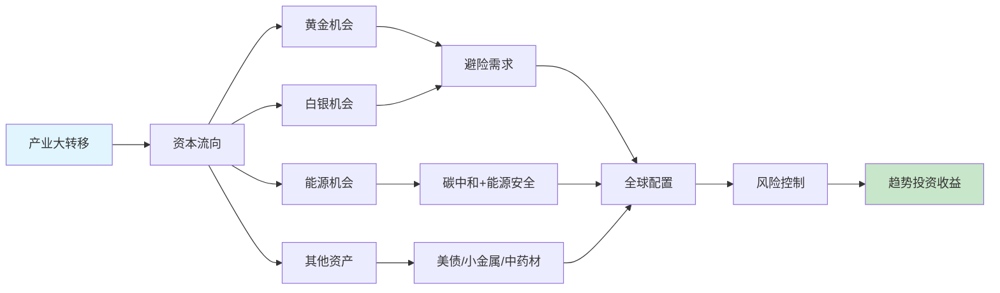

# 《时寒冰说：全球视野下的投资机会》 - 章节导航

> **作者**: 时寒冰（字暖之）
> **总章节**: 8章
> **拆解状态**: ✅ 已完成
> **最后更新**: 2026-02-28

---

## 📚 章节结构（Mermaid Mindmap）

```mermaid
mindmap
root((《时寒冰说》））
    第一部分: 趋势基础
      第1章 第五次产业大转移
        核心概念: 产业转移路径
        核心概念: 国运方向
      第2章 黄金趋势
        核心概念: 货币超发
        核心概念: 稀缺性
        核心概念: 避险需求
    第二部分: 投资标的
      第3章 白银与货币
        核心概念: 双重属性
        核心概念: 货币本质
      第4章 核电与能源
        核心概念: 碳中和
        核心概念: 能源安全
      第5章 美债分析
        核心概念: 全球资产锚
        核心概念: 利率影响
      第6章 小金属
        核心概念: 战略资源
        核心概念: 工业维生素
      第7章 中药材
        核心概念: 中国独有
        核心概念: 稀缺性
    第三部分: 投资哲学
      第8章 风险与机会共存
        核心概念: 全球配置
        核心概念: 顺应趋势
        核心概念: 风险控制
```

---

## 🔗 核心概念关联图



---


| 章节 | 标题 | 状态 | 完成日期 | 核心收获 |
|------|------|------|----------|----------|

**拆解完成率**: 8/8 = 100% ✅

---

## 🚀 快速跳转

### 按章节跳转
- [[第1章-第五次产业大转移]] - 产业转移决定投资方向
- [[第2章-黄金趋势分析]] - 黄金上涨三大逻辑
- [[第3章-白银与货币]] - 白银双重属性
- [[第4章-核电与能源]] - 能源转型机会
- [[第5章-美债分析]] - 全球资产锚
- [[第6章-小金属]] - 战略资源
- [[第7章-中药材]] - 中国独有资源
- [[第8章-风险与机会共存]] - 投资哲学

### 按主题跳转
- [[趋势投资方法论]] - 第1章、第8章
- [[贵金属投资]] - 第2章、第3章
- [[能源投资]] - 第4章
- [[资源投资]] - 第6章、第7章
- [[全球资产配置]] - 第5章、第8章

### 相关资源
- [[时寒冰说-全球视野下的投资机会-时寒冰-拆解记录]] - 主拆解笔记
- [[周期-拆解记录]] - 周期思维
- [[富爸爸穷爸爸-清崎-拆解记录]] - 财富思维
- [[非对称风险-塔勒布-拆解记录]] - 风险思维

---

## 📖 全书核心框架总结

### 三大投资方法论
1. **趋势投资** = 数据 + 逻辑 + 推演
2. **全球视野** = 跟着产业走，跟着资本走
3. **风险控制** = 全球配置 + 分散投资

### 八大投资机会
| 序号 | 投资标的 | 核心逻辑 | 章节 |
|------|----------|----------|------|
| 1 | 黄金 | 货币超发+稀缺性+避险 | 第2章 |
| 2 | 白银 | 贵金属+工业双重属性 | 第3章 |
| 3 | 核电/铀 | 碳中和+能源安全 | 第4章 |
| 4 | 美债 | 全球资产定价基准 | 第5章 |
| 5 | 小金属 | 新能源+科技需求 | 第6章 |
| 6 | 中药材 | 中国独有+稀缺性 | 第7章 |

### 五条投资原则
1. **选对市场** > 努力投资
2. **顺应趋势** > 逆势而为
3. **全球配置** > 单一市场
4. **数据说话** > 消息猜测
5. **风险控制** > 追求收益

---

*导航创建日期：2026-02-28*
*章节拆解完成日期：2026-02-28*
*拆解方法论：系统化拆解方法论 v3.0 + chapter-deep-dive*
