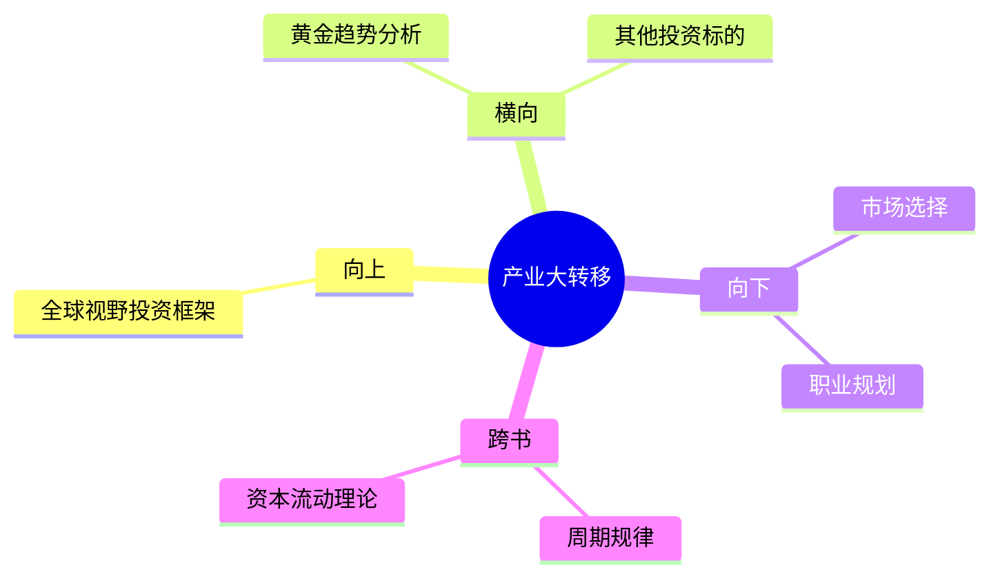

---

category: 
  - 书籍拆解
  - "《时寒冰说：全球视野下的投资机会》"
status: 🌲常青
chapter: 
number: 1
title: 第五次产业大转移与未来30年国运
links:

created: 2026-02-28
tags:
  - 时寒冰
  - 产业大转移
  - 趋势投资
  - 国运
---

# 第1章 第五次产业大转移与未来30年国运

## 📍 章节定位

### 全书位置
> 本章是全书的开篇定位，回答"为什么要用全球视野投资"的核心问题

- **全书核心问题**: 在全球视野下，如何找到投资机会？
- **本章回答的问题**: 产业正在往哪里转移？资本正在流向哪里？
- **角色类型**: 开篇定位型
- **论证位置**: 定义问题的框架，为后续章节奠定基础

### 章节序列
| 方向 | 章节标题 | 逻辑连接 |
|------|----------|----------|
| 前章 | 无（开篇） | - |
| 后章 | [[第2章-黄金趋势分析]] | 用产业转移的框架分析具体投资标的 |

### 一句话定位
> 第1章是全书开篇定位，回答"产业大转移决定投资方向"，为后续各投资品种分析奠定理论基础

---

## 🎯 核心观点

### 第一层：表层案例
> 章节中的具体案例、故事、数据

| 案例名称 | 简要描述 | 数据支撑 |
|----------|----------|----------|
| 日本股市上涨 | 2020年后日本股市和楼市大幅上涨 | 产业流入效应 |
| 巴菲特投资日本 | 巴菲特对日本的大手笔投资 | 跟随产业转移规律 |
| 历史产业转移 | 前4次产业大转移的路径 | 英国→美国→日本→亚洲四小龙→中国 |

### 第二层：中层机制
> 案例背后的运行机制、方法论

```
【产业转移机制图】

成本上升 + 政策变化 + 技术迭代
         ↓
    产业开始转移
         ↓
    ┌────────────────────────────┐
    │   产业流入地              │
    │   - 就业增加              │
    │   - 收入提高              │
    │   - 消费增长              │
    │   - 经济繁荣              │
    └────────────────────────────┘
         ↓
    投资机会涌现
```

**机制总结**：
1. 产业流入 → 就业增加 → 收入提高 → 消费增长 → 经济繁荣
2. 产业流出 → 就业减少 → 收入下降 → 消费萎缩 → 经济下行
3. 投资本质 = 跟着产业走

### 第三层：底层规律
> 可迁移的普遍规律

| 规律陈述 | 抽象层级 | 知识连接 | 适用范围 |
|----------|----------|----------|----------|
| 资本和产业会流向成本更低、效率更高、环境更稳定的地方 | 经济学基本规律 | [[国富论-亚当·斯密]] | 全球经济 |
| 产业转移是周期性的，每30-50年一次 | 历史规律 | [[周期]] | 工业革命以来 |
| 跟着产业走，就是跟着机会走 | 投资方法论 | [[富爸爸穷爸爸-清崎]] | 个人投资 |

---

## 💬 降维翻译

### 观点1: 产业转移决定国运

#### 原文表达
> 产业在重新进行大转移，在产业流入国进行投资，将会发现机会满地；而在产业流出国，经济下行，失业激增，做什么都难以赚到钱。

#### 降维翻译（中学生能懂）
工厂往哪里搬，哪里就有工作、有钱赚、有发展。工厂搬走的地方，人会失业、生意会变差、机会会变少。

#### 日常类比（奶奶能懂）
就像100年前欧洲工厂搬到美国，美国变强了；后来美国工厂搬到日本，日本变富了；再后来搬到中国，中国发展了。现在工厂又在往新的地方搬。

#### 检验
- Q: 如果一个中学生问你这是什么意思？
- A: 就像候鸟南飞一样，工厂也会寻找最适合的地方。哪里工厂多，哪里就富裕。

---

### 观点2: 投资要顺应产业转移

#### 原文表达
> 如果你在产业流入国进行投资，将会发现机会满地，赚钱容易，而在产业流出国，经济下行，失业激增，做什么都难以赚到钱。

#### 降维翻译（中学生能懂）
做生意要选对地方。去工厂多的地方开店，客人就多；去工厂搬走的地方开店，客人就少。

#### 日常类比（奶奶能懂）
就像种庄稼，要选肥沃的土地。在肥沃的土地上，随便撒种子都能长；在贫瘠的土地上，怎么浇水施肥都不行。

---

## ✨ 金句库

### 原书金句
| 金句 | 适用场景 |
|------|----------|
| "全球化在坍塌，世界在撕裂，产业在重新进行大转移。" | 宏观趋势文章引用 |
| "在产业流入国进行投资，将会发现机会满地。" | 投资建议文章 |
| "投资必须顺应大趋势。" | 方法论总结 |

### 降维金句
| 金句 | 来源观点 | 适用场景 |
|------|----------|----------|
| "工厂往哪里搬，哪里就有机会" | 产业转移 | 大众传播 |
| "跟着产业走，就是跟着机会走" | 投资方法论 | 朋友圈分享 |
| "选对池塘比努力游泳更重要" | 市场选择 | 短视频 |

## 🔗 当下映射

### 💰 财富应用
| 场景 | 具体行动 | 预期效果 | 风险提示 |
|------|----------|----------|----------|
| 投资决策 | 关注产业流入国的股市和房产 | 长期增值 | 政策风险 |
| 职业选择 | 在产业流入地找工作 | 收入增长 | 语言文化障碍 |

### 💼 职场应用
| 场景 | 具体行动 | 所需能力 | 适用职级 |
|------|----------|----------|----------|
| 职业规划 | 关注产业转移趋势 | 宏观视野 | 全职级 |
| 企业选址 | 在产业流入地设厂 | 战略眼光 | 高管 |

### 🏠 生活应用
| 场景 | 具体行动 | 可行性 | 见效时间 |
|------|----------|--------|----------|
| 资产配置 | 关注产业流入国的投资机会 | 中 | 3-5年 |
| 迁移决策 | 考虑搬到产业流入地 | 低 | 5-10年 |

### 72小时行动计划
1. **明天**: 搜索"第五次产业大转移"的相关信息，了解转移方向
2. **本周**: 检查自己的投资组合，是否与产业转移方向一致
3. **本月**: 关注一个产业流入国的经济数据

---

## 🕸️ 章节关联

### 向上关联 → 整书
- **贡献**: 本章确立全球视野的投资框架，是后续各投资品种分析的基础
- **位置**: 论证的起点，定义问题的框架

### 横向关联 → 章节间
| 章节编号 | 章节标题 | 关联类型 | 连接描述 |
|----------|----------|----------|----------|
| 第2章 | 黄金趋势分析 | 铺垫 | 用产业转移框架分析黄金投资 |

### 向下关联 → 具体应用
| 应用场景 | 难度 | 前置知识 |
|----------|------|----------|
| 判断投资市场 | 中 | 宏观经济基础 |
| 职业规划 | 低 | 行业了解 |

### 跨书关联 → 知识网络
| 书籍 | 概念 | 关系 | 备注 |
|------|------|------|------|
| [[周期]] | 周期规律 | 互补 | 产业转移是长周期现象 |
| [[国富论-亚当·斯密]] | 资本流动 | 延伸 | 斯密的资本理论现代化 |

### 关联可视化


---

## ❓ 问答设计

### Q1: 什么是第五次产业大转移？（记忆型）
**认知层次**: 记忆
**难度**: 低
**答案要点**:
- 产业从高成本地区向低成本地区转移
- 每30-50年发生一次
- 前四次：英国→美国→日本→亚洲四小龙→中国

### Q2: 为什么产业转移会影响投资机会？（理解型）
**认知层次**: 理解
**难度**: 中
**答案要点**:
- 产业流入→就业增加→收入提高→消费增长→经济繁荣
- 产业流出→就业减少→收入下降→消费萎缩→经济下行

### Q3: 如果要顺应产业转移，应该如何调整投资？（应用型）
**认知层次**: 应用
**难度**: 中
**答案要点**:
- 关注产业流入国的股市和房产
- 减少产业流出国的投资
- 建立全球资产配置思维

---
