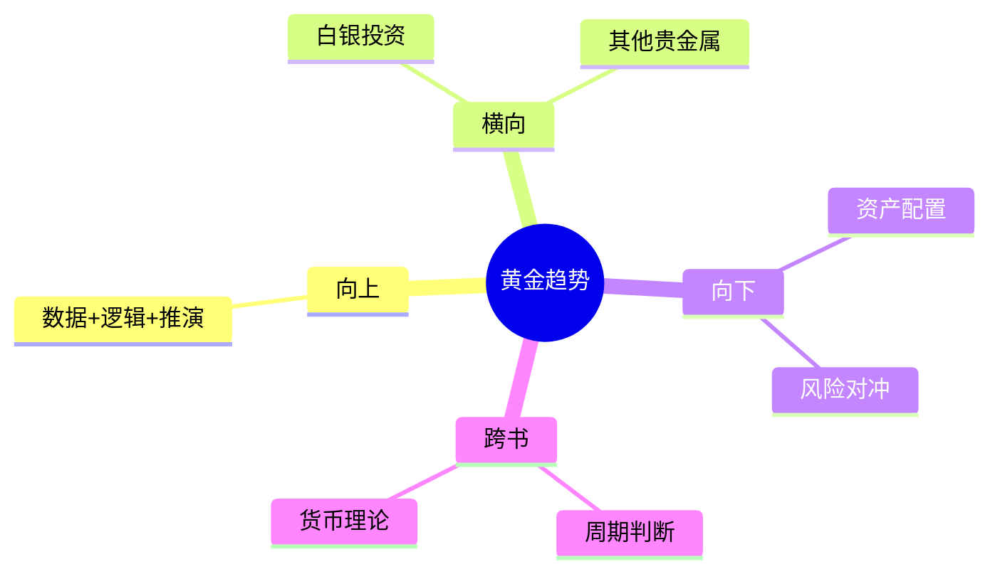

---

category: 
  - 书籍拆解
  - "《时寒冰说：全球视野下的投资机会》"
status: 🌲常青
chapter: 
number: 2
title: 黄金趋势分析
links:

  - "[[第1章-第五次产业大转移]]"
created: 2026-02-28
tags:
  - 时寒冰
  - 黄金投资
  - 趋势投资
  - 贵金属
description: "本章用数据+逻辑的方法论，深度分析黄金这一核心投资品种"
---

# 第2章 黄金趋势分析

## 📍 章节定位

### 全书位置
> 本章用数据+逻辑的方法论，深度分析黄金这一核心投资品种

- **全书核心问题**: 在全球视野下，如何找到投资机会？
- **本章回答的问题**: 黄金为什么值得投资？黄金的上涨逻辑是什么？
- **角色类型**: 核心概念型
- **论证位置**: 在产业转移框架下，分析具体投资标的

### 章节序列
| 方向 | 章节标题 | 逻辑连接 |
|------|----------|----------|
| 前章 | [[第1章-第五次产业大转移]] | 承接产业转移框架，应用到黄金分析 |
| 后章 | [[第3章-白银与货币]] | 铺垫白银等其他贵金属 |

### 一句话定位
> 第2章是全书核心章节，用数据+逻辑的方法论，揭示黄金上涨的三大逻辑：货币超发、稀缺性、避险需求

---

## 🎯 核心观点

### 第一层：表层案例
> 章节中的具体案例、故事、数据

| 案例名称 | 简要描述 | 数据支撑 |
|----------|----------|----------|
| 黄金价格走势 | 2022年至今黄金从约1600美元涨至超4300美元 | 170%涨幅 |
| 央行购金 | 2022年全球央行购金1136吨，2023年1037.4吨 | 历史新高 |
| 美联储资产负债表 | 从2019年3.76万亿美元增至2022年8.97万亿美元 | 139%增长 |
| 中国M2 | 从2019年27.61万亿美元增至2024年41.92万亿美元 | 51.8%增长 |

### 第二层：中层机制
> 案例背后的运行机制、方法论

```
【黄金上涨三大逻辑】

┌─────────────────────────────────────────────────────────┐
│                    货币超发                              │
│   央行印钱 → 法币贬值 → 资产价格上涨                     │
│   美联储资产负债表 +139%                                 │
│   中国M2 +51.8%                                         │
└─────────────────────────────────────────────────────────┘
                          ↓
┌─────────────────────────────────────────────────────────┐
│                    稀缺性                                │
│   资源枯竭 → 开采成本上升 → 供给减少                     │
│   黄金储量有限，年产量稳定                               │
└─────────────────────────────────────────────────────────┘
                          ↓
┌─────────────────────────────────────────────────────────┐
│                    避险需求                              │
│   地缘冲突 → 全球化撕裂 → 资金避险                       │
│   各国央行持续增持黄金                                   │
└─────────────────────────────────────────────────────────┘
                          ↓
                    黄金价格上涨
```

**机制对比表**：

| 逻辑 | 数据支撑 | 机制解释 | 验证方式 |
|------|----------|----------|----------|
| 货币超发 | 央行资产负债表爆炸式增长 | 钱多了，黄金相对稀缺 | 看M2和资产负债表 |
| 稀缺性 | 开采成本上升、储量有限 | 供给减少，价格上升 | 看产量和储量数据 |
| 避险需求 | 地缘冲突、央行购金 | 资金寻求"终极保险" | 看央行购金数据 |

### 第三层：底层规律
> 可迁移的普遍规律

| 规律陈述 | 抽象层级 | 知识连接 | 适用范围 |
|----------|----------|----------|----------|
| 当法币信用下降时，黄金作为"货币的终极保险"必然升值 | 货币理论 | [[货币的祸害-弗里德曼]] | 全球货币体系 |
| 供给不变+需求增加=价格上涨 | 经济学基本规律 | [[国富论-亚当·斯密]] | 所有资产 |
| 数据+逻辑+推演=趋势判断 | 投资方法论 | [[周期]] | 所有投资决策 |

---

## 💬 降维翻译

### 观点1: 黄金上涨的三大逻辑

#### 原文表达
> 黄金、白银大涨的逻辑是货币超发+稀缺性+避险需求。

#### 降维翻译（中学生能懂）
各国央行疯狂印钱，钱越来越不值钱；但黄金就那么多，挖得越来越难；再加上大家怕打仗，都想把钱换成"硬通货"。

#### 日常类比（奶奶能懂）
就像大米：如果政府发了很多粮票（钱），但大米（黄金）就那么多，粮票多了，大米价格自然就涨了。再加上大家都怕饿，都抢着买大米，价格涨得更多。

#### 检验
- Q: 如果一个中学生问你这是什么意思？
- A: 假设班里每个人都有10块钱买零食，零食价格正常。如果老师突然给每个人发100块，零食价格肯定要涨。黄金就是那个"零食"。

---

### 观点2: 用数据判断趋势

#### 原文表达
> 以扎实的基本面研究为起点，通过数据与逻辑，对趋势进行系统推演。

#### 降维翻译（中学生能懂）
不是猜黄金涨不涨，是看数据说话。央行印了多少？买了多少黄金？供给够不够？

#### 日常类比（奶奶能懂）
就像看天气预报：不是猜明天会不会下雨，是看气压、湿度、风向，然后判断。时寒冰就是看"经济的天气预报"。

---

## ✨ 金句库

### 原书金句
| 金句 | 适用场景 |
|------|----------|
| "黄金是货币的终极保险" | 资产配置文章引用 |
| "各国央行正大规模增持黄金，推高需求" | 市场分析文章 |

### 降维金句
| 金句 | 来源观点 | 适用场景 |
|------|----------|----------|
| "各国央行疯狂印钱，但黄金就那么多，当然越来越贵" | 三大逻辑 | 大众传播 |
| "看数据不是猜涨跌，是看'经济的天气预报'" | 方法论 | 朋友圈分享 |

## 🔗 当下映射

### 💰 财富应用
| 场景 | 具体行动 | 预期效果 | 风险提示 |
|------|----------|----------|----------|
| 资产配置 | 配置5-10%的黄金或黄金ETF | 对冲法币贬值 | 短期波动 |
| 趋势跟踪 | 关注央行购金数据 | 及时调整仓位 | 数据滞后 |

### 💼 职场应用
| 场景 | 具体行动 | 所需能力 | 适用职级 |
|------|----------|----------|----------|
| 投资分析 | 用数据+逻辑分析趋势 | 数据分析能力 | 分析师 |

### 72小时行动计划
1. **明天**: 查看美联储资产负债表和中国M2的最新数据
2. **本周**: 关注一周内的黄金价格走势
3. **本月**: 评估自己的资产配置中是否有黄金

---

## 🕸️ 章节关联

### 向上关联 → 整书
- **贡献**: 本章用具体案例展示"数据+逻辑+推演"的方法论
- **位置**: 在产业转移框架下，分析第一个核心投资标的

### 横向关联 → 章节间
| 章节编号 | 章节标题 | 关联类型 | 连接描述 |
|----------|----------|----------|----------|
| 第1章 | 产业大转移 | 承接 | 用产业转移框架看黄金 |
| 第3章 | 白银与货币 | 铺垫 | 白银与黄金逻辑相似 |

### 跨书关联 → 知识网络
| 书籍 | 概念 | 关系 | 备注 |
|------|------|------|------|
| [[周期]] | 周期判断 | 互补 | 用周期思维看黄金位置 |
| [[货币的祸害-弗里德曼]] | 通胀本质 | 延伸 | 理解货币超发的危害 |

### 关联可视化


---

## ❓ 问答设计

### Q1: 黄金上涨的三大逻辑是什么？（记忆型）
**认知层次**: 记忆
**难度**: 低
**答案要点**:
- 货币超发：央行印钱，法币贬值
- 稀缺性：黄金储量有限，开采成本上升
- 避险需求：地缘冲突，资金避险

### Q2: 为什么时寒冰说"数据+逻辑+推演"很重要？（理解型）
**认知层次**: 理解
**难度**: 中
**答案要点**:
- 不是猜涨跌，是用数据支撑判断
- 可复盘的研究路径
- 提前看到趋势方向

### Q3: 如果要投资黄金，应该关注哪些数据？（应用型）
**认知层次**: 应用
**难度**: 中
**答案要点**:
- 各国央行资产负债表
- 全球央行购金数据
- 黄金产量和储量数据
- 地缘政治事件

---
