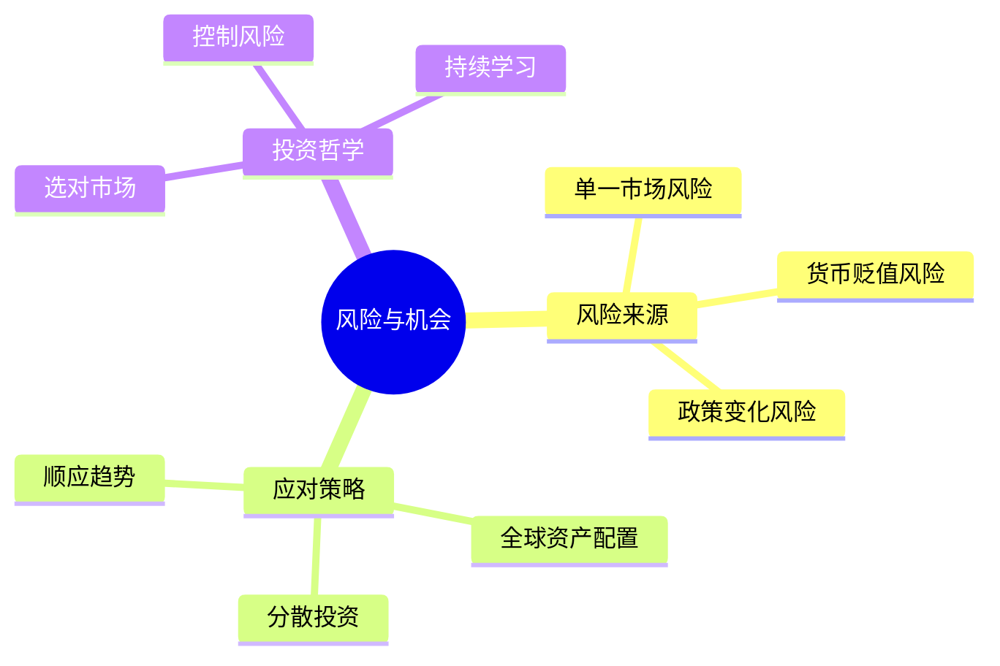

---

category: 
  - 书籍拆解
  - "《时寒冰说：全球视野下的投资机会》"
status: 🌲常青
chapter: 
number: 8
title: 风险与机会共存
links:

  - "[[第7章-中药材]]"
created: 2026-02-28
tags:
  - 时寒冰
  - 风险管理
  - 投资哲学
  - 全球配置
description: "本章是全书的收尾章节，总结投资哲学和风险管理原则"
---

# 第8章 风险与机会共存

## 📍 章节定位

### 全书位置
> 本章是全书的收尾章节，总结投资哲学和风险管理原则

- **全书核心问题**: 在全球视野下，如何找到投资机会？
- **本章回答的问题**: 如何在机会中控制风险？正确的投资心态是什么？
- **角色类型**: 整合升华型
- **论证位置**: 总结全书，升华投资哲学

### 章节序列
| 方向 | 章节标题 | 逻辑连接 |
|------|----------|----------|
| 前章 | [[第7章-中药材]] | 从具体标的到风险控制 |
| 后章 | 无（收尾章节） | - |

### 一句话定位
> 第8章是全书升华，强调"风险与机会共存"，全球资产配置是降低风险的根本之道

---

## 🎯 核心观点

### 第一层：表层案例
> 章节中的具体案例、故事、数据

| 案例名称 | 简要描述 | 数据支撑 |
|----------|----------|----------|
| 单一市场风险 | 委内瑞拉、土耳其等货币贬值 | 财富毁灭 |
| 全球配置成功 | 挪威主权基金 | 长期稳定收益 |
| 巴菲特选择美股 | 成就股神的不仅是个人能力 | 市场选择 |

### 第二层：中层机制
> 案例背后的运行机制、方法论

```
【风险与机会的平衡】

┌─────────────────────────────────────┐
│        风险来源                      │
│   - 单一市场风险                     │
│   - 货币贬值风险                     │
│   - 政策变化风险                     │
│   - 地缘政治风险                     │
└─────────────────────────────────────┘
                  ↓
┌─────────────────────────────────────┐
│        应对策略                      │
│   - 全球资产配置                     │
│   - 分散投资                         │
│   - 顺应大趋势                       │
│   - 保持学习                         │
└─────────────────────────────────────┘
                  ↓
         风险可控 + 机会可期
```

**机制对比表**：

| 风险类型 | 具体表现 | 应对策略 | 关键要点 |
|----------|----------|----------|----------|
| 单一市场风险 | 本国经济衰退 | 全球配置 | 不要把鸡蛋放在一个篮子 |
| 货币风险 | 法币贬值 | 持有硬通货资产 | 黄金、美元资产 |
| 政策风险 | 政策突变 | 分散投资 | 不要押注单一品种 |
| 认知风险 | 判断错误 | 持续学习 | 保持开放心态 |

### 第三层：底层规律
> 可迁移的普遍规律

| 规律陈述 | 抽象层级 | 知识连接 | 适用范围 |
|----------|----------|----------|----------|
| 分散投资是唯一的"免费午餐" | 投资理论 | [[聪明的投资者-格雷厄姆]] | 所有投资 |
| 风险与收益永远相伴 | 金融理论 | [[非对称风险-塔勒布]] | 所有资产 |
| 在正确的市场，普通人也能致富 | 市场规律 | [[周期]] | 全球投资 |

---

## 💬 降维翻译

### 观点1: 正确的市场比努力更重要

#### 原文表达
> 资金必须放在正确的市场当中。什么是正确的市场？就是只要选对品种或者选对企业，哪怕有剧烈的调整，也能很快修复，并给你持续带来可观投资回报的市场。

#### 降维翻译（中学生能懂）
选对池塘比努力游泳更重要。在涨潮的海里，躺着也能漂起来；在干涸的池塘里，再努力也没用。

#### 日常类比（奶奶能懂）
就像种地：在肥沃的土地上随便撒种子都能长，在盐碱地上怎么施肥都不行。

---

### 观点2: 全球配置是降低风险的根本

#### 原文表达
> 不要把所有鸡蛋放在一个篮子里，全球资产配置是降低单一市场风险的根本之道。

#### 降维翻译（中学生能懂）
不要把钱都放在一个地方。如果那个地方出问题，你就全完了。分散到不同国家、不同资产，才能睡得安稳。

#### 日常类比（奶奶能懂）
就像家里存粮：不能只存大米，也要存面粉、玉米、豆子。万一大米坏了，还有别的吃。

---

### 观点3: 投资必须顺应大趋势

#### 原文表达
> 投资必须顺应大趋势。全球化在坍塌，世界在撕裂，产业在重新进行大转移。

#### 降维翻译（中学生能懂）
跟着趋势走，不要逆着来。产业往哪里转移，机会就在哪里；钱往哪里流，你就跟到哪里。

#### 日常类比（奶奶能懂）
就像骑自行车：顺风骑轻松，逆风骑费力。投资也是，顺着大趋势，省力又安全。

---

## ✨ 金句库

### 原书金句
| 金句 | 适用场景 |
|------|----------|
| "资金必须放在正确的市场当中" | 市场选择 |
| "投资必须顺应大趋势" | 趋势投资 |
| "风险与机会共存" | 投资哲学 |

### 降维金句
| 金句 | 来源观点 | 适用场景 |
|------|----------|----------|
| "选对池塘比努力游泳更重要" | 市场选择 | 大众传播 |
| "不要把钱都放在一个地方，万一那个地方出问题你就完了" | 全球配置 | 朋友圈分享 |
| "跟着趋势走，不要逆着来" | 趋势投资 | 投资建议 |

## 🔗 当下映射

### 💰 财富应用
| 场景 | 具体行动 | 预期效果 | 风险提示 |
|------|----------|----------|----------|
| 资产配置 | 建立全球资产配置框架 | 降低单一市场风险 | 需要学习 |
| 风险控制 | 定期评估投资组合风险 | 睡得安稳 | 需要纪律 |

### 💼 职场应用
| 场景 | 具体行动 | 所需能力 | 适用职级 |
|------|----------|----------|----------|
| 职业规划 | 顺应产业转移趋势 | 宏观视野 | 全职级 |

### 72小时行动计划
1. **明天**: 列出自己目前的所有资产，检查是否过度集中
2. **本周**: 学习全球资产配置的基本知识
3. **本月**: 制定自己的全球资产配置计划

---

## 🕸️ 章节关联

### 向上关联 → 整书
- **贡献**: 本章总结全书投资哲学，强调风险控制的重要性
- **位置**: 论证的终点，升华投资智慧

### 横向关联 → 章节间
| 章节编号 | 章节标题 | 关联类型 | 连接描述 |
|----------|----------|----------|----------|
| 第1-7章 | 具体投资标的 | 整合 | 风险控制适用于所有标的 |

### 跨书关联 → 知识网络
| 书籍 | 概念 | 关系 | 备注 |
|------|------|------|------|
| [[非对称风险-塔勒布]] | 风险控制 | 互补 | 塔勒布强调"切肤之痛" |
| [[聪明的投资者-格雷厄姆]] | 安全边际 | 延伸 | 格雷厄姆强调本金安全 |
| [[周期]] | 周期位置 | 应用 | 用周期思维判断风险 |

### 关联可视化


---

## ❓ 问答设计

### Q1: 为什么说"选对市场比努力更重要"？（理解型）
**认知层次**: 理解
**难度**: 中
**答案要点**:
- 在正确的市场，选对品种能修复，持续回报
- 在错误的市场，赚钱速度跟不上货币贬值
- 成就巴菲特的不仅是他本人，还有美股市场

### Q2: 如何进行全球资产配置？（应用型）
**认知层次**: 应用
**难度**: 中
**答案要点**:
- 分散到不同国家、不同资产
- 持有部分硬通货资产（黄金、美元资产）
- 不要把所有鸡蛋放在一个篮子

### Q3: 什么是"顺应大趋势"？（理解型）
**认知层次**: 理解
**难度**: 中
**答案要点**:
- 跟着产业转移方向走
- 跟着资本流向走
- 不要逆着趋势投资

---
