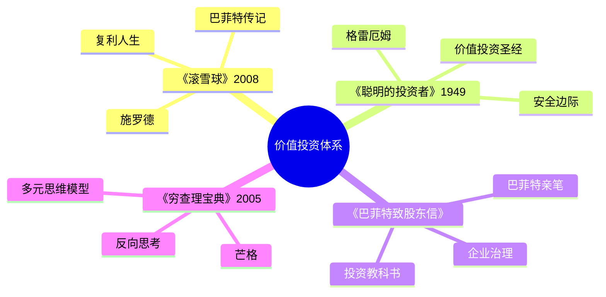

# 《滚雪球》读书笔记

## 这本书要解决什么问题？

**核心困境**：不是问"如何投资？"，而是问"一个人如何用一生的时间，把一个小雪球滚成850亿美元的财富？"价值投资听起来简单，为什么99%的人做不到？

**一句话定位**：
> 人生就像滚雪球，你需要找到很湿的雪和很长的坡道——巴菲特用78年人生告诉你，复利的力量远超想象。

### 作者站在什么位置说这些话？

| 维度 | 定位 |
|------|------|
| 主领域 | 价值投资实践、企业家传记 |
| 跨界领域 | 人生哲学、决策心理学、企业管理、美国商业史 |
| 作者背景 | 摩根士丹利前董事总经理，保险分析师，2000小时深度访谈巴菲特 |
| 历史语境 | 2008年出版，唯一经巴菲特授权的官方传记，首次完整公开其人生故事和投资决策逻辑 |

### 和其他书有什么关系？

| 关联书籍 | 关联关系 | 共同底层逻辑 |
|----------|----------|--------------|
| [[富爸爸穷爸爸-清崎]] | 延伸 | 清崎启蒙"资产思维"，巴菲特示范"如何滚大雪球" |
| [[穷查理宝典]] | 互补 | 芒格是巴菲特的黄金搭档，两本书是伯克希尔的完整拼图 |
| [[周期]] | 互补 | 马克斯讲"周期位置"，巴菲特示范"穿越周期的定力" |
| [[纳瓦尔宝典-乔根森]] | 对比 | 纳瓦尔：专长知识+杠杆；巴菲特：能力圈+复利+安全边际 |
| [[非对称风险-塔勒布]] | 对立 | 塔勒布：黑天鹅不可预测；巴菲特：深入研究可降低风险 |

### 知识网络图

---

## 作者的核心论点

### 滚雪球：复利的终极隐喻

巴菲特9岁时在院子里滚雪球，从小雪球滚到整个街区。10岁买第一只股票，94岁时身家850亿美元。这里有一个关键数字：50岁时他的资产是8.5亿美元，90岁时850亿美元——40年增长了100倍。不是前50年不努力，而是复利需要时间。

滚雪球需要三个要素：

| 要素 | 含义 | 巴菲特的实践 |
|------|------|--------------|
| 湿雪 | 充足的本金 | 10岁开始积累，节俭生活保本金 |
| 长坡 | 时间+复利 | 70年投资生涯，年均回报20%+ |
| 持续滚动 | 专注学习 | 每天5-6小时阅读，终身学习 |

> **巴菲特复利定律**：时间是复利的朋友，早开始比高收益更重要。

20岁开始投资，有70年复利时间；50岁开始，只有40年。差距不是2倍，而是100倍。

以前我以为投资最重要的是选对股票，现在意识到这完全错了。最重要的是时间和纪律——早开始，持续投，不中断。下次遇到"现在开始太晚了吧"的念头，我不会再犹豫，而是立刻开始，因为最晚的开始就是今天。

但这还没完，作者进一步指出，光有时间和纪律还不够——你还需要一套极端的筛选机制，确保不被打回原点。

### 赔率评估者：巴菲特的投资真相

有一个鲜为人知的案例：中部穿孔卡公司投资，18年年化33%。巴菲特从不建复杂财务模型，只关注最核心的几组数据。他的第一步永远相同：有没有灾难性风险？有，立即拒绝。

他的投资决策流程是一套极端的筛选机制：

| 步骤 | 问题 | 淘汰率 |
|------|------|--------|
| 1. 风险排查 | 有没有灾难性风险？ | 淘汰80% |
| 2. 回报筛选 | 初始回报率>15%？ | 再淘汰一半 |
| 3. 能力圈 | 我能看懂吗？ | 再淘汰一半 |
| 4. 安全边际 | 价格够便宜吗？ | 再淘汰一半 |
| **最终下注** | 100个机会只下注3个 | **97%淘汰率** |

> **巴菲特赔率定律**：不要被打回原点——先活下来，再谈收益。

塔勒布和巴菲特在风险管理上形成鲜明对比。塔勒布认为黑天鹅不可预测，用杠铃策略应对；巴菲特通过深入研究降低风险，在能力圈内下重注。一个不预测、只应对，一个深入研究、主动排除风险。

这打碎了我对"分散投资=安全"的迷信。巴菲特用97%的淘汰率证明：真正的安全不是什么都投一点，而是只投你真正懂的。下次遇到"分散风险"的建议，我不会再无脑分散，而是先问自己：这100个机会里，有几个是我真正理解的？

复利和风控只是硬币的一面，另一面是专注——巴菲特成功的真正秘密。

### 专注：巴菲特成功的真正秘密

巴菲特7岁读《债券推销术》，一本书读四五遍直到背下来。成年后每天5-6小时阅读，几十年如一日。喝可乐、吃汉堡、穿同一套灰西装——不是装穷，是真的不在意。

芒格评价他："他是一个学习机器，而且他的学习是累积性的。"

专注是有代价的。他对艺术、文学、科学、旅行、建筑全都充耳不闻。但正因为放弃了99%的世界，他在商业判断上无人能及。他说"我不懂"的次数，比说"我懂"多得多。

> **巴菲特专注定律**：他除了商业活动外，对艺术、文学、科学、旅行、建筑全都充耳不闻——因此他能专心致志追寻自己的激情。

这个观点打碎了我对"全面发展"的迷信。我一直以为什么都学才是聪明人，现在意识到，什么都学等于什么都不精。巴菲特不是什么都懂，他只懂一样，但懂到极致。

不过，专注只是巴菲特的一面。他还有另一个更底层的品质，让他在所有人恐慌时保持冷静。

### 内在记分卡：独立思考的根基

巴菲特童年时母亲情绪不稳定，他从小就学会不依赖外界评价。投资时不看"市场先生"的脸色，只看公司内在价值。开老爷车、住老房子、吃汉堡——不是作秀，是真的不在意他人眼光。

他把自己和别人的评价体系分成两种：

| 外在记分卡 | 内在记分卡 |
|------------|------------|
| 市场涨了→开心 | 价值低估→开心 |
| 别人说好→买入 | 自己研究→决策 |
| 短期业绩→焦虑 | 长期结果→耐心 |

> **巴菲特独立定律**：你的投资决策，应该来自独立思考，而不是他人观点。

马克斯用"钟摆"理解市场情绪，巴菲特用"内在记分卡"抵抗市场情绪。两人的共同逻辑是：独立思考是穿越周期的关键。下次市场暴跌、身边人恐慌的时候，我不会再跟着焦虑，而是打开自己的记分卡——我买的公司变了吗？没有的话，恐慌什么？

有了专注和独立思考，还需要另一个维度的支撑——没有人能独自成功，巴菲特也不例外。

### 三个影响巴菲特一生的男人

没有人能独自成功。巴菲特的人生有三个关键人物：

1. **父亲霍华德·巴菲特**：教会他独立思考和正直——这是内在记分卡的源头
2. **导师本杰明·格雷厄姆**：教会他价值投资和安全边际——从投机到投资的转变
3. **搭档查理·芒格**：教会他买入优质企业——从"烟蒂投资"到"价值投资"的升级

最关键的转变来自芒格。遇到芒格前，巴菲特买便宜货（烟蒂型股票）；遇到芒格后，他开始买优质企业（护城河+好价格）。格雷厄姆教他怎么买便宜，芒格教他怎么买好的。这两位老师的差异，正好解释了《聪明的投资者》的格雷厄姆和《滚雪球》的巴菲特之间的区别：格雷厄姆主张便宜价格买普通公司，巴菲特（受芒格影响后）主张合理价格买优秀公司。

> **巴菲特成长定律**：没有人能独自成功——你的圈子决定你的高度。

---

## 这本书的局限

| 批评点 | 谁在批评 | 怎么说 | 实际情况 |
|--------|---------|--------|---------|
| 篇幅过长 | 普通读者 | 中文版760页，阅读门槛高 | 这是一本传记不是投资手册，建议配合《巴菲特致股东信》阅读 |
| 模式不可复制 | 投资者 | 巴菲特的天赋、时代机遇、保险浮存金杠杆普通人无法获得 | 不可复制的是结果，可以学习的是原则。滚雪球三要素是普适的 |
| 美化倾向 | 书评人 | 作者与巴菲特关系密切，可能有美化倾向 | 任何传记都有视角偏差，关注投资智慧和人生哲学，而非八卦 |
| 时代局限性 | 经济学者 | 巴菲特成功的时代背景（美国战后牛市）不可复制 | 原则跨越时代，但具体策略需要适配 |

**一句话总结局限性**：
> 不可复制的是巴菲特的结果，可以学习的是他的原则——专注、独立思考、长期主义。

---

## 最值得记住的话

**原书说的**：
1. "人生就像滚雪球，你需要找到很湿的雪和很长的坡道。"
2. "他除了关注商业活动外，几乎对其他一切如艺术、文学、科学、旅行、建筑等全都充耳不闻。"
3. "他从不建复杂财务模型，只关注最核心的几组数据。"
4. "不要被打回原点——先活下来，再谈收益。"
5. "内在记分卡是你自己给自己打分，而不是让他人来评判你。"
6. "他设定15%的初始回报率作为底线，追求合理赔率，而不是贪婪幻想。"
7. "第一步永远是问自己：这项投资有没有灾难性风险？"
8. "他像一个赛马下注师——先问会不会输光，再问能赢多少。"
9. "50岁时他的资产是8.5亿美元，90岁时850亿美元——四十年间增加了100倍。"
10. "查理·芒格说他是'学习机器'——学习是累积性的。"

**翻译成人话**：
1. 时间是复利的朋友，早开始比高收益更重要
2. 他不是什么都懂，他只懂一样，但懂到极致
3. 第一步永远问：这局会不会让我出局？
4. 内在记分卡：自己给自己打分，不管别人怎么说
5. 他读书像别人刷手机一样上瘾
6. 市场先生是个躁郁症患者，别听他的
7. 别人贪婪时恐惧，别人恐惧时贪婪——说起来容易做起来难
8. 他的投资淘汰率97%：100个机会只下注3个
9. 巴菲特不是天才，他只是比你有耐心
10. 芒格改变了巴菲特：从买便宜货到买好公司
11. 专注的代价：不懂艺术；专注的收益：商业无人能及
12. 没有人能独自成功——你的圈子决定你的高度

---

## 讲给没读过的人听

你有没有想过，为什么巴菲特能成为世界上最有钱的人之一？

他的答案很简单：滚雪球。人生就像滚雪球，你需要很湿的雪（本金）和很长的坡道（时间）。他从10岁开始买第一只股票，一直滚到现在94岁，850亿美元。

但滚雪球有三个条件缺一不可：湿雪、长坡、持续滚动。很多人有本金、有时间，但没有持续滚动——被市场波动吓跑了，被噪音干扰了，被短期诱惑带偏了。

巴菲特的投资淘汰率是97%。100个机会，他只下注3个。第一步永远问：这局会不会让我出局？会的话，再高的收益也不碰。

所以他不是最聪明的人，而是最有耐心的人。他读书像别人刷手机一样上瘾，每天5-6小时，几十年不断。他对艺术、文学、旅行都不感兴趣，只在商业上懂到极致。

记住他的两个秘密武器：专注和内在记分卡。专注让你成为领域内最好的，内在记分卡让你在别人恐慌时保持冷静。

---

## 用来检验理解的问题

**基础回忆**：
1. Q: 滚雪球三要素是什么？
   A: 湿雪（本金积累）、长坡（时间+复利）、持续滚动（专注投入）。

2. Q: 巴菲特的投资淘汰率是多少？
   A: 97%。100个机会只下注3个。四层筛选：风险排查→回报筛选→能力圈→安全边际。

3. Q: 影响巴菲特的三个男人是谁？
   A: 父亲霍华德（独立思考）、导师格雷厄姆（安全边际）、搭档芒格（买优质企业）。

**理解验证**：
1. Q: 为什么50岁到90岁资产增长100倍，而不是前50年？
   A: 复利是指数增长，时间越长增长越快。巴菲特94%的财富是在50岁之后赚的。

2. Q: 内在记分卡和外在记分卡的区别是什么？
   A: 外在记分卡根据市场涨跌和他人评价做决策；内在记分卡根据自己研究和长期判断做决策。

3. Q: 格雷厄姆和芒格对巴菲特的影响有什么不同？
   A: 格雷厄姆教他买便宜货（烟蒂投资），芒格教他买优质企业（护城河+好价格）。

**实际应用**：
1. Q: 用巴菲特的投资决策流程，分析你最近想买的一只股票。
   A: 第一步：有灾难性风险吗？第二步：初始回报率>15%吗？第三步：你看得懂吗？第四步：价格够便宜吗？

2. Q: 你的记分卡是内在的还是外在的？举一个例子。
   A: 如果因为别人推荐而买入，就是外在记分卡；如果因为自己研究而买入，就是内在记分卡。

**深度分析**：
1. Q: 为什么巴菲特的模式不可复制？
   A: 他的天赋、时代机遇（美国战后牛市）、保险浮存金杠杆、伯克希尔规模优势，普通人无法获得。但原则可以学习：专注、独立思考、长期主义。

2. Q: 巴菲特和塔勒布在风险管理上的本质区别？
   A: 塔勒布认为黑天鹅不可预测，用杠铃策略被动应对；巴菲特通过深入研究主动排除风险，在能力圈内下重注。一个不预测只应对，一个深入研究主动防御。

---

## 和其他书的对话

清崎和巴菲特在财富思维上一脉相承。清崎告诉你"什么是资产"，巴菲特示范"如何滚大雪球"。清崎是启蒙，巴菲特是实践。读完《富爸爸穷爸爸》建立资产思维，再读《滚雪球》看到真正的复利是怎么运作的。

芒格是巴菲特的黄金搭档。巴菲特专注商业，芒格跨界学习——两人互补，组成伯克希尔的完整大脑。读《滚雪球》理解巴菲特，读《穷查理宝典》理解芒格，两本书合在一起才是伯克希尔的完整拼图。

马克斯和巴菲特都在研究如何穿越周期。马克斯教你"知道在周期的什么位置"，巴菲特示范"如何用内在记分卡穿越周期"。一个用钟摆理解市场情绪，一个用独立思考抵抗市场情绪。

纳瓦尔和巴菲特代表了两种财富路径。纳瓦尔主张专长知识加杠杆，用技术创造财富；巴菲特主张能力圈加复利加安全边际，用时间积累财富。一个快，一个慢；一个靠创造，一个靠积累。

塔勒布和巴菲特在风险观上是对立的。塔勒布说黑天鹅不可预测，任何深入研究都有盲区；巴菲特说通过深入研究可以降低风险，在能力圈内下重注。一个教你应对不可知的未来，一个教你把未知变成已知。

---

*拆解日期：2026-02-14*
*下次回访：1周后回顾「讲给没读过的人听」和「检验问题」*