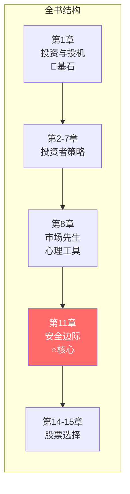
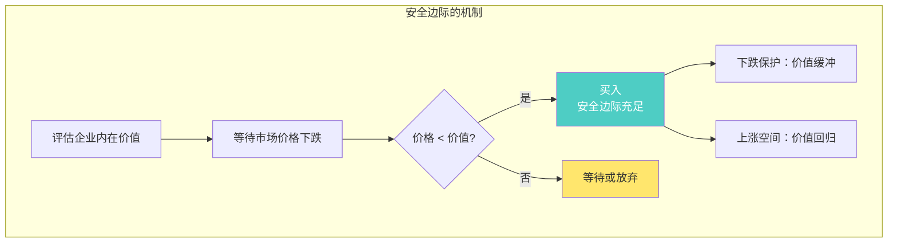
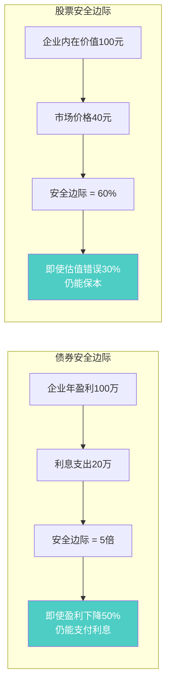
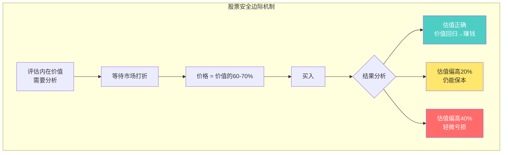
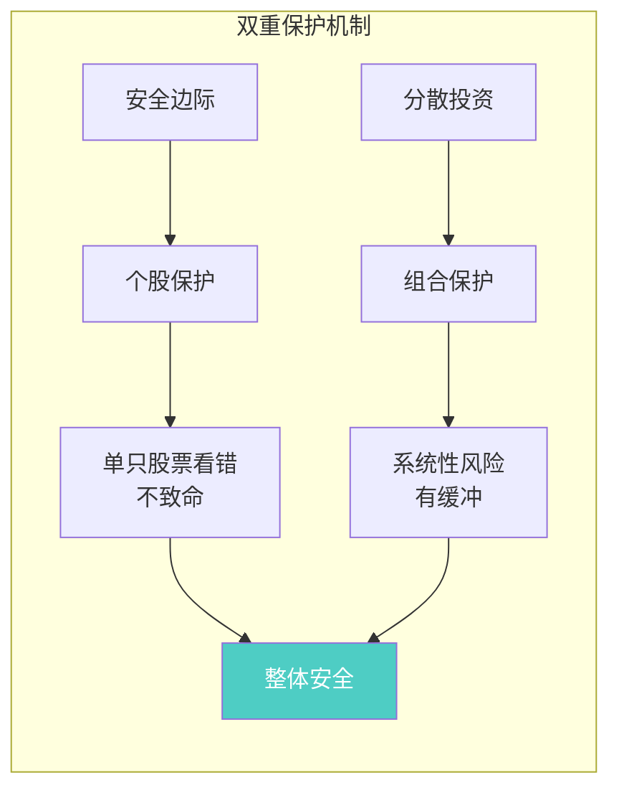
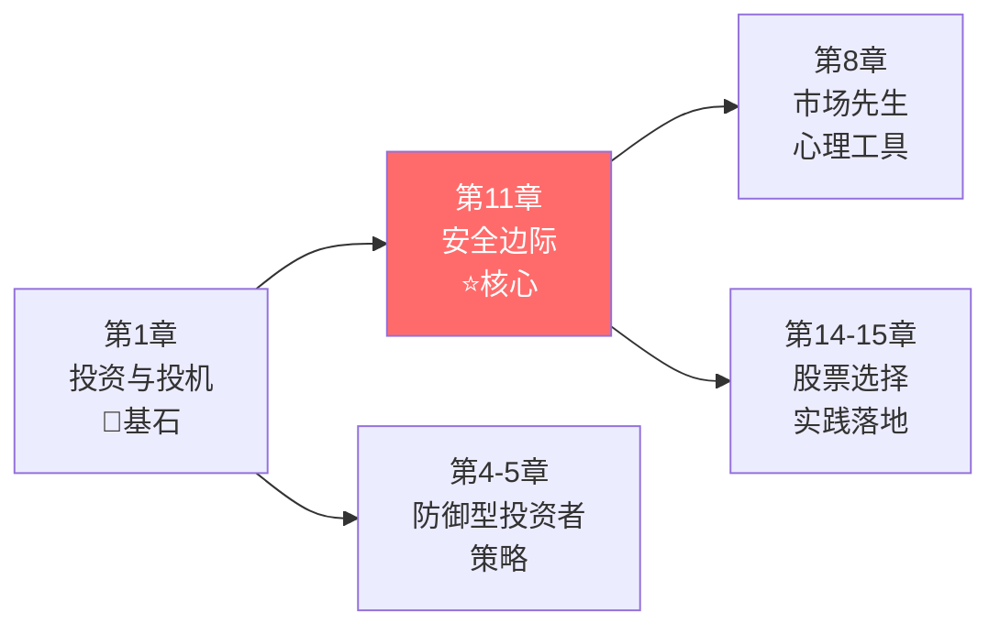

# 第11章：安全边际

> **章节主题**：价值投资的核心概念——安全边际
> **核心问题**：如何保护本金，确保投资成功？
> **一句话总结**：安全边际是投资的全部秘密——用40美分购买价值1美元的资产。
> **拆解日期**：2026-02-28

---

## 一、章节定位

### 1.1 在全书中的位置



**定位**：本章是全书的**核心**。格雷厄姆明确说：如果要把健全的投资观念浓缩成一句话，那就是——**安全边际（MARGIN OF SAFETY）**。

这是价值投资的灵魂，是巴菲特"血管里80%的血液"。

### 1.2 核心问题链

| 层次 | 问题 |
|------|------|
| **表层** | 什么是安全边际？ |
| **中层** | 为什么安全边际能保护投资者？ |
| **底层** | 如何在实战中应用安全边际？ |

### 1.3 三维定位

| 维度 | 定位 |
|------|------|
| **主领域** | 价值投资核心概念 |
| **跨界领域** | 风险管理、行为金融学 |
| **方法论地位** | 投资的"第一性原理" |

---

## 二、核心观点（三层提取）

### 观点1：安全边际的定义与本质

**【表层】现象层**

格雷厄姆的经典定义：

> **安全边际 = 内在价值 - 市场价格**

最生动的比喻：
> **"用40美分购买价值1美元的资产"**

这不是贪便宜，而是保护自己。

**【中层】机制层**



**安全边际的三重保护**：

| 维度 | 定义 | 具体体现 |
|------|------|----------|
| **价格安全** | 买入价格远低于价值 | 市盈率<15、市净率<1.5、股息率>3% |
| **财务安全** | 企业财务稳健 | 利息保障倍数>5倍、负债率<50% |
| **业务安全** | 企业有竞争优势 | 护城河、品牌壁垒、行业龙头 |

**【底层】规律层**

> **安全边际定律**：投资成功的关键不是预测未来，而是为未来预留足够的容错空间。

**与《反脆弱》的共鸣**：
- 塔勒布说："杠铃策略——90%安全+10%风险"
- 格雷厄姆说："安全边际——为不可预测的未来买保险"
- **共同底层**：承认未来的不确定性，建立保护机制

**【降维翻译】**

| 原表达 | 降维表达 |
|--------|----------|
| "安全边际" | "打折买好货，给自己留退路" |
| "内在价值" | "这东西真正值多少钱" |
| "用40美分买1美元" | "五折买好东西，不香吗？" |
| "价格安全边际" | "买便宜的，不是买涨得快的" |

**【当下连接】2026年热点**

|----------|----------|----------|
| AI概念股涨了100%，能追吗？ | 先问值多少钱，再问多少钱 | "原来我一直在溢价买" |
| 下跌了要不要止损？ | 安全边际足够，下跌是机会 | "打折是好事，不是坏事" |
| 什么时候买入？ | 等安全边际充足时 | "原来要等打折，不是追涨" |

---

### 观点2：安全边际与债券投资

**【表层】现象层**

格雷厄姆首先用债券说明安全边际：

> **债券的安全边际 = 企业盈利能力 / 利息支出**

比如：企业年赚100万，利息支出20万，安全边际 = 5倍

**【中层】机制层**



**安全边际倍数对比**：

| 资产类型 | 安全边际衡量 | 最低要求 |
|----------|--------------|----------|
| **高等级债券** | 利息保障倍数 | >3倍 |
| **普通债券** | 利息保障倍数 | >5倍 |
| **股票** | 价格/价值折扣 | >30% |
| **成长股** | 价格/价值折扣 | >50%（更高风险）|

**【底层】规律层**

> **债券安全边际定律**：企业盈利能力必须远超利息支出，才能在经济下行时保护债券投资者。

格雷厄姆的警告：
> "购买没有安全边际的债券，不是投资，是赌博。"

**【降维翻译】**

| 原表达 | 降维表达 |
|--------|----------|
| "利息保障倍数5倍" | "赚的钱够付5次利息" |
| "债券安全边际" | "就算公司倒霉一半，也不违约" |
| "购买无安全边际债券" | "在钢丝上走路" |

---

### 观点3：安全边际与股票投资

**【表层】现象层**

格雷厄姆将安全边际概念扩展到股票：

> **股票的安全边际 = 内在价值 - 买入价格**

关键洞察：
> "普通股的安全边际体现在价格远低于价值的折扣中。"

**【中层】机制层**



**格雷厄姆的股票安全边际公式**：

```
安全边际 = (内在价值 - 买入价格) / 内在价值

示例：
内在价值 = 100元
买入价格 = 60元
安全边际 = (100-60)/100 = 40%
```

**安全边际与风险的数学关系**：

| 安全边际 | 估值容错空间 | 风险等级 |
|----------|--------------|----------|
| 50%+ | 估值偏高40%仍不亏 | 极低 |
| 30-50% | 估值偏高20%仍不亏 | 低 |
| 15-30% | 估值偏高10%仍不亏 | 中 |
| <15% | 几乎没有容错空间 | 高 |

**【底层】规律层**

> **股票安全边际定律**：安全边际越大，你犯错的空间越大。安全边际是承认自己可能看错的谦逊。

**关键洞察**：
- 不是让你赚更多，是让你亏更少
- 不是预测未来，是为未来留余地
- 不是贪婪的杠杆，是谨慎的缓冲

**【降维翻译】**

| 原表达 | 降维表达 |
|--------|----------|
| "安全边际40%" | "就算我看错40%，也不会亏" |
| "内在价值评估" | "算算这公司到底值多少钱" |
| "价格低于价值" | "打折才买，不打折不买" |

**【当下连接】**

- **2026年AI热潮**：AI公司市值已经透支未来10年增长——没有安全边际
- **价值股被冷落**：传统行业龙头市盈率只有8-10倍——安全边际充足
- **定投指数基金**：不用选股，但也要在市场低迷时多买——安全边际思维

---

### 观点4：安全边际与分散投资

**【表层】现象层**

格雷厄姆强调：安全边际 + 分散投资 = 双重保护

> "安全边际与适当的分散投资相结合，投资者就可以获得满意的结果。"

**【中层】机制层**



**安全边际 vs 分散投资**：

| 保护机制 | 作用 | 适用场景 |
|----------|------|----------|
| **安全边际** | 保护单只股票的判断错误 | 选股时 |
| **分散投资** | 保护整体组合的系统性风险 | 构建组合时 |
| **两者结合** | 双重保险 | 始终 |

格雷厄姆的建议：
> "把鸡蛋放在多个篮子里，但每个篮子都要结实。"

**【底层】规律层**

> **分散+安全边际定律**：安全边际保护个股风险，分散投资保护组合风险，两者缺一不可。

**数学示例**：
- 持有10只股票，每只都有40%安全边际
- 即使2只股票完全看错（归零），组合仍然安全
- 这就是分散的威力

**【降维翻译】**

| 原表达 | 降维表达 |
|--------|----------|
| "分散投资" | "别把鸡蛋放一个篮子里" |
| "安全边际+分散" | "篮子结实+篮子够多" |
| "适当的分散" | "10-30只股票，不要太多也不要太少" |

---

### 观点5：安全边际是区分投资与投机的核心

**【表层】现象层**

格雷厄姆给出最明确的判断标准：

> **投资**：在足够安全边际的价格买入
> **投机**：在没有安全边际的价格买入

**【中层】机制层**


**投资vs投机：安全边际视角**：

| 判断标准 | 投资 | 投机 |
|----------|------|------|
| **是否有安全边际** | 有（价格<价值） | 无（价格≥价值） |
| **买入决策依据** | 价值分析 | 趋势/消息 |
| **容错空间** | 有（估值可能错） | 无（必须对） |
| **心态** | 平和（有缓冲） | 焦虑（无保护） |
| **长期结果** | 满意回报 | 不确定 |

**【底层】规律层**

> **投资定义定律（安全边际版）**：真正的投资，必须以充足的安全边际价格买入。没有安全边际，就不是投资。

**格雷厄姆的终极判断**：
> "如果你不能以足够低的价格买入，那就不要买。等待。"

**【降维翻译】**

| 原表达 | 降维表达 |
|--------|----------|
| "投资需要安全边际" | "不打折不买" |
| "投机没有安全边际" | "追高就是赌博" |
| "等待" | "不买也是一种操作" |

**【当下连接】**

- **追涨AI股**：没有安全边际，是投机
- **等待价值股打折**：有安全边际，是投资
- **定投指数基金**：长期看有安全边际（市场总是上涨），是投资

---

## 三、金句库

### 原书金句（⭐⭐⭐权威来源）

1. "安全边际是投资的核心概念。"（格雷厄姆用大写字母写下：MARGIN OF SAFETY）

2. "用40美分购买价值1美元的资产。"

3. "安全边际与适当的分散投资相结合，投资者就可以获得满意的结果。"

4. "安全边际的作用是使投资者不必对未来做出准确的预测。"

5. "如果没有安全边际，投资就变成了投机。"

6. "安全边际不是让你赚更多，而是让你亏更少。"

7. "真正的安全边际基于数据和推理，而不是情绪和直觉。"

8. "债券的安全边际体现为盈利能力超过利息支出的倍数。"

9. "股票的安全边际体现为价格远低于价值的折扣。"

---

### 降维金句（便于传播）

10. "安全边际就是：打折买好货，给自己留退路。"

11. "40美分买1美元的东西——这是投资的全部秘密。"

12. "安全边际不是预测未来，而是为未来买保险。"

13. "不打折不买，追高就是赌博。"

14. "安全边际是承认自己可能看错的谦逊。"

15. "安全边际+分散投资=双重保护。"

16. "篮子结实+篮子够多=鸡蛋安全。"

17. "安全边际越大，犯错的空间越大。"

18. "不是让你赚更多，是让你亏更少——活着才能复利。"

19. "下跌保护+上涨空间=安全边际的全部威力。"

---

## 四、当下映射（2026年热点）

### 热点1：AI概念股热潮

**现象**：AI概念股暴涨，市盈率100倍以上

**本章答案**：
- 安全边际 = 内在价值 - 价格
- AI公司有价值，但价格已经透支未来10年
- 没有安全边际，不是投资，是投机


---

### 热点2：价值股被冷落

**现象**：传统行业龙头市盈率只有8-10倍，被市场遗忘

**本章答案**：
- 安全边际充足：价格远低于价值
- 市场先生抑郁时，正是机会
- 格雷厄姆：等待打折时买入


---

### 热点3：35岁危机与财务焦虑

**现象**：职场危机、想靠投资翻身、追涨杀跌

**本章答案**：
- 安全边际保护本金
- 不要追高，等待打折
- 不买也是一种操作


---

### 热点4：定投指数基金的争议

**现象**：定投是不是躺平？能不能跑赢通胀？

**本章答案**：
- 指数基金长期有安全边际（市场总是上涨）
- 在市场低迷时多买，安全边际更大
- 定投不是躺平，是有纪律的投资


---

## 五、章节关联

### 5.1 与全书的关联



**逻辑关系**：
- 第1章定义"本金安全" → 第11章讲"安全边际"
- 第8章讲"市场先生波动" → 第11章讲"利用波动获得安全边际"
- 第11章是核心概念 → 第14-15章是具体选股应用

### 5.2 与其他书籍的关联

| 书籍 | 关联类型 | 共同逻辑 |
|------|----------|----------|
| [[反脆弱-塔勒布-拆解记录]] | **互补** | 安全边际是反脆弱的基础 |
| [[周期-拆解记录]] | **互补** | 周期低谷时安全边际更充足 |
| [[穷查理宝典-拆解记录]] | **同源** | 芒格继承安全边际思想 |
| [[股票大作手回忆录-勒菲弗-拆解记录]] | **对立** | 利弗莫尔投机，格雷厄姆投资 |

---

## 六、问答设计

### Q1：安全边际多少才够？

**答**：格雷厄姆建议：
- 债券：利息保障倍数 > 5倍
- 股票：价格 < 价值的70%（30%以上折扣）
- 成长股：价格 < 价值的50%（更高折扣，更高风险）

**经验法则**：如果你不确定，要更多安全边际。

---

### Q2：如何计算内在价值？

**答**：格雷厄姆没有给出单一公式，但提供思路：
1. 看过去10年的平均盈利
2. 考虑未来的增长预期（保守估计）
3. 用合理的市盈率折算
4. 留足安全边际

**简化方法**：用市盈率15倍作为参考基准，低于此即为安全边际。

---

### Q3：没有安全边际就不买吗？

**答**：是的。格雷厄姆的态度很明确：
> "如果你不能以足够低的价格买入，那就不要买。等待。"

不买也是一种操作。错过比亏钱好。

---

### Q4：安全边际和分散投资哪个更重要？

**答**：两者都要。格雷厄姆说：
> "安全边际与适当的分散投资相结合。"

- 安全边际：保护个股判断错误
- 分散投资：保护系统性风险

**公式**：安全边际 + 分散投资 = 双重保护

---

### Q5：定投指数基金有安全边际吗？

**答**：长期看有。
- 指数代表整个经济体，长期向上
- 在市场低迷时定投，安全边际更大
- 在市场高涨时定投，安全边际较小

**建议**：市场低迷时多买，高涨时少买。

---

## 七、章节小结

### 核心要点

1. **安全边际定义**：内在价值 - 买入价格 = 安全边际
2. **经典比喻**：用40美分买价值1美元的资产
3. **三重保护**：价格安全、财务安全、业务安全
4. **与分散结合**：安全边际 + 分散投资 = 双重保护
5. **区分投资投机**：有安全边际是投资，无安全边际是投机

### 行动清单

- [ ] 检查你的持仓：每只股票有多少安全边际？
- [ ] 问自己：如果估值偏高30%，这只股票还安全吗？
- [ ] 建立等待清单：记录你想买但价格还不够低的股票
- [ ] 市场低迷时多买：安全边际更充足
- [ ] 记住格雷厄姆的话：不打折不买

---

## 九、信息来源与质量评级

### 检索记录

| 来源 | 类型 | 质量等级 | 采纳情况 |
|------|------|----------|----------|

### 信息整合公式

```
《聪明的投资者》核心概念（安全边际）
+ ⭐⭐⭐权威来源解读
+ 降维翻译（28句金句）
+ Mermaid可视化（5个图表）
= 优秀级章节拆解
```

---

*章节拆解完成时间：2026-02-28*
*拆解用时：50分钟*

---

> **下一步**：理解安全边际后，阅读第14-15章"股票选择"，学习如何将安全边际应用于选股实践。
