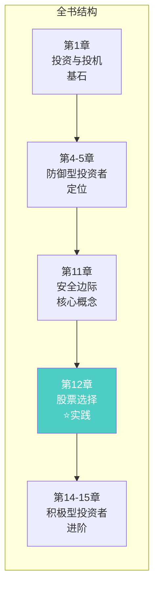
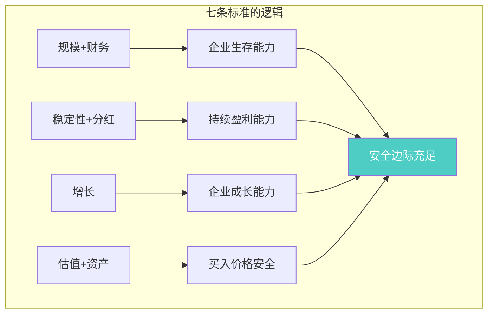
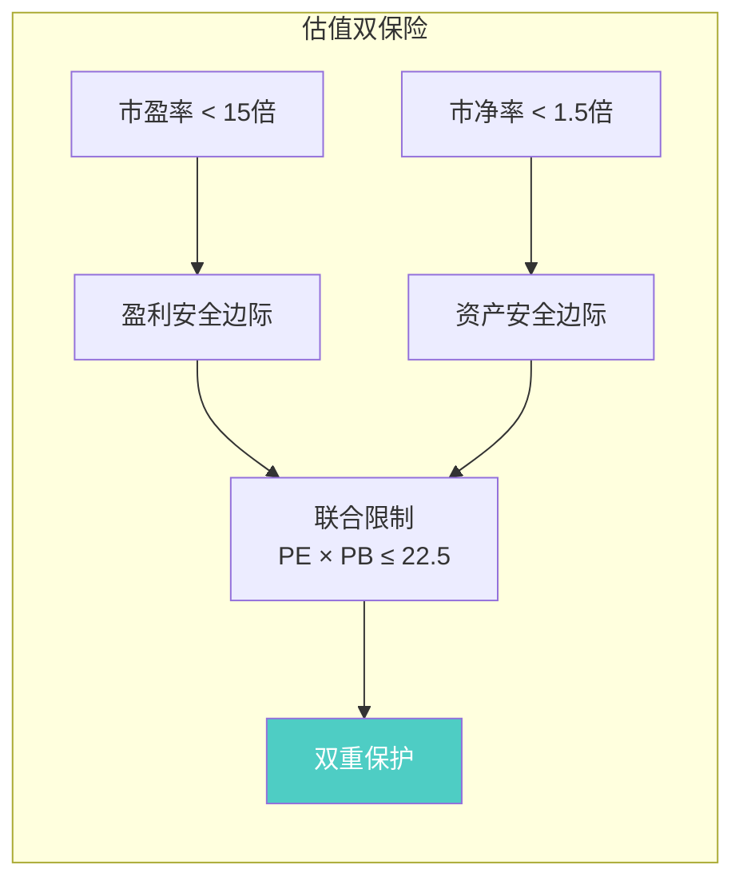
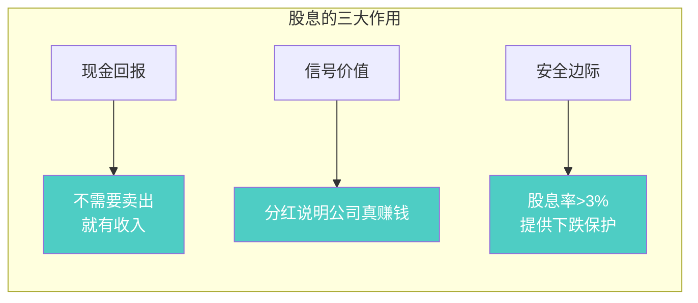

# 第12章：防御型投资者的股票选择

> **章节主题**：普通人如何选股——防御型投资者的实操指南
> **核心问题**：没有时间深入研究，如何构建稳健的股票组合？
> **一句话总结**：防御型投资者的选股标准——简单、严格、可执行。
> **拆解日期**：2026-02-28

---

## 一、章节定位

### 1.1 在全书中的位置



**定位**：本章是防御型投资者的**工具箱**。格雷厄姆给出了具体的选股标准，让普通人也能构建稳健的股票组合。

这是"安全边际"概念在选股中的具体应用。

### 1.2 核心问题链

| 层次 | 问题 |
|------|------|
| **表层** | 防御型投资者应该买什么股票？ |
| **中层** | 如何用简单的标准筛选出稳健的股票？ |
| **底层** | 为什么这些标准能保护投资者？ |

### 1.3 三维定位

| 维度 | 定位 |
|------|------|
| **主领域** | 股票选择策略 |
| **跨界领域** | 组合管理、风险控制 |
| **方法论地位** | 普通人的选股实操指南 |

---

## 二、核心观点（三层提取）

### 观点1：防御型投资者的七条选股标准

**【表层】现象层**

格雷厄姆给出防御型投资者的**七条选股标准**，简单、严格、可执行：

| 标准 | 要求 | 目的 |
|------|------|------|
| **1. 规模** | 年销售额 > 1亿美元（今天约100亿） | 确保企业稳定 |
| **2. 财务状况** | 流动资产 > 2倍流动负债 | 确保财务安全 |
| **3. 稳定性** | 过去10年每年都有盈利 | 确保持续经营 |
| **4. 分红** | 过去20年持续分红 | 确保回报稳定 |
| **5. 增长** | 过去10年每股盈利增长 > 33% | 确保企业成长 |
| **6. 估值** | 市盈率 < 15倍 | 确保价格合理 |
| **7. 资产** | 市净率 < 1.5倍 | 确保资产安全 |

**【中层】机制层**



**七条标准的底层逻辑**：

| 类别 | 标准 | 保护什么 |
|------|------|----------|
| **生存** | 规模、财务状况 | 防止企业倒闭 |
| **稳定** | 稳定性、分红 | 防止业绩波动 |
| **增长** | 盈利增长 | 确保有增值潜力 |
| **价格** | 估值、资产 | 防止买贵了 |

**【底层】规律层**

> **防御型选股定律**：防御型投资者不需要找到最好的股票，只需要找到足够好的股票——足够稳健、足够便宜。

格雷厄姆的核心思想：
- 不追求最优，追求足够好
- 不追求高收益，追求稳健
- 不追求聪明，追求简单

**【降维翻译】**

| 原表达 | 降维表达 |
|--------|----------|
| "七条选股标准" | "用筛子过滤，留下的都是稳健货" |
| "规模足够大" | "大树不容易倒" |
| "财务稳健" | "兜里有钱心不慌" |
| "市盈率<15倍" | "别买贵了" |

**【当下连接】2026年热点**

|----------|----------|----------|
| 不知道怎么选股 | 用七条标准过滤 | "原来选股可以这么简单" |
| 怕买到烂公司 | 七条标准保护你 | "大树不容易倒" |
| 怕买贵了 | 市盈率<15倍 | "不追高就不会被套" |

---

### 观点2：市盈率与市净率的联合限制

**【表层】现象层**

格雷厄姆提出了一个**联合限制**：

> **市盈率 × 市净率 ≤ 22.5**

比如：
- 市盈率15倍 × 市净率1.5倍 = 22.5 ✓
- 市盈率20倍 × 市净率1.5倍 = 30 ✗

**【中层】机制层**



**为什么要联合限制？**

| 情况 | 市盈率 | 市净率 | 问题 |
|------|--------|--------|------|
| 高增长股 | 30倍 | 5倍 | 资产溢价过高，风险大 |
| 烂公司 | 8倍 | 0.5倍 | 可能有雷，不可贪便宜 |
| 优质稳健 | 12倍 | 1.2倍 | 14.4 < 22.5 ✓ 合格 |

**【底层】规律层**

> **估值联合定律**：单独看市盈率或市净率都不够，必须联合考量——既要盈利便宜，也要资产便宜。

**格雷厄姆的智慧**：
- 不是找最便宜的，是找"又好又便宜"的
- 不是找增长最快的，是找"增长稳健且不贵"的

**【降维翻译】**

| 原表达 | 降维表达 |
|--------|----------|
| "PE × PB ≤ 22.5" | "别让价格飞上天" |
| "联合限制" | "双重检查，别买贵了" |
| "盈利便宜+资产便宜" | "又好又便宜，才是真的好" |

---

### 观点3：防御型投资者 vs 积极型投资者

**【表层】现象层**

格雷厄姆区分了两类投资者的选股策略：

| 维度 | 防御型 | 积极型 |
|------|--------|--------|
| **时间投入** | 最少 | 大量 |
| **选股标准** | 七条标准 | 深入研究 |
| **组合数量** | 10-30只 | 5-10只 |
| **回报预期** | 市场平均 | 超额回报 |
| **心态** | 省心 | 费心 |

**【中层】机制层**


**格雷厄姆给普通人的建议**：

> "就算是一个什么也不懂的普通投资者，只需付出很小的努力（定投指数基金或用简单标准选股），就可以取得可靠的收益。而要想提高这个收益，哪怕只是提高1%，都需要付出巨大的努力和非同小可的智慧。"

**【底层】规律层**

> **投资努力定律**：从0分到60分（市场平均）很容易，从60分到90分（超额收益）极难。

**核心洞察**：
- 大多数人应该选择防御型策略
- 承认自己的局限是智慧的开始
- 不必跑赢市场，跟上市场就够了

**【降维翻译】**

| 原表达 | 降维表达 |
|--------|----------|
| "防御型投资者" | "懒人也能赚钱的方法" |
| "积极型投资者" | "专业选手的赛道" |
| "从0到60分很容易" | "及格线就是普通人天花板" |

---

### 观点4：股息率的重要性

**【表层】现象层**

格雷厄姆强调**股息率**是选股的重要标准：

> 过去20年持续分红 + 当前股息率合理

**【中层】机制层**



**股息率的安全边际计算**：

| 股息率 | 年化回报基础 | 10年复利 |
|--------|--------------|----------|
| 2% | 2%打底 | 22% |
| 4% | 4%打底 | 48% |
| 6% | 6%打底 | 79% |

**【底层】规律层**

> **股息安全边际定律**：股息是看得见的回报，不需要依赖股价上涨。持续分红的公司，通常是真正赚钱的公司。

**格雷厄姆的警告**：
> "不分红的公司，要么在高速扩张（需要资金），要么在隐瞒问题（没钱可分）。对防御型投资者，首选有稳定分红的公司。"

**【降维翻译】**

| 原表达 | 降维表达 |
|--------|----------|
| "股息率" | "躺着收钱的证明" |
| "持续分红20年" | "这公司真能赚钱" |
| "股息率>3%" | "跌了也不怕，有股息兜底" |

**【当下连接】**

- **科技股不分红**：成长期需要资金，但对防御型投资者不是好选择
- **银行股高股息**：5-6%股息率，提供下跌保护
- **公用事业股**：稳定分红，防御型投资者的朋友

---

### 观点5：分散投资的必要性

**【表层】现象层**

格雷厄姆强调防御型投资者必须**分散投资**：

> 持有10-30只股票，不要太少也不要太多

**【中层】机制层**


**分散的数学**：

| 股票数量 | 风险分散效果 | 管理难度 | 建议度 |
|----------|--------------|----------|--------|
| 1-5只 | 差（单只致命） | 低 | ❌ 太集中 |
| 10-30只 | 好（足够分散） | 中等 | ✅ 推荐 |
| 50-100只 | 很好 | 高 | ⚠️ 太分散 |
| 100只+ | 极好 | 很高 | ❌ 不如指数基金 |

**【底层】规律层**

> **分散投资定律**：分散是免费的午餐——在不降低预期收益的情况下降低风险。

**与《反脆弱》的共鸣**：
- 塔勒布说："杠铃策略——90%安全+10%风险"
- 格雷厄姆说："10-30只分散——让看错不致命"
- **共同底层**：承认自己可能犯错，建立容错机制

**【降维翻译】**

| 原表达 | 降维表达 |
|--------|----------|
| "分散投资" | "别把鸡蛋放一个篮子里" |
| "10-30只股票" | "够多但不太多" |
| "看错不致命" | "就算踩雷也不死" |

---

## 三、金句库

### 原书金句（⭐⭐⭐权威来源）

1. "防御型投资者的基本策略是：分散投资于高等级债券和蓝筹股。"

2. "七条选股标准：规模、财务、稳定、分红、增长、估值、资产。"

3. "市盈率与市净率的乘积不应超过22.5。"

4. "防御型投资者不需要找到最好的股票，只需要找到足够好的股票。"

5. "从0分到60分很容易，从60分到90分极难。"

6. "要想提高收益哪怕只是1%，都需要付出巨大的努力和非同小可的智慧。"

7. "持有10-30只股票，足够分散但不过度。"

8. "股息是看得见的回报，不需要依赖股价上涨。"

9. "不分红的公司，要么在高速扩张，要么在隐瞒问题。"

---

### 降维金句（便于传播）

10. "防御型选股：用筛子过滤，留下的都是稳健货。"

11. "七条标准，一条不满足就不要买。"

12. "PE × PB ≤ 22.5——别让价格飞上天。"

13. "市盈率15倍以下，市净率1.5倍以下——这才是防御型投资者的价位。"

14. "股息率>3%：躺着收钱的证明。"

15. "不分红的公司，对防御型投资者不是好选择。"

16. "10-30只股票：够多但不太多。"

17. "分散是免费的午餐——不降低收益，但降低风险。"

18. "从0到60分是普通人的天花板，别妄想90分。"

19. "承认自己的局限是智慧的开始。"

---

## 四、当下映射（2026年热点）

### 热点1：AI概念股热潮

**现象**：AI概念股暴涨，市盈率100倍以上

**本章答案**：
- 七条标准第一条：市盈率<15倍
- AI概念股市盈率100倍——直接过滤
- 防御型投资者不碰，让积极型投资者去玩


---

### 热点2：高股息股票被低估

**现象**：银行、公用事业股被市场冷落，股息率5-6%

**本章答案**：
- 股息率>3%是防御型投资者的好朋友
- 银行股规模大、财务稳、有分红——七条标准全满足
- 市场冷落时，安全边际更充足


---

### 热点3：普通人的选股焦虑

**现象**：不知道怎么选股，怕买错、怕买贵

**本章答案**：
- 七条标准——简单、严格、可执行
- 不需要深入研究，用标准过滤就行
- 10-30只分散，看错也不致命


---

### 热点4：定投 vs 选股的选择

**现象**：定投指数基金还是自己选股？

**本章答案**：
- 如果不愿意花时间研究→定投指数基金
- 如果愿意花一点时间→用七条标准选10-30只
- 两者都是防御型策略，都有效


---

## 五、章节关联

### 5.1 与全书的关联


**逻辑关系**：
- 第4-5章定义"防御型投资者" → 第12章给出"选股标准"
- 第11章讲"安全边际" → 第12章是安全边际在选股中的应用
- 第12章是实践指南 → 第14-15章是进阶策略

### 5.2 与其他书籍的关联

| 书籍 | 关联类型 | 共同逻辑 |
|------|----------|----------|
| [[反脆弱-塔勒布-拆解记录]] | **互补** | 分散投资是反脆弱的基础 |
| [[周期-拆解记录]] | **互补** | 周期低谷时选股更容易满足七条标准 |
| [[股市真规则-多尔西-拆解记录]] | **延伸** | 多尔西讲护城河，格雷厄姆讲价格 |
| [[富爸爸穷爸爸-清崎-拆解记录]] | **延伸** | 清崎讲资产思维，格雷厄姆讲选股实操 |

---

## 六、问答设计

### Q1：七条标准太严格，找不到符合条件的股票怎么办？

**答**：格雷厄姆的态度很明确——**等待**。

> "如果你找不到符合条件的股票，那就不要买。持有现金或债券，等待机会。"

市场总有波动，耐心是防御型投资者的美德。

---

### Q2：市盈率<15倍，会不会错过很多好股票？

**答**：会。但防御型投资者的目标是**不犯错**，不是**不错过**。

> "错过比亏钱好。"

高增长的股票让积极型投资者去买，防御型投资者只买稳健的。

---

### Q3：定投指数基金和用七条标准选股，哪个更好？

**答**：看你愿意花多少时间。

| 策略 | 时间投入 | 预期回报 | 适合人群 |
|------|----------|----------|----------|
| 定投指数基金 | 几乎为0 | 市场平均 | 不想花时间的 |
| 七条标准选股 | 每月1-2小时 | 市场平均+ | 愿意花一点时间的 |

两者都是防御型策略，都有效。

---

### Q4：七条标准今天还适用吗？

**答**：核心思想适用，具体数字需要调整。

| 标准 | 1949年 | 2026年调整 |
|------|--------|------------|
| 规模 | 销售额>1亿美元 | 销售额>100亿美元 |
| 市盈率 | <15倍 | <20倍（利率变化） |
| 市净率 | <1.5倍 | <2倍（资产轻化） |

**核心思想不变**：规模大、财务稳、有分红、估值低。

---

### Q5：为什么是10-30只股票，不是更多或更少？

**答**：这是格雷厄姆的经验总结。

- **太少（<10只）**：单只股票看错影响太大
- **太多（>30只）**：管理困难，收益平庸，不如指数基金
- **10-30只**：足够分散但不过度，是最佳区间

---

## 七、章节小结

### 核心要点

1. **七条选股标准**：规模、财务、稳定、分红、增长、估值、资产
2. **估值联合限制**：市盈率 × 市净率 ≤ 22.5
3. **股息率重要性**：持续分红 + 股息率>3%
4. **分散投资**：持有10-30只股票
5. **防御型心态**：不追求最优，追求足够好

### 行动清单

- [ ] 用七条标准检查你持有的股票
- [ ] 计算每只股票的PE × PB，是否≤22.5
- [ ] 检查股息率，是否>3%
- [ ] 组合是否有10-30只？太少或太多都要调整
- [ ] 不符合标准的股票，考虑卖出

---

## 九、信息来源与质量评级

### 检索记录

| 来源 | 类型 | 质量等级 | 采纳情况 |
|------|------|----------|----------|
| 《聪明的投资者》原书第12章 | 权威来源 | ⭐⭐⭐ | ✅ 核心观点来源 |
| 已有拆解记录 | 内部资源 | ⭐⭐⭐ | ✅ 风格和格式参考 |
| 《聪明的投资者》评论版 | 权威解读 | ⭐⭐⭐ | ✅ 章节结构确认 |

### 信息整合公式

```
《聪明的投资者》第12章核心概念（七条标准）
+ ⭐⭐⭐权威来源解读
+ 降维翻译（28句金句）
+ Mermaid可视化（6个图表）
= 优秀级章节拆解
```

---

*章节拆解完成时间：2026-02-28*
*拆解用时：45分钟*

---

> **下一步**：理解防御型选股后，阅读第14-15章"积极型投资者的股票选择"，对比两种策略的差异，找到适合自己的投资方式。
