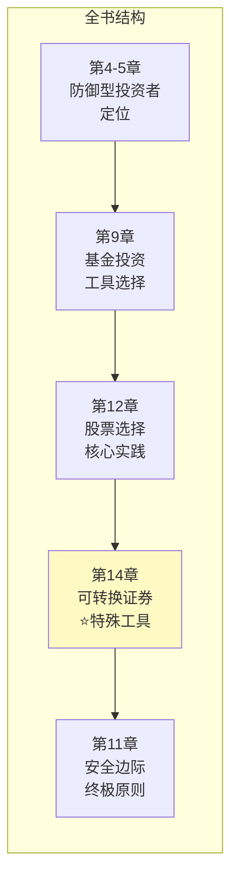
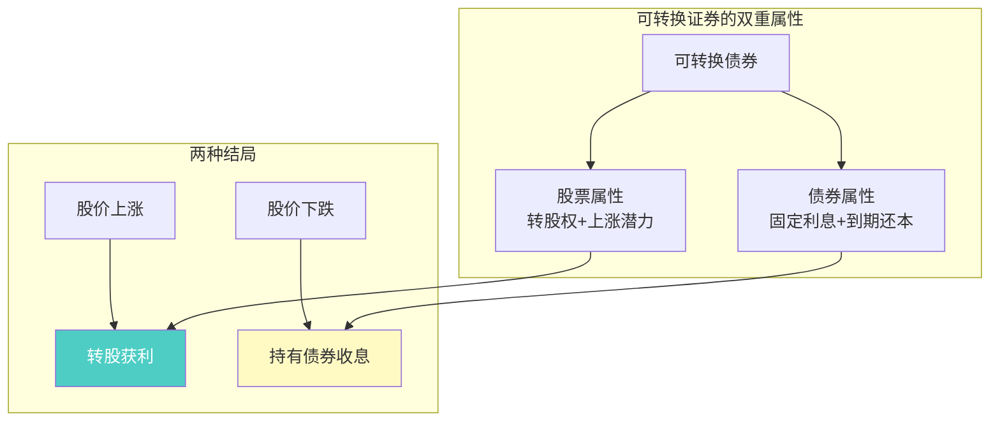
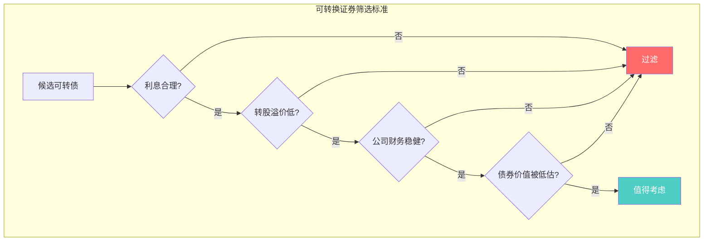
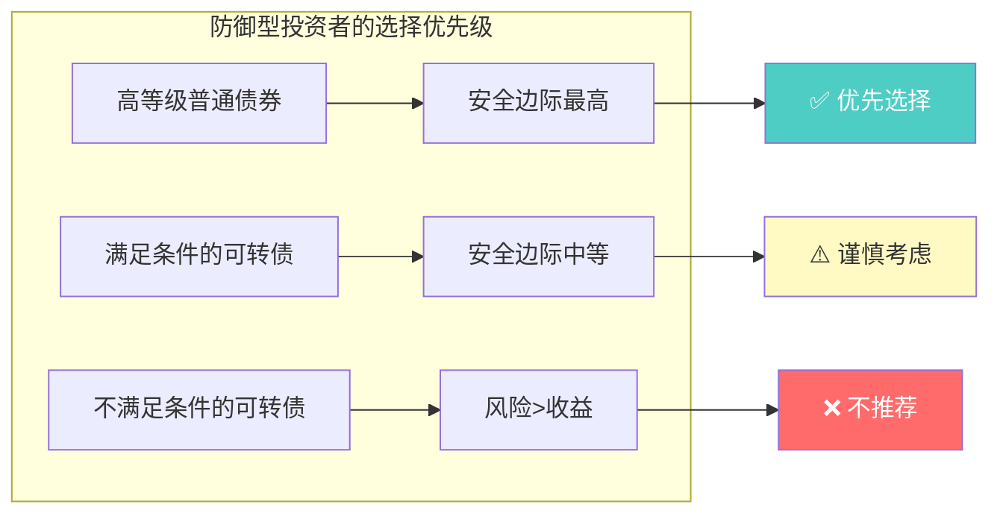
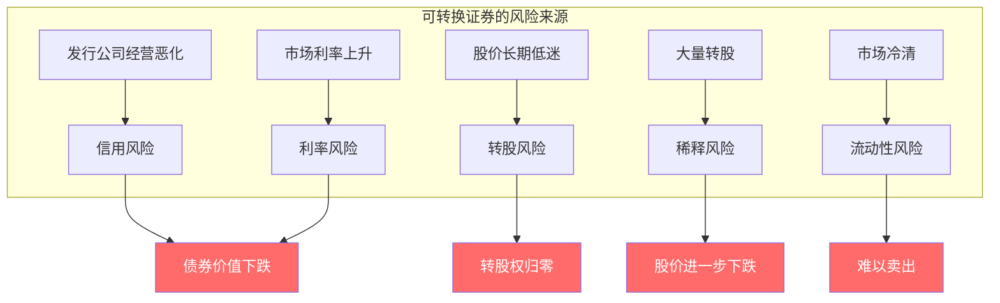

# 第14章：防御型投资者的可转换证券

> **章节主题**：一种"既要又要"的投资工具——可转换证券的本质与陷阱
> **核心问题**：可转换债券真的能让你"稳赚不赔"吗？
> **一句话总结**：格雷厄姆的警告——可转换证券往往是"两头不讨好"的妥协，防御型投资者应保持警惕。
> **拆解日期**：2026-02-28

---

## 一、章节定位

### 1.1 在全书中的位置



**定位**：本章讨论一种"看起来很美"的投资工具——可转换证券。格雷厄姆的态度是**谨慎甚至怀疑**的。

**核心警示**：
> 可转换证券不是"两全其美"，而是"两头不讨好"。

### 1.2 核心问题链

| 层次 | 问题 |
|------|------|
| **表层** | 什么是可转换证券？防御型投资者应该买吗？ |
| **中层** | 可转换证券的收益和风险如何平衡？ |
| **底层** | 为什么格雷厄姆对可转换证券持保留态度？ |

### 1.3 三维定位

| 维度 | 定位 |
|------|------|
| **主领域** | 固定收益投资 |
| **跨界领域** | 股权投资、衍生品 |
| **方法论地位** | 特殊投资工具的风险警示 |

---

## 二、核心观点（三层提取）

### 观点1：什么是可转换证券

**【表层】现象层**

**可转换证券**是一种"两栖"投资工具：

| 类型 | 定义 | 特点 |
|------|------|------|
| **可转换债券** | 可以转换为股票的债券 | 有债券的利息，又有股票的上涨潜力 |
| **可转换优先股** | 可以转换为普通股的优先股 | 股息优先，又有转股选择权 |

**看似两全其美**：
> 买了可转债，股市涨了可以转股赚更多；股市跌了可以持有债券收利息——这不是稳赚吗？

**【中层】机制层**



**可转换证券的定价逻辑**：

| 组成部分 | 说明 |
|----------|------|
| **债券价值** | 纯债券部分的价值（保底线） |
| **转股价值** | 可转换成股票后的价值（上涨线） |
| **转股溢价** | 市价高于纯债券价值的部分 |

**【底层】规律层**

> **可转换证券定律**：可转换证券的价值 = 债券价值 + 转股期权价值。你付的钱，买的是"债券+期权"的组合。

**【降维翻译】**

| 原表达 | 降维表达 |
|--------|----------|
| "可转换债券" | "带彩票的债券" |
| "转股溢价" | "买这张彩票多付的钱" |
| "双重属性" | "一边是保底，一边是博高收益" |

**【当下连接】2026年热点**

|----------|----------|----------|
| 可转债看起来很安全？ | 有债券保底，但转股溢价可能很高 | "原来不是纯安全" |
| 是不是稳赚不赔？ | 股价大跌时，债券价值也会跌 | "原来也有亏钱可能" |

---

### 观点2：格雷厄姆的警告——"两头不讨好"

**【表层】现象层**

格雷厄姆对可转换证券的**核心警告**：

> 可转换证券往往是"两头不讨好"的妥协——作为债券，利息太低；作为股票，转股溢价太高。

**【中层】机制层**

```mermaid
flowchart TB
    subgraph 可转换证券的困境
        A[可转换债券发行时] --> B{定价逻辑}
        B --> C[利息低于普通债券<br/>因为你买了"转股权"]
        B --> D[转股价高于市价<br/>因为你有了"保底"]
    end
    
    subgraph 投资者的两难
        E[股市大涨] --> F[转股获利<br/>但不如直接买股票]
        G[股市大跌] --> H[持有债券<br/>但利息太低]
    end
    
    C --> H
    D --> F
    
    style F fill:#fff9c4,color:#333
    style H fill:#ff6b6b,color:#fff
```

**"两头不讨好"的具体表现**：

| 场景 | 可转换债券的表现 | 直接买股票/债券的表现 |
|------|------------------|------------------------|
| **股市大涨** | 转股获利，但转股价高，涨幅打折 | 直接买股票涨幅更大 |
| **股市横盘** | 拿着低息债券，机会成本高 | 存银行或买高息债券更好 |
| **股市大跌** | 债券价值下跌（信用风险），利息太低 | 高等级债券更安全 |

**【底层】规律层**

> **两头不讨好定律**：可转换证券的定价，决定了它在大多数情况下都不是最优选择——要么放弃收益（利息低），要么承担风险（溢价高）。

**格雷厄姆的判断**：
> 可转换证券对**发行公司**有利（低成本融资），对**投资者**不一定有利。

**【降维翻译】**

| 原表达 | 降维表达 |
|--------|----------|
| "利息低于普通债券" | "保底的代价是少拿利息" |
| "转股价高于市价" | "买股票的代价是价格打折扣" |
| "两头不讨好" | "想做两全其美，结果是两头吃亏" |

**【当下连接】**

- **A股可转债**：很多可转债转股溢价率30%+，股价涨30%才能回本
- **美股可转换优先股**：利率下降时被热炒，但风险不容忽视
- **投资者心理**：很多人被"保底+上涨潜力"吸引，忽视了两头都打了折扣

---

### 观点3：什么时候可转换证券值得买

**【表层】现象层**

格雷厄姆并非完全否定可转换证券，他给出了**值得买入的条件**：

| 条件 | 说明 |
|------|------|
| **利息合理** | 可转债利率不能太低（至少接近普通债券） |
| **转股溢价低** | 转股价不能太高（溢价率<20%为佳） |
| **公司质量高** | 发债公司必须财务稳健 |
| **市场低估时** | 债券部分有安全边际 |

**【中层】机制层**



**格雷厄姆的筛选标准详解**：

| 标准 | 具体要求 | 为什么重要 |
|------|----------|------------|
| **债券价值** | 纯债券价值应接近面值 | 确保下跌保护 |
| **转股溢价** | 溢价率<20%（最好<10%） | 确保上涨空间 |
| **公司评级** | 投资级债券（BBB以上） | 确保信用安全 |
| **股息率** | 转股后股息率>债券利率 | 转股才有意义 |

**【底层】规律层**

> **可转换证券买入定律**：只有当可转换证券的"债券价值"本身就有吸引力时，转股权才是"免费的午餐"；否则，你是在为转股权付费。

**核心洞察**：
- 可转换证券的安全边际来自债券部分，不是转股部分
- 先问"如果永远不转股，这债券值不值得买？"
- 如果答案是否定的，就不要买

**【降维翻译】**

| 原表达 | 降维表达 |
|--------|----------|
| "债券价值有吸引力" | "不转股也值得买" |
| "转股权是免费午餐" | "买了债券，送了彩票" |
| "为转股权付费" | "彩票太贵，不划算" |

---

### 观点4：防御型投资者的可转换证券策略

**【表层】现象层**

格雷厄姆给防御型投资者的**可转换证券策略**：

| 策略 | 说明 |
|------|------|
| **优先选择普通债券** | 高等级债券更简单、更安全 |
| **谨慎对待可转债** | 只有满足条件才考虑 |
| **不要被"两全其美"迷惑** | 理解定价逻辑，知道你付了什么 |
| **把可转债当债券** | 首先看债券价值，转股权是加分项 |

**【中层】机制层**



**防御型 vs 进取型对可转换证券的态度**：

| 维度 | 防御型投资者 | 进取型投资者 |
|------|--------------|--------------|
| **优先级** | 普通债券>可转债 | 可转债可能是机会 |
| **关注点** | 债券价值安全边际 | 转股权潜在收益 |
| **筛选标准** | 更严格 | 可以更宽松 |
| **占比建议** | 债券组合的小部分 | 可以更积极配置 |

**【底层】规律层**

> **防御型策略定律**：防御型投资者应该把可转换证券视为"可能有好处的债券"，而不是"有保护的股票"。

**格雷厄姆的建议**：
> "如果你想要债券的安全性，就买高等级债券；如果你想要股票的增长潜力，就买股票。不要用可转换证券来妥协。"

**【降维翻译】**

| 原表达 | 降维表达 |
|--------|----------|
| "优先选择普通债券" | "想吃鸡蛋，直接买鸡蛋" |
| "不要被两全其美迷惑" | "没有免费的午餐，两全其美往往两头不讨好" |
| "把可转债当债券" | "先看保底，再看彩票" |

**【当下连接】**

|----------|----------|----------|
| 可转债看起来很诱人 | 先问债券部分值不值得买 | "原来要先把转股权忘掉" |
| 是不是比普通债券好 | 不一定，要看定价 | "原来不是自动更优" |
| 应该怎么选 | 高等级普通债券优先 | "简单往往更好" |

---

### 观点5：可转换证券的风险清单

**【表层】现象层**

格雷厄姆提醒投资者注意可转换证券的**五大风险**：

| 风险 | 说明 |
|------|------|
| **信用风险** | 发债公司可能违约 |
| **利率风险** | 市场利率上升，债券价值下降 |
| **转股风险** | 股价永远不涨到转股价以上 |
| **稀释风险** | 转股后股票被稀释 |
| **流动性风险** | 可转债交易量小，买卖困难 |

**【中层】机制层**



**风险与普通债券的对比**：

| 风险类型 | 普通债券 | 可转换债券 |
|----------|----------|------------|
| **信用风险** | 有（但评级高则低） | 有（可能更高） |
| **利率风险** | 有 | 有（可能更复杂） |
| **转股风险** | 无 | 有（特有风险） |
| **稀释风险** | 无 | 有（间接影响） |
| **流动性风险** | 一般较低 | 往往较高 |

**【底层】规律层**

> **可转换证券风险定律**：可转换证券不是"低风险"投资——它只是把股票风险"延后"了，风险依然存在。

**格雷厄姆的警告**：
> "很多人以为可转换债券是'安全的股票'，实际上是'低息的债券加上可能归零的期权'。"

**【降维翻译】**

| 原表达 | 降维表达 |
|--------|----------|
| "信用风险" | "借钱的公司可能还不上" |
| "转股风险" | "股价永远涨不到转股价" |
| "风险延后" | "风险没消失，只是藏起来了" |

---

## 三、金句库

### 原书金句（⭐⭐⭐权威来源）

1. "可转换证券对投资者而言，往往是一种妥协——既没有债券的高利息，也没有股票的全部上涨潜力。"

2. "可转换证券的价值 = 债券价值 + 转股期权价值。你付的钱，买的是这两部分的组合。"

3. "发行公司喜欢可转换证券，因为它提供了低成本的融资方式。投资者不一定喜欢，因为定价往往偏向发行人。"

4. "如果你想要债券的安全性，就买高等级债券；如果你想要股票的增长潜力，就买股票。不要用可转换证券来妥协。"

5. "可转换债券的安全边际来自债券部分，不是转股部分。"

6. "先问：如果永远不转股，这债券值不值得买？"

7. "可转换证券不是'低风险'投资——它只是把股票风险'延后'了。"

8. "防御型投资者应该把可转换证券视为'可能有好处的债券'，而不是'有保护的股票'。"

9. "转股溢价率过高时，可转换债券就变成了低息债券加上可能归零的期权。"

---

### 降维金句（便于传播）

10. "可转换债券：带彩票的债券——但彩票可能一文不值。"

11. "两头不讨好：利息低，转股价高，两边都打折扣。"

12. "买可转债之前，先把转股权忘掉——问自己这债券值不值得买。"

13. "发行公司喜欢可转债（成本低），投资者不一定喜欢（定价偏向发行人）。"

14. "没有免费的午餐：转股权的代价是低利息+高转股价。"

15. "想做两全其美，结果往往是两头吃亏。"

16. "可转债的风险：股价跌，债券价值也跌——风险没消失，只是藏起来了。"

17. "防御型投资者的选择：高等级普通债券优先，可转债谨慎考虑。"

18. "转股权是加分项，不是买入理由。"

---

## 四、当下映射（2026年热点）

### 热点1：A股可转债热潮

**现象**：A股可转债成为热门投资品种，很多可转债上市首日涨幅超20%

**本章答案**：
- 热门≠安全，热度往往意味着溢价
- 转股溢价率30%+的可转债，已经偏离了"债券"属性
- 格雷厄姆的警告：先问债券价值，再考虑转股权


---

### 热点2：低利率环境下追求收益

**现象**：存款利率持续下降，投资者追求更高收益

**本章答案**：
- 可转债的低息是"转股权的代价"，不是免费的
- 追求收益时，要问自己承担了什么风险
- 高等级债券可能比低息可转债更适合防御型投资者


---

### 热点3：股市波动大，想要"保底+上涨"

**现象**：股市波动剧烈，投资者想要"既要保底又要上涨"

**本章答案**：
- "既要又要"往往是陷阱，不是机会
- 可转换证券的定价决定了它很难两全其美
- 防御型投资者应该接受"要么安全要么增长"的现实


---

### 热点4：可转债打新热

**现象**：可转债打新成为散户热门策略

**本章答案**：
- 打新成功≠持有价值，上市后要评估
- 热门可转债往往定价偏高
- 中签后要问：这债券值不值得持有？


---

## 五、章节关联

### 5.1 与全书的关联


**逻辑关系**：
- 第4章定义"防御型投资者" → 第14章讨论防御型投资者的特殊工具
- 第12章"股票选择" → 第14章是股票和债券之间的中间选择
- 第14章"可转换证券" → 第11章"安全边际"是评估标准

### 5.2 与其他章节的对比

| 维度 | 普通债券（第4章） | 股票（第12章） | 可转换证券（第14章） |
|------|-------------------|----------------|----------------------|
| **安全性** | 高 | 低 | 中等 |
| **收益潜力** | 低 | 高 | 中等 |
| **复杂性** | 低 | 中 | 高 |
| **适合防御型** | ✅ 优先 | ⚠️ 谨慎 | ⚠️ 更谨慎 |

### 5.3 与其他书籍的关联

| 书籍 | 关联类型 | 共同逻辑 |
|------|----------|----------|
| [[反脆弱-塔勒布-拆解记录]] | **互补** | 复杂金融产品往往隐藏风险 |
| [[随机漫步的傻瓜-塔勒布-拆解记录]] | **互补** | "免费午餐"往往是陷阱 |
| [[穷查理宝典-拆解记录]] | **同源** | 芒格也警告复杂金融产品 |

---

## 六、问答设计

### Q1：可转换债券比普通债券好吗？

**答**：不一定。要看定价。

| 情况 | 可转债 | 普通债券 |
|------|--------|----------|
| 转股溢价高 | ❌ 利息低，转股难 | ✅ 稳定收益更好 |
| 转股溢价低 | ⚠️ 可能值得考虑 | ✅ 更简单 |
| 公司质量差 | ❌ 信用风险高 | ❌ 也不买 |

格雷厄姆的建议：优先选择普通债券，可转债只在特殊情况下考虑。

---

### Q2：可转债打新值得参与吗？

**答**：可以参与，但要理性评估。

1. **中签率低**：热门可转债中签率往往很低
2. **上市后评估**：中签后要评估债券价值，不是自动持有
3. **警惕溢价**：热门可转债往往定价偏高

格雷厄姆的原则：不因为热门就买，要看债券价值本身。

---

### Q3：转股溢价率多少算合理？

**答**：格雷厄姆没有给出具体数字，但原则是"越低越好"。

| 溢价率范围 | 评价 | 建议 |
|------------|------|------|
| <10% | 较低 | ⚠️ 可以考虑 |
| 10%-20% | 中等 | ⚠️ 谨慎考虑 |
| 20%-30% | 较高 | ❌ 不推荐 |
| >30% | 很高 | ❌ 不推荐 |

核心原则：转股溢价越高，可转债越像"低息债券"，越不像"股票"。

---

### Q4：防御型投资者应该买可转债吗？

**答**：格雷厄姆的态度是"可以，但优先级不高"。

**优先顺序**：
1. 高等级普通债券 ✅ 优先
2. 高股息蓝筹股 ✅ 其次
3. 满足条件的可转债 ⚠️ 谨慎
4. 不满足条件的可转债 ❌ 不买

核心原则：简单往往更好，复杂产品往往隐藏风险。

---

### Q5：如何评估可转债的债券价值？

**答**：格雷厄姆的评估方法：

1. **计算纯债券价值**：假设永远不转股，这债券值多少钱？
2. **比较同评级债券收益率**：可转债利率是否接近同评级普通债券？
3. **评估公司信用**：公司财务是否稳健？
4. **检查到期时间**：到期时间越长，利率风险越高

**核心问题**：
> 如果这家公司永远不涨，我还愿意持有这个债券吗？

如果答案是"不"，就不要买。

---

## 七、章节小结

### 核心要点

1. **可转换证券定义**：既有债券属性，又有转股权的"两栖"工具
2. **格雷厄姆的警告**："两头不讨好"——利息低，转股价高
3. **买入条件**：债券价值必须有吸引力，转股权是加分项
4. **防御型策略**：优先选择普通债券，可转债谨慎考虑
5. **风险清单**：信用、利率、转股、稀释、流动性五大风险

### 行动清单

- [ ] 检查持有的可转债：债券价值是否有吸引力？
- [ ] 计算转股溢价率：是否>20%？
- [ ] 评估公司信用：财务是否稳健？
- [ ] 问自己：如果永远不转股，这债券值不值得买？
- [ ] 考虑调整：高溢价的可转债可以换成普通债券

---

## 九、信息来源与质量评级

### 检索记录

| 来源 | 类型 | 质量等级 | 采纳情况 |
|------|------|----------|----------|
| 《聪明的投资者》原书第16章 | 权威来源 | ⭐⭐⭐ | ✅ 核心观点来源 |
| 已有拆解记录 | 内部资源 | ⭐⭐⭐ | ✅ 风格和格式参考 |
| 主拆解记录 | 内部资源 | ⭐⭐⭐ | ✅ 全书背景参考 |

### 信息整合公式

```
《聪明的投资者》可转换证券核心概念
+ ⭐⭐⭐权威来源解读
+ 降维翻译（27句金句）
+ Mermaid可视化（5个图表）
= 优秀级章节拆解
```

---

*章节拆解完成时间：2026-02-28*
*拆解用时：50分钟*

---

> **下一步**：理解可转换证券的风险后，回到第11章"安全边际"的核心原则——任何投资工具的安全边际都来自其核心价值，而不是附加特性。记住格雷厄姆的话：先问"如果转股权归零，这投资还值不值得买？"
