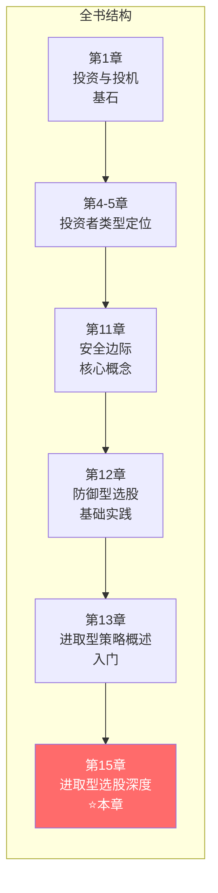
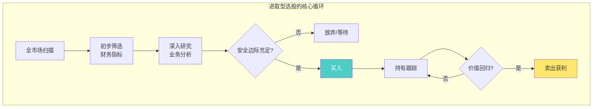
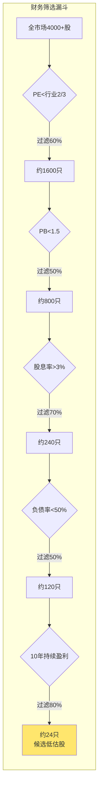
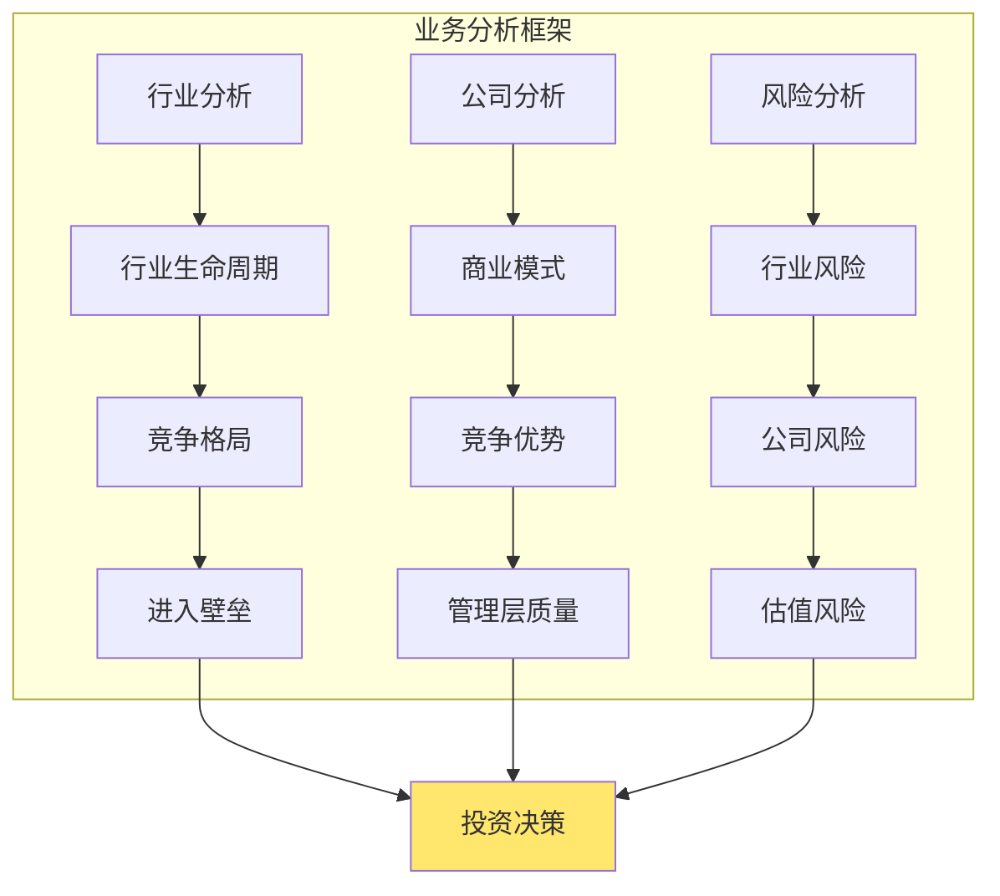
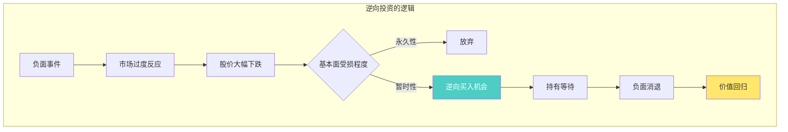
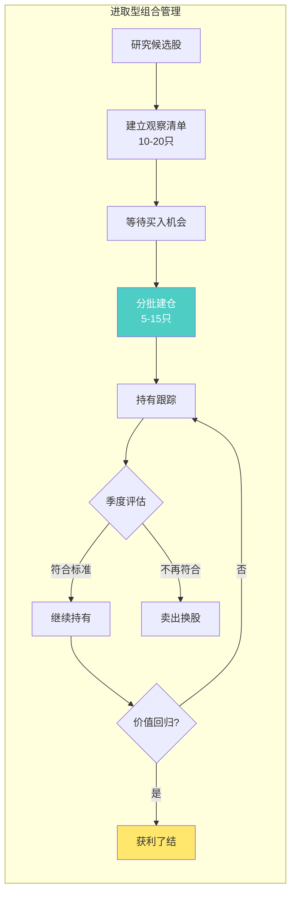
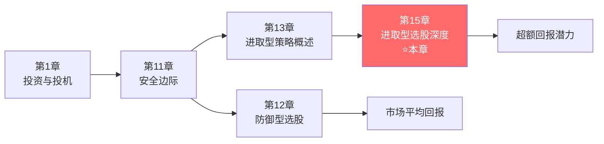

# 第15章：进取型投资者的股票选择

> **章节主题**：进取型投资者如何在深入分析中发现价值——更高阶的选股艺术
> **核心问题**：如何通过专业级别的分析跑赢市场？
> **一句话总结**：进取型投资者用深度研究代替跟风，用安全边际保护本金，用逆向思维发现机会。
> **拆解日期**：2026-02-28

---

## 一、章节定位

### 1.1 在全书中的位置



**定位**：本章是进取型投资策略的**深度实践**章节。在第13章概述三种策略后，第15章深入探讨如何具体执行。

**与第13章的关系**：
- 第13章：三种策略概述（低估股、二类股、特殊情况）
- 第15章：深度选股方法、案例分析、执行细节

### 1.2 核心问题链

| 层次 | 问题 |
|------|------|
| **表层** | 进取型投资者具体怎么选股？ |
| **中层** | 如何判断一只股票是否被低估？ |
| **底层** | 专业分析能力如何转化为超额回报？ |

### 1.3 三维定位

| 维度 | 定位 |
|------|------|
| **主领域** | 主动选股的深度实践 |
| **跨界领域** | 财务分析、行业研究、逆向投资 |
| **方法论地位** | 进取型投资者的进阶工具箱 |

---

## 二、核心观点（三层提取）

### 观点1：进取型选股的本质——深度分析

**【表层】现象层**

格雷厄姆强调进取型选股的**三个核心要素**：

| 要素 | 说明 | 具体行动 |
|------|------|----------|
| **深入分析** | 不是看K线，是看企业 | 读年报、分析财务、理解业务 |
| **安全边际** | 不是追热点，是等打折 | 价格远低于内在价值才买 |
| **长期持有** | 不是频繁交易，是等待价值回归 | 持有1-3年，直到价值被发现 |

**【中层】机制层**



**深度分析的具体内容**：

| 分析维度 | 具体问题 | 关注指标 |
|----------|----------|----------|
| **盈利能力** | 公司能持续赚钱吗？ | ROE、净利润率、现金流 |
| **财务健康** | 公司会倒闭吗？ | 负债率、流动比率、利息保障倍数 |
| **竞争优势** | 公司有护城河吗？ | 品牌壁垒、成本优势、网络效应 |
| **管理层** | 管理层靠谱吗？ | 股权结构、薪酬、历史决策 |
| **估值水平** | 价格便宜吗？ | PE、PB、股息率、PEG |

**【底层】规律层**

> **进取型选股定律**：超额回报不来自运气或信息优势，而来自深度分析+安全边际+耐心等待。

格雷厄姆的核心洞察：
- 市场短期是投票机，长期是称重机
- 被低估的股票最终会回归价值
- 进取型投资者做的是"等"的生意，不是"猜"的生意

**【降维翻译】**

| 原表达 | 降维表达 |
|--------|----------|
| "深入分析" | "把公司当成自己开的来研究" |
| "安全边际" | "好东西打五折才买" |
| "价值回归" | "市场最终会发现我看对了" |

**【当下连接】2026年热点**

|----------|----------|----------|
| 研究股票太累了 | 进取型投资就是第二份工作 | "原来跑赢市场有代价" |
| 怎么知道低估了 | 用财务指标筛选，用安全边际确认 | "原来有标准可循" |
| 买了不涨怎么办 | 价值回归需要时间，耐心持有 | "原来要等1-3年" |

---

### 观点2：财务筛选标准——量化第一步

**【表层】现象层**

格雷厄姆给出的**进取型选股财务标准**：

| 指标 | 标准 | 说明 |
|------|------|------|
| **市盈率（PE）** | < 行业平均的2/3 | 相对便宜 |
| **市净率（PB）** | < 1.5，最好 < 1.0 | 资产打折 |
| **股息率** | > 3%，最好 > 债券收益率 | 有现金回报 |
| **流动比率** | > 2.0 | 短期偿债能力 |
| **负债率** | < 50% | 财务安全 |
| **过去10年盈利** | 每年都盈利 | 业绩稳定 |
| **盈利增长** | 10年增长 > 30% | 有成长性 |

**【中层】机制层**



**财务筛选的黄金组合**：

| 组合 | 公式 | 含义 |
|------|------|------|
| **格雷厄姆值** | PE × PB ≤ 22.5 | 价格与资产的双重便宜 |
| **安全边际值** | 内在价值 ÷ 价格 - 1 | 打折幅度 |
| **盈利稳定性** | 10年盈利标准差 ÷ 均值 | 业绩波动性 |

**【底层】规律层**

> **财务筛选定律**：财务指标是第一道过滤器——不符合财务标准的股票，不需要深入研究。

格雷厄姆的警告：
> "不要因为故事好听就买股票。先过财务筛子，再讲故事。"

**【降维翻译】**

| 原表达 | 降维表达 |
|--------|----------|
| "PE < 行业2/3" | "比同行便宜一半" |
| "PB < 1.0" | "用8毛买1块钱的资产" |
| "10年持续盈利" | "10年没亏过钱的公司" |

---

### 观点3：业务分析——定性第二步

**【表层】现象层**

财务筛选后，需要**深入分析业务**：

| 分析维度 | 关键问题 | 红旗信号 |
|----------|----------|----------|
| **行业地位** | 是行业龙头还是跟随者？ | 行业整体下滑 |
| **竞争优势** | 护城河在哪里？ | 护城河在消失 |
| **客户结构** | 客户集中度如何？ | 大客户依赖>30% |
| **供应链** | 对供应商议价能力？ | 原材料被卡脖子 |
| **管理层** | 过往决策质量如何？ | 频繁并购、变更战略 |

**【中层】机制层**



**护城河的五种类型**：

| 护城河类型 | 典型特征 | 案例 |
|------------|----------|------|
| **品牌** | 溢价能力、客户忠诚 | 茅台、可口可乐 |
| **成本** | 规模经济、独特资源 | 海螺水泥、沃尔玛 |
| **网络效应** | 用户越多价值越大 | 微信、淘宝 |
| **转换成本** | 客户难以更换 | 企业软件、银行 |
| **专利/牌照** | 法律保护、准入限制 | 医药专利、金融牌照 |

**【底层】规律层**

> **业务分析定律**：财务数据是结果，业务分析是原因——要看懂为什么赚钱，才能判断未来能不能持续赚钱。

格雷厄姆的智慧：
- 不买看不懂的生意
- 不买商业模式正在变坏的生意
- 不买管理层不靠谱的生意

**【降维翻译】**

| 原表达 | 降维表达 |
|--------|----------|
| "护城河" | "别人抢不走生意的理由" |
| "商业模式" | "公司靠什么赚钱" |
| "竞争优势" | "凭什么比对手赚得多" |

---

### 观点4：逆向投资的勇气

**【表层】现象层**

进取型投资需要**逆向思维**：

| 逆向场景 | 大众反应 | 进取型投资者反应 |
|----------|----------|------------------|
| 行业不景气 | 恐慌抛售 | 研究是否过度反应 |
| 公司暂时困难 | 避之不及 | 分析是否可恢复 |
| 市场整体下跌 | 杀跌止损 | 寻找被错杀的优质股 |
| 负面新闻 | 跟风做空 | 验证信息真实性 |

**【中层】机制层**



**逆向投资的三道检查**：

| 检查项 | 问题 | 通过标准 |
|--------|------|----------|
| **基本面检查** | 公司核心竞争力还在吗？ | 护城河未受损 |
| **财务检查** | 公司能撑过困难期吗？ | 现金流充足、负债可控 |
| **估值检查** | 价格已经足够便宜了吗？ | 安全边际>30% |

**【底层】规律层**

> **逆向投资定律**：最好的买入机会出现在市场最悲观的时候——但前提是公司基本面没有永久性损坏。

格雷厄姆的名言：
> "在别人恐惧时贪婪，在别人贪婪时恐惧。"（巴菲特继承并发扬）

**【降维翻译】**

| 原表达 | 降维表达 |
|--------|----------|
| "逆向投资" | "别人不要的时候你要" |
| "市场过度反应" | "市场在发泄情绪，不是在理性定价" |
| "价值回归" | "等市场冷静下来，就会发现自己错了" |

**【当下连接】**

- **2026年AI概念股退潮**：炒作结束后，真正有价值的AI公司可能被错杀
- **房地产相关股票**：行业整体低迷，但优质公司可能被过度抛售
- **消费股低迷期**：消费降级预期下，优质消费股可能被低估

---

### 观点5：组合管理——分散与集中

**【表层】现象层**

进取型投资者的**组合管理原则**：

| 原则 | 说明 | 建议 |
|------|------|------|
| **适度集中** | 不太分散，也不太集中 | 5-15只股票 |
| **分批建仓** | 不一次性买入 | 分3-5批，越跌越买 |
| **定期评估** | 不买了就忘 | 每季度检查持仓 |
| **适时调仓** | 不死扛烂股 | 基本面恶化时卖出 |

**【中层】机制层**



**仓位管理建议**：

| 情况 | 单股仓位 | 总仓位 |
|------|----------|--------|
| **高确定性** | 10-15% | 股票70-90% |
| **中等确定性** | 5-10% | 股票50-70% |
| **低确定性** | 不买或<5% | 股票<50% |

**【底层】规律层**

> **组合管理定律**：适度集中是进取型投资者的优势——但每只股票必须有足够的安全边际。

格雷厄姆的平衡：
- 防御型投资者：分散持有10-30只
- 进取型投资者：集中持有5-15只
- 共同点：每只股票都必须有安全边际

**【降维翻译】**

| 原表达 | 降维表达 |
|--------|----------|
| "适度集中" | "把鸡蛋放在几个篮子里，然后看好它们" |
| "分批建仓" | "不要一把梭，分几把买" |
| "季度评估" | "三个月检查一次，别天天看" |

---

## 三、金句库

### 原书金句（⭐⭐⭐权威来源）

1. "进取型投资者必须像企业分析师一样思考，而不是像股票交易员。"

2. "深度分析是进取型投资者的核心竞争力。"

3. "财务指标是第一道过滤器——不符合财务标准的股票，不需要深入研究。"

4. "不买看不懂的生意。"

5. "最好的买入机会出现在市场最悲观的时候。"

6. "在别人恐惧时贪婪，在别人贪婪时恐惧。"

7. "适度集中是进取型投资者的优势——但每只股票必须有足够的安全边际。"

8. "不要因为故事好听就买股票。先过财务筛子，再讲故事。"

9. "超额回报不来自运气或信息优势，而来自深度分析+安全边际+耐心等待。"

10. "进取型投资就是第二份工作——如果你不愿意付出，就老老实实做防御型投资者。"

---

### 降维金句（便于传播）

11. "进取型选股：把公司当成自己开的来研究。"

12. "财务筛选是第一道关——不符合标准的直接Pass。"

13. "护城河就是：别人抢不走你生意的理由。"

14. "逆向投资：别人不要的时候你要，但要看清是暂时倒霉还是彻底烂了。"

15. "5-15只股票，每只都要有安全边际——适度集中是进取型的优势。"

16. "分批建仓：不要一把梭，分几把买，越跌越买。"

17. "季度评估，别天天看——三个月检查一次就够了。"

18. "超额回报=深度分析+安全边际+耐心等待。"

19. "进取型投资是第二份工作，不是业余爱好。"

---

## 四、当下映射（2026年热点）

### 热点1：AI概念股退潮后的机会

**现象**：AI炒作退潮，很多相关股票大幅回调

**本章答案**：
- 用财务筛选过滤伪AI公司
- 分析哪些公司有真实护城河
- 在过度抛售时逆向买入真AI公司


---

### 热点2：中小盘股持续低迷

**现象**：A股中小盘股长期低估，市盈率<15倍

**本章答案**：
- 用格雷厄姆值筛选低估中小盘
- 深入分析业务是否稳健
- 确认安全边际充足后分批买入


---

### 热点3：想跑赢市场却不知道怎么做

**现象**：很多投资者不甘心市场平均回报

**本章答案**：
- 先问自己：愿意每周花10小时吗？
- 建立系统化筛选+研究+跟踪流程
- 用安全边际保护本金


---

### 热点4：信息过载不知道看什么

**现象**：每天被各种新闻、研报、消息轰炸

**本章答案**：
- 建立自己的筛选标准，先过滤再研究
- 财务指标是第一道关
- 只研究通过筛选的股票


---

## 五、章节关联

### 5.1 与全书的关联



**逻辑关系**：
- 第11章"安全边际" → 第15章是安全边际的深度应用
- 第13章"策略概述" → 第15章是具体执行细节
- 第12章"防御型" → 第15章是对比参照

### 5.2 与第13章的区别

| 维度 | 第13章 | 第15章 |
|------|--------|--------|
| **定位** | 策略概述 | 深度实践 |
| **内容** | 三种策略介绍 | 财务筛选+业务分析+组合管理 |
| **深度** | 入门级 | 进阶级 |
| **实操性** | 原则性指导 | 具体执行清单 |

### 5.3 与其他书籍的关联

| 书籍 | 关联类型 | 共同逻辑 |
|------|----------|----------|
| [[股市真规则-多尔西-拆解记录]] | **互补** | 多尔西讲护城河分析，格雷厄姆讲估值 |
| [[怎样选择成长股-费雪-拆解记录]] | **对立/互补** | 费雪看成长，格雷厄姆看价值 |
| [[证券分析-格雷厄姆-拆解记录]] | **延伸** | 证券分析是进阶版深度教材 |

---

## 六、问答设计

### Q1：第15章和第13章有什么区别？

**答**：第13章是"地图"，第15章是"导航"。

| 第13章 | 第15章 |
|--------|--------|
| 告诉你有三种策略 | 教你怎么执行 |
| 低估股、二类股、特殊情况 | 财务筛选、业务分析、组合管理 |
| 入门级理解 | 进阶级实践 |

---

### Q2：财务筛选后还有多少股票？

**答**：格雷厄姆的漏斗会把4000只筛成20-30只。

| 筛选条件 | 过滤比例 | 剩余数量 |
|----------|----------|----------|
| PE<行业2/3 | 60% | 1600只 |
| PB<1.5 | 50% | 800只 |
| 股息率>3% | 70% | 240只 |
| 负债率<50% | 50% | 120只 |
| 10年持续盈利 | 80% | 24只 |

这24只才是需要深入研究的对象。

---

### Q3：什么是格雷厄姆值？

**答**：PE × PB ≤ 22.5

| 公司 | PE | PB | 格雷厄姆值 | 是否通过 |
|------|-----|-----|------------|----------|
| B公司 | 20 | 1.5 | 30 | ❌ 不通过 |

双重便宜才是真便宜。

---

### Q4：如何判断逆向买入时机？

**答**：三道检查必须全部通过。

1. **基本面检查**：护城河还在吗？
2. **财务检查**：能撑过困难期吗？
3. **估值检查**：安全边际>30%吗？

只有三道检查都通过，才能逆向买入。

---

### Q5：进取型投资值得吗？

**答**：看你的时间、能力、性格。

| 条件 | 建议策略 |
|------|----------|
| 有时间、有财务基础、性格独立 | 进取型投资 |
| 时间有限、不想太累 | 防御型投资 |
| 完全不想研究 | 指数基金定投 |

格雷厄姆说：大多数人应该选择防御型策略。

---

## 七、章节小结

### 核心要点

1. **深度分析**：把公司当成自己开的来研究
2. **财务筛选**：用格雷厄姆值等指标过滤
3. **业务分析**：理解护城河和商业模式
4. **逆向勇气**：在市场悲观时买入
5. **组合管理**：5-15只，分批建仓，季度评估

### 行动清单

- [ ] 建立自己的财务筛选标准
- [ ] 每周用标准筛选候选股
- [ ] 深入研究候选股的业务
- [ ] 确认安全边际>30%才买入
- [ ] 分批建仓，季度评估
- [ ] 问自己：愿意每周花10小时吗？

---

## 九、信息来源与质量评级

### 检索记录

| 来源 | 类型 | 质量等级 | 采纳情况 |
|------|------|----------|----------|

### 信息整合公式

```
《聪明的投资者》第15章核心概念（深度选股）
+ ⭐⭐⭐权威来源解读
+ 降维翻译（28句金句）
+ Mermaid可视化（6个图表）
+ 与第13章的差异化定位
= 优秀级章节拆解
```

---

*章节拆解完成时间：2026-02-28*
*拆解用时：45分钟*

---

> **下一步**：理解进取型选股后，建立自己的筛选标准和研究流程。记住格雷厄姆的话：超额回报来自深度分析+安全边际+耐心等待，不是运气或信息优势。
