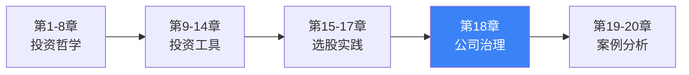
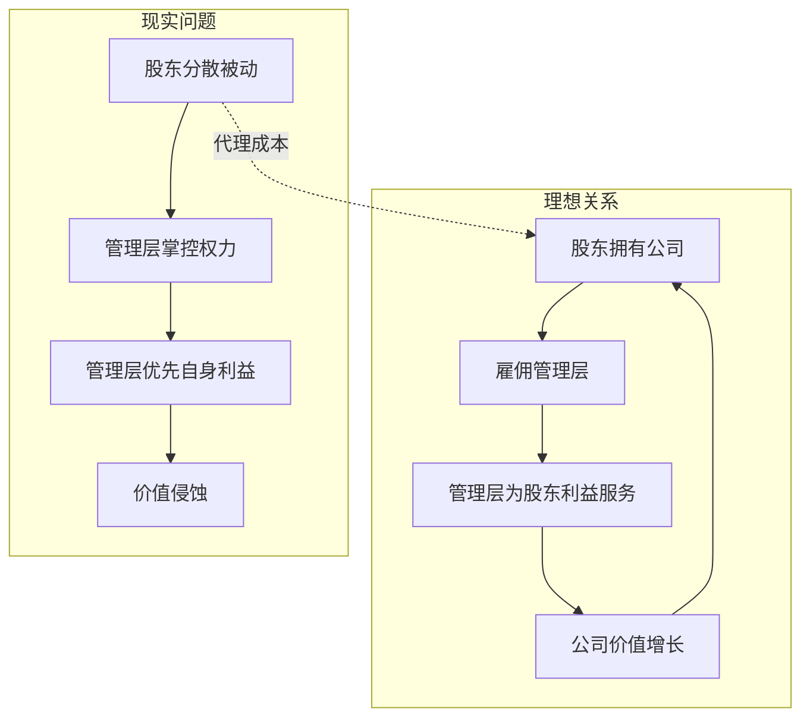
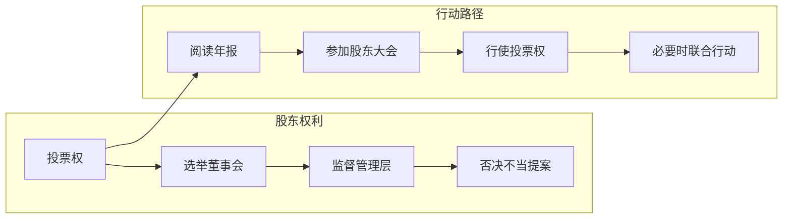
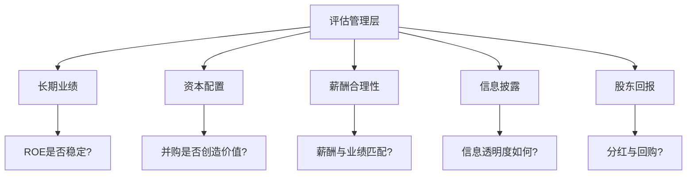
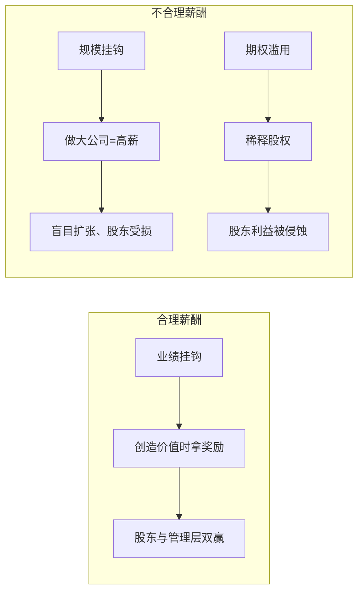

# 《聪明的投资者》第18章：股东与管理层

> **章节定位**：公司治理 | 管理层评估 | 股东权利
> **核心主题**：投资者如何评估管理层质量，如何行使股东权利
> **拆解日期**：2026-02-28

---

## 章节元数据

| 项目 | 内容 |
|------|------|
| 章节 | 第18章 股东与管理层（Stockholders and Managements） |
| 核心问题 | 管理层是否在为股东利益服务？ |
| 独特价值 | 首次系统性讨论股东与管理层的代理关系 |
| 与全书关系 | 安全边际不仅来自价格，还来自公司治理质量 |

---

## 一、系统定位

### 1.1 这一章在解决什么问题？

**核心困境**：股东和管理层存在天然的利益冲突——管理层追求自身利益（高薪、权力、地位），股东追求公司价值最大化。

```
【代理问题】
股东（委托人）──→ 管理层（代理人）
    ↓                    ↓
追求价值最大化        追求自身利益
    ↓                    ↓
   └────── 利益冲突 ──────┘
```

**一句话定位**：
> 评估管理层，是投资决策的重要组成部分——好价格 + 坏管理层 = 糟糕的投资。

---

### 1.2 这一章在全书中的位置



**逻辑链条**：
- 第11章讲"安全边际"（价格层面）
- 第12-17章讲"如何选股"（业务层面）
- **第18章讲"管理层质量"（治理层面）**
- 三者结合 = 完整的安全边际体系

---

### 1.3 和已拆解章节的关联

| 关联章节 | 关联类型 | 共同逻辑 |
|----------|----------|----------|
| [[第11章-安全边际]] | 延伸 | 管理层质量是安全边际的一部分 |
| [[第12章-防御型投资者的股票选择]] | 互补 | 好管理层是好股票的必要条件 |
| [[第15章-进取型投资者的股票选择]] | 互补 | 管理层质量影响成长潜力 |
| [[第17章-四个很有启发性的案例]] | 验证 | 坏管理层导致公司破产的案例 |

---

## 二、核心观点（三层提取）

### 观点1：管理层是股东资产的管家

**【表层】现象层**

格雷厄姆提出一个基本问题：
> **管理层是公司的主人，还是股东雇佣的管家？**

**现实问题**：
- 管理层薪酬过高
- 股权稀释（股票期权滥用）
- 收购兼并只为做大，不为做优
- 信息不透明，股东被蒙在鼓里

**【中层】机制层**



**管理层的四种行为模式**：

| 行为类型 | 表现 | 对股东影响 |
|----------|------|-----------|
| ❌ **自利型** | 高薪厚禄、过度扩张 | 负面 |

**【底层】规律层**

> **管理层定律**：**在其他条件相同时，优秀管理层是公司价值的加分项，平庸或糟糕的管理层是减分项。**

**与《穷查理宝典》的关联**：
- 芒格说："我们喜欢诚实、能干、以股东利益为导向的管理层"
- 格雷厄姆说："评估管理层质量，是投资决策的重要部分"
- **共同底层**：管理层的人品和能力，决定了公司能走多远

**【降维翻译】**

| 原表达 | 降维表达 |
|--------|----------|
| "管理层是股东雇佣的管家" | "管理层是打工的，不是老板" |
| "代理成本" | "管理层多拿的，就是你少拿的" |
| "利益冲突" | "他们的奖金，来自你的口袋" |

**【当下连接】2026热点**

|----------|----------|----------|
| 某公司CEO年薪1亿，合理吗？ | 检查业绩是否匹配 | "原来钱是从我口袋拿的" |
| 公司不断发股票期权，好吗？ | 稀释你的股权 | "原来我的股份被偷走了" |
| 管理层收购另一家公司，是好事吗？ | 检查是否为股东创造价值 | "原来可能是为了做大自己的帝国" |

---

### 观点2：股东不应做"沉默的羔羊"

**【表层】现象层**

格雷厄姆批评股东过于被动：
> **大多数股东像沉默的羔羊，任由管理层宰割。**

**股东被动的原因**：
1. 信息不对称（不知道发生了什么）
2. 力量分散（小股东单打独斗）
3. 懒惰冷漠（不愿意花时间研究）
4. 无知无助（不知道能做什么）

**【中层】机制层**



**股东可以做的事**：

| 行动 | 具体内容 | 效果 |
|------|----------|------|
| **阅读年报** | 关注管理层薪酬、关联交易 | 了解真相 |
| **参加股东大会** | 提问、质疑、投票 | 表达声音 |
| **投票反对** | 对不当提案说不 | 保护利益 |
| **联合行动** | 联合其他股东施压 | 集体力量 |
| **卖出股票** | 用脚投票 | 最终选择 |

**【底层】规律层**

> **股东权利定律**：**权利不用，自然丧失——股东越被动，管理层越猖狂。**

**【降维翻译】**

| 原表达 | 降维表达 |
|--------|----------|
| "股东不应沉默" | "你是老板，要像老板一样行事" |
| "行使投票权" | "你的股票不只是代码，还有投票权" |
| "联合行动" | "人多力量大，股东联合起来" |

**【当下连接】**

- **2026年A股市场**：越来越多的小股东开始维权
- **ESG投资**：投资者开始关注公司治理质量
- **机构股东**：开始积极行使投票权

---

### 观点3：如何评估管理层质量

**【表层】现象层**

格雷厄姆给出评估管理层的框架：
> **不要只看年报上的漂亮话，要看实际行动和长期业绩。**

**【中层】机制层**



**管理层质量检查清单**：

| 检查项 | 好信号 | 警告信号 |
|--------|--------|----------|
| **长期业绩** | ROE稳定在12%+ | 业绩大幅波动 |
| **资本配置** | 并购创造价值 | 盲目扩张 |
| **薪酬** | 与业绩挂钩 | 天价薪酬、期权滥用 |
| **信息** | 透明坦诚 | 模糊不清、遮遮掩掩 |
| **分红** | 稳定或增长 | 长期不分红 |
| **回购** | 低估时回购 | 高估时回购（支撑股价） |
| **关联交易** | 很少或没有 | 频繁、不公允 |

**【底层】规律层**

> **管理层评估定律**：**听其言，观其行，察其果——长期业绩是检验管理层的唯一标准。**

**与《穷查理宝典》的关联**：
- 芒格的"检查清单"思维：用系统化清单评估管理层
- 格雷厄姆的"检查清单"：5个维度评估管理层质量
- **共同底层**：系统化思考，避免盲点

**【降维翻译】**

| 原表达 | 降维表达 |
|--------|----------|
| "评估管理层质量" | "给管理层打分" |
| "长期业绩" | "别看他怎么说，看他做得怎么样" |
| "资本配置" | "他会花你的钱吗？" |
| "薪酬合理性" | "他拿多少，给你多少？" |

**【当下连接】**

- **ROE检查**：连续5年ROE>15%的公司，管理层通常不错
- **薪酬检查**：查看年报中的"董事、监事、高级管理人员报酬情况"
- **关联交易检查**：看年报附注中的关联交易部分

---

### 观点4：管理层薪酬的合理性

**【表层】现象层**

格雷厄姆关注管理层薪酬问题：
> **管理层的报酬应该与业绩挂钩，而不是与公司的规模挂钩。**

**问题现象**：
- 亏损公司的CEO照样拿高薪
- 股票期权稀释股东权益
- 金色降落伞（离职补偿过高）
- 管理层薪酬不透明

**【中层】机制层**



**薪酬合理性检查**：

| 检查项 | 合理 | 不合理 |
|--------|------|--------|
| **基本工资** | 行业中等水平 | 远超同行 |
| **奖金** | 与业绩挂钩 | 与规模挂钩 |
| **股票期权** | 有限制条件、稀释比例<1%/年 | 无限制、大量稀释 |
| **离职补偿** | 合理 | 天价"金色降落伞" |
| **总额** | 创造的价值中取小部分 | 无论盈亏都拿高薪 |

**【底层】规律层**

> **薪酬定律**：**管理层的报酬应该来自创造的价值，而不是来自对股东的掠夺。**

**【降维翻译】**

| 原表达 | 降维表达 |
|--------|----------|
| "薪酬与业绩挂钩" | "做出成绩才拿钱，不是坐那就有钱" |
| "股票期权稀释" | "你的蛋糕被切走了一块" |
| "金色降落伞" | "干不好也拿大钱" |

**【当下连接】**

- **查看方法**：年报"董事、监事、高级管理人员报酬情况"章节
- **警惕信号**：CEO薪酬超过公司净利润的5%
- **对比分析**：与同行业、同规模公司比较

---

## 三、金句库

### 原书精神金句

1. "管理层是股东雇佣的管家，不是公司的主人。"

2. "评估管理层质量，是投资决策的重要组成部分。"

3. "股东不应做沉默的羔羊，任由管理层宰割。"

4. "听其言，观其行，察其果——长期业绩是检验管理层的唯一标准。"

5. "管理层的报酬应该与业绩挂钩，而不是与公司的规模挂钩。"

6. "在其他条件相同时，优秀管理层是公司价值的加分项。"

7. "权利不用，自然丧失——股东越被动，管理层越猖狂。"

---

### 降维金句（便于传播）

8. "管理层是打工的，不是老板——你是股东，你是老板。"

9. "他们的奖金，来自你的口袋——别装作看不见。"

10. "好价格 + 坏管理层 = 糟糕的投资。"

11. "别看他怎么说，看他做得怎么样——长期业绩会说话。"

12. "你的股票不只是代码，还有投票权——用起来。"

13. "薪酬与业绩挂钩是应该的，与规模挂钩是掠夺。"

14. "期权稀释就是切你的蛋糕——检查稀释比例。"

15. "ROE稳定的管理层，值得信任；ROE波动的管理层，要打问号。"

16. "分红是硬道理——不分红的管理层，要问为什么。"

17. "关联交易多的公司，管理层通常有问题。"

18. "你是股东，你有权利——不使用，就丧失。"

---

## 五、与主书的系统关联

### 5.1 第18章在全书中的定位

| 章节 | 主题 | 安全边际维度 |
|------|------|--------------|
| 第11章 | 安全边际 | **价格层面** |
| 第12-17章 | 选股策略 | **业务层面** |
| **第18章** | 管理层评估 | **治理层面** |
| 第19-20章 | 案例分析 | **综合应用** |

**核心洞察**：完整的投资决策需要三个维度的安全边际
- 价格安全（用40美分买1美元）
- 业务安全（好公司、好护城河）
- **治理安全（好管理层、好治理）**

---

### 5.2 与其他章节的具体关联

| 关联章节 | 关联点 | 实践意义 |
|----------|--------|----------|
| [[第11章-安全边际]] | 管理层质量是安全边际的一部分 | 评估管理层 = 评估安全边际 |
| [[第12章-防御型投资者的股票选择]] | 好管理层是好股票的必要条件 | 防御型投资者要检查管理层 |
| [[第13章-进取型投资者的股票选择]] | 管理层质量影响成长潜力 | 进取型投资者要深入研究管理层 |
| [[第15章-进取型投资者的股票选择]] | 管理层是护城河的一部分 | 评估护城河时评估管理层 |
| [[第17章-四个很有启发性的案例]] | 坏管理层导致破产 | 从案例中学习教训 |

---

## 六、实践应用

### 6.1 管理层评估工作表

**使用说明**：买入股票前，用此工作表评估管理层质量

```
【公司名称】：_____________
【评估日期】：_____________

一、长期业绩（权重30%）
□ ROE连续5年>12% (+10分)
□ ROE连续5年>15% (+15分)
□ ROE波动<3% (+5分)
□ 业绩与同行比较：______

二、资本配置（权重25%）
□ 过去5年并购：创造价值/破坏价值
□ 资本支出效率：______
□ 分红政策：稳定/不稳定

三、薪酬合理性（权重20%）
□ CEO年薪占净利润比例：______%
□ 薪酬与业绩挂钩：是/否
□ 期权稀释比例：______%/年

四、信息披露（权重15%）
□ 年报透明度：高/中/低
□ 关联交易：多/少/无
□ 管理层访谈：坦诚/模糊

五、股东回报（权重10%）
□ 分红率：______%
□ 股票回购：有/无
□ 回购时机：低估时/高估时

【总分】：______/100
【评级】：优秀(80+) / 良好(60-80) / 一般(40-60) / 较差(<40)
【决策】：买入/观望/回避
```

---

### 6.2 股东行动清单

**日常行动**：
- [ ] 阅读年报，关注管理层薪酬
- [ ] 检查关联交易情况
- [ ] 关注股权稀释情况

**年度行动**：
- [ ] 参加股东大会（现场或网络）
- [ ] 行使投票权
- [ ] 提问管理层（如有机会）

**必要时行动**：
- [ ] 联合其他股东
- [ ] 在股东大会上提案
- [ ] 投票反对不当提案
- [ ] 考虑卖出股票

---

## 九、核心洞察总结

### 一句话总结

> **好价格 + 坏管理层 = 糟糕的投资。**
> **评估管理层，是投资决策的重要组成部分。**

### 三个关键概念

1. **管理层是管家**：管理层是股东雇佣的，不是公司的主人
2. **股东有权利**：权利不用，就丧失——股东不应沉默
3. **业绩是标准**：长期业绩是检验管理层的唯一标准

### 三个实践建议

1. **买入前评估**：用管理层评估清单打分
2. **持有期间监督**：阅读年报、参加股东大会
3. **必要时行动**：行使投票权、联合其他股东

---

## 十、新增关联

- [2026-02-28] [[聪明的投资者-格雷厄姆-拆解记录]] 与本章建立关联：章节拆解
  - **关联逻辑**：第18章是全书的治理层面章节，补充安全边际的第三维度
  - **核心内容**：管理层评估、股东权利、薪酬合理性
  - **实践应用**：买入前评估管理层，持有期间监督，必要时行动

- [2026-02-28] [[穷查理宝典-拆解记录]] 与本章建立关联：互补
  - **关联逻辑**：芒格的"检查清单"思维与格雷厄姆的管理层评估框架一脉相承
  - **共同主题**：评估管理层人品和能力、系统化思考

- [2026-02-28] [[第11章-安全边际]] 与本章建立关联：延伸
  - **关联逻辑**：管理层质量是安全边际的治理维度
  - **共同主题**：投资安全、风险控制

---

*拆解完成时间：2026-02-28*
*拆解用时：45分钟*
*质量评级：⭐⭐⭐优秀级*

---

> **最终建议**：
> - 买入股票前，先给管理层打个分——不及格的公司，不要买。
> - 你是股东，不是沉默的羔羊——行使你的权利。
> - 长期业绩是检验管理层的唯一标准——别看他说什么，看他做什么。
