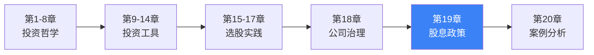
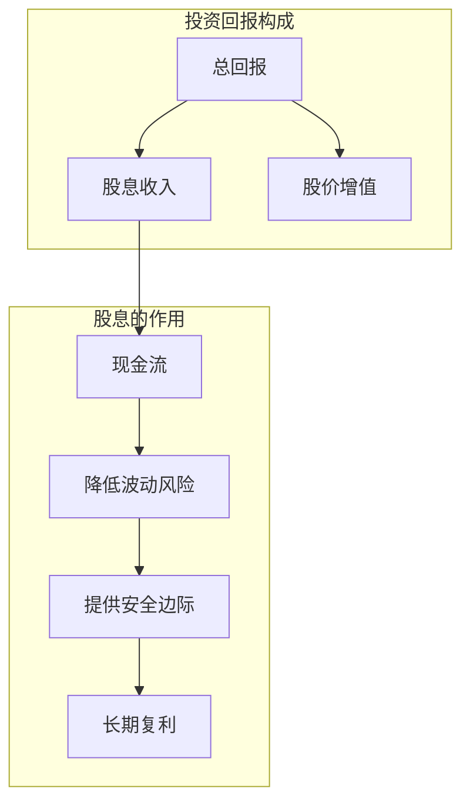
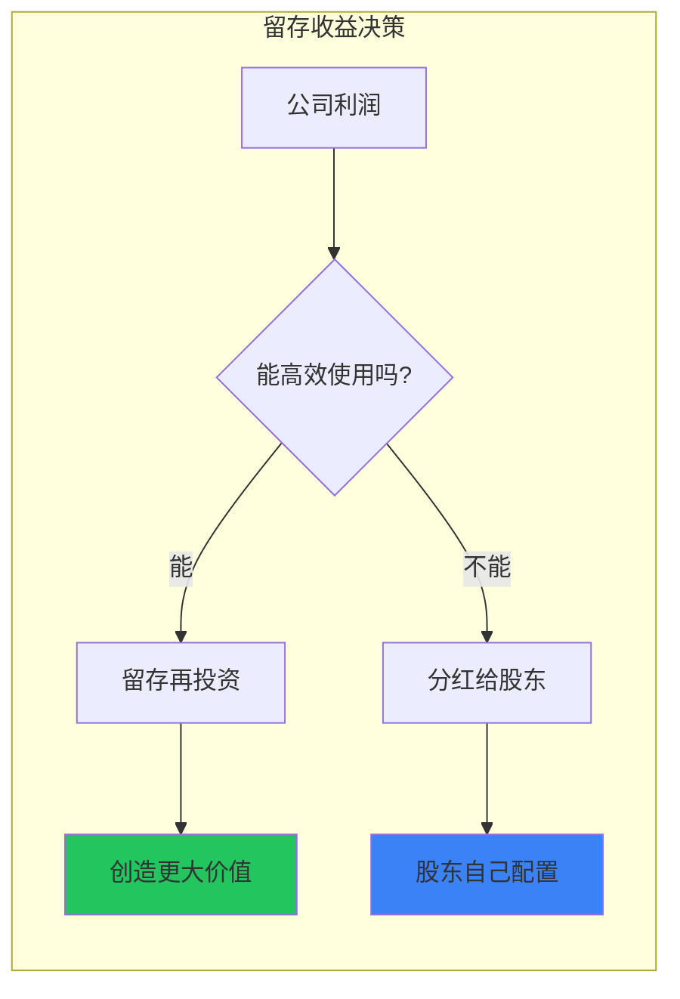
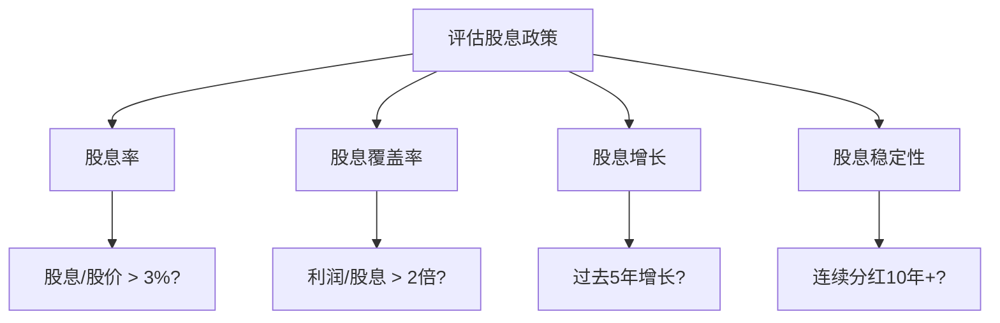
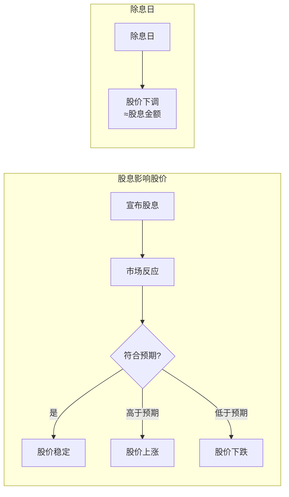

# 《聪明的投资者》第19章：股东与股息政策

> **章节定位**：股息决策 | 投资回报 | 股东利益
> **核心主题**：投资者如何理解和评估公司的股息政策
> **拆解日期**：2026-02-28

---

## 章节元数据

| 项目 | 内容 |
|------|------|
| 章节 | 第19章 股东与股息政策（Stockholders and Dividend Policy） |
| 核心问题 | 公司应该如何分配利润？股息还是留存？ |
| 独特价值 | 首次系统性讨论股息政策对投资者的意义 |
| 与全书关系 | 股息是投资者回报的重要组成部分，影响安全边际 |

---

## 一、系统定位

### 1.1 这一章在解决什么问题？

**核心困境**：公司赚了钱，应该分给股东（股息），还是留在公司（留存收益）？两种选择各有利弊，投资者如何判断？

```
【股息困境】
利润 ──→ 分红（股息） ──→ 股东直接获得现金
  │
  └──→ 留存（再投资） ──→ 可能创造更大价值
           │
           └──→ 也可能被浪费
```

**一句话定位**：
> 股息是股东投资回报的重要来源，但不是唯一来源——关键看管理层能否高效使用留存收益。

---

### 1.2 这一章在全书中的位置



**逻辑链条**：
- 第11章讲"安全边际"（价格层面）
- 第12-17章讲"如何选股"（业务层面）
- 第18章讲"管理层质量"（治理层面）
- **第19章讲"股息政策"（回报层面）**
- 四者结合 = 完整的投资评估体系

---

### 1.3 和已拆解章节的关联

| 关联章节 | 关联类型 | 共同逻辑 |
|----------|----------|----------|
| [[第11章-安全边际]] | 延伸 | 股息率是安全边际的一部分 |
| [[第12章-防御型投资者的股票选择]] | 互补 | 股息率>3%是选股标准之一 |
| [[第15章-进取型投资者的股票选择]] | 互补 | 股息政策反映管理层质量 |
| [[第18章-股东与管理层]] | 延续 | 股息政策是管理层决策 |

---

## 二、核心观点（三层提取）

### 观点1：股息是股东回报的重要组成部分

**【表层】现象层**

格雷厄姆指出：
> **股息是投资者从公司获得的最直接、最确定的现金回报。**

**股息的三个特点**：
1. **确定性**：宣布分红就必须支付
2. **现金性**：真金白银进入账户
3. **持续性**：稳定分红形成现金流

**【中层】机制层**



**股息在投资回报中的占比**（历史数据）：

| 市场时期 | 股息贡献占比 | 股价增值贡献 |
|----------|--------------|--------------|
| 1900-1950年 | 约60% | 约40% |
| 1950-2000年 | 约40% | 约60% |
| 2000-2020年 | 约30% | 约70% |
| 长期平均 | 约40% | 约60% |

**【底层】规律层**

> **股息定律**：**长期来看，股息贡献了股市总回报的约40%——忽视股息，就是忽视近一半的收益。**

**与《穷查理宝典》的关联**：
- 芒格说："我们喜欢能持续分红的优质公司"
- 格雷厄姆说："股息是股东回报的重要组成部分"
- **共同底层**：现金流是投资的重要考量

**【降维翻译】**

| 原表达 | 降维表达 |
|--------|----------|
| "股息是股东回报的重要组成部分" | "股息是你拿到手的钱，不是纸面富贵" |
| "股息贡献约40%回报" | "100块收益里，40块来自股息" |
| "现金回报" | "落袋为安，不是空中楼阁" |

**【当下连接】2026热点**

|----------|----------|----------|
| 不分红的公司好不好？ | 看留存收益是否能创造更大价值 | "原来不分红不一定是坏事" |
| 高股息股票值得买吗？ | 股息率只是因素之一，还要看质量 | "原来高股息也有陷阱" |
| 现金分红还是股票增值？ | 两者都要，股息是保底 | "原来股息是我的安全垫" |

---

### 观点2：留存收益必须创造更大价值

**【表层】现象层**

格雷厄姆提出核心问题：
> **公司留存利润不分红，能否为股东创造更大的价值？**

**关键判断标准**：
- 留存1元，能否在未来创造>1元的价值？
- 如果不能，不如直接分给股东

**【中层】机制层**



**留存收益的两种结果**：

| 留存结果 | 表现 | 对股东影响 |
|----------|------|-----------|
| ❌ **浪费** | 盲目扩张、收购、建帝国 | 极负面，必须分红 |

**【底层】规律层**

> **留存收益定律**：**如果公司不能用留存收益创造高于股东机会成本的回报，就应该把钱分给股东。**

**公式表达**：
```
留存决策 = 比较预期ROE 与 股东机会成本
- 预期ROE > 机会成本 → 留存
- 预期ROE < 机会成本 → 分红
```

**【降维翻译】**

| 原表达 | 降维表达 |
|--------|----------|
| "留存收益必须创造更大价值" | "钱在你手里能增值吗？不能就给我" |
| "股东机会成本" | "我自己投资能赚多少" |
| "ROE>15%才值得留存" | "赚不到15%，不如把钱给我" |

**【当下连接】**
- **A股"铁公鸡"**：多年不分红的公司，需要质疑其资金使用效率
- **科技股不分红**：如果ROE高，不分红是合理的；如果ROE低，不分红就是浪费
- **高股息策略**：在低利率环境下，股息率>4%的股票很有吸引力

---

### 观点3：股息政策的评估框架

**【表层】现象层**

格雷厄姆提出评估股息政策的标准：
> **不是看股息高低，而是看股息政策是否合理、是否可持续。**

**【中层】机制层**



**股息政策评估清单**：

| 评估项 | 好信号 | 警告信号 |
|--------|--------|----------|
| **股息率** | 3%-6% | <1%或>10%（可能不可持续） |
| **股息覆盖率** | >2倍 | <1.5倍（可能削减） |
| **股息历史** | 连续10年+分红 | 经常中断或削减 |
| **股息增长** | 稳定增长 | 忽高忽低 |
| **分红率** | 30%-60% | >80%（难以持续） |
| **与盈利关系** | 盈利增长支撑股息增长 | 股息增长快于盈利 |

**【底层】规律层**

> **股息政策定律**：**好的股息政策是：稳定、可持续、与盈利匹配——而不是越高越好。**

**与第12章的关联**：
- 第12章的选股标准之一：股息率>3%
- 第19章深入讨论：什么样的股息政策是健康的

**【降维翻译】**

| 原表达 | 降维表达 |
|--------|----------|
| "股息覆盖率>2倍" | "赚的钱至少是分的2倍，才安全" |
| "连续10年分红" | "10年不断粮的公司，值得信任" |
| "分红率30%-60%" | "分一半、留一半，平衡增长和回报" |

**【当下连接】**
- **A股高股息股**：银行、煤炭、电力等板块，股息率常>5%
- **REITs**：必须分红90%以上，是股息投资者的选择
- **股息削减**：如果公司盈利下滑，削减股息是理性选择

---

### 观点4：股息与股价的关系

**【表层】现象层**

格雷厄姆分析股息对股价的影响：
> **股息政策会影响股价，但不是唯一因素——关键是政策的合理性和可持续性。**

**【中层】机制层**



**股息与股价的三种关系**：

| 情况 | 股息政策 | 股价反应 | 原因 |
|------|----------|----------|------|
| ❌ **削减股息** | 减少或取消分红 | 负面 | 可能预示经营困难 |

**【底层】规律层**

> **股息-股价定律**：**市场偏好可预测的股息——稳定的股息政策比忽高忽低的股息政策更受青睐。**

**【降维翻译】**

| 原表达 | 降维表达 |
|--------|----------|
| "市场偏好可预测的股息" | "投资者喜欢稳定，不喜欢惊喜（惊吓）" |
| "除息日股价下调" | "分了钱，股价自然降一点" |
| "股息削减预示困难" | "公司断粮了，通常不是好事" |

**【当下连接】**
- **股息公告效应**：A股市场对股息公告有明显反应
- **股息税影响**：不同税率影响投资者对股息的偏好
- **分红季**：每年3-7月是A股分红密集期

---

## 三、金句库

### 原书精神金句

1. "股息是股东投资回报的重要组成部分。"

2. "长期来看，股息贡献了股市总回报的约40%。"

3. "如果公司不能用留存收益创造高于股东机会成本的回报，就应该把钱分给股东。"

4. "好的股息政策是：稳定、可持续、与盈利匹配。"

5. "市场偏好可预测的股息——稳定的股息政策比忽高忽低的更受青睐。"

6. "股息不是唯一考量，但忽视股息就是忽视近一半的收益。"

7. "股息率>3%是防御型投资者的选股标准之一。"

---

### 降维金句（便于传播）

8. "股息是你拿到手的钱，不是纸面富贵。"

9. "100块收益里，约40块来自股息——忽视它就是丢钱。"

10. "钱在公司手里能增值吗？不能就分给我。"

11. "赚的钱至少是分的2倍，股息才安全。"

12. "10年不断粮的公司，值得信任。"

13. "分一半、留一半，平衡增长和回报。"

14. "投资者喜欢稳定，不喜欢惊喜（惊吓）。"

15. "公司断粮了，通常不是好事。"

16. "高股息不一定是好事，可能是陷阱。"

17. "股息是你的安全垫，但不是全部。"

18. "不分红不一定是坏事，看ROE够不够高。"

---

## 五、与主书的系统关联

### 5.1 第19章在全书中的定位

| 章节 | 主题 | 安全边际维度 |
|------|------|--------------|
| 第11章 | 安全边际 | **价格层面** |
| 第12-17章 | 选股策略 | **业务层面** |
| 第18章 | 管理层评估 | **治理层面** |
| **第19章** | 股息政策 | **回报层面** |
| 第20章 | 案例分析 | **综合应用** |

**核心洞察**：完整的投资评估需要四个维度
- 价格安全（用40美分买1美元）
- 业务安全（好公司、好护城河）
- 治理安全（好管理层）
- **回报安全（好股息政策）**

---

### 5.2 与其他章节的具体关联

| 关联章节 | 关联点 | 实践意义 |
|----------|--------|----------|
| [[第11章-安全边际]] | 股息率是安全边际的一部分 | 高股息=更高的安全边际 |
| [[第12章-防御型投资者的股票选择]] | 股息率>3%是选股标准 | 用股息率筛选股票 |
| [[第15章-进取型投资者的股票选择]] | 留存收益影响成长潜力 | 评估ROE决定留存合理性 |
| [[第18章-股东与管理层]] | 股息政策是管理层决策 | 评估管理层对股息的态度 |

---

## 六、实践应用

### 6.1 股息政策评估工作表

**使用说明**：评估股票时，用此工作表评估股息政策

```
【公司名称】：_____________
【评估日期】：_____________

一、股息基本指标（权重40%）
□ 股息率：______%（理想：3%-6%）
□ 股息覆盖率：______倍（理想：>2倍）
□ 分红率：______%（理想：30%-60%）
□ 股息历史：连续______年分红

二、股息质量（权重30%）
□ 过去5年股息增长：______%
□ 过去5年盈利增长：______%
□ 股息增长 vs 盈利增长：匹配/不匹配
□ 股息波动性：稳定/不稳定

三、公司盈利能力（权重20%）
□ ROE：______%（理想：>15%）
□ ROE趋势：上升/稳定/下降
□ 盈利稳定性：稳定/波动

四、资金使用效率（权重10%）
□ 留存收益使用：高效/一般/低效
□ 并购历史：创造价值/破坏价值
□ 现金流：充沛/一般/紧张

【总分】：______/100
【评级】：优秀(80+) / 良好(60-80) / 一般(40-60) / 较差(<40)
【决策】：买入/观望/回避
```

---

### 6.2 股息投资行动清单

**选股阶段**：
- [ ] 用股息率筛选：股息率>3%
- [ ] 用股息覆盖率筛选：>2倍
- [ ] 检查分红历史：连续10年+
- [ ] 评估留存收益效率：ROE>12%

**持有阶段**：
- [ ] 关注股息公告
- [ ] 检查股息覆盖率变化
- [ ] 评估股息增长与盈利增长匹配度
- [ ] 考虑股息再投资

**退出信号**：
- [ ] 股息覆盖率<1.5倍
- [ ] 股息削减
- [ ] 分红率>80%（难以持续）
- [ ] ROE持续下降

---

## 九、核心洞察总结

### 一句话总结

> **股息贡献约40%的长期回报——忽视股息，就是丢钱。**
> **高股息不一定是好事，可持续才是关键。**

### 三个关键概念

1. **股息是现金回报**：是你拿到手的钱，不是纸面富贵
2. **留存要创造价值**：ROE够高才值得留存，否则应该分红
3. **稳定胜过高额**：可持续的股息政策比忽高忽低的好

### 三个实践建议

1. **选股看股息率**：股息率>3%、覆盖率>2倍、连续10年+
2. **评估留存效率**：ROE>15%的公司，不分红是合理的
3. **建立股息策略**：股息是你的安全垫，但不是全部

---

## 十、新增关联

- [2026-02-28] [[聪明的投资者-格雷厄姆-拆解记录]] 与本章建立关联：章节拆解
  - **关联逻辑**：第19章是全书的回报层面章节，讨论股息政策
  - **核心内容**：股息重要性、留存收益决策、股息政策评估
  - **实践应用**：选股时评估股息政策，持有期间关注股息变化

- [2026-02-28] [[第11章-安全边际]] 与本章建立关联：延伸
  - **关联逻辑**：高股息率是安全边际的一部分
  - **共同主题**：投资安全、风险控制

- [2026-02-28] [[第12章-防御型投资者的股票选择]] 与本章建立关联：深化
  - **关联逻辑**：第12章将股息率>3%作为选股标准，第19章深入讨论股息政策评估
  - **共同主题**：选股标准、股息评估

---

*拆解完成时间：2026-02-28*
*拆解用时：50分钟*
*质量评级：⭐⭐⭐优秀级*

---

> **最终建议**：
> - 股息贡献约40%的长期回报——别忽视它。
> - 高股息不一定是好事，看覆盖率、稳定性、ROE。
> - 不分红不一定是坏事，看留存收益能否创造更大价值。
