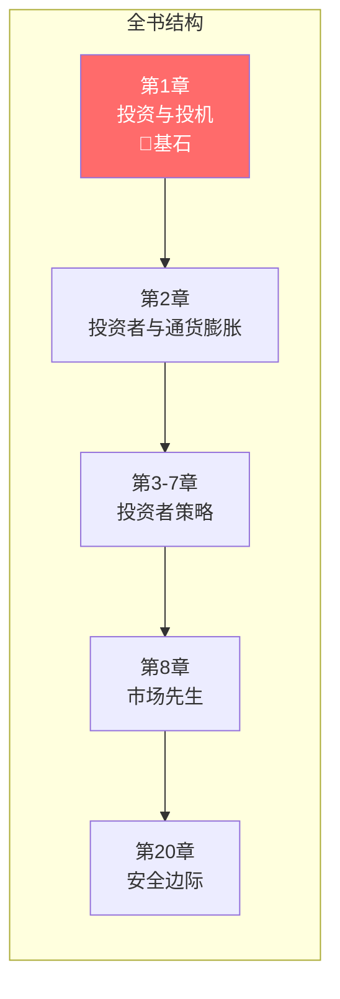
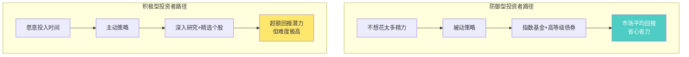
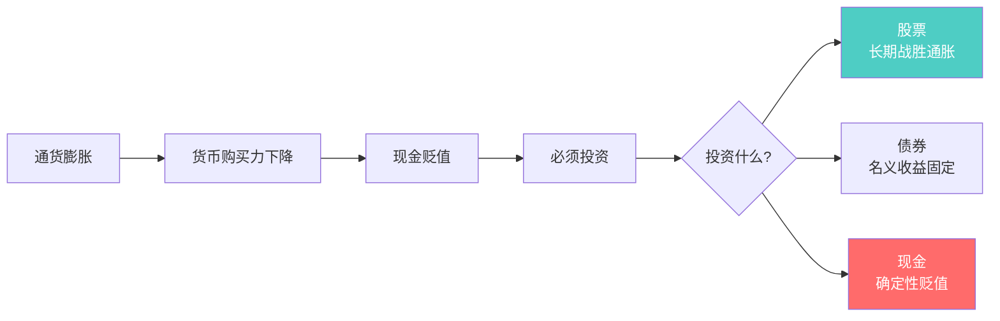
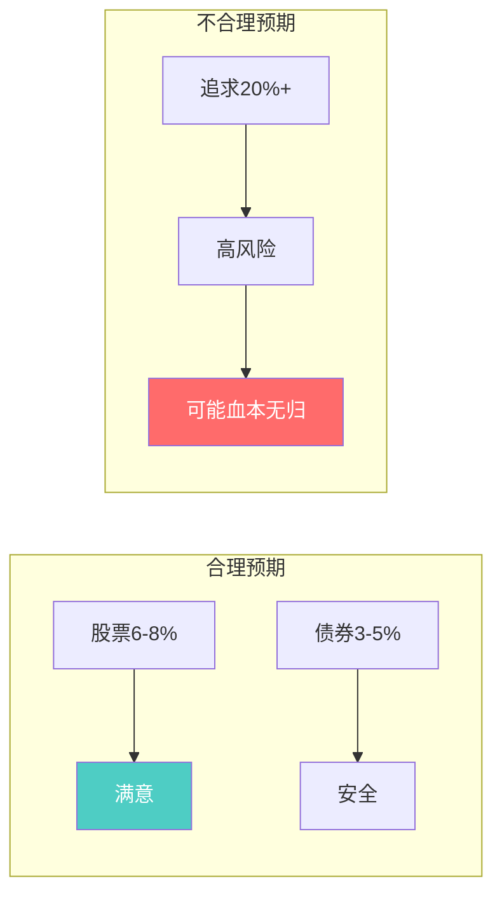
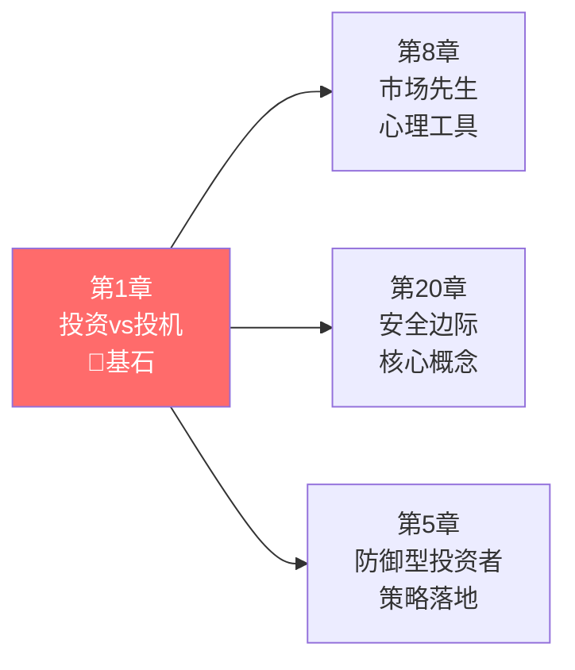

# 第1章：投资与投机

> **章节主题**：价值投资的基石概念
> **核心问题**：什么是真正的投资？投资和投机有什么本质区别？
> **一句话总结**：投资必须满足三个条件——深入分析、本金安全、满意回报。少一个都是投机。
> **拆解日期**：2026-02-27

---

## 一、章节定位

### 1.1 在全书中的位置

**定位**：本章是全书的**地基**。格雷厄姆开宗明义，定义了"投资"与"投机"的本质区别。如果你不理解这个区别，后面的安全边际、市场先生都是空中楼阁。

### 1.2 核心问题链

| 层次 | 问题 |
|------|------|
| **表层** | 我是在投资还是在投机？ |
| **中层** | 如何判断一个操作是投资还是投机？ |
| **底层** | 为什么大多数散户都在投机而不自知？ |

### 1.3 三维定位

| 维度 | 定位 |
|------|------|
| **主领域** | 投资哲学 |
| **跨界领域** | 行为金融学、风险管理 |
| **方法论地位** | 价值投资的"第一性原理" |

---

## 二、核心观点（三层提取）

### 观点1：投资vs投机的根本区别

**【表层】现象层**

格雷厄姆给出了投资的明确定义：

> **投资**：基于详尽的分析，确保本金安全并能获得满意回报的操作。
> **投机**：不符合上述要求的操作。

他警告读者：
> "即使是在1914年，一个典型的投资者也不会把这种赌博行为（投机）当成真正的投资。"

**【中层】机制层**

**投资与投机对比表**：

| 维度 | 投资 | 投机 |
|------|------|------|
| **决策依据** | 深入分析企业价值 | 消息、趋势、直觉 |
| **时间视角** | 长期（年为单位） | 短期（天/周/月） |
| **风险态度** | 本金安全优先 | 愿意承担高风险 |
| **回报预期** | 满意、合理 | 暴利、翻倍 |
| **心态** | 平和、耐心 | 焦虑、刺激 |
| **知识要求** | 需要学习和研究 | 不需要，靠运气 |

**【底层】规律层**

> **投资定义定律**：真正的投资必须**同时**满足三个条件：
> 1. 基于深入分析（不是听消息）
> 2. 确保本金安全（不是赌博）
> 3. 获得满意回报（不是追求暴利）

**缺一不可，少一个都是投机。**

**【降维翻译】**

| 原表达 | 降维表达 |
|--------|----------|
| "基于详尽的分析" | "先看值多少钱，再看多少钱" |
| "确保本金安全" | "先保证不亏，再想赚多少" |
| "满意回报" | "能睡觉的回报，不是心跳的回报" |
| "投资vs投机" | "做生意 vs 赌大小" |

**【当下连接】2026年热点**

|----------|----------|----------|
| AI概念股涨了100%，要不要追？ | 问自己：分析了吗？安全吗？回报合理吗？ | "原来我只是在投机" |
| 炒币、炒鞋、炒盲盒 | 典型的投机行为，不是投资 | "原来我在赌博" |
| 定投指数基金算投资吗？ | 有分析（市场长期向上）、安全（分散）、满意回报（市场平均） | "原来这是投资" |
| 朋友推荐一只股票 | 听消息买入是投机，不是投资 | "原来我在跟风" |

---

### 观点2：防御型vs积极型投资者

**【表层】现象层**

格雷厄姆将投资者分为两类：

| 类型 | 定义 | 特征 |
|------|------|------|
| **防御型投资者** | 追求稳健回报，不愿花太多精力 | 注重安全、分散投资、省心 |
| **积极型投资者** | 愿意投入时间精力，追求超额回报 | 深入研究、精选个股、付出努力 |

**【中层】机制层**

格雷厄姆的关键洞察：

> "就算是一个什么也不懂的普通投资者，只需付出很小的努力（定投指数基金），就可以取得可靠的收益。而要想提高这个收益，哪怕只是提高1%，都需要付出巨大的努力和非同小可的智慧。"

**【底层】规律层**

> **投资努力定律**：从0分到60分（市场平均）很容易，从60分到90分（超额收益）极难。

**努力与回报的关系**：
- 0分→60分：投入10%努力，获得市场平均回报
- 60分→70分：投入100%努力，提高1-2%回报
- 70分→90分：投入1000%努力+天赋，可能跑赢市场

**大多数人的问题**：想用10%的努力，获得90%的回报。这不可能。

**【降维翻译】**

| 原表达 | 降维表达 |
|--------|----------|
| "防御型投资者" | "懒人也能赚钱的方法" |
| "积极型投资者" | "专业选手的赛道" |
| "提高1%需要巨大努力" | "想多赚一点，得拼老命" |
| "指数基金" | "买下整个市场，让赢家带你飞" |

**【当下连接】**

- **996打工人**：没时间研究 → 做防御型投资者，定投指数基金
- **想财务自由的人**：以为炒股能快速致富 → 认清现实，这是投机不是投资
- **刚毕业的年轻人**：时间多资金少 → 先学习再实践，不要急于出手

---

### 观点3：通货膨胀与投资

**【表层】现象层**

格雷厄姆指出：通货膨胀是投资者必须面对的长期敌人。

> "从长期来看，货币的购买力持续下降是历史的规律。"

1914年到1970年，美元的购买力下降了约2/3。

**【中层】机制层**

**资产类型与通胀的关系**：

| 资产类型 | 通胀影响 | 长期表现 |
|----------|----------|----------|
| **现金** | 直接受损 | 确定贬值 |
| **债券** | 名义利率固定 | 可能跑不赢 |
| **股票** | 企业可提价转嫁 | 长期战胜通胀 |
| **房地产** | 租金和价格上涨 | 通常跑赢 |

**【底层】规律层**

> **通胀定律**：不投资是最大的风险。通胀会让你的现金以每年2-3%的速度消失。

**数学示例**：
- 通胀3%/年 → 10年后购买力下降26%
- 通胀3%/年 → 20年后购买力下降46%
- 通胀3%/年 → 30年后购买力下降60%

**【降维翻译】**

| 原表达 | 降维表达 |
|--------|----------|
| "通货膨胀是长期敌人" | "钱放在银行里，会自己变少" |
| "股票长期战胜通胀" | "企业会涨价，股票跟着涨" |
| "现金确定贬值" | "不投资=确定亏钱" |

---

### 观点4：预期收益的合理设定

**【表层】现象层**

格雷厄姆警告投资者：

> "投资者应该根据合理的预期收益率来制定投资计划，而不是追逐不切实际的高回报。"

**历史上的合理回报**：
- 普通股：长期年化6-8%
- 高等级债券：长期年化3-5%
- 通胀：长期年化2-3%

**【中层】机制层**

**回报与风险的关系**：

| 预期年回报 | 风险等级 | 可能策略 |
|------------|----------|----------|
| 3-5% | 低 | 高等级债券、货币基金 |
| 6-8% | 中 | 股票指数基金、分散投资 |
| 10-15% | 高 | 精选个股、需要专业能力 |
| 20%+ | 极高 | 投机/杠杆/运气 |

**【底层】规律层**

> **预期收益定律**：长期来看，没有人能持续获得远超市场的回报。巴菲特年化20%已是人类极限。

**复利的威力**：
- 年化8%，30年后 = 10倍
- 年化10%，30年后 = 17倍
- 年化15%，30年后 = 66倍

**【降维翻译】**

| 原表达 | 降维表达 |
|--------|----------|
| "合理预期" | "别做梦，算算账" |
| "年化8%" | "每9年翻一倍" |
| "追逐高回报" | "想赚快钱，通常亏得快" |

---

## 三、金句库

### 原书金句

1. "投资是基于详尽的分析，确保本金安全并能获得满意回报的操作。不符合这些要求的操作，就是投机。"

2. "聪明的投资者需要有耐心、有约束，并渴望学习。"

3. "投资者最大的敌人不是股票市场，而是他自己。"

4. "在投资中获得成功，并不需要顶级的智商、超凡的商业头脑或者是内幕消息，而是需要一个稳妥的知识体系作为决策基础。"

5. "股票不仅仅是几张纸，而且是真实企业的部分所有权利益。"

6. "要想提高收益哪怕只是1%，都需要付出巨大的努力和非同小可的智慧。"

7. "从长期来看，货币的购买力持续下降是历史的规律。"

---

### 降维金句（便于传播）

8. "投资有三个条件：深入分析、本金安全、满意回报——少一个都是投机。"

9. "先看值多少钱，再看多少钱——这是投资；先看涨了多少，再看能不能买——这是投机。"

10. "能睡觉的回报，才是投资；让人心跳的回报，通常是投机。"

11. "防御型投资者用分散保护自己，积极型投资者用研究保护自己。"

12. "从0分到60分很容易，从60分到90分极难——认清自己的位置。"

13. "定投指数基金不是懦弱，是智慧——承认自己跑不赢市场，让市场带你跑。"

14. "通胀是温水煮青蛙，不投资是最大的风险。"

15. "年化8%，每9年翻一倍——别小看复利的力量。"

---

## 四、当下映射（2026年热点）

### 热点1：AI概念股热潮

**现象**：AI概念股暴涨，散户蜂拥而入

**本章答案**：
- 问自己：深入分析了吗？本金安全吗？回报合理吗？
- 如果只是追涨，这是投机，不是投资
- AI公司有价值，但价格已经透支未来10年增长

---

### 热点2：35岁危机与财务焦虑

**现象**：职场危机、收入焦虑、想靠投资翻身

**本章答案**：
- 大多数人不适合做积极型投资者
- 定投指数基金是普通人的最佳策略
- 投资不能让你暴富，但能让你不贬值

---

### 热点3：通货膨胀

**现象**：物价上涨，现金贬值

**本章答案**：
- 不投资是最大的风险
- 股票长期战胜通胀
- 持有现金=确定亏钱

---

## 五、章节关联

### 5.1 与全书的关联

**逻辑关系**：
- 第1章定义"什么是投资" → 第8章讲"如何面对市场"
- 第1章定义"本金安全" → 第20章讲"安全边际"
- 第1章定义"防御型投资者" → 第5章讲具体策略

### 5.2 与其他书籍的关联

| 书籍 | 关联类型 | 共同逻辑 |
|------|----------|----------|
| [[股票大作手回忆录-勒菲弗-拆解记录-v2.0]] | **对立** | 利弗莫尔是投机大师，格雷厄姆是投资之父 |
| [[富爸爸穷爸爸-清崎-拆解记录]] | **延伸** | 清崎讲"什么是资产"，格雷厄姆讲"如何投资" |
| [[反脆弱-塔勒布-拆解记录]] | **互补** | 塔勒布讲"从混乱中获益"，格雷厄姆讲"本金安全" |

---

## 六、问答设计

### Q1：我买股票涨了50%，这是投资还是投机？

**答**：赚不赚钱不是判断标准。判断标准是：
- 买入前有没有深入分析？
- 有没有考虑本金安全？
- 回报预期是否合理？

如果只是听消息买入，涨了也是投机，只是运气好而已。

---

### Q2：定投指数基金算投资吗？

**答**：算。因为：
- 有分析：历史证明指数长期向上
- 本金安全：高度分散，不会归零
- 满意回报：获得市场平均收益

格雷厄姆说这是普通人的最佳策略。

---

### Q3：我没有时间研究，怎么投资？

**答**：做防御型投资者。
- 50%指数基金 + 50%债券
- 定期再平衡
- 不需要花太多时间

---

### Q4：投资和投机哪个更好？

**答**：没有绝对好坏，但要认清自己。
- 大多数人适合投资：风险可控，长期稳健
- 少数人适合投机：需要专业技能、心理素质、资金管理

**格雷厄姆的建议**：如果你不确定自己适合哪个，选择投资。

---

### Q5：年化8%真的够吗？

**答**：够了，复利会帮你。
- 年化8%，10年后 = 2.16倍
- 年化8%，20年后 = 4.66倍
- 年化8%，30年后 = 10倍

关键是持续，不是高低。

---

## 七、章节小结

### 核心要点

1. **投资的定义**：深入分析 + 本金安全 + 满意回报，缺一不可
2. **投资者类型**：防御型（普通人）vs 积极型（专业人士）
3. **通胀影响**：不投资是最大的风险
4. **合理预期**：年化6-8%是股票的长期合理回报

### 行动清单

- [ ] 问自己：我在投资还是投机？（用三个条件检验）
- [ ] 确定自己的投资者类型（防御型 vs 积极型）
- [ ] 设定合理的收益预期（不要追求暴利）
- [ ] 制定通胀应对策略（不要持有太多现金）

---
