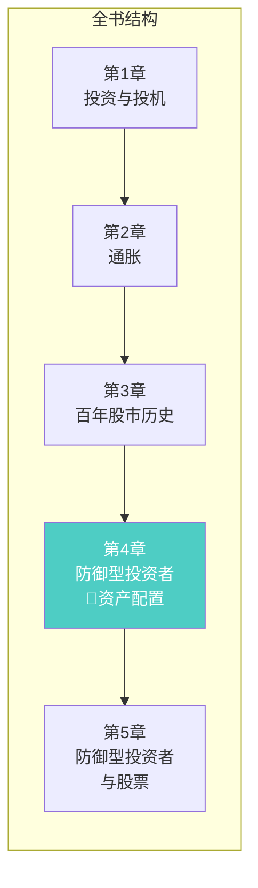
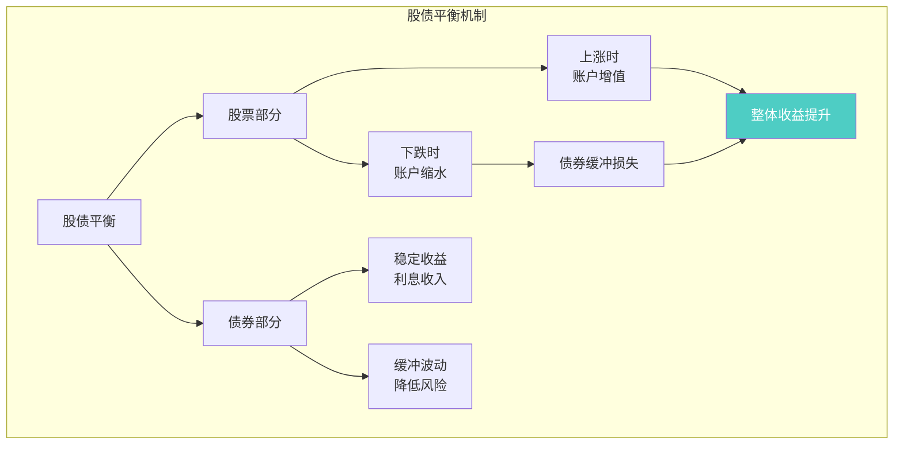
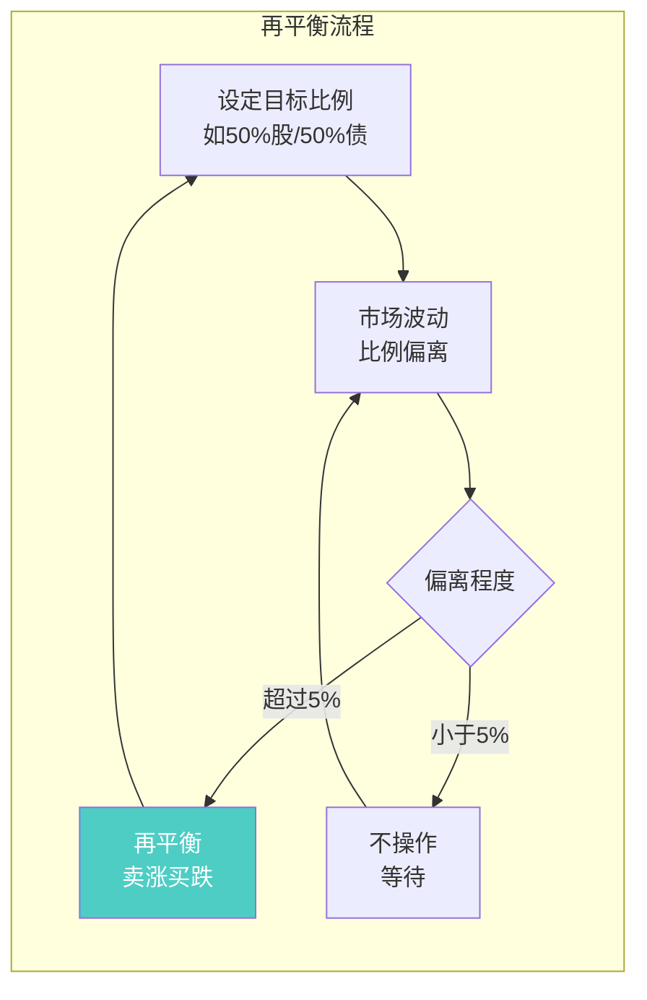
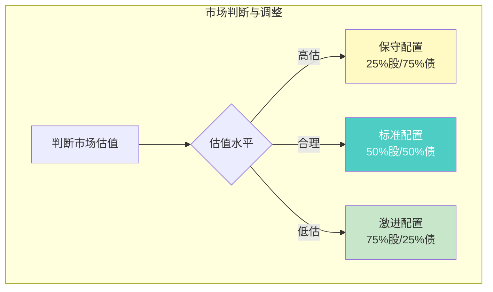
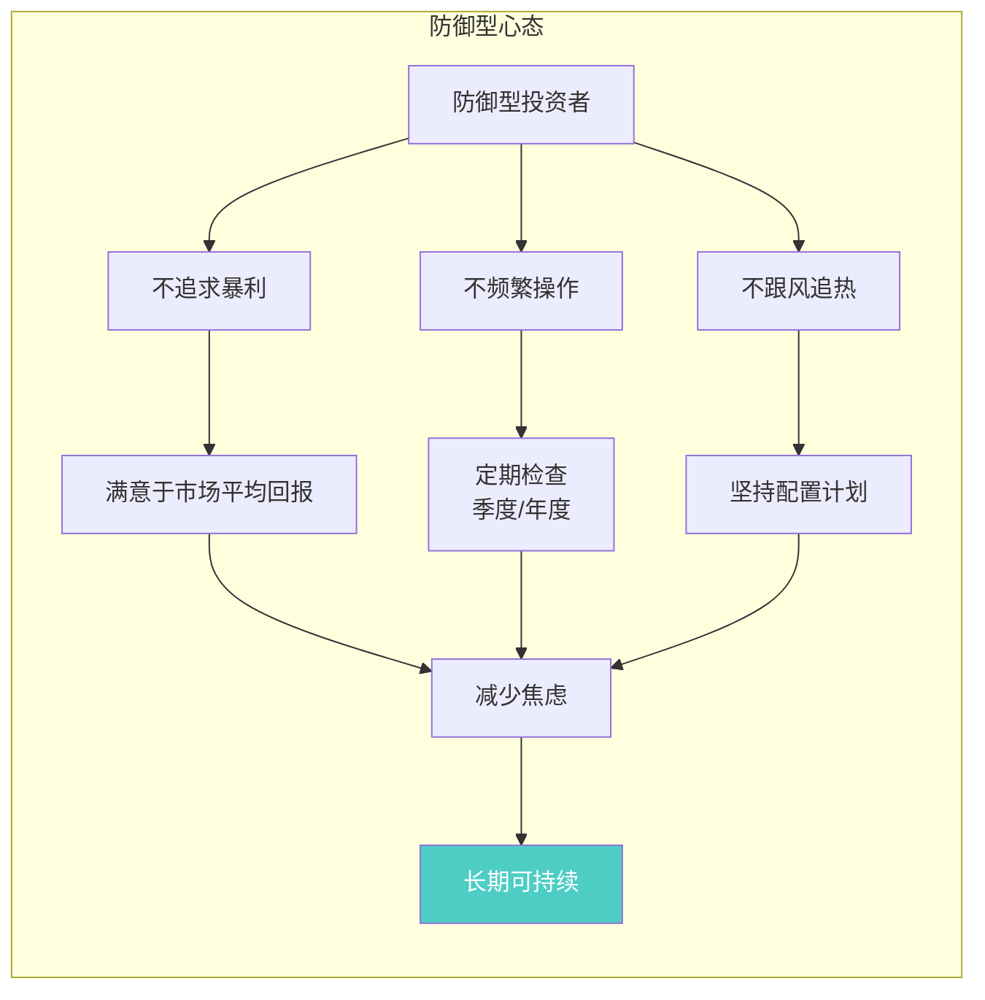
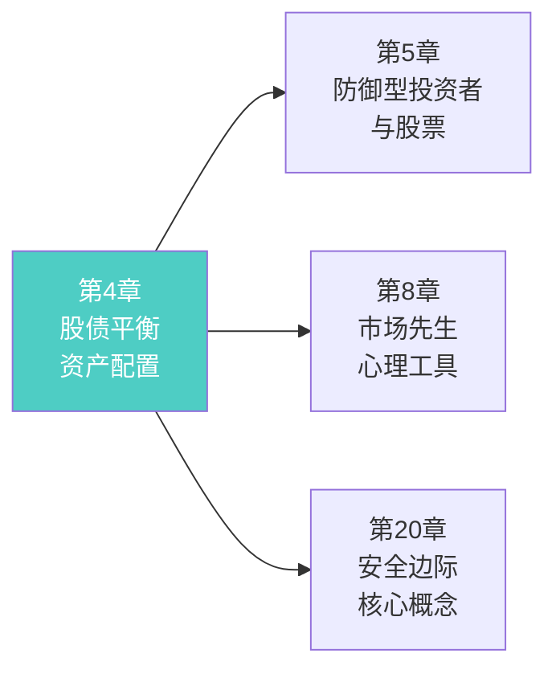
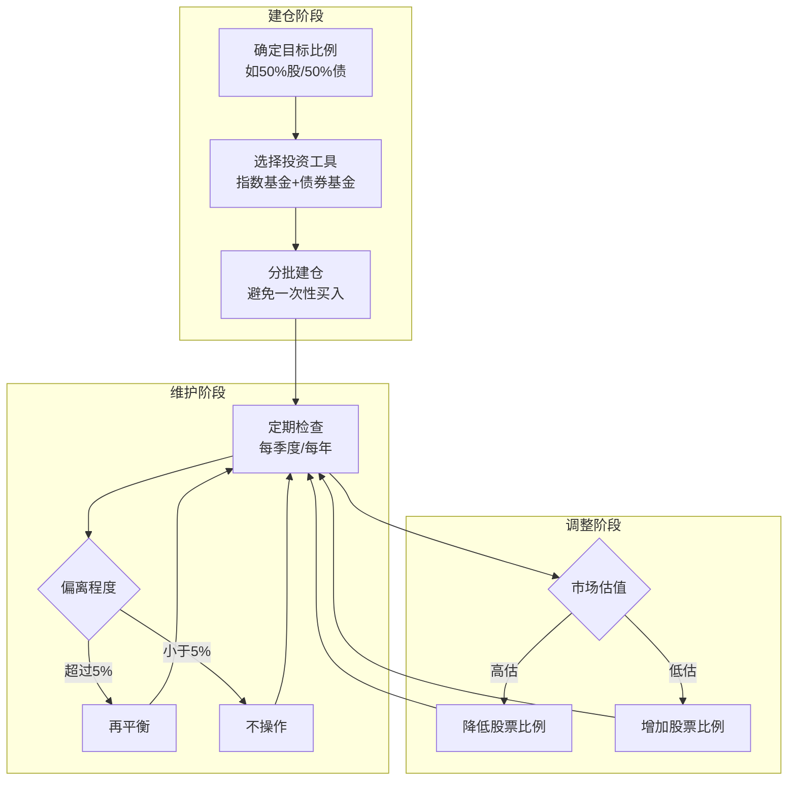

# 第4章：防御型投资者的通用投资组合策略

> **章节主题**：防御型投资者的资产配置方法论
> **核心问题**：普通人应该如何配置资产？股票和债券的比例应该是多少？
> **一句话总结**：股债平衡是普通人的最佳策略——股票25%-75%，债券75%-25%，根据市场情况调整。
> **拆解日期**：2026-02-28

---

## 一、章节定位

### 1.1 在全书中的位置

**定位**：本章是**防御型投资者策略的核心**。格雷厄姆在这里给出了普通人资产配置的具体方案——股债平衡。这是全书最实用的章节之一。

### 1.2 核心问题链

| 层次 | 问题 |
|------|------|
| **表层** | 我的钱应该怎么分配？买股票还是买债券？ |
| **中层** | 股债比例应该如何确定？什么时候调整？ |
| **底层** | 为什么股债平衡比全仓股票或全仓债券更好？ |

### 1.3 三维定位

| 维度 | 定位 |
|------|------|
| **主领域** | 资产配置 |
| **跨界领域** | 风险管理、行为金融学 |
| **方法论地位** | 普通人投资策略的"操作手册" |

---

## 二、核心观点（三层提取）

### 观点1：股债平衡——防御型投资者的核心策略

**【表层】现象层**

格雷厄姆明确指出：

> 防御型投资者应该将资金分散投资于高等级债券和蓝筹股。

**股债比例的基本原则**：
- 股票占比：**25%-75%**
- 债券占比：**75%-25%**
- **绝不要**100%全仓股票或100%全仓债券

他给出的建议配置：
- **标准配置**：50%股票 + 50%债券
- **激进配置**：75%股票 + 25%债券（市场低估时）
- **保守配置**：25%股票 + 75%债券（市场高估时）

**【中层】机制层**

**股债平衡的三重作用**：

| 作用 | 股票部分 | 债券部分 |
|------|----------|----------|
| **收益** | 提供长期增长动力 | 提供稳定现金流 |
| **风险** | 承担市场波动 | 降低整体波动 |
| **流动性** | 可随时卖出 | 可随时变现 |

**【底层】规律层**

> **股债平衡定律**：没有单一资产能在所有市场环境中表现最优。股债平衡是用"不完美"换取"可持续"。

**数学逻辑**：
- 全仓股票：收益高但波动大，30%跌幅需要43%涨幅回本
- 全仓债券：稳定但收益低，长期跑不赢通胀
- 50/50配置：收益适中，波动可控，心理压力小

**【降维翻译】**

| 原表达 | 降维表达 |
|--------|----------|
| "股债平衡" | "不要把鸡蛋放在一个篮子里" |
| "25%-75%股票" | "最多七成股，最少两成半" |
| "高等级债券" | "不会赖账的借条" |
| "蓝筹股" | "大公司，不容易倒闭" |

**【当下连接】2026年热点**

|----------|----------|----------|
| 全仓股票收益更高，为什么要配债券？ | 全仓股票下跌30%需要涨43%才能回本 | "原来全仓风险这么大" |
| 债券收益这么低，值得配吗？ | 债券是减震器，不是赚钱主力 | "原来债券是保命的" |
| 50/50太保守了，能不能更激进？ | 75%股票已经是激进配置的上限 | "原来75%股已经很激进了" |

---

### 观点2：再平衡——定期调整股债比例

**【表层】现象层**

格雷厄姆强调：股债比例不是一成不变的，需要定期调整。

> 当股票上涨导致股票占比超过计划比例时，卖出部分股票买入债券；反之亦然。

**再平衡的核心逻辑**：
1. 设定目标比例（如50/50）
2. 定期检查（如每季度或每年）
3. 偏离超过5%时调整
4. 卖涨买跌，自动实现"低买高卖"

**【中层】机制层**

**再平衡示例**：

| 情景 | 初始配置 | 股票大涨后 | 再平衡操作 |
|------|----------|------------|------------|
| 情景A | 50万股/50万债 | 70万股/50万债 | 卖10万股票，买10万债券 |
| 情景B | 50万股/50万债 | 40万股/60万债 | 卖10万债券，买10万股票 |

**再平衡的三大好处**：

| 好处 | 说明 |
|------|------|
| **自动低买高卖** | 涨了卖，跌了买 |
| **控制风险** | 防止某一资产占比过高 |
| **纪律性** | 用规则对抗情绪 |

**【底层】规律层**

> **再平衡定律**：市场永远在波动，再平衡让你自动成为"逆向投资者"——在别人贪婪时卖出，在别人恐惧时买入。

**心理学原理**：
- 涨了想追 → 再平衡强制卖出
- 跌了想逃 → 再平衡强制买入
- 用规则战胜人性

**【降维翻译】**

| 原表达 | 降维表达 |
|--------|----------|
| "再平衡" | "定期把账户收拾整齐" |
| "卖涨买跌" | "涨多的卖掉，跌多的补上" |
| "偏离5%" | "跑偏了就拉回来" |

**【当下连接】**

- **2026年AI热潮**：股票大涨，股票占比可能超过70% → 考虑再平衡，卖出部分股票
- **熊市恐慌**：股票大跌，股票占比可能低于40% → 考虑再平衡，买入股票
- **散户心理**：涨了想加仓，跌了想割肉 → 再平衡帮你反向操作

---

### 观点3：根据市场情况调整比例

**【表层】现象层**

格雷厄姆建议根据市场估值水平调整股债比例：

| 市场状态 | 股票比例 | 债券比例 | 说明 |
|----------|----------|----------|------|
| **市场高估** | 25% | 75% | 减少股票风险敞口 |
| **市场合理** | 50% | 50% | 标准配置 |
| **市场低估** | 75% | 25% | 增加股票配置 |

他强调：
> "我们建议投资者根据市场的一般价格水平，调整股票和债券的比例。"

**【中层】机制层**

**如何判断市场估值？**

格雷厄姆建议关注：
- 整体市盈率（P/E）
- 股息率与债券收益率对比
- 市场整体情绪

**【底层】规律层**

> **估值调整定律**：在高估时降低风险暴露，在低估时增加风险暴露。这不是预测市场，而是管理风险。

**核心逻辑**：
- 高估 → 下跌风险大 → 减少股票
- 低估 → 上涨潜力大 → 增加股票
- 不是"预测"市场，而是"应对"风险

**【降维翻译】**

| 原表达 | 降维表达 |
|--------|----------|
| "市场高估" | "股价太贵了" |
| "市场低估" | "股价便宜了" |
| "调整比例" | "贵了少买点，便宜多买点" |

**【当下连接】**

| 2026年场景 | 判断 | 建议配置 |
|------------|------|----------|
| AI概念股暴涨，估值泡沫 | 高估 | 25%股/75%债 |
| 熊市下跌，估值回归 | 合理/低估 | 50%-75%股 |
| 震荡市，情绪低迷 | 低估 | 75%股/25%债 |

---

### 观点4：防御型投资者的心态

**【表层】现象层**

格雷厄姆强调心态的重要性：

> "防御型投资者的主要目标是：避免重大错误和重大损失。"

**防御型投资者的三个特征**：
1. **不追求暴利**：满意于市场平均回报
2. **不频繁操作**：定期检查，不天天盯盘
3. **不跟风追热**：坚持自己的配置计划

**【中层】机制层**

**防御型vs积极型对比**：

| 维度 | 防御型投资者 | 积极型投资者 |
|------|--------------|--------------|
| **目标** | 市场平均回报 | 跑赢市场 |
| **时间投入** | 每月1-2小时 | 每天2-4小时 |
| **策略** | 股债平衡+定投 | 深入研究+精选个股 |
| **心态** | 平和、从容 | 积极甚至焦虑 |
| **适合人群** | 普通人、上班族 | 专业人士、全职投资者 |

**【底层】规律层**

> **防御型心态定律**：成功的投资不需要高智商或大量时间，需要的是正确的心态和简单的纪律。

**格雷厄姆的智慧**：
> "在投资中，性格比智商更重要。"

**【降维翻译】**

| 原表达 | 降维表达 |
|--------|----------|
| "防御型投资者" | "不想折腾的普通人" |
| "避免重大错误" | "别亏大钱就行" |
| "不追求暴利" | "别想一夜暴富" |
| "性格比智商重要" | "心态好比聪明更重要" |

**【当下连接】**

- **996打工人**：没时间研究 → 做防御型投资者，50/50配置+定投
- **焦虑的中年人**：想快速致富 → 认清现实，防御型策略才是正道
- **退休人员**：本金安全第一 → 25%股/75%债的保守配置

---

## 三、金句库

### 原书金句

1. "防御型投资者应该将资金分散投资于高等级债券和蓝筹股。"

2. "股票和债券的比例应该在25%-75%之间，根据市场情况调整。"

3. "债券在这里扮演的角色是缓冲器，不是主要收益来源。"

4. "再平衡的目的是保持风险水平稳定，而不是预测市场。"

5. "防御型投资者的主要目标是避免重大错误和重大损失。"

6. "在投资中，性格比智商更重要。"

7. "我们从市场历史中学到的唯一教训是：市场会大幅波动。"

---

### 降维金句（便于传播）

8. "股债平衡就是：不把鸡蛋放在一个篮子里，也不把篮子放在同一辆车上。"

9. "50%股+50%债：股票负责赚钱，债券负责保命。"

10. "再平衡就是：涨多的卖掉，跌多的补上——自动低买高卖。"

11. "全仓股票下跌30%，需要涨43%才能回本——这就是为什么要配债券。"

12. "防御型投资者的目标：先不亏，再想赚。"

13. "在投资中，心态好比聪明更重要。"

14. "市场高估时减股，市场低估时加股——不是预测，是风险管理。"

15. "定投+再平衡+耐心=普通人最好的投资策略。"

---

## 四、当下映射（2026年热点）

### 热点1：AI概念股热潮

**现象**：AI概念股暴涨，散户全仓追入

**本章答案**：
- 全仓单一板块违反股债平衡原则
- 涨多了要考虑再平衡，而不是加仓
- AI是好赛道，但好价格更重要

---

### 热点2：通胀与利率波动

**现象**：通胀高企，债券收益上升

**本章答案**：
- 利率上升时债券价格下跌，但新买入的债券收益更高
- 股债平衡可以在不同经济周期中都有应对
- 不预测利率，只管理风险

---

### 热点3：退休规划焦虑

**现象**：退休人员担心本金亏损

**本章答案**：
- 退休人员应该更保守：25%股/75%债
- 债券提供稳定现金流，股票提供增长潜力
- 防御型策略是退休人员的最佳选择

---

## 五、章节关联

### 5.1 与全书的关联

**逻辑关系**：
- 第4章讲"如何配置资产" → 第5章讲"如何选择股票"
- 第4章讲"再平衡" → 第8章讲"利用市场波动"
- 第4章讲"控制风险" → 第20章讲"安全边际"

### 5.2 与其他书籍的关联

| 书籍 | 关联类型 | 共同逻辑 |
|------|----------|----------|
| [[周期-拆解记录]] | **互补** | 周期决定何时调整股债比例 |
| [[富爸爸穷爸爸-清崎-拆解记录]] | **延伸** | 资产配置是财富积累的基础 |
| [[反脆弱-塔勒布-拆解记录]] | **互补** | 股债平衡是从混乱中获益的基础 |
| [[纳瓦尔宝典-乔根森-拆解记录]] | **互补** | 纳瓦尔讲创造财富，格雷厄姆讲守护财富 |

---

## 六、实操指南

### 6.1 防御型投资者的操作流程

### 6.2 具体配置建议

**年龄段配置建议**：

| 年龄段 | 股票比例 | 债券比例 | 说明 |
|--------|----------|----------|------|
| 20-30岁 | 70-75% | 25-30% | 时间长，可承受波动 |
| 30-40岁 | 60-65% | 35-40% | 收入稳定，适度保守 |
| 40-50岁 | 50-55% | 45-50% | 标准配置 |
| 50-60岁 | 40-45% | 55-60% | 接近退休，逐步保守 |
| 60岁以上 | 25-30% | 70-75% | 退休后，保守为主 |

**工具选择**：

| 资产类型 | 推荐工具 | 说明 |
|----------|----------|------|
| **股票部分** | 宽基指数基金（沪深300、标普500） | 分散、低成本 |
| **债券部分** | 国债基金、高等级企业债基金 | 安全、稳定 |
| **替代方案** | 目标日期基金 | 自动调整比例 |

---

## 七、问答设计

### Q1：我有10万元，应该怎么配置？

**答**：假设采用标准50/50配置：
- 5万元买入宽基指数基金（如沪深300 ETF）
- 5万元买入国债基金或高等级债券基金
- 每季度检查一次，偏离超过5%就再平衡

---

### Q2：什么时候应该调整股债比例？

**答**：两种情况：
1. **定期再平衡**：比例偏离目标超过5%
2. **估值调整**：市场明显高估或低估时

不要频繁调整，每季度或每年检查一次足够。

---

### Q3：债券收益这么低，值得配吗？

**答**：债券的作用不是赚钱，是：
- 降低整体波动
- 提供稳定现金流
- 在股票大跌时提供"弹药"加仓

全仓股票下跌30%需要涨43%才能回本，50/50配置只需要涨15%。

---

### Q4：定投和股债平衡怎么结合？

**答**：完美结合：
1. 每月定投金额按目标比例分配（如50%股/50%债）
2. 每季度或每年检查总资产比例
3. 偏离超过5%时再平衡

定投解决"什么时候买"，股债平衡解决"买什么、买多少"。

---

### Q5：退休人员应该怎么配置？

**答**：更保守的配置：
- 25%股票 + 75%债券
- 股票部分以分红稳定的大盘股为主
- 债券部分以国债和高等级企业债为主
- 每年检查一次，适当调整

---

## 八、章节小结

### 核心要点

1. **股债平衡**：股票25%-75%，债券75%-25%，绝不全仓
2. **标准配置**：50%股票 + 50%债券，适合大多数人
3. **再平衡**：定期检查，偏离5%以上就调整
4. **估值调整**：高估时减股，低估时加股
5. **防御心态**：不追求暴利，避免重大损失

### 行动清单

- [ ] 确定自己的目标股债比例（建议从50/50开始）
- [ ] 选择合适的投资工具（指数基金+债券基金）
- [ ] 设定再平衡频率（建议每季度或每年）
- [ ] 记录初始配置，建立跟踪表格
- [ ] 根据年龄和风险承受能力调整比例

---
