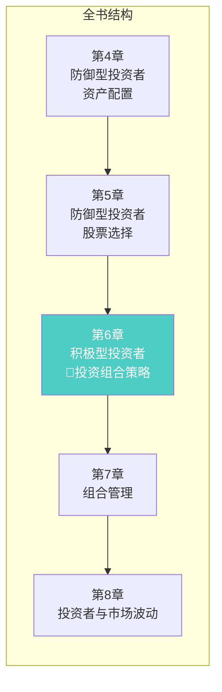
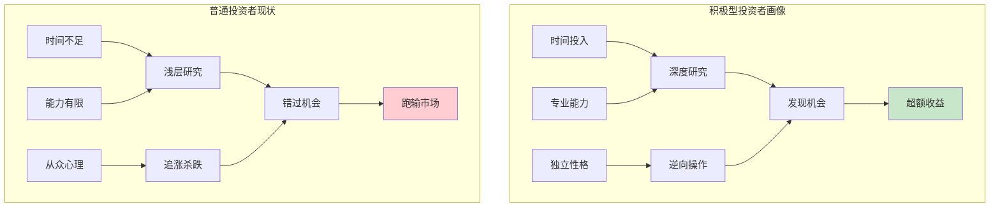
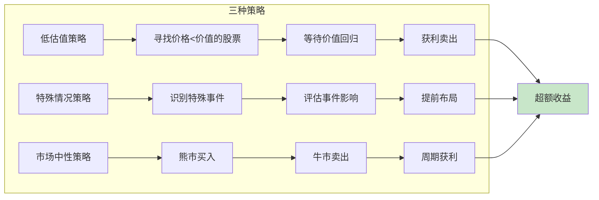
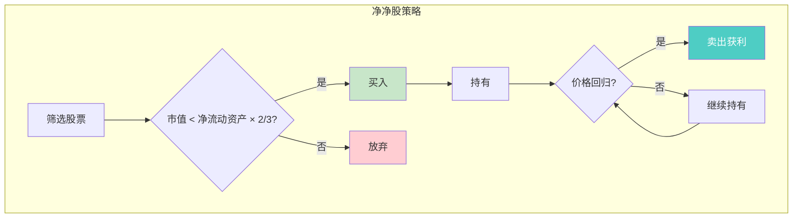
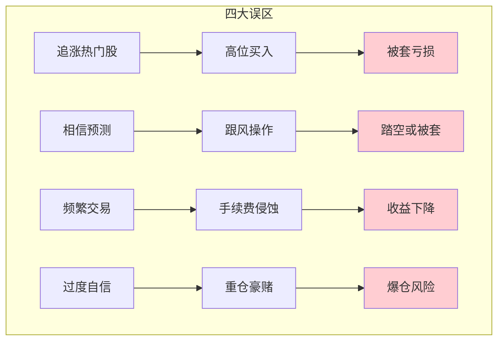
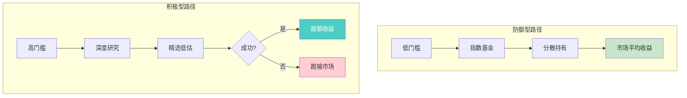
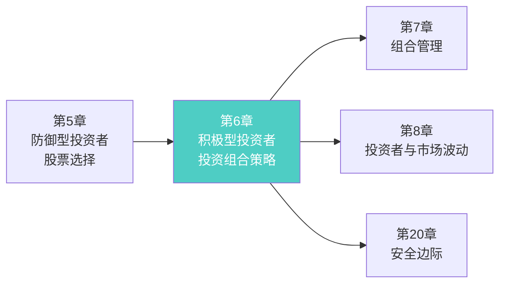
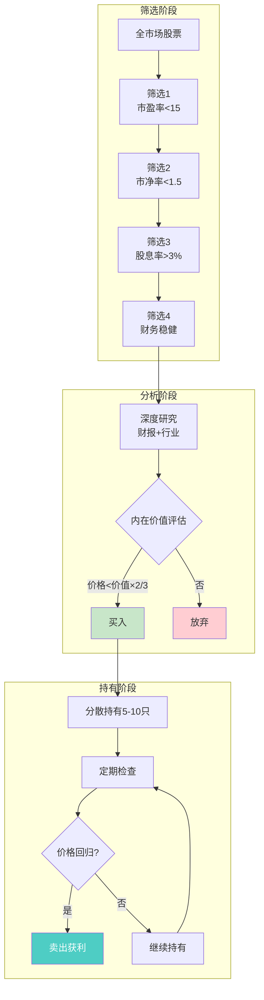

# 第6章：积极型投资者的投资组合策略

> **章节主题**：积极型投资者如何追求超越市场的回报
> **核心问题**：普通人有可能跑赢市场吗？用什么策略？
> **一句话总结**：积极型投资的悖论——想跑赢市场，你必须做和别人不一样的事，但大多数人注定做不到。
> **拆解日期**：2026-02-28

---

## 一、章节定位

### 1.1 在全书中的位置



**定位**：本章是**积极型投资者的策略指南**。与第5章的"防御型选股"形成对比，本章探讨的是"如何追求超额收益"。这是全书最具挑战性的章节，因为它揭示了积极投资的残酷真相。

### 1.2 核心问题链

| 层次 | 问题 |
|------|------|
| **表层** | 积极型投资者应该采取什么策略？ |
| **中层** | 如何在市场中找到被低估的机会？ |
| **底层** | 为什么大多数人注定跑不赢市场？ |

### 1.3 三维定位

| 维度 | 定位 |
|------|------|
| **主领域** | 积极型投资策略 |
| **跨界领域** | 行为金融学、市场效率理论 |
| **方法论地位** | 区分"能做"和"该做"的分水岭 |

---

## 二、核心观点（三层提取）

### 观点1：积极型投资的三个必要条件

**【表层】现象层**

格雷厄姆指出，想要成为积极型投资者，必须满足三个条件：

> 1. **时间**：愿意投入大量时间研究
> 2. **能力**：具备专业的分析能力
> 3. **性格**：能够独立思考，不受群体影响

**残酷的真相**：
> "大多数试图跑赢市场的人，最终都跑输了市场。"

**【中层】机制层**



**积极型投资者 vs 普通投资者对比**：

| 维度 | 积极型投资者 | 普通投资者 |
|------|-------------|-----------|
| **时间投入** | 每周10+小时 | 偶尔看盘 |
| **研究深度** | 财报、行业、管理层 | 看新闻、听消息 |
| **决策依据** | 独立分析 | 跟风随大流 |
| **情绪控制** | 逆向操作 | 追涨杀跌 |
| **结果** | 有机会跑赢 | 大概率跑输 |

**【底层】规律层**

> **积极投资门槛定律**：积极型投资不是"选择"，而是"资格"。只有满足时间、能力、性格三条件的人，才有资格尝试跑赢市场。

**格雷厄姆的警告**：
> "如果你想成为积极型投资者，请问自己：我有什么资格比别人更聪明？"

**【降维翻译】**

| 原表达 | 降维表达 |
|--------|----------|
| "时间投入" | "你愿意每周花10小时研究股票吗？" |
| "专业能力" | "你能看懂财报吗？" |
| "独立性格" | "别人恐慌时你敢买吗？" |
| "跑赢市场" | "你凭什么比别人赚得多？" |

**【当下连接】2026年热点**

|----------|----------|----------|
| 我能靠炒股发财吗？ | 大多数人不行，你凭什么例外？ | "原来我是大多数" |
| 为什么我总追高被套？ | 因为你没有独立思考 | "原来我在跟风" |
| 专业投资者能跑赢吗？ | 大部分也跑不赢 | "原来专业人士也不行" |

---

### 观点2：积极型投资的三种策略

**【表层】现象层**

格雷厄姆为积极型投资者提供三种可行策略：

> 1. **低估值策略**：买入价格明显低于内在价值的股票
> 2. **特殊情况策略**：利用并购、重组、分拆等特殊事件
> 3. **市场中性策略**：不在牛市追涨，而在熊市捡便宜

**核心原则**：
> "积极型投资者必须做一些防御型投资者不做的事。"

**【中层】机制层**



**三种策略对比**：

| 策略 | 核心逻辑 | 操作难度 | 风险水平 |
|------|----------|----------|----------|
| **低估值策略** | 买入打折的好公司 | 中等 | 低 |
| **特殊情况策略** | 利用信息不对称 | 高 | 中等 |
| **市场中性策略** | 利用市场周期 | 中等 | 低 |

**格雷厄姆推荐顺序**：
1. 低估值策略（首选，最适合普通积极型投资者）
2. 市场中性策略（次选，需要耐心等待）
3. 特殊情况策略（高阶，需要专业背景）

**【底层】规律层**

> **超额收益来源定律**：超额收益只能来自三个方面：比别人更勤奋（发现低估）、比别人更聪明（发现机会）、比别人更耐心（等待周期）。

**数学逻辑**：
- 市场平均收益 = 指数基金收益
- 超额收益 = 你的收益 - 市场平均
- 要获得超额收益，你必须做与大多数人不同的事

**【降维翻译】**

| 原表达 | 降维表达 |
|--------|----------|
| "低估值策略" | "买打折的好货" |
| "特殊情况策略" | "捡别人没注意的漏" |
| "市场中性策略" | "熊市买入，牛市卖出" |
| "超额收益" | "比别人多赚的钱" |

**【当下连接】**

- **2026年低估值机会**：A股银行股、港股地产股
- **2026年特殊事件**：国企改革、并购重组
- **2026年周期策略**：等待AI泡沫破裂后的机会

---

### 观点3：格雷厄姆的"净净股"策略

**【表层】现象层**

这是格雷厄姆最著名的选股方法——**"净净股"（Net-Net）策略**：

> 买入市值低于"净流动资产"的股票

**公式**：
```
净流动资产 = 流动资产 - 总负债
买入条件：市值 < 净流动资产 × 2/3
```

**通俗理解**：
> 用50美分买价值1美元的资产，而且这1美元是现金和存货，不是虚的。

**【中层】机制层**



**净净股筛选标准**：

| 标准 | 具体要求 | 原因 |
|------|----------|------|
| **市值** | < 净流动资产 × 2/3 | 足够便宜 |
| **流动资产** | 主要是现金、存货 | 资产真实 |
| **总负债** | 不超过流动资产 | 债务可控 |
| **行业** | 避开高负债行业 | 防止破产 |

**历史表现**：
- 格雷厄姆时期年化回报约20%
- 巴菲特早期用此策略获得巨额收益
- 在现代市场机会较少，但仍有

**【底层】规律层**

> **净净股定律**：当一家公司的市值低于其清算价值时，市场一定犯了错。等待市场纠错，就是获利之时。

**格雷厄姆的解释**：
> "这种投资方法就像是用50美分买一张1美元的钞票，唯一的风险是你需要等待。"

**【降维翻译】**

| 原表达 | 降维表达 |
|--------|----------|
| "净流动资产" | "把公司卖了能收回的钱" |
| "市值低于净流动资产" | "买这家公司比把钱存银行还便宜" |
| "等待价值回归" | "等市场醒过来" |

**【当下连接】**

- **A股现状**：极少数股票符合净净股标准
- **港股机会**：部分地产股、老牌工业股可能符合
- **格雷厄姆会怎么做**：如果找不到，就持有现金等待

---

### 观点4：积极型投资的四个误区

**【表层】现象层**

格雷厄姆警告积极型投资者要避免四个常见误区：

> 1. **追涨热门股**：买入已经大涨的股票
> 2. **相信市场预测**：听信"专家"预测
> 3. **频繁交易**：试图抓住每一个波动
> 4. **过度自信**：认为自己能战胜市场

**【中层】机制层**



**误区与正确做法对比**：

| 误区 | 表现 | 正确做法 |
|------|------|----------|
| **追涨热门股** | 看到涨了才想买 | 在被忽视时买入 |
| **相信预测** | 听专家、看研报 | 独立分析、忽略噪音 |
| **频繁交易** | 每天买卖 | 长期持有、少操作 |
| **过度自信** | 全仓一只股 | 分散投资、留有余地 |

**【底层】规律层**

> **积极投资陷阱定律**：试图跑赢市场的行为本身，往往会让你跑输市场。因为你付出的交易成本、情绪成本和机会成本，远超你获得的额外收益。

**格雷厄姆的警告**：
> "在华尔街，真正赚钱的方法是：不要试图赚太多。"

**【降维翻译】**

| 原表达 | 降维表达 |
|--------|----------|
| "追涨热门股" | "追网红股，接盘侠是你" |
| "相信预测" | "专家嘴上说，你钱包掏" |
| "频繁交易" | "给券商打工" |
| "过度自信" | "你以为你是巴菲特" |

**【当下连接】**

- **2026年追涨案例**：AI概念股、新能源股追高被套
- **2026年预测泛滥**：各路"专家"预测牛市
- **格雷厄姆会怎么做**：不听、不看、不追，坚持自己的标准

---

### 观点5：积极型 vs 防御型的本质区别

**【表层】现象层**

格雷厄姆明确区分两类投资者：

| 维度 | 防御型投资者 | 积极型投资者 |
|------|-------------|-------------|
| **目标** | 市场平均收益 | 超额收益 |
| **时间** | 最少 | 最多 |
| **能力** | 基础 | 专业 |
| **风险** | 最低 | 较高 |
| **方法** | 指数基金+分散 | 深度研究+精选 |

**核心区别**：
> 防御型投资者问"如何不亏？"，积极型投资者问"如何多赚？"

**【中层】机制层**



**收益分布对比**：

| 投资者类型 | 预期收益 | 成功率 | 适合人群 |
|-----------|----------|--------|----------|
| **防御型** | 市场平均 | 100% | 95%的人 |
| **积极型（成功）** | 市场+5%以上 | 10% | 5%的人 |
| **积极型（失败）** | 市场-5%以下 | 90% | 不该尝试的人 |

**【底层】规律层**

> **投资者分类定律**：95%的人应该做防御型投资者，只有5%的人有资格做积极型投资者。但每个人都认为自己属于那5%。

**格雷厄姆的建议**：
> "如果你不确定自己是哪一类，那你就是防御型投资者。"

**【降维翻译】**

| 原表达 | 降维表达 |
|--------|----------|
| "防御型投资者" | "买指数基金，躺赢市场" |
| "积极型投资者" | "自己选股，赌能跑赢" |
| "市场平均收益" | "别人赚多少你赚多少" |
| "超额收益" | "比别人多赚的钱" |

**【当下连接】**

- **2026年现实**：90%的散户跑输指数
- **格雷厄姆会说**：承认自己是普通人，买指数基金
- **巴菲特的赌约**：对冲基金跑不赢指数基金

---

## 三、金句库

### 原书金句

1. "积极型投资者必须做一些防御型投资者不做的事。"

2. "大多数试图跑赢市场的人，最终都跑输了市场。"

3. "如果你想成为积极型投资者，请问自己：我有什么资格比别人更聪明？"

4. "净净股策略是用50美分买价值1美元的资产，唯一的风险是等待。"

5. "在华尔街，真正赚钱的方法是：不要试图赚太多。"

6. "如果你不确定自己是哪一类投资者，那你就是防御型投资者。"

7. "超额收益只能来自三个方面：比别人更勤奋、比别人更聪明、比别人更耐心。"

8. "试图跑赢市场的行为本身，往往会让你跑输市场。"

---

### 降维金句（便于传播）

9. "积极型投资的门槛：你凭什么比别人赚得多？"

10. "想跑赢市场？先问自己三个问题：有时间吗？有能力吗？有胆量吗？"

11. "95%的人应该买指数基金，但每个人都觉得自己是那5%。"

12. "净净股策略：用五折价格买一家公司的现金。"

13. "超额收益的代价：你必须在别人恐惧时贪婪，别人贪婪时恐惧。"

14. "追涨热门股 = 在最高点接盘。"

15. "频繁交易 = 给券商打工。"

16. "市场预测 = 专家嘴上说，你钱包掏。"

---

## 四、当下映射（2026年热点）

### 热点1：AI概念股热潮

**现象**：AI概念股暴涨，散户追高入场

**本章答案**：
- 追涨热门股 = 误区1
- 大多数人追高 = 大多数人跑不赢
- 等待泡沫破裂才是机会


---

### 热点2：指数基金普及

**现象**：越来越多的人选择指数基金

**本章答案**：
- 防御型投资者的正确选择
- 95%的人应该这样做
- 巴菲特也推荐


---

### 热点3：散户亏损

**现象**：A股散户大面积亏损

**本章答案**：
- 频繁交易+追涨杀跌 = 跑输市场
- 大多数人不该做积极型投资者
- 承认自己是普通人


---

## 五、章节关联

### 5.1 与全书的关联



**逻辑关系**：
- 第5章讲"防御型选股" → 第6章讲"积极型策略"
- 第6章讲"追求超额收益" → 第20章讲"安全边际保护"
- 第6章讲"独立思考" → 第8章讲"利用市场波动"

### 5.2 与其他书籍的关联

| 书籍 | 关联类型 | 共同逻辑 |
|------|----------|----------|
| [[怎样选择成长股-费雪-拆解记录]] | **互补** | 费雪讲"买入成长"，格雷厄姆讲"买入低估" |
| [[股票大作手回忆录-勒菲弗-拆解记录]] | **对立** | 利弗莫尔是投机，格雷厄姆是投资 |
| [[反脆弱-塔勒布-拆解记录]] | **互补** | 塔勒布讲"从混乱中获益"，格雷厄姆讲"在恐慌中买入" |
| [[漫步华尔街-马尔基尔]] | **延伸** | 马尔基尔证明"市场难以战胜" |

---

## 六、实操指南

### 6.1 积极型投资者自测

**在尝试积极型投资之前，诚实回答以下问题**：

| 问题 | 是 | 否 |
|------|----|----|
| 我每周能花10小时以上研究股票吗？ | □ | □ |
| 我能独立看懂财报吗？ | □ | □ |
| 别人恐惧时我敢买入吗？ | □ | □ |
| 别人贪婪时我敢卖出吗？ | □ | □ |
| 我能承受跑输市场吗？ | □ | □ |

**评分**：
- 5个"是"：你有资格尝试积极型投资
- 3-4个"是"：建议以防御型为主，小仓位尝试积极型
- 0-2个"是"：你应该做防御型投资者

### 6.2 低估值策略实操流程



### 6.3 净净股筛选标准

**A股适用标准（降低门槛）**：

| 标准 | 格雷厄姆原版 | A股适用版 |
|------|-------------|----------|
| **市值** | < 净流动资产×2/3 | < 净流动资产 |
| **流动比率** | > 2 | > 1.5 |
| **负债率** | < 50% | < 60% |
| **行业** | 避开高负债 | 避开地产、金融 |

**2026年潜在机会**：
- 部分港股地产股（风险较高）
- 传统制造业（需要仔细筛选）
- 如果找不到 → 持有现金等待

---

## 七、问答设计

### Q1：普通人真的不可能跑赢市场吗？

**答**：格雷厄姆不是说"不可能"，而是说"很难"。数据表明：
- 90%的散户跑输指数
- 80%的主动基金经理跑输指数
- 只有10%的人能长期跑赢

**关键**：你要问自己"我凭什么属于那10%？"

---

### Q2：我应该做防御型还是积极型投资者？

**答**：格雷厄姆的测试：
- 你有每周10小时研究股票吗？
- 你能独立看懂财报吗？
- 你能在别人恐惧时买入吗？

如果答案是"否"，你就是防御型投资者。

---

### Q3：净净股策略在A股还有效吗？

**答**：有效性降低，但原理依然适用：
- A股符合标准的股票极少
- 港股可能有一些机会
- 核心思想"买入打折的好公司"永远有效

---

### Q4：格雷厄姆对指数基金怎么看？

**答**：格雷厄姆在晚年支持指数基金：
- 对于大多数投资者，指数基金是最好的选择
- 它让你获得市场平均收益
- 不需要研究、不需要选股

---

### Q5：积极型投资者应该持有多只股票？

**答**：格雷厄姆建议：
- 比防御型投资者更集中
- 5-15只股票
- 每只都是深入研究后的选择
- 但绝不能只持有一只

---

## 八、章节小结

### 核心要点

1. **积极型投资门槛**：时间+能力+性格，缺一不可
2. **三种策略**：低估值、特殊情况、市场中性
3. **净净股策略**：市值 < 净流动资产 × 2/3
4. **四大误区**：追涨、信预测、频繁交易、过度自信
5. **本质区别**：95%的人应该做防御型投资者

### 行动清单

- [ ] 完成积极型投资者自测
- [ ] 如果不达标，选择防御型策略
- [ ] 如果达标，选择一种策略深入研究
- [ ] 建立自己的筛选标准
- [ ] 耐心等待机会，不追涨

---

## 新增关联

- [2026-02-28] [[怎样选择成长股-费雪-拆解记录]] 与本章建立关联：互补
  - **关联逻辑**：格雷厄姆讲"买入低估"，费雪讲"买入成长"
  - **核心差异**：
    - 格雷厄姆：静态价值、安全边际、捡烟蒂
    - 费雪：动态成长、未来潜力、种大树
  - **共同主题**：深入研究公司、长期持有、独立判断

- [2026-02-28] [[漫步华尔街-马尔基尔]] 与本章建立关联：延伸
  - **关联逻辑**：格雷厄姆说"大多数人跑不赢市场"，马尔基尔用数据证明这一点
  - **共同主题**：指数基金、市场效率、长期投资

- [2026-02-28] [[股票大作手回忆录-勒菲弗-拆解记录]] 与本章建立关联：对立
  - **关联逻辑**：利弗莫尔是投机，格雷厄姆是投资
  - **核心差异**：
    - 利弗莫尔：趋势跟踪、短线交易、情绪博弈
    - 格雷厄姆：价值投资、长期持有、安全边际
  - **共同主题**：独立思考、情绪控制、不追涨杀跌
