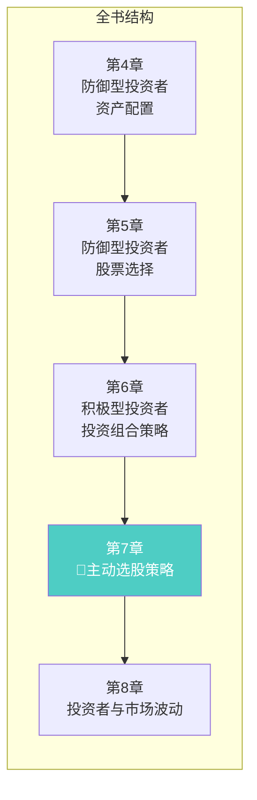
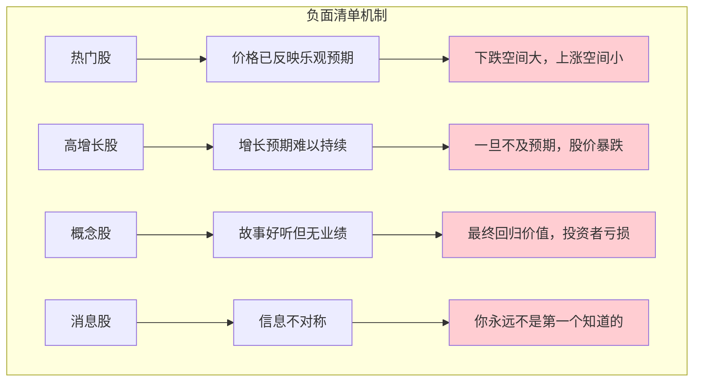
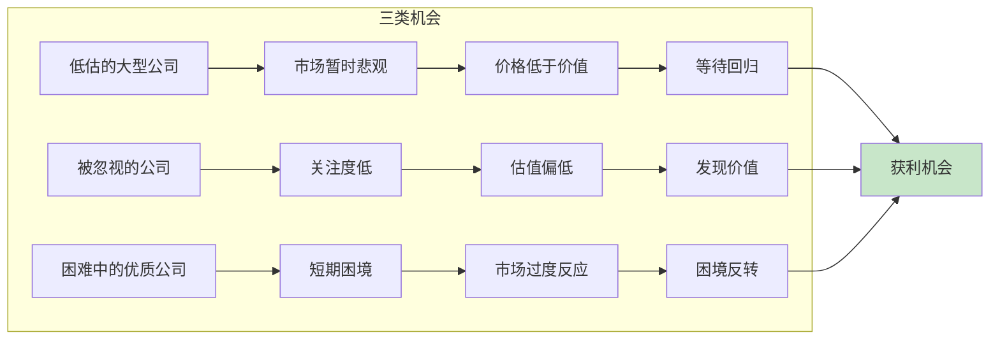
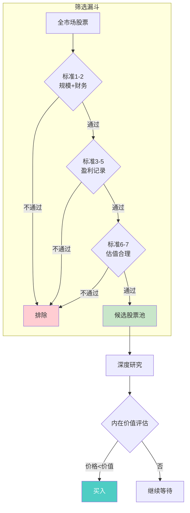
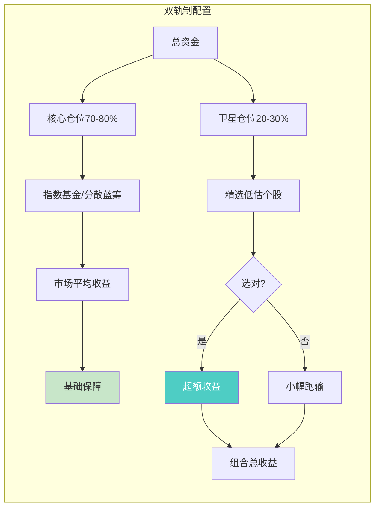
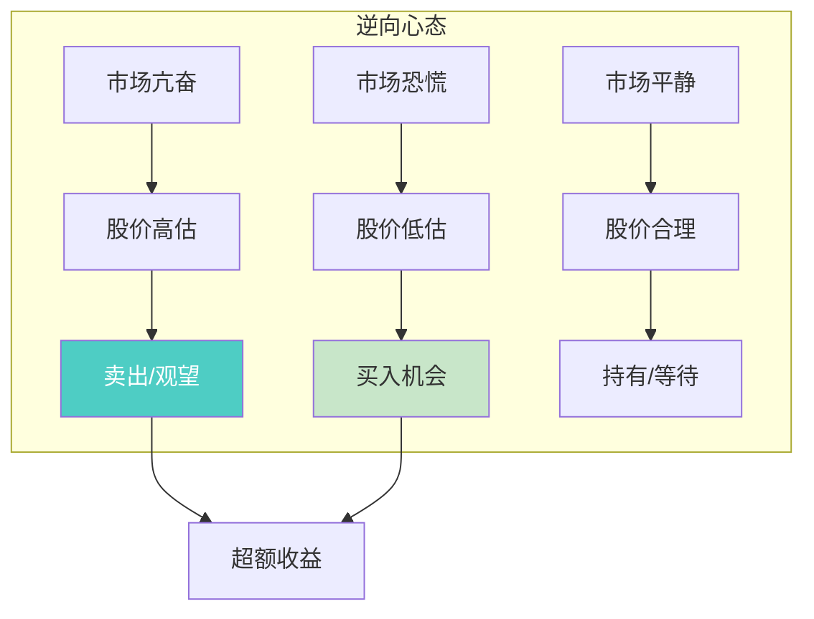
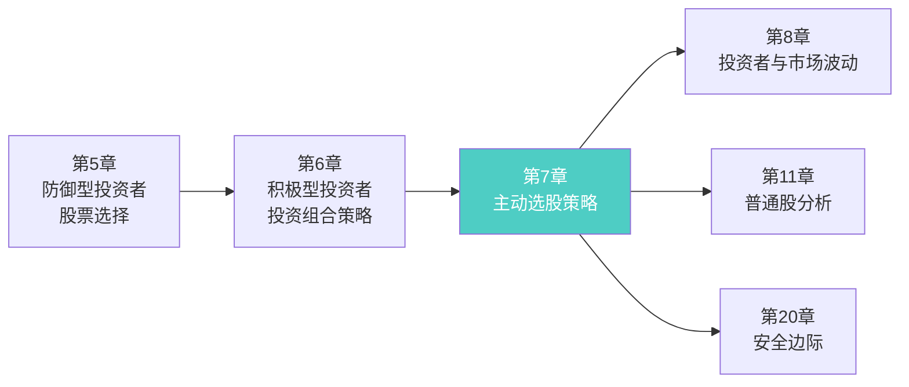

# 第7章：积极型投资者的主动投资策略

> **章节主题**：积极型投资者如何主动选择股票
> **核心问题**：什么样的股票值得主动研究？用什么标准筛选？
> **一句话总结**：选股的艺术——先知道不买什么，再知道买什么，最后知道用多少价格买。
> **拆解日期**：2026-02-28

---

## 一、章节定位

### 1.1 在全书中的位置



**定位**：本章是**积极型投资者的选股实操指南**。第6章讲了"积极型投资者该采取什么策略"，本章则深入"如何具体选股"。这是全书方法论落地最具体的章节之一。

### 1.2 核心问题链

| 层次 | 问题 |
|------|------|
| **表层** | 积极型投资者应该买什么样的股票？ |
| **中层** | 如何用定量标准筛选值得研究的公司？ |
| **底层** | 什么样的股票既能保证安全，又有上涨潜力？ |

### 1.3 三维定位

| 维度 | 定位 |
|------|------|
| **主领域** | 主动选股方法论 |
| **跨界领域** | 财务分析、企业估值 |
| **方法论地位** | 价值投资选股标准的奠基之作 |

---

## 二、核心观点（三层提取）

### 观点1：先知道"不买什么"——格雷厄姆的负面清单

**【表层】现象层**

格雷厄姆首先列出积极型投资者**不应该买什么**：

> 1. **热门股**：被市场追捧、价格已经很高的股票
> 2. **高增长股**：预期增长率极高、市盈率极高的股票
> 3. **概念股**：没有实际业绩支撑的"故事股"
> 4. **消息股**：靠内幕消息、推荐买入的股票

**格雷厄姆的原话**：
> "在投资领域，知道不做什么，比知道做什么更重要。"

**【中层】机制层**



**四类股票的共同问题**：

| 股票类型 | 问题本质 | 投资者心理 |
|----------|----------|------------|
| **热门股** | 价格已经透支未来 | FOMO（错过恐惧） |
| **高增长股** | 增长不可持续 | 贪婪（想赚快钱） |
| **概念股** | 故事大于价值 | 从众（别人都在买） |
| **消息股** | 信息劣势 | 懒惰（想走捷径） |

**【底层】规律层**

> **负面筛选定律**：在投资中，排除错误选项比寻找正确选项更容易、更有效。先确保不买错，再考虑买对。

**格雷厄姆的警告**：
> "华尔街最常见的错误，就是为未来的增长支付过高的价格。"

**【降维翻译】**

| 原表达 | 降维表达 |
|--------|----------|
| "热门股" | "大家都在买的股票，往往是最贵的" |
| "高增长股" | "增长预期像泡沫，戳破就很疼" |
| "概念股" | "故事好听，钱难赚" |
| "消息股" | "你知道的消息，都是别人想让你知道的" |

**【当下连接】2026年热点**

|----------|----------|----------|
| AI股涨了100%，还能买吗？ | 热门股=高风险 | "原来我在追高" |
| 新能源概念股怎么样？ | 先问业绩，再问概念 | "原来故事不值钱" |
| 朋友推荐一只股，能买吗？ | 你永远不是第一个知道的 | "原来我是接盘侠" |

---

### 观点2：积极的选股方向——三类值得研究的股票

**【表层】现象层**

在排除不该买的之后，格雷厄姆指出三类值得积极型投资者研究的方向：

> 1. **低估的大型公司**：规模大、盈利稳定，但暂时被市场低估
> 2. **被忽视的重要公司**：业绩好但关注度低，如二线蓝筹
> 3. **处于财务困难的优质公司**：暂时遇到困难但根基稳固

**格雷厄姆的核心思想**：
> "寻找那些被市场暂时'误解'的好公司。"

**【中层】机制层**



**三类机会对比**：

| 类型 | 机会来源 | 风险水平 | 适合人群 |
|------|----------|----------|----------|
| **低估的大型公司** | 市场情绪波动 | 低 | 初级积极型投资者 |
| **被忽视的公司** | 信息不对称 | 中等 | 中级积极型投资者 |
| **困难中的优质公司** | 困境反转 | 高 | 高级积极型投资者 |

**格雷厄姆推荐顺序**：
1. 低估的大型公司（首选，风险最低）
2. 被忽视的重要公司（次选，需要更多研究）
3. 困难中的优质公司（谨慎，需要专业判断）

**【底层】规律层**

> **价值发现定律**：超额收益来自于发现市场"暂时"定价错误的优质资产。关键词是"暂时"和"优质"——市场最终会纠错，而优质资产有纠错的底气。

**与第6章的关联**：
- 第6章讲"三种策略"（低估值、特殊情况、市场中性）
- 本章是"低估值策略"的具体落地

**【降维翻译】**

| 原表达 | 降维表达 |
|--------|----------|
| "低估的大型公司" | "打折买好货，而且是大品牌" |
| "被忽视的重要公司" | "好公司没人注意，等你发现" |
| "困难中的优质公司" | "落难王子，等待复辟" |
| "市场暂时误解" | "市场在犯错，你在捡便宜" |

**【当下连接】**

- **2026年低估大型公司**：银行、保险、能源等传统行业龙头
- **2026年被忽视的公司**：部分制造业、消费品二线品牌
- **2026年困难中的优质公司**：受政策影响的平台经济、地产链

---

### 观点3：格雷厄姆的七大选股标准

**【表层】现象层**

格雷厄姆为积极型投资者提供了一套**可量化的选股标准**：

> 1. **适当的规模**：销售额不低于1亿美元（相当于现在的30-50亿美元）
> 2. **足够强劲的财务状况**：流动比率>2，长期负债不超过净流动资产
> 3. **稳定的盈利**：过去10年没有亏损
> 4. **持续的股息记录**：过去20年持续支付股息
> 5. **盈利增长**：过去10年每股盈利增长至少33%
> 6. **适度的市盈率**：不超过15倍
> 7. **适度的市净率**：不超过1.5倍

**格雷厄姆的总结**：
> "这些标准的目的是排除投机性股票，留下值得深入研究的投资标的。"

**【中层】机制层**



**七大标准详解**：

| 标准 | 具体要求 | 逻辑 | A股适用版 |
|------|----------|------|----------|
| **规模** | 销售额>1亿美元 | 避免小公司风险 | 市值>100亿人民币 |
| **财务** | 流动比率>2 | 短期偿债能力强 | 流动比率>1.5 |
| **盈利稳定** | 10年无亏损 | 生存能力强 | 5年无亏损 |
| **股息记录** | 20年持续分红 | 管理层可靠 | 5年持续分红 |
| **盈利增长** | 10年增长33% | 有成长性 | 5年增长20% |
| **市盈率** | <15倍 | 估值合理 | <20倍 |
| **市净率** | <1.5倍 | 资产折扣 | <2倍 |

**格雷厄姆的综合指标**：
> 市盈率 × 市净率 ≤ 22.5
> （例如：15倍PE × 1.5倍PB = 22.5）

**【底层】规律层**

> **定量筛选定律**：投资决策应该基于可量化的标准，而非主观感觉。量化标准能帮助你避免情绪干扰，保持纪律性。

**格雷厄姆的解释**：
> "这些标准不能保证你赚钱，但能帮助你避免亏大钱。"

**【降维翻译】**

| 原表达 | 降维表达 |
|--------|----------|
| "适当的规模" | "别买太小的公司，容易死" |
| "流动比率>2" | "公司有两块钱资产，才有一块钱债" |
| "10年无亏损" | "十年没亏过钱的公司，靠谱" |
| "市盈率<15" | "15年回本的价格，不贵" |
| "市盈率×市净率≤22.5" | "双低标准：价格低+资产低" |

**【当下连接】**

- **A股符合标准的股票**：约50-100只（需动态筛选）
- **格雷厄姆会说**：如果找不到，就买指数基金
- **核心思想**：标准是底线，不是目标；通过标准后，还要深入研究

---

### 观点4：选股的"双轨制"——防御与积极的平衡

**【表层】现象层**

格雷厄姆建议积极型投资者采用"双轨制"策略：

> 1. **核心仓位（70-80%）**：采用防御型策略，持有指数基金或分散的优质股
> 2. **卫星仓位（20-30%）**：采用积极型策略，精选低估个股

**格雷厄姆的警告**：
> "即使是积极型投资者，也不应该把全部资金押注在主动选股上。"

**【中层】机制层**



**双轨制对比**：

| 维度 | 核心仓位 | 卫星仓位 |
|------|----------|----------|
| **占比** | 70-80% | 20-30% |
| **策略** | 防御型 | 积极型 |
| **目标** | 不跑输市场 | 追求超额收益 |
| **风险** | 低 | 中等 |
| **心态** | 轻松 | 需要研究 |

**双轨制的核心逻辑**：
- 核心仓位保证"不输"
- 卫星仓位争取"多赢"
- 即使卫星仓位失败，整体也不会崩盘

**【底层】规律层**

> **双轨制定律**：主动选股应该是一种"锦上添花"，而不是"孤注一掷"。用小仓位博取超额收益，用大仓位保证基本收益。

**格雷厄姆的智慧**：
> "投资成功的秘诀不是选对股票，而是不要选错太多。"

**【降维翻译】**

| 原表达 | 降维表达 |
|--------|----------|
| "核心仓位" | "保命钱，买指数基金" |
| "卫星仓位" | "冒险钱，自己选股" |
| "双轨制" | "一手稳，一手博" |
| "不把全部资金押注" | "别把鸡蛋放一个篮子" |

**【当下连接】**

- **2026年双轨制实践**：
  - 核心：沪深300指数基金 + 中证红利指数
  - 卫星：精选低估银行股、能源股
- **格雷厄姆会说**：即使你对选股有信心，也要留有余地

---

### 观点5：选股心态——"逆向"比"聪明"更重要

**【表层】现象层**

格雷厄姆强调，积极型投资者最需要的不是智商，而是心态：

> 1. **耐心**：等待好价格出现，不急于出手
> 2. **独立**：不随大流，敢于与众不同
> 3. **冷静**：市场恐慌时买入，市场亢奋时卖出
> 4. **谦逊**：承认自己可能看错，留有安全边际

**格雷厄姆的名言**：
> "成功的投资者不需要很高的智商，但需要很稳的心态。"

**【中层】机制层**



**四种心态对比**：

| 心态 | 表现 | 对立面 |
|------|------|--------|
| **耐心** | 等待3年买入一只股票 | 急躁（追涨杀跌） |
| **独立** | 别人恐惧时买入 | 从众（追热点） |
| **冷静** | 市场暴跌时不动如山 | 恐慌（割肉逃跑） |
| **谦逊** | 承认自己可能看错 | 自大（重仓豪赌） |

**【底层】规律层**

> **逆向投资定律**：在别人贪婪时恐惧，在别人恐惧时贪婪。这不是口号，而是赚钱的唯一途径——因为你买的是别人卖出的，你卖出的是别人想买的。

**格雷厄姆的总结**：
> "投资是唯一一个业余者可以战胜专业人士的领域，因为专业人士受到业绩压力的束缚，而你没有。"

**【降维翻译】**

| 原表达 | 降维表达 |
|--------|----------|
| "耐心等待" | "好公司好价格，等三年也值" |
| "独立思考" | "别人说不行，你自己想清楚" |
| "逆向操作" | "别人卖你买，别人买你卖" |
| "谦逊" | "承认自己笨，给自己留退路" |

**【当下连接】**

- **2026年逆向机会**：
  - 市场恐慌时：地产链、平台经济
  - 市场亢奋时：AI概念股（卖出或观望）
- **格雷厄姆会说**：逆向不是目的，只是手段；目的是在安全边际下买入好公司

---

## 三、金句库

### 原书金句

1. "在投资领域，知道不做什么，比知道做什么更重要。"

2. "华尔街最常见的错误，就是为未来的增长支付过高的价格。"

3. "寻找那些被市场暂时'误解'的好公司。"

4. "这些标准的目的是排除投机性股票，留下值得深入研究的投资标的。"

5. "这些标准不能保证你赚钱，但能帮助你避免亏大钱。"

6. "即使是积极型投资者，也不应该把全部资金押注在主动选股上。"

7. "投资成功的秘诀不是选对股票，而是不要选错太多。"

8. "成功的投资者不需要很高的智商，但需要很稳的心态。"

9. "投资是唯一一个业余者可以战胜专业人士的领域，因为专业人士受到业绩压力的束缚，而你没有。"

---

### 降维金句（便于传播）

10. "选股第一课：先知道不买什么，再知道买什么。"

11. "热门股=高价股=低回报=高风险。"

12. "你知道的消息，都是别人想让你知道的。"

13. "格雷厄姆七标准：帮你排除90%的坑股。"

14. "市盈率×市净率≤22.5，这是格雷厄姆的选股底线。"

15. "双轨制：70%保命钱买指数，30%冒险钱自己选。"

16. "逆向不是目的，只是手段；目的是在安全边际下买入好公司。"

17. "选股三问：它值多少钱？现在多少钱？为什么这么便宜？"

---

## 四、当下映射（2026年热点）

### 热点1：AI概念股热潮

**现象**：AI概念股暴涨，散户追高入场

**本章答案**：
- 热门股 = 负面清单第一条
- 为增长支付过高价格 = 华尔街最常见错误
- 先问市盈率，再问故事


---

### 热点2：银行股低估

**现象**：银行股持续低迷，市净率低于0.5

**本章答案**：
- 可能属于"低估的大型公司"
- 需要验证：财务稳健？盈利稳定？股息持续？
- 符合标准后，值得深入研究


---

### 热点3：散户亏损

**现象**：散户追涨杀跌，大面积亏损

**本章答案**：
- 没有选股标准 = 随机买入
- 追热门、信消息、买概念 = 必然亏钱
- 格雷厄姆七标准 = 帮你排除90%的坑


---

## 五、章节关联

### 5.1 与全书的关联



**逻辑关系**：
- 第5章讲"防御型选股" → 第7章讲"积极型选股"
- 第6章讲"策略框架" → 第7章讲"具体标准"
- 第7章讲"选股标准" → 第20章讲"安全边际验证"

### 5.2 与其他书籍的关联

| 书籍 | 关联类型 | 共同逻辑 |
|------|----------|----------|
| [[怎样选择成长股-费雪-拆解记录]] | **互补** | 费雪强调"成长性"，格雷厄姆强调"安全性" |
| [[股市真规则-多尔西-拆解记录]] | **延伸** | 多尔西将格雷厄姆标准现代化 |
| [[证券分析-格雷厄姆]] | **深化** | 《证券分析》是本章的理论基础 |
| [[巴菲特致股东的信]] | **传承** | 巴菲特继承并发扬格雷厄姆选股思想 |

---

## 六、实操指南

### 6.1 格雷厄姆七标准A股适用版

| 标准 | 格雷厄姆原版 | A股适用版 | 筛选工具 |
|------|-------------|----------|----------|
| **规模** | 销售额>1亿美元 | 市值>100亿人民币 | 同花顺iFinD |
| **财务** | 流动比率>2 | 流动比率>1.5 | 同花顺F10 |
| **盈利稳定** | 10年无亏损 | 5年无亏损 | 东方财富 |
| **股息记录** | 20年持续分红 | 5年持续分红 | 股息率排行 |
| **盈利增长** | 10年增长33% | 5年增长20% | 复合增长率 |
| **市盈率** | <15倍 | <20倍 | 市盈率排行 |
| **市净率** | <1.5倍 | <2倍 | 市净率排行 |

**综合指标**：市盈率 × 市净率 ≤ 30（A股放宽）

### 6.2 选股流程图

```mermaid
flowchart TB
    subgraph 第一步：负面筛选
        A[全市场5000+股票] --> B[排除：ST、退市风险]
        B --> C[排除：市盈率>50或亏损]
        C --> D[排除：热门概念股]
        D --> E[剩余约500只]
    end
    
    subgraph 第二步：正面筛选
        E --> F{七标准筛选}
        F --> G[符合标准：约50只]
    end
    
    subgraph 第三步：深度研究
        G --> H[财报分析]
        H --> I[行业研究]
        I --> J[管理层评估]
        J --> K{内在价值>价格×1.3?}
        K -->|是| L[买入候选]
        K -->|否| M[放弃/等待]
    end
    
    style L fill:#c8e6c9,color:#333
    style M fill:#ffcdd2,color:#333
```

### 6.3 双轨制配置建议

| 投资者类型 | 核心仓位 | 卫星仓位 | 建议 |
|-----------|----------|----------|------|
| **新手** | 90%指数基金 | 10%选股实验 | 先学习，再实战 |
| **进阶** | 80%指数基金 | 20%选股 | 用小钱验证能力 |
| **成熟** | 70%指数基金 | 30%选股 | 选股能力被验证后 |

---

## 七、问答设计

### Q1：格雷厄姆的标准在A股还有效吗？

**答**：有效性降低，但核心思想依然适用：
- A股符合原版标准的股票极少
- 放宽标准后（见上表）仍有50-100只
- 核心思想"定量筛选+安全边际"永远有效

---

### Q2：为什么格雷厄姆强调"先排除"？

**答**：两个原因：
1. **效率**：排除比选择更快
2. **安全**：排除坑股比选对牛股更重要

格雷厄姆说："我宁愿错过好机会，也不愿买错股票。"

---

### Q3：如果找不到符合标准的股票怎么办？

**答**：格雷厄姆的答案很简单：
1. 持有现金等待
2. 买指数基金
3. 不要降低标准

**不买，永远不会亏。**

---

### Q4：选股后持有多久？

**答**：格雷厄姆建议：
- 至少持有1-2年
- 等待价值回归
- 如果基本面恶化，及时卖出

**核心**：买入时想清楚持有3年的理由。

---

### Q5：如何验证自己的选股能力？

**答**：格雷厄姆建议：
1. 先用模拟账户跟踪1年
2. 记录每一笔交易的逻辑
3. 对比指数基金收益
4. 如果跑不赢指数，回到防御型策略

---

## 八、章节小结

### 核心要点

1. **负面清单**：不买热门股、高增长股、概念股、消息股
2. **三个方向**：低估大型公司、被忽视的公司、困境中的优质公司
3. **七大标准**：规模、财务、盈利、股息、增长、市盈率、市净率
4. **双轨制**：70-80%核心仓位 + 20-30%卫星仓位
5. **逆向心态**：耐心、独立、冷静、谦逊

### 行动清单

- [ ] 建立自己的"负面清单"
- [ ] 用格雷厄姆七标准筛选A股候选股
- [ ] 设计自己的双轨制配置比例
- [ ] 记录每次选股的逻辑和结果
- [ ] 定期对比选股收益vs指数收益

---

## 新增关联

- [2026-02-28] [[怎样选择成长股-费雪-拆解记录]] 与本章建立关联：互补
  - **关联逻辑**：格雷厄姆强调"价值安全"，费雪强调"成长潜力"
  - **核心差异**：
    - 格雷厄姆：看过去（历史数据）、看资产（清算价值）、看安全（不亏损）
    - 费雪：看未来（成长空间）、看管理（能力评估）、看成长（长期复利）
  - **共同主题**：深入研究、长期持有、独立判断
  - **实战融合**：先用格雷厄姆标准筛选安全边际，再用费雪标准评估成长潜力

- [2026-02-28] [[股市真规则-多尔西-拆解记录]] 与本章建立关联：延伸
  - **关联逻辑**：多尔西将格雷厄姆的选股标准现代化、系统化
  - **共同主题**：护城河、财务分析、估值方法

- [2026-02-28] [[证券分析-格雷厄姆]] 与本章建立关联：深化
  - **关联逻辑**：《证券分析》是本章选股方法的理论基础
  - **共同主题**：内在价值、安全边际、定量分析
