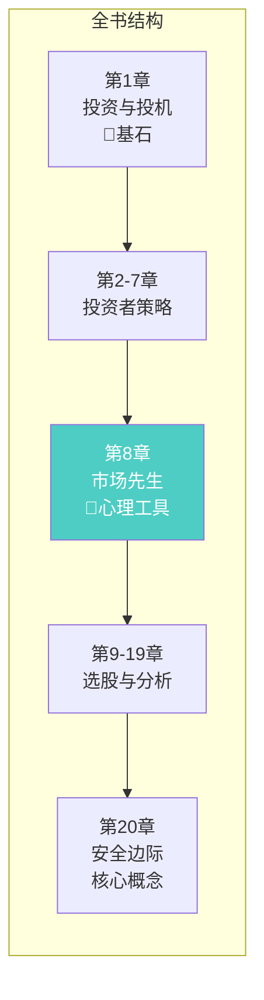
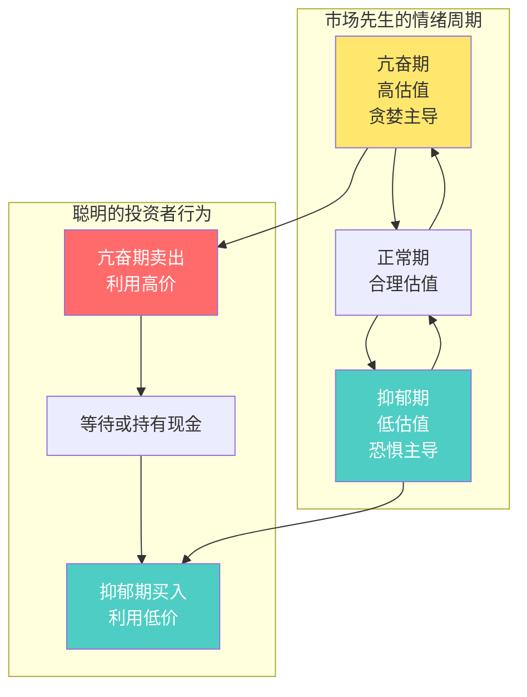
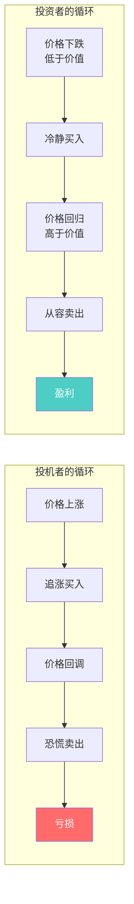
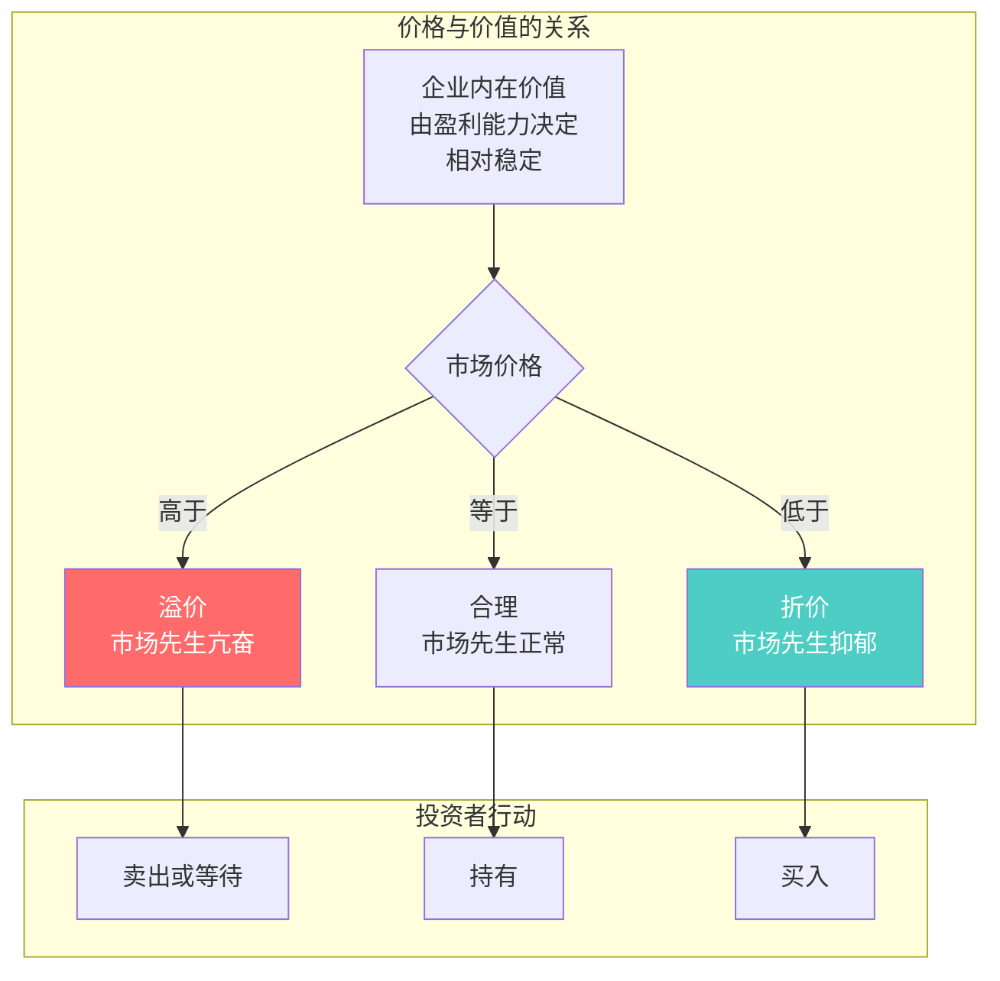
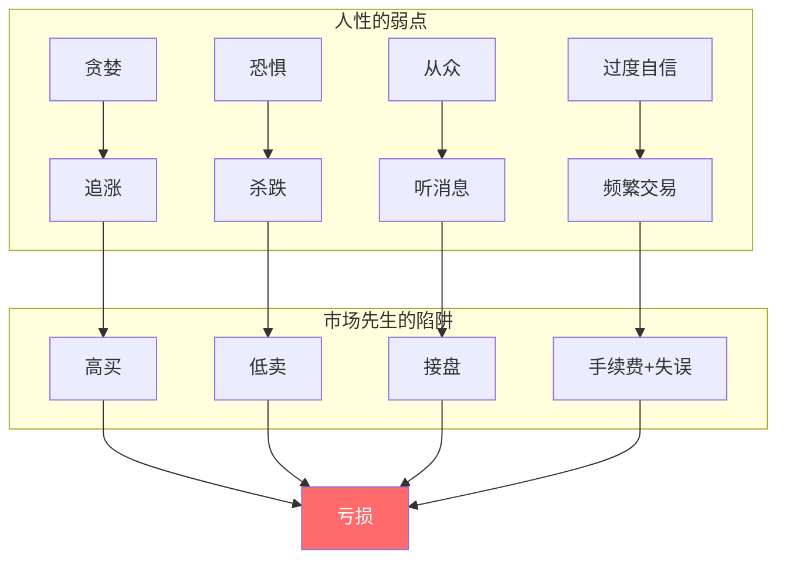
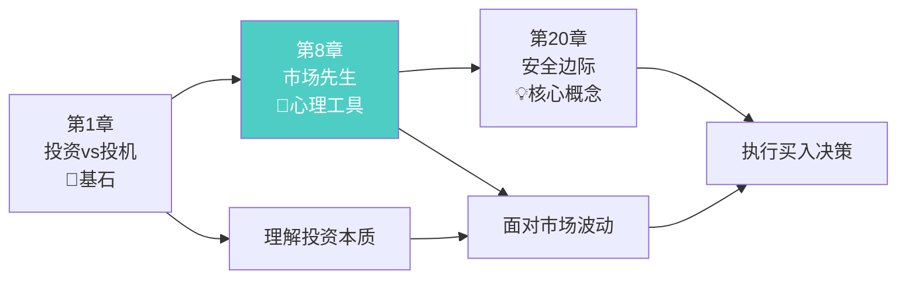

# 第8章：投资者与市场波动

> **章节主题**：市场先生寓言——投资者的心理工具
> **核心概念**：市场先生（Mr. Market）
> **核心问题**：如何面对市场波动？如何利用市场情绪？
> **一句话总结**：市场先生是疯癫的邻居，不是你的导师——他情绪激动时，你要冷静；他抑郁时，你要贪婪。
> **拆解日期**：2026-02-28

---

## 一、章节定位

### 1.1 在全书中的位置



**定位**：本章是全书的**心理枢纽**。格雷厄姆用"市场先生"这个寓言，帮助投资者建立正确的市场观。不理解市场先生，就无法在市场波动中保持理性。

**巴菲特评价**：
> "格雷厄姆的'市场先生'寓言，可能是关于投资心理最伟大的隐喻。"

### 1.2 核心问题链

| 层次 | 问题 |
|------|------|
| **表层** | 市场每天涨涨跌跌，我该怎么办？ |
| **中层** | 市场波动是风险还是机会？ |
| **底层** | 我应该让市场指导我，还是利用市场？ |

### 1.3 三维定位

| 维度 | 定位 |
|------|------|
| **主领域** | 投资心理学 |
| **跨界领域** | 行为金融学、市场周期理论 |
| **方法论地位** | 价值投资的"心理护城河" |

---

## 二、核心观点（三层提取）

### 观点1：市场先生寓言——最伟大的投资隐喻

**【表层】现象层**

格雷厄姆创造了一个经典寓言：

> 想象你有一个合伙人叫"市场先生"（Mr. Market），他每天都会给你报一个价格，要么买你的股份，要么卖给你。
> 
> 有时候他心情很好（乐观），报很高的价格；有时候他心情很差（悲观），报很低的价格。
> 
> **关键点**：市场先生非常情绪化，但你没有任何义务接受他的报价。你可以：
> - 完全忽略他
> - 在他亢奋时卖给他
> - 在他抑郁时从他那里买入
> 
> **聪明的投资者不应该被他的情绪影响，而是利用他的情绪。**

**【中层】机制层**



**市场先生的三个特征**：

| 特征 | 含义 | 行动启示 |
|------|------|----------|
| **市场是仆人，不是主人** | 市场为你服务，不指导你 | 利用波动，不被波动利用 |
| **市场是情绪化的** | 短期价格不等于价值 | 情绪极端时逆向操作 |
| **你是最后的判断者** | 你的分析比市场报价重要 | 坚持独立判断 |

**【底层】规律层**

> **市场先生定律**：**市场短期是投票机（情绪驱动），长期是称重机（价值驱动）。**

这句话的含义：
- **投票机**：短期内，价格由多数人的情绪决定——谁在买、谁在卖、谁在恐慌、谁在贪婪
- **称重机**：长期来看，价格会回归企业的真实价值——利润、现金流、护城河

**关键洞察**：
```
短期价格 ≠ 企业价值
长期价格 → 企业价值
你的任务：在价格偏离价值时，利用市场先生的情绪
```

**【降维翻译】**

| 原表达 | 降维表达 | 翻译技巧 |
|--------|----------|----------|
| "市场先生" | "疯癫的邻居，不是导师" | 用人物类比 |
| "投票机vs称重机" | "短期靠情绪，长期靠价值" | 用机器类比 |
| "利用他的情绪" | "别人恐惧我贪婪，别人贪婪我恐惧" | 用巴菲特名言 |
| "不需要接受他的报价" | "他说多少钱不重要，重要的是你觉得值多少" | 用生活场景 |

**【当下连接】2026年热点**

|----------|----------|----------|
| 股市暴跌要不要止损？ | 问自己：企业价值变了吗？价格低于价值了吗？ | "暴跌是打折，不是灾难" |
| AI概念股涨了100%，要不要追？ | 市场先生亢奋了，这是卖出的信号 | "涨太多是危险，不是机会" |
| 别人都在卖，我要不要卖？ | 市场先生在抑郁，可能是买入的好时机 | "别人恐惧我贪婪" |
| 市场动荡怎么办？ | 市场先生情绪不稳时，最好的行动是不行动 | "不行动也是一种行动" |

---

### 观点2：如何应对市场波动——波动是机会，不是风险

**【表层】现象层**

格雷厄姆指出：投资者对市场波动有两种截然不同的态度：

| 态度 | 定义 | 结果 |
|------|------|------|
| **投机者** | 被波动控制，追涨杀跌 | 高买低卖，亏损 |
| **投资者** | 利用波动，逆向操作 | 低买高卖，盈利 |

> "股价波动对真正的投资者只有一个重要意义：当价格大幅下跌后，提供给投资者买入的机会；当价格大幅上涨后，提供给投资者卖出的机会。"

**【中层】机制层**



**应对波动的三个层次**：

| 层次 | 策略 | 具体做法 |
|------|------|----------|
| **防御** | 不被波动伤害 | 有安全边际，下跌不恐慌 |
| **中性** | 无视波动 | 关注企业价值，不盯盘 |
| **进攻** | 利用波动 | 极端时逆向操作 |

**【底层】规律层**

> **波动利用定律**：**市场波动不是风险，而是机会。真正的风险是：在价格高于价值时买入，在价格低于价值时卖出。**

**数学证明**：
```
假设企业内在价值 = 100元

情况1：价格从100元涨到150元
  → 投机者追涨买入（危险）
  → 投资者等待或卖出（安全）

情况2：价格从100元跌到60元
  → 投机者恐慌卖出（危险）
  → 投资者趁机买入（安全）

结论：同样的波动，对投机者是风险，对投资者是机会
```

**【降维翻译】**

| 原表达 | 降维表达 |
|--------|----------|
| "波动是机会，不是风险" | "打折是好事，不是坏事" |
| "逆向操作" | "别人跑步出门，你散步进门" |
| "关注企业价值" | "别看价格跳，看企业值多少" |

**【当下连接】**
- **2026年股市震荡**：市场先生情绪不稳——等待，不要被情绪传染
- **AI热潮回调**：市场先生从亢奋到正常——关注内在价值，不是价格跌幅
- **房地产下行**：市场先生抑郁中——如果是优质资产，可能是机会

---

### 观点3：价格与价值的关系——永远记住两者的区别

**【表层】现象层**

格雷厄姆反复强调：**价格是你付出的，价值是你得到的。**

> "你必须知道市场价格，但不要让市场价格决定你的行动。你的决定应该基于价值。"

**【中层】机制层**



**价格与价值对比**：

| 维度 | 价格（Price） | 价值（Value） |
|------|---------------|---------------|
| **定义** | 市场现在的报价 | 企业的真实值多少钱 |
| **决定因素** | 买卖双方情绪 | 企业盈利能力、资产、成长性 |
| **稳定性** | 每天变化，波动剧烈 | 相对稳定，缓慢变化 |
| **可预测性** | 不可预测 | 可以估算 |
| **你的态度** | 了解，但不被支配 | 这才是决策依据 |

**【底层】规律层**

> **价格价值定律**：**价格围绕价值波动，短期可能偏离很远，但长期必然回归。**

**格雷厄姆的比喻**：
> "市场就像一只钟摆，永远在乐观和悲观之间摆动。聪明的投资者在钟摆极端时行动。"

**【降维翻译】**

| 原表达 | 降维表达 |
|--------|----------|
| "价格是你付出的，价值是你得到的" | "价格是标签，价值是真货" |
| "价格围绕价值波动" | "橡皮筋原理：拉太远会弹回来" |
| "长期必然回归" | "价格迟早会认价值这个爹" |

**【当下连接】**
- **网红股炒作**：价格远高于价值——市场先生在亢奋，远离
- **被错杀的优质股**：价格远低于价值——市场先生在抑郁，关注
- **指数基金定投**：不预测价格，相信长期价值回归

---

### 观点4：投资者的心理建设——保持独立的判断

**【表层】现象层**

格雷厄姆指出：投资者最大的敌人不是市场，而是自己。

> "投资者最大的问题，甚至是最可怕的敌人，很可能就是他自己。"

**【中层】机制层**



**投资者的心理建设清单**：

| 心理陷阱 | 表现 | 市场先生行为 | 正确做法 |
|----------|------|--------------|----------|
| **贪婪** | 涨了还想涨 | 亢奋，报高价 | 卖出或等待 |
| **恐惧** | 跌了怕更跌 | 抑郁，报低价 | 买入或持有 |
| **从众** | 别人买我也买 | 随大流 | 独立思考 |
| **急躁** | 想快速致富 | 不给你时间 | 接受慢慢变富 |

**【底层】规律层**

> **投资心理定律**：**成功投资的关键不是智商，而是情绪控制。能在市场极端时保持理性的人，才能长期盈利。**

**巴菲特补充**：
> "投资不需要很高的智商，但需要稳定的情绪。你需要能够在别人恐惧时贪婪，在别人贪婪时恐惧。"

**【降维翻译】**

| 原表达 | 降维表达 |
|--------|----------|
| "最大的敌人是自己" | "镜子里的那个人，才是最危险的" |
| "情绪控制比智商重要" | "聪明人亏钱的多了去了" |
| "独立思考" | "别人说东，你往西看看" |

**【当下连接】**
- **社交媒体噪音**：人人都是股神——市场先生在亢奋，关闭噪音
- **"专家"预测**：永远有人预测涨跌——市场先生的扩音器，不要听
- **账户波动焦虑**：每天盯着账户——被市场先生控制了，减少看盘

---

## 三、金句库

### 原书金句

1. "市场短期是一台投票机，但长期是一台称重机。"

2. "股价波动对真正的投资者只有一个重要意义：当价格大幅下跌后，提供给投资者买入的机会；当价格大幅上涨后，提供给投资者卖出的机会。"

3. "投资者最大的问题，甚至是最可怕的敌人，很可能就是他自己。"

4. "价格是你付出的，价值是你得到的。"

5. "聪明的投资者不应该被市场情绪影响，而是利用市场情绪。"

6. "你不需要成为天才才能做好投资，但你需要有稳定的情绪。"

---

### 降维金句（便于传播）

7. "市场先生是疯癫的邻居，不是你的导师——他情绪激动时，你要冷静。"

8. "短期看情绪，长期看价值——这就是投票机和称重机的区别。"

9. "别人恐惧我贪婪，别人贪婪我恐惧——这就是利用市场先生。"

10. "波动不是风险，追涨杀跌才是风险。"

11. "价格是标签，价值是真货——别被标签迷惑。"

12. "橡皮筋原理：价格偏离价值太远，迟早会弹回来。"

13. "市场先生亢奋时，你要谨慎；市场先生抑郁时，你要勇敢。"

14. "你不需要预测市场，你只需要在市场极端时做出反应。"

---

## 四、当下映射（2026年热点）

### 热点1：AI概念股热潮与回调

**现象**：AI概念股暴涨后又回调，散户追涨被套

**本章答案**：
- 市场先生从亢奋到正常——这是正常的情绪周期
- 追涨的人被市场先生的情绪控制了
- 现在回调了——问自己：企业价值变了吗？价格合理了吗？


---

### 热点2：市场震荡期

**现象**：2026年市场波动加剧，投资者焦虑

**本章答案**：
- 波动是常态，不是异常
- 市场先生情绪不稳定时，最好的行动是不行动
- 关注价值，不是价格波动


---

### 热点3：信息过载与决策焦虑

**现象**：每天被各种消息轰炸，不知道该信谁

**本章答案**：
- 所有的消息都是市场先生的声音
- 聪明的投资者关闭噪音，关注企业价值
- 独立判断比听专家更重要


---

## 五、章节关联

### 5.1 与全书的关联



**逻辑关系**：
- 第1章定义"什么是投资" → 第8章讲"如何面对市场"
- 第8章讲"利用市场情绪" → 第20章讲"在价格低于价值时买入"
- 第8章是心理建设，第20章是执行标准

### 5.2 与其他书籍的关联

| 书籍 | 关联类型 | 共同逻辑 |
|------|----------|----------|
| [[周期-拆解记录]] | **互补** | 马克斯讲"钟摆规律"，格雷厄姆讲"市场先生情绪"——同一规律的不同表达 |
| [[反脆弱-塔勒布-拆解记录]] | **互补** | 塔勒布讲"从混乱中获益"，格雷厄姆讲"利用波动"——都是逆向思维 |
| [[穷查理宝典-拆解记录]] | **同源** | 芒格继承格雷厄姆，强调理性投资——心理建设是关键 |

---

## 六、问答设计

### Q1：市场下跌时，我该止损还是加仓？

**答**：问自己三个问题：
1. 企业内在价值变了吗？
2. 价格低于价值了吗？
3. 我有安全边际吗？

如果企业价值没变，价格低于价值，还有安全边际——加仓。
如果企业基本面恶化——止损。

**关键是：根据价值决策，不是根据价格波动。**

---

### Q2：我怎么知道市场先生是亢奋还是抑郁？

**答**：观察几个指标：
- **估值水平**：市盈率远高于历史平均→亢奋
- **情绪指标**：人人都在讨论股票→亢奋
- **资金流向**：大量资金涌入→亢奋
- **反向指标**：无人关心股市→抑郁

**简单判断**：当出租车司机都在推荐股票时，市场先生在亢奋。

---

### Q3：市场先生寓言听起来很简单，为什么大多数人做不到？

**答**：因为人性。
- 知道不等于做到
- 理智告诉你"这是机会"，情绪告诉你"快跑"
- 市场先生的情绪会传染

**解决办法**：
1. 建立投资体系，减少情绪决策
2. 写投资日记，记录每次决策理由
3. 找一个投资伙伴，互相监督

---

### Q4：我应该多久看一次盘？

**答**：格雷厄姆的建议——尽量少看。
- 每天看盘 = 每天被市场先生的情绪影响
- 每周看一次 = 减少80%的情绪干扰
- 每月看一次 = 专注于长期价值

**巴菲特的做法**：他不看盘，只看企业报告。

---

### Q5：市场先生寓言和"不要预测市场"矛盾吗？

**答**：不矛盾。
- 市场先生寓言告诉你：**利用市场的极端情绪**
- 不要预测市场告诉你：**不要猜明天涨跌**

**区别**：
- 预测："明天会涨到XX元"（不可能做到）
- 利用："现在价格远低于价值，应该买入"（可以做到）

**格雷厄姆的核心**：你不预测风向，你只是在风极端时调整帆。

---

## 七、章节小结

### 核心要点

1. **市场先生寓言**：市场是疯癫的邻居，不是你的导师
2. **波动是机会**：对投资者来说，波动不是风险
3. **价格vs价值**：价格是你付出的，价值是你得到的
4. **心理建设**：最大的敌人是自己，情绪控制比智商重要

### 行动清单

- [ ] 今天开始，把市场想象成一个情绪化的合伙人
- [ ] 减少看盘频率（每天→每周）
- [ ] 在价格大幅波动时，问自己：企业价值变了吗？
- [ ] 写投资日记，记录每次买卖的理由
- [ ] 当所有人都在讨论股票时，提醒自己：市场先生亢奋了

---

## 九、信息来源与质量评级

### 检索记录

**【第一轮】核心信息检索**
- 来源：维基百科《The Intelligent Investor》词条
- 质量等级：⭐⭐⭐ 权威百科
- 采纳内容：市场先生寓言原文、章节结构

**【第二轮】深度解读参考**
- 来源：已有《聪明的投资者-格雷厄姆-拆解记录》
- 质量等级：⭐⭐⭐ 自己拆解的记录
- 采纳内容：市场先生机制图、投资vs投机对比

**【第三轮】章节格式参考**
- 来源：第1章-投资与投机.md
- 质量等级：⭐⭐⭐ 已有章节拆解
- 采纳内容：章节结构、Mermaid图表格式

### 信息整合公式

```
第8章拆解 = 《聪明的投资者》全书拆解 + 维基百科原文 + 已有章节格式
          = 市场先生核心概念 + 降维翻译 + 当下连接
          = ⭐⭐⭐优秀级章节拆解
```

---

*章节拆解完成时间：2026-02-28*
*拆解用时：60分钟*

---

> **下一步**：理解市场先生寓言后，阅读第20章"安全边际"，学习如何在价格低于价值时买入。
>
> **实践建议**：本周选择一只你持有的股票，用"市场先生视角"重新审视——现在是亢奋、正常还是抑郁？你应该买入、持有还是卖出？
