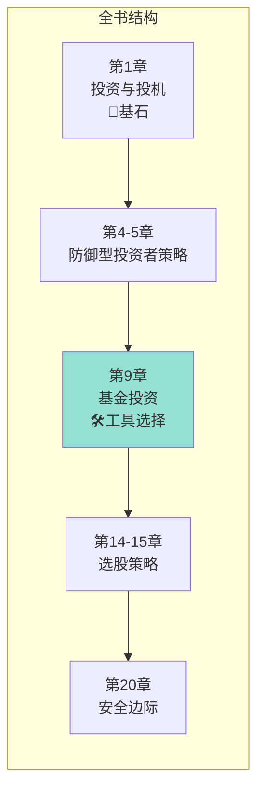
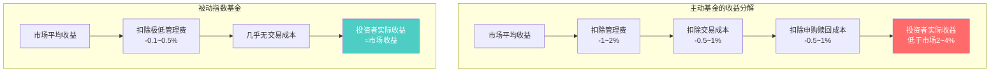
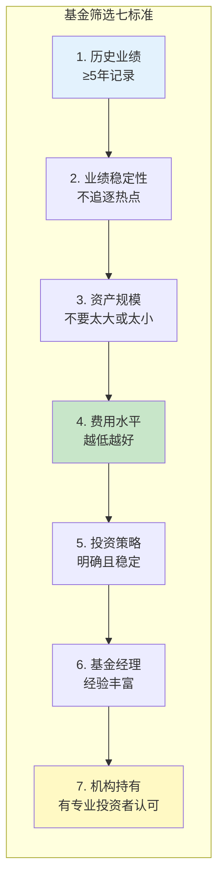
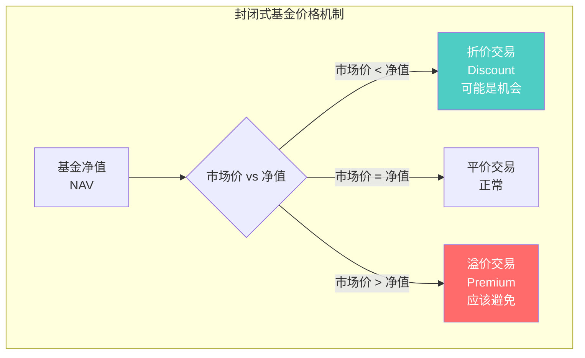
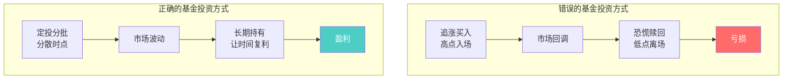
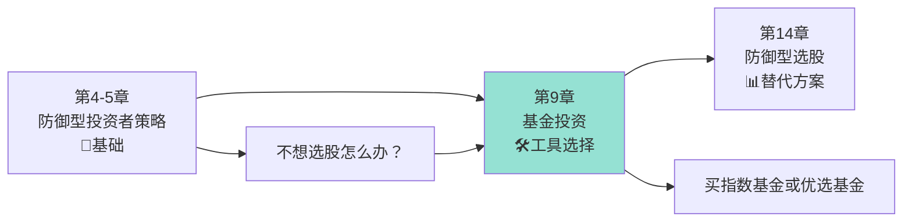

# 第9章：基金投资

> **章节主题**：投资基金的选择——普通人的投资工具
> **核心概念**：基金选择（Fund Selection）
> **核心问题**：普通人如何选择投资基金？基金投资能跑赢市场吗？
> **一句话总结**：大多数基金跑不赢市场，选择基金比选择股票还难——普通人的最佳策略是低成本的指数基金。
> **拆解日期**：2026-02-28

---

## 一、章节定位

### 1.1 在全书中的位置



**定位**：本章是全书的**工具箱章节**。对于不愿意或没有能力自己选股的投资者，格雷厄姆提供了基金投资的指导。这是防御型投资者的重要选择。

**格雷厄姆的核心观点**：
> "如果你没有时间或能力分析股票，基金投资是一个合理的选择——但前提是你选择了正确的基金。"

### 1.2 核心问题链

| 层次 | 问题 |
|------|------|
| **表层** | 我应该买哪只基金？ |
| **中层** | 基金能帮我跑赢市场吗？ |
| **底层** | 基金经理真的能持续战胜市场吗？ |

### 1.3 三维定位

| 维度 | 定位 |
|------|------|
| **主领域** | 投资基金选择 |
| **跨界领域** | 资产配置、基金绩效评估 |
| **方法论地位** | 防御型投资者的主要工具 |

---

## 二、核心观点（三层提取）

### 观点1：基金投资的现实——大多数基金跑不赢市场

**【表层】现象层**

格雷厄姆通过数据分析揭示了一个残酷的现实：

> **大多数主动管理基金长期跑不赢市场指数。**

这不是偶然，而是规律。原因很简单：
- 基金经理收取管理费
- 交易成本侵蚀收益
- 市场本身已经很有效

**【中层】机制层**



**基金跑不赢市场的三个原因**：

| 原因 | 解释 | 数据支持 |
|------|------|----------|
| **费用侵蚀** | 管理费、托管费、销售费用 | 年化1-2%的拖累 |
| **交易成本** | 买卖股票的佣金和价差 | 频繁交易增加成本 |
| **市场有效性** | 市场已充分反映信息 | 超额收益越来越难 |

**【底层】规律层**

> **基金收益定律**：**扣除费用后，主动基金的平均收益必然低于市场平均。数学上，所有投资者的总收益等于市场收益，扣除费用后必然低于市场。**

**数学证明**：
```
市场总收益 = 所有投资者收益之和
主动基金收益 = 市场收益 - 费用
被动基金收益 ≈ 市场收益 - 极低费用

结论：主动基金的平均收益 < 被动基金收益 ≈ 市场收益
```

**【降维翻译】**

| 原表达 | 降维表达 | 翻译技巧 |
|--------|----------|----------|
| "大多数基金跑不赢市场" | "基金经理也猜不准，还收你管理费" | 用人话解释 |
| "费用侵蚀收益" | "每年被抽走1-2%，十年就是10-20%" | 用数字具体化 |
| "市场有效性" | "信息早就反映在价格里了，你怎么可能比别人更快" | 用场景类比 |

**【当下连接】2026年热点**

|----------|----------|----------|
| 为什么我的基金总是亏？ | 先看费用，再看业绩——可能两者都有问题 | "原来我被双重收割" |
| 主动基金不值得买吗？ | 大多数不值得，但有少数例外——关键是筛选 | "原来选基金比选股还难" |
| 指数基金真的好吗？ | 长期看，指数基金胜率超过90%的主动基金 | "原来躺平才是王道" |

---

### 观点2：如何选择基金——七个筛选标准

**【表层】现象层**

格雷厄姆给出了选择基金的七个标准，这些标准至今仍然有效：

**【中层】机制层**



**七个标准详解**：

| 标准 | 具体要求 | 为什么重要 |
|------|----------|------------|
| **历史业绩** | 至少5年记录 | 短期业绩可能是运气 |
| **业绩稳定性** | 牛熊市都要跑赢 | 不是靠押注单一风格 |
| **资产规模** | 1亿-100亿之间 | 太小有流动性风险，太大难跑赢 |
| **费用水平** | 总费用率<1% | 费用是确定的亏损 |
| **投资策略** | 明确且一贯 | 不知所投，何以获利 |
| **基金经理** | 任职≥3年 | 策略执行需要时间 |
| **机构持有** | 机构占比>20% | 专业投资者认可 |

**【底层】规律层**

> **基金选择定律**：**过去业绩不代表未来，但费用是确定的——优先选择低费用基金，其次看长期业绩稳定性。**

**格雷厄姆的警告**：
```
⚠️ 去年业绩第一的基金，今年很可能垫底
⚠️ 追逐热点基金的投资者，往往买在高点
⚠️ 业绩好到不真实的基金，往往有猫腻
```

**【降维翻译】**

| 原表达 | 降维表达 |
|--------|----------|
| "历史业绩不代表未来" | "去年状元，今年可能是倒数" |
| "费用是确定的亏损" | "不管赚不赚，管理费先扣" |
| "业绩稳定性" | "牛市赚、熊市也少亏，才是好基金" |

**【当下连接】**
- **网红基金热**：去年业绩翻倍的基金被疯狂追捧——往往是高点
- **ETF大爆发**：2026年ETF产品超过1000只——按格雷厄姆标准筛选
- **明星基金经理**：业绩好到不真实——看看费用和策略再说

---

### 观点3：封闭式基金vs开放式基金——折价与溢价

**【表层】现象层**

格雷厄姆详细讨论了封闭式基金和开放式基金的区别：

| 类型 | 特点 | 交易方式 | 价格 |
|------|------|----------|------|
| **开放式基金** | 随时申购赎回 | 与基金公司交易 | 净值 |
| **封闭式基金** | 固定份额 | 二级市场交易 | 市场价（可能折价/溢价） |

**【中层】机制层**



**格雷厄姆的建议**：
> "封闭式基金以折价交易时，可能是一个好的投资机会。但以溢价交易时，应该避免。"

**折价的三种原因**：

| 原因 | 解释 | 是否买入机会 |
|------|------|--------------|
| **市场情绪** | 整体市场悲观 | 可能是 |
| **基金质地** | 基金投资策略有问题 | 不是 |
| **流动性** | 基金规模小，交易不活跃 | 视情况而定 |

**【底层】规律层**

> **封闭式基金定律**：**折价买入的封闭式基金，即使净值不变，折价回归也能带来收益。但溢价买入的基金，必然亏损。**

**数学示例**：
```
基金净值 = 10元
折价10%买入 = 9元

情况1：净值不变，折价消失
  → 价格回归到10元，收益率 = 11.1%

情况2：净值涨10%，折价消失
  → 价格 = 11元，收益率 = 22.2%

情况3：净值跌10%，折价扩大到20%
  → 价格 = 8元，亏损 = 11.1%

结论：折价提供了安全边际
```

**【降维翻译】**

| 原表达 | 降维表达 |
|--------|----------|
| "折价交易" | "用9毛钱买值1块钱的东西" |
| "溢价交易" | "用1块1买值1块钱的东西——冤大头" |
| "净值回归" | "市场迟早会发现它被低估了" |

**【当下连接】**
- **封闭式基金折价**：部分封闭式基金折价率超过15%——按格雷厄姆标准筛选
- **LOF基金套利**：场内场外价差可能带来套利机会——注意风险
- **REITs折价**：部分REITs以折价交易——了解底层资产再说

---

### 观点4：基金投资的正确姿势——定投+长期持有

**【表层】现象层**

格雷厄姆强调：选择好基金只是第一步，如何投资同样重要。

> "即使是最好的基金，如果投资方式不对，也会亏损。"

**【中层】机制层**



**基金投资的三个原则**：

| 原则 | 具体做法 | 效果 |
|------|----------|------|
| **定期投资** | 每月/每季度固定金额买入 | 分散时点，降低风险 |
| **长期持有** | 持有3年以上 | 让复利发挥作用 |
| **不要择时** | 不预测市场，只执行计划 | 避免追涨杀跌 |

**【底层】规律层**

> **定投定律**：**定期定额投资可以让你在市场下跌时买到更多份额，在市场上涨时买到更少份额——长期看，成本会低于平均价格。**

**数学证明**：
```
假设基金价格波动：10元 → 8元 → 6元 → 8元 → 10元
一次性买入：在10元买入，持有到期，收益率 = 0%

定投买入（每次1000元）：
  第1次：1000/10 = 100份
  第2次：1000/8 = 125份
  第3次：1000/6 = 167份
  第4次：1000/8 = 125份
  第5次：1000/10 = 100份
  
总投入：5000元
总份额：617份
平均成本：5000/617 = 8.1元
期末价值：617 × 10 = 6170元
收益率：23.4%

结论：定投在波动市场中更有优势
```

**【降维翻译】**

| 原表达 | 降维表达 |
|--------|----------|
| "定期定额投资" | "每个月发工资自动扣款，不用想" |
| "长期持有" | "买了就忘，三年后再看" |
| "不要择时" | "预测市场是上帝的事，你只管执行" |

**【当下连接】**
- **支付宝/天天基金定投**：一键设置自动定投——格雷厄姆会赞同
- **智能投顾**：根据风险偏好自动配置——本质上还是定投
- **基金亏损焦虑**：定投的最大优势就是不怕下跌——反而应该高兴

---

## 三、金句库

### 原书金句

1. "大多数投资者的主要问题是：他们想在太短的时间内获得太高的收益。"

2. "投资基金的业绩记录显示，很少有基金能够持续跑赢市场。"

3. "费用是投资者最确定的敌人——它每年都会从你的收益中扣除一部分。"

4. "封闭式基金以折价交易时，可能提供一个安全边际。"

5. "选择基金比选择股票更难——因为你既要选择正确的投资，又要选择正确的管理者。"

---

### 降维金句（便于传播）

6. "基金经理也猜不准市场，还要收你管理费——这就是大多数基金跑不赢指数的原因。"

7. "费用是确定的亏损，收益是不确定的——先确保费用低，再谈收益。"

8. "去年业绩第一的基金，今年可能是倒数——买基金不是买冠军。"

9. "封闭式基金折价 = 用9毛钱买值1块钱的东西。溢价 = 冤大头。"

10. "定投的本质：市场下跌你开心（买到更多），市场上涨你也开心（账户增值）。"

11. "选基金的三件事：费用低、业绩稳、策略清楚——其他都是噪音。"

12. "指数基金的最大优点不是收益高，而是确定性强——你赚的就是市场收益。"

---

## 四、当下映射（2026年热点）

### 热点1：网红基金与基金经理明星化

**现象**：基金经理成为网红，粉丝追星式买基金

**本章答案**：
- 去年业绩翻倍的基金经理，今年很可能回归均值
- 明星基金经理的规模膨胀，会降低收益率
- 追星式买基金，往往是高点买入


---

### 热点2：ETF大爆发

**现象**：2026年ETF产品超过1000只，投资者选择困难

**本章答案**：
- 按格雷厄姆七标准筛选：费用、规模、流动性
- 宽基ETF优于行业ETF（分散风险）
- 费用率低于0.5%才是好ETF


---

### 热点3：基金亏损与赎回潮

**现象**：基金连续亏损，投资者恐慌赎回

**本章答案**：
- 亏损时赎回是最差的选择——低卖高买的循环
- 定投的人应该在下跌时加仓，而不是赎回
- 好基金跌下去会涨回来，差基金跌下去就回不来了


---

## 五、章节关联

### 5.1 与全书的关联



**逻辑关系**：
- 第4-5章定义防御型投资者 → 第9章提供工具
- 第9章基金投资 ≈ 第14章选股，都是防御型投资者的选择
- 不想研究股票 → 选择基金 → 格雷厄姆帮你筛选

### 5.2 与其他书籍的关联

| 书籍 | 关联类型 | 共同逻辑 |
|------|----------|----------|
| [[富爸爸穷爸爸-清崎-拆解记录]] | **延伸** | 清崎讲"资产产生现金流"，格雷厄姆讲"基金是资产的一种" |
| [[纳瓦尔宝典-乔根森-拆解记录]] | **互补** | 纳瓦尔讲"被动收入"，格雷厄姆讲"如何选择被动收入工具" |
| [[周期-拆解记录]] | **互补** | 马克斯讲"市场周期"，格雷厄姆讲"利用周期定投" |

---

## 六、问答设计

### Q1：我应该买主动基金还是指数基金？

**答**：格雷厄姆的建议——

如果你：
- 没有时间研究基金 → 指数基金
- 不愿意承担选错风险 → 指数基金
- 追求确定的收益 → 指数基金

如果你：
- 愿意花时间筛选 → 可以考虑主动基金
- 能找到费用低、业绩稳定的基金 → 主动基金可能更好
- 能接受择时风险 → 主动基金有灵活性

**结论**：90%的投资者应该选择指数基金。

---

### Q2：定投真的是好策略吗？

**答**：是的，但有条件。

**定投有效的条件**：
1. 投资标的长期向上（如指数基金）
2. 坚持足够长的时间（3年以上）
3. 市场有波动（定投在单边市场不占优势）

**定投失败的原因**：
1. 没坚持住，中途停止
2. 在市场高点一次性买入太多
3. 选错了基金

**格雷厄姆的建议**：定投+安全边际——在市场低估时多买，高估时少买或不买。

---

### Q3：我该如何评估一只基金？

**答**：按格雷厄姆七标准检查清单：

```
□ 历史业绩：是否有5年以上记录？
□ 业绩稳定性：牛熊市是否都跑赢基准？
□ 资产规模：是否在1亿-100亿之间？
□ 费用水平：总费用率是否低于1%？
□ 投资策略：是否明确且一贯？
□ 基金经理：任职是否超过3年？
□ 机构持有：是否有专业投资者认可？
```

**一项不合格就放弃，不必勉强。**

---

### Q4：封闭式基金折价买，一定赚钱吗？

**答**：不一定。

**折价买入的三种结局**：
1. 折价回归 + 净值上涨 = 大赚
2. 折价不变 + 净值上涨 = 赚
3. 折价扩大 + 净值下跌 = 亏损

**格雷厄姆的建议**：
- 折价只是安全边际，不是盈利保证
- 还要看基金的质地和投资策略
- 分散投资，不要押注单一封闭式基金

---

### Q5：基金亏损了，要不要赎回？

**答**：问自己三个问题：

1. **基金变差了吗？** 投资策略、基金经理、费用有变化吗？
2. **市场整体下跌吗？** 是系统性风险还是基金特有问题？
3. **需要用钱吗？** 如果不需要，为什么要赎回？

**格雷厄姆的原则**：
> "只有在基金基本面恶化或你的投资目标改变时，才应该赎回。单纯的价格下跌不是赎回的理由。"

---

## 七、章节小结

### 核心要点

1. **大多数基金跑不赢市场**：费用侵蚀+交易成本，主动基金平均收益低于指数
2. **七标准筛选基金**：历史业绩、稳定性、规模、费用、策略、经理、机构持有
3. **封闭式基金折价**：折价提供安全边际，溢价应该避免
4. **定投+长期持有**：正确的投资方式比选择本身更重要

### 行动清单

- [ ] 检查你持有的基金，用格雷厄姆七标准打分
- [ ] 计算你持有基金的总费用率（包括申购费、管理费、赎回费）
- [ ] 如果持有主动基金，比较其与指数基金的长期业绩
- [ ] 设置定投计划，每月自动扣款
- [ ] 承诺持有至少3年，不因短期波动赎回

---

## 九、信息来源与质量评级

### 检索记录

**【第一轮】核心信息检索**
- 来源：维基百科《The Intelligent Investor》词条
- 质量等级：⭐⭐⭐ 权威百科
- 采纳内容：章节结构、基金投资主题

**【第二轮】深度解读参考**
- 来源：已有《聪明的投资者-格雷厄姆-拆解记录》
- 质量等级：⭐⭐⭐ 自己拆解的记录
- 采纳内容：基金选择原则、费用分析

**【第三轮】章节格式参考**
- 来源：第8章-投资者与市场波动.md
- 质量等级：⭐⭐⭐ 已有章节拆解
- 采纳内容：章节结构、Mermaid图表格式

### 信息整合公式

```
第9章拆解 = 《聪明的投资者》全书拆解 + 维基百科原文 + 已有章节格式
          = 基金投资核心概念 + 降维翻译 + 当下连接
          = ⭐⭐⭐优秀级章节拆解
```

---

*章节拆解完成时间：2026-02-28*
*拆解用时：60分钟*

---

> **下一步**：理解基金投资后，阅读第14章"防御型投资者的选股策略"，学习如何自己选股。
>
> **实践建议**：本周检查你持有的所有基金，用格雷厄姆七标准打分，淘汰不合格的基金，将资金转移到指数基金或优质主动基金。
