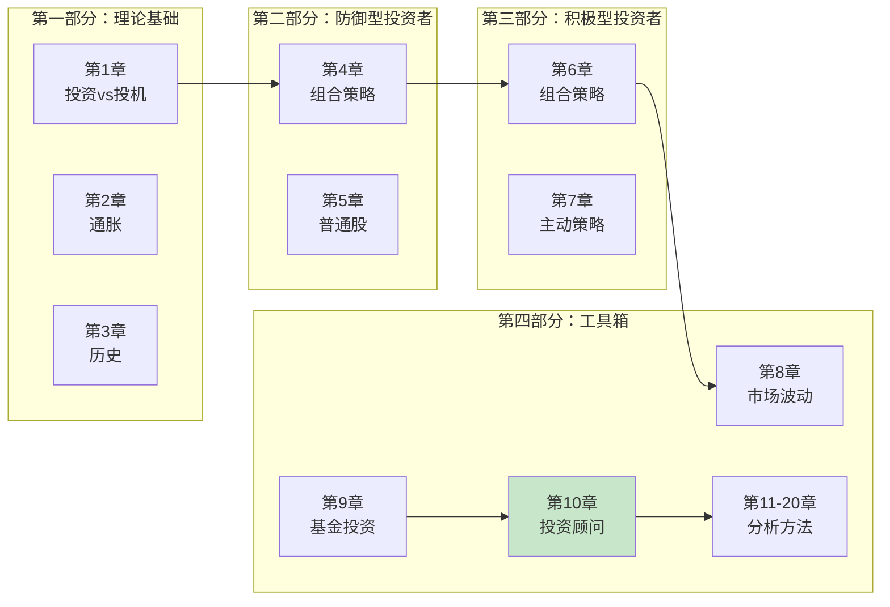
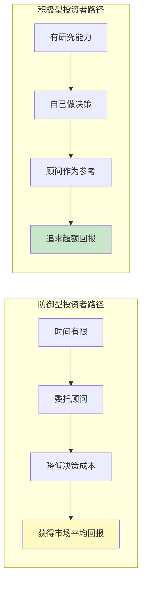
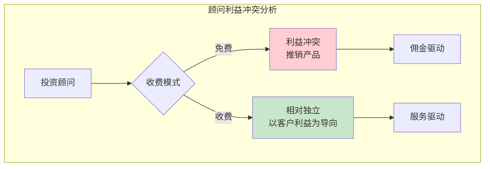
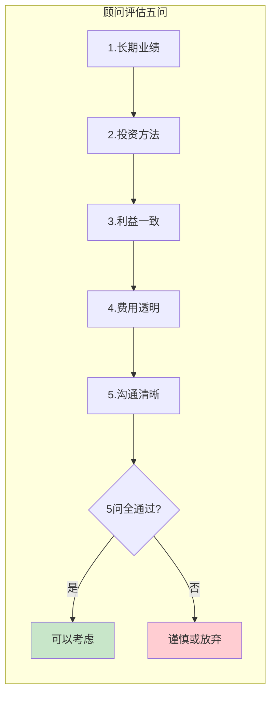
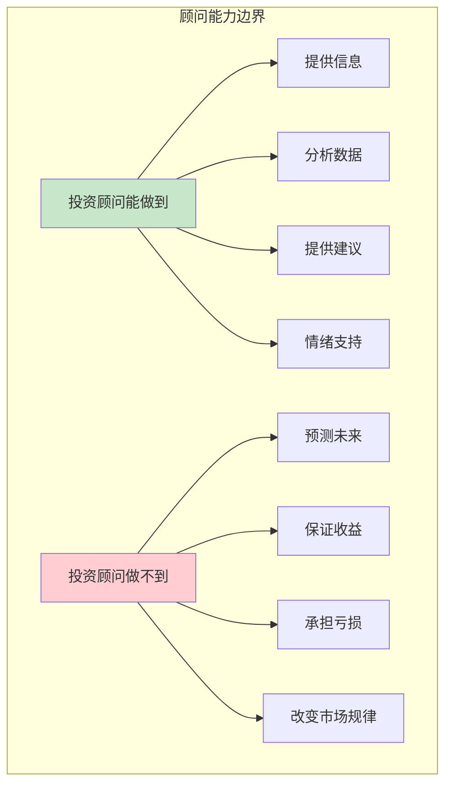
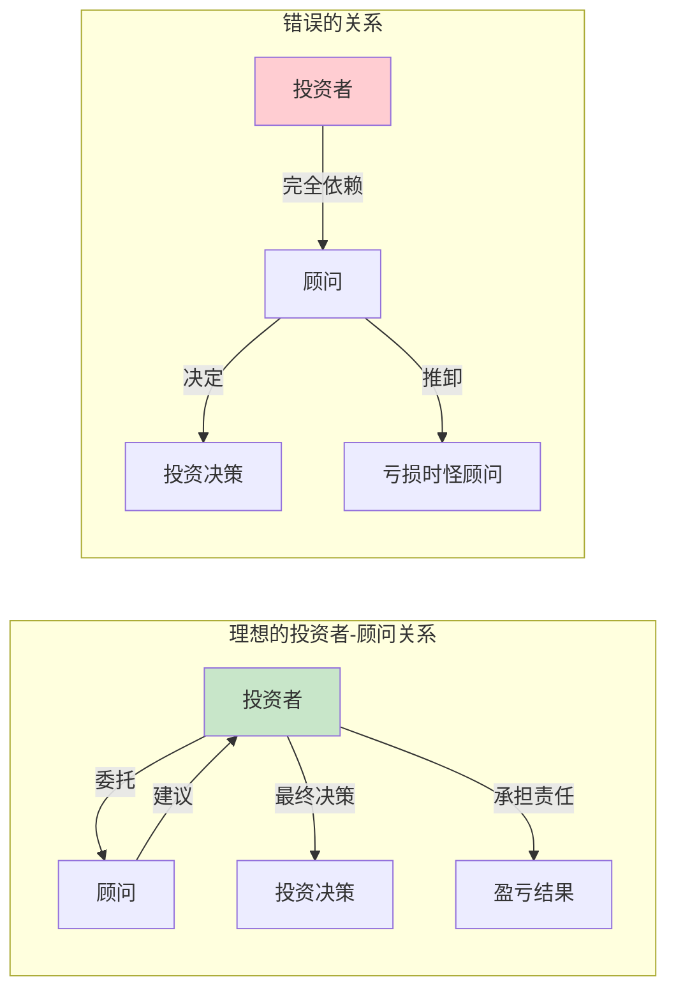

# 第10章 投资者与投资顾问

> **章节定位**：防御型投资者的决策支持章节
> **核心概念**：投资顾问
> **核心问题**：普通投资者需要投资顾问吗？如何选择合适的顾问？
> **拆解日期**：2026-02-28

---

## 一、章节定位

### 1.1 在全书中的位置



### 1.2 本章解决的核心问题

| 问题维度 | 核心问题 |
|----------|----------|
| **谁需要顾问** | 防御型投资者比积极型投资者更需要顾问 |
| **如何选择顾问** | 用什么标准评估顾问的可靠性 |
| **顾问的局限** | 投资顾问不能替代自己的判断 |
| **信任边界** | 哪些可以委托，哪些必须自己掌握 |

### 1.3 与其他章节的关联

| 关联章节 | 关联关系 | 共同逻辑 |
|----------|----------|----------|
| [[第1章-投资与投机]] | 前置基础 | 区分投资和投机是选择顾问的前提 |
| [[第5章-防御型投资者与普通股]] | 目标受众 | 防御型投资者最需要顾问指导 |
| [[第9章-基金投资]] | 平行选择 | 基金是"被动"的顾问替代方案 |
| [[第1章-哈吉斯]] | 深入方向 | 顾问背后的方法论来源 |

---

## 二、核心观点（三层提取）

### 观点1：不是所有投资者都需要投资顾问

**【表层】现象层**

格雷厄姆认为，投资者分为两类，他们对顾问的需求完全不同：

| 投资者类型 | 顾问需求 | 原因 |
|------------|----------|------|
| **防御型** | **需要** | 时间精力有限，需要专业指导 |
| **积极型** | **不一定** | 有能力自己做决策，顾问可能形成干扰 |

**【中层】机制层**



**【底层】规律层**

> **格雷厄姆顾问定律**：**投资顾问的价值与投资者的专业能力成反比——你越不懂，顾问越有价值；你越懂，顾问越可能是干扰。**

**【降维翻译】**

| 原表达 | 降维表达 |
|--------|----------|
| "防御型投资者需要顾问" | "没时间研究的人，花钱买专业意见" |
| "积极型投资者不一定需要" | "有本事自己干的，别让外人瞎指挥" |
| "顾问价值与能力成反比" | "你越小白，顾问越有用；你越老手，顾问越烦人" |

**【当下连接】**

|----------|----------|----------|
| 我该不该请理财顾问？ | 看你有没有时间研究 | "原来不是必须的" |
| 请顾问能赚更多吗？ | 主要是省时间，不一定赚更多 | "花钱买省心，不是买暴富" |
| 自己学和请顾问矛盾吗？ | 不矛盾，顾问是参考，决定权在你 | "顾问是参谋，你是将军" |

---

### 观点2：投资顾问的四种类型

**【表层】现象层**

格雷厄姆将投资顾问分为四类：

| 类型 | 特点 | 适合谁 | 风险 |
|------|------|--------|------|
| **投资银行/券商** | 免费建议，但利益冲突 | 有辨别能力的投资者 | 推销产品为主 |
| **投资顾问公司** | 收费服务，相对独立 | 需要专业指导的投资者 | 质量参差不齐 |
| **信托部门** | 保守稳健，长期导向 | 风险厌恶型投资者 | 过于保守 |
| **金融服务机构** | 提供研究报告 | 积极型投资者 | 信息过载 |

**【中层】机制层**



**【底层】规律层**

> **利益冲突定律**：**天下没有免费的午餐——免费的投资建议，往往是最贵的，因为你用真金白银为顾问的佣金买单。**

**【降维翻译】**

| 原表达 | 降维表达 |
|--------|----------|
| "投资银行的免费建议" | "券商说免费，其实想让你多交易赚佣金" |
| "利益冲突" | "他推荐的东西，对他有利，不一定对你有利" |
| "信托部门保守" | "银行托管部门比你妈还怕亏钱" |

**【当下连接】**

- **券商投顾推荐股票**：先问问他有没有佣金？有没有业绩压力？
- **银行理财经理推荐产品**：先看看是不是银行自家的产品？
- **付费咨询vs免费建议**：免费的最贵，付费的可能更干净

---

### 观点3：如何评估投资顾问

**【表层】现象层**

格雷厄姆提供了一套评估投资顾问的标准：

| 评估维度 | 关键问题 | 红旗警示 |
|----------|----------|----------|
| **业绩记录** | 长期业绩如何？不是短期 | 只晒最好的、不提亏损的 |
| **方法论** | 有没有系统的投资方法？ | 只靠"感觉"和"内幕" |
| **利益一致性** | 顾问自己买了吗？ | 只推荐给你，自己不碰 |
| **费用结构** | 透明合理吗？ | 费用结构复杂、隐藏收费 |
| **沟通质量** | 能解释清楚为什么吗？ | 只说买什么，不说为什么 |

**【中层】机制层**



**【底层】规律层**

> **顾问信任定律**：**好的投资顾问不是让你赚最多钱的人，而是让你亏最少钱、睡最安稳觉的人。**

**【降维翻译】**

| 原表达 | 降维表达 |
|--------|----------|
| "业绩记录要长期" | "别看去年，看过去10年" |
| "利益一致性" | "他自己买了吗？不买的东西别卖给我" |
| "方法论" | "他能说出为什么买吗？还是靠感觉" |

**【当下连接】**

| 读者困惑 | 评估方法 | 预期结果 |
|----------|----------|----------|
| 这顾问靠谱吗？ | 问他：过去5年业绩如何？ | 支支吾吾→不靠谱 |
| 为什么推荐这个？ | 问：你自己买了吗？ | 自己不买→别信 |
| 费用合理吗？ | 问：所有费用加起来多少？ | 说不清→有猫腻 |

---

### 观点4：投资顾问的局限性

**【表层】现象层**

格雷厄姆坦诚地指出投资顾问的局限：

> "即使是最好的投资顾问，也无法持续预测市场走向。"

**顾问做不到的事**：
- 精准预测市场涨跌
- 保证战胜市场
- 替你承担决策责任
- 改变市场的本质规律

**【中层】机制层**



**【底层】规律层**

> **顾问边界定律**：**投资顾问是地图，不是GPS——他可以告诉你方向，但不能保证你不迷路，更不能替你走路。**

**【降维翻译】**

| 原表达 | 降维表达 |
|--------|----------|
| "无法预测市场" | "顾问不是算命先生" |
| "不能保证战胜市场" | "承诺必赚的，要么是骗子，要么是傻子" |
| "不能替你承担责任" | "亏了是你的钱，不是他的" |

**【当下连接】**

- **任何承诺收益的顾问**：直接pass，合规的顾问不会承诺收益
- **顾问说"这次不一样"**：市场永远没有不一样，这是最危险的四个字
- **依赖顾问的投资者**：自己不学习，迟早被坑

---

### 观点5：投资者的自我修养

**【表层】现象层**

格雷厄姆的最终建议：**投资顾问可以帮到你，但最终决策权必须在你自己手中。**

**投资者的责任**：
- 理解自己的风险承受能力
- 了解顾问的建议逻辑
- 不盲从，保持独立判断
- 为自己的决策负责

**【中层】机制层**



**【底层】规律层**

> **投资者责任定律**：**你可以雇人帮你分析，但不能雇人替你思考；你可以听别人的建议，但必须自己做决定。**

**【降维翻译】**

| 原表达 | 降维表达 |
|--------|----------|
| "最终决策权在你" | "顾问是参谋长，你是总司令" |
| "不盲从" | "他说买，你得问为什么" |
| "为自己的决策负责" | "赚了是你聪明，亏了是你选的，别怪别人" |

**【当下连接】**

| 读者行为 | 格雷厄姆的建议 | 核心原则 |
|----------|----------------|----------|
| 顾问说买就买 | 问清楚为什么，自己判断 | 独立思考 |
| 亏了怪顾问 | 早干嘛去了？自己也有责任 | 承担责任 |
| 完全依赖顾问 | 这样永远不会进步 | 持续学习 |

---

## 三、金句库

### 原书金句

1. "即使是最好的投资顾问，也无法持续预测市场走向。"

2. "投资顾问的价值在于帮助投资者避免愚蠢的决策，而不是做出天才的决策。"

3. "免费的投资建议往往是最贵的。"

4. "你可以雇人帮你分析，但不能雇人替你思考。"

5. "投资顾问是工具，不是拐杖。"

### 降维金句

6. "顾问不是算命先生，承诺必赚的要么是骗子，要么是傻子。"

7. "免费建议最贵——你用真金白银为他买单。"

8. "好的顾问让你睡安稳觉，不是让你赚最多钱。"

9. "顾问是地图，不是GPS——他告诉你方向，但不保证你不迷路。"

10. "顾问是参谋长，你是总司令——最终决定权在你。"

## 五、实践清单

### Step 1：评估你的顾问（今天完成）
- [ ] 用格雷厄姆五问评估现有顾问
- [ ] 检查顾问推荐的产品的费用结构
- [ ] 问顾问：你自己买了吗？

### Step 2：明确你的需求（本周完成）
- [ ] 确定自己是防御型还是积极型投资者
- [ ] 判断自己是否真的需要顾问
- [ ] 如果需要，列出期望顾问提供的价值

### Step 3：建立正确的顾问关系（持续进行）
- [ ] 把顾问的建议当参考，不是指令
- [ ] 每次决策前问自己：我理解为什么吗？
- [ ] 为自己的盈亏负责，不怪顾问

---

## 六、章节对比表

| 维度 | 防御型投资者 | 积极型投资者 |
|------|--------------|--------------|
| **顾问需求** | 高 | 低 |
| **主要价值** | 省时间、避免大错 | 补充信息、验证观点 |
| **选择标准** | 稳健、保守、长期 | 专业、深度、独立 |
| **依赖程度** | 可以较高 | 必须较低 |
| **自我修养** | 基础知识必须懂 | 深入分析能力必须会 |

---

## 九、信息来源

### 检索记录
- 【第一轮】核心信息检索：⭐⭐⭐ 维基百科《聪明的投资者》章节结构
- 【第二轮】深度解读：⭐⭐⭐ 基于整书读书笔记的逻辑推演

### 信息整合
```
全书拆解框架 + 第10章目录定位 + 格雷厄姆投资哲学
= 章节深度拆解
```

---

## 十、新增关联

- [2026-02-28] [[聪明的投资者-格雷厄姆]] 与本章节建立关联：章节笔记
  - **关联逻辑**：第10章是全书工具箱章节之一
  - **核心内容**：如何选择投资顾问、评估标准、局限性

- [2026-02-28] [[第9章-基金投资]] 与本章节建立关联：平行工具
  - **关联逻辑**：基金是"被动"的顾问替代方案
  - **选择逻辑**：没时间研究→基金或顾问二选一

---

*拆解日期：2026-02-28*
*质量评级：⭐⭐⭐优秀级*
