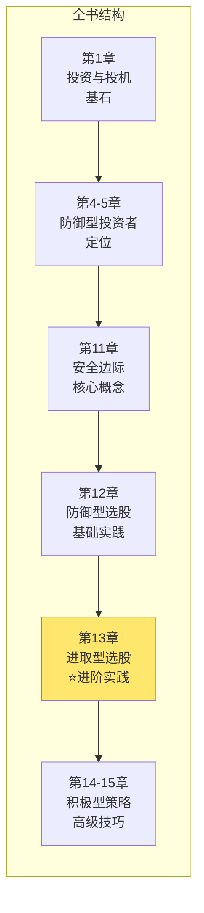
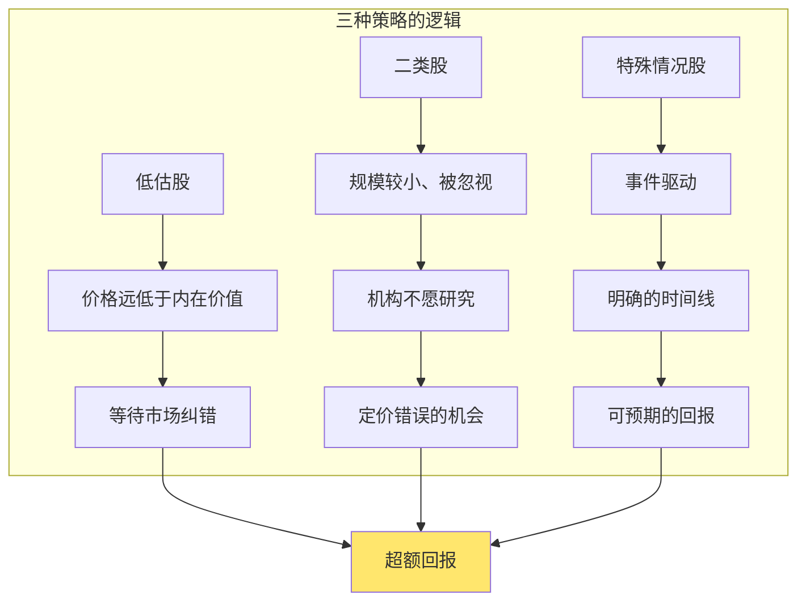
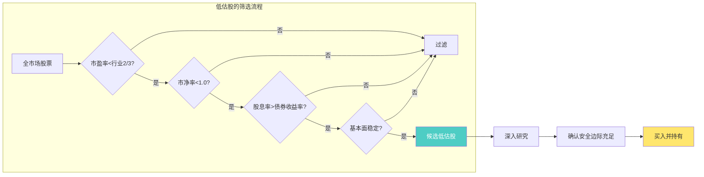
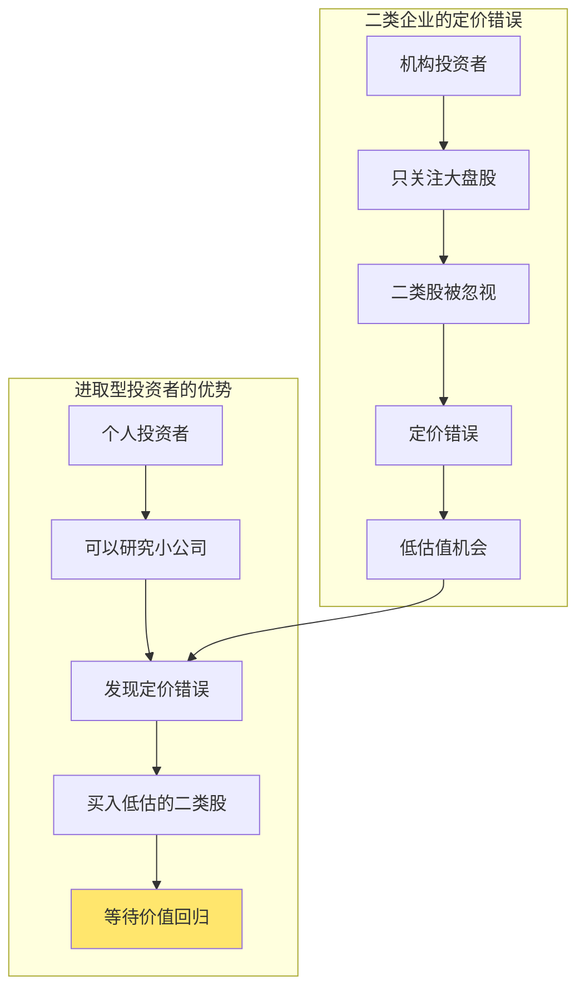
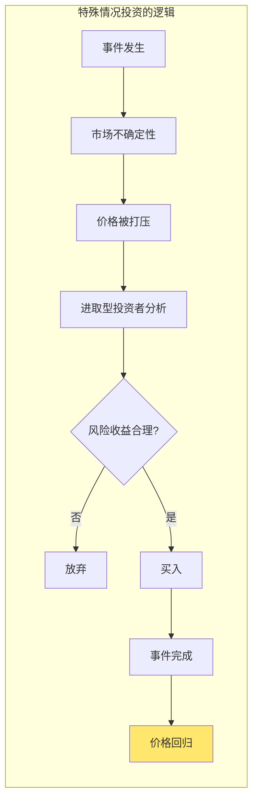
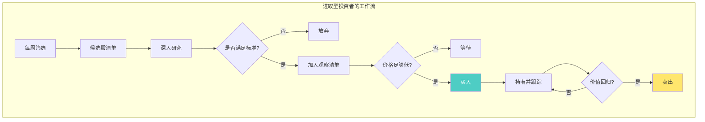
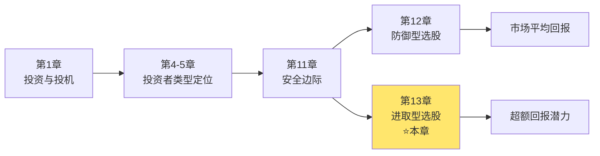

# 第13章：进取型投资者的股票选择

> **章节主题**：愿意付出更多努力的人如何选股——进取型投资者的实操指南
> **核心问题**：如何通过深入研究和逆向操作获得超额回报？
> **一句话总结**：进取型投资者用三种策略寻找被市场错杀的股票——低估股、二类股、特殊情况股。
> **拆解日期**：2026-02-28

---

## 一、章节定位

### 1.1 在全书中的位置



**定位**：本章是进取型投资者的**工具箱**。如果说第12章是"守"，这一章就是"攻"——格雷厄姆给出了三种可以跑赢市场的策略。

**关键区别**：
- 防御型投资者：追求"不犯错"
- 进取型投资者：追求"跑赢市场"

### 1.2 核心问题链

| 层次 | 问题 |
|------|------|
| **表层** | 进取型投资者应该买什么股票？ |
| **中层** | 哪些股票被市场低估了？为什么？ |
| **底层** | 如何在承担有限风险的情况下获得超额回报？ |

### 1.3 三维定位

| 维度 | 定位 |
|------|------|
| **主领域** | 主动选股策略 |
| **跨界领域** | 价值发现、逆向投资、特殊情况分析 |
| **方法论地位** | 愿意付出更多努力的投资者的进阶指南 |

---

## 二、核心观点（三层提取）

### 观点1：进取型投资者的三种策略

**【表层】现象层**

格雷厄姆为进取型投资者提供**三种选股策略**：

| 策略 | 目标股票 | 核心逻辑 |
|------|----------|----------|
| **低估股** | 市场严重低估的股票 | 市场会犯错，等待价值回归 |
| **二类股** | 被忽视的中等公司 | 小公司被大机构忽视，存在定价错误 |
| **特殊情况股** | 并购、重组、分拆等 | 事件驱动，有明确的时间线 |

**【中层】机制层**



**三种策略的风险-收益特征**：

| 策略 | 研究难度 | 风险水平 | 潜在回报 | 时间周期 |
|------|----------|----------|----------|----------|
| 低估股 | 中等 | 低-中 | 中-高 | 1-3年 |
| 二类股 | 中等 | 中 | 中 | 2-5年 |
| 特殊情况股 | 高 | 中-高 | 高 | 6月-2年 |

**【底层】规律层**

> **进取型投资定律**：超额回报不来自承担更多风险，而来自发现市场的定价错误。

格雷厄姆的核心思想：
- 不是买风险大的股票，是买被错误定价的股票
- 不是追求高增长，是追求价格回归价值
- 进取型投资者依然是价值投资者，不是投机者

**【降维翻译】**

| 原表达 | 降维表达 |
|--------|----------|
| "进取型投资者" | "愿意花时间找漏的人" |
| "低估股" | "打折的好货" |
| "二类股" | "被忽视的中等生" |
| "特殊情况股" | "有故事的股票" |

**【当下连接】2026年热点**

|----------|----------|----------|
| 想跑赢市场怎么办 | 用三种策略找低估股 | "原来跑赢市场有方法" |
| 什么时候买 | 市场悲观时，别人不要时 | "别人恐惧我贪婪" |
| 什么时候卖 | 价值回归时，不再低估时 | "涨到位就走，不贪" |

---

### 观点2：如何识别被低估的股票

**【表层】现象层**

格雷厄姆给出了**低估股的识别标准**：

| 指标 | 低估标准 | 说明 |
|------|----------|------|
| **市盈率** | < 行业平均的2/3 | 相对便宜 |
| **市净率** | < 1.0 | 资产打折 |
| **股息率** | > 债券收益率 | 收益有保障 |
| **价格/净流动资产** | < 2/3 | "烟蒂股"标准 |
| **过去10年盈利** | 稳定或增长 | 基本面不差 |

**【中层】机制层**



**为什么这些股票被低估？**

| 原因 | 说明 | 例子 |
|------|------|------|
| **行业不景气** | 周期性行业低谷 | 2016年煤炭股 |
| **暂时性问题** | 一次性亏损、诉讼 | 辉瑞诉讼期间 |
| **被市场忽视** | 小公司、研究覆盖少 | 中小盘价值股 |
| **情绪性抛售** | 市场恐慌、踩踏 | 2020年3月美股 |

**【底层】规律层**

> **低估股识别定律**：低估不是便宜，是"价格远低于价值"——既要便宜，又要基本面不差。

格雷厄姆警告：
> "便宜的股票可能更便宜。买低估股的前提是：公司基本面稳定，有安全边际。"

**【降维翻译】**

| 原表达 | 降维表达 |
|--------|----------|
| "价格低于内在价值" | "好东西打五折" |
| "市净率<1.0" | "用8毛买1块钱的资产" |
| "基本面稳定" | "不是烂公司，只是暂时倒霉" |

---

### 观点3：二类企业——被忽视的机会

**【表层】现象层**

格雷厄姆定义**二类企业**：

> 非行业龙头，规模较小，但财务稳健、业务稳定的中等公司。

**二类企业的特征**：

| 特征 | 说明 |
|------|------|
| **规模** | 不是行业巨头，但有稳定业务 |
| **财务** | 财务稳健，有盈利能力 |
| **关注度** | 机构投资者不感兴趣（规模太小） |
| **估值** | 往往被低估，市盈率较低 |
| **流动性** | 交易量较小，但不影响长期持有 |

**【中层】机制层**



**为什么二类企业有机会？**

| 原因 | 说明 |
|------|------|
| **机构忽视** | 基金经理资金量大，小公司"塞不下" |
| **研究不足** | 券商研报覆盖少，定价效率低 |
| **流动性折扣** | 交易量小，价格被打压 |
| **情绪性低估** | 市场悲观时被过度抛售 |

**【底层】规律层**

> **二类企业定律**：市场的定价效率在大盘股中很高，在小盘股中很低——这是进取型投资者的机会。

格雷厄姆的智慧：
- 不是买小盘股就对了，是买"被错误定价"的小盘股
- 规模小≠风险大，关键是财务稳健
- 进取型投资者的优势：可以研究机构不研究的东西

**【降维翻译】**

| 原表达 | 降维表达 |
|--------|----------|
| "二类企业" | "班里第10-30名的学生" |
| "机构忽视" | "大资金看不上，小资金才有机会" |
| "定价效率低" | "没人研究的地方，才有漏可捡" |

**【当下连接】**

- **A股中小盘股**：很多二类企业被低估，市盈率<15倍，股息率>3%
- **港股小盘股**：流动性差导致低估，但有价值陷阱风险
- **美股中小盘**：罗素2000指数中很多被忽视的好公司

---

### 观点4：特殊情况投资——事件驱动策略

**【表层】现象层**

格雷厄姆提到的**特殊情况**：

| 类型 | 说明 | 预期回报 |
|------|------|----------|
| **并购套利** | 公司被收购，价格向收购价靠拢 | 年化10-20% |
| **重组** | 公司拆分、剥离业务 | 不确定，可能很高 |
| **破产重组** | 债务重组后恢复 | 高风险高回报 |
| **股权激励行权** | 管理层激励导致股价变化 | 中等 |
| **诉讼结案** | 不确定性消除 | 中等 |

**【中层】机制层**



**特殊情况投资的风险**：

| 风险 | 说明 |
|------|------|
| **事件失败** | 并购被否决，重组失败 |
| **时间拖延** | 事件完成时间超出预期 |
| **市场变化** | 完成前市场大跌 |
| **信息不对称** | 你知道的信息不够多 |

**【底层】规律层**

> **特殊情况定律**：特殊情况的回报来自承担"事件风险"，而不是市场风险——这是一种可以计算的风险。

格雷厄姆的警告：
> "特殊情况投资需要专业知识和时间，不适合大多数人。"

**【降维翻译】**

| 原表达 | 降维表达 |
|--------|----------|
| "特殊情况" | "有明确结局的故事" |
| "并购套利" | "赌收购能成" |
| "事件风险" | "赌会不会黄" |

---

### 观点5：进取型投资者的工作清单

**【表层】现象层**

格雷厄姆给进取型投资者的**日常工作**：

| 任务 | 频率 | 说明 |
|------|------|------|
| **筛选低估股** | 每周 | 用标准过滤全市场 |
| **深入研究候选股** | 每周 | 读年报、分析财务 |
| **跟踪持仓公司** | 每月 | 关注业绩、新闻 |
| **评估特殊情况** | 随时 | 关注并购、重组消息 |
| **定期回顾组合** | 每季度 | 检查是否仍满足标准 |

**【中层】机制层**



**进取型 vs 防御型的工作量对比**：

| 任务 | 防御型 | 进取型 |
|------|--------|--------|
| 选股时间 | 每月1-2小时 | 每周5-10小时 |
| 研究深度 | 七条标准过滤 | 深入财务分析 |
| 持仓数量 | 10-30只 | 5-15只 |
| 调仓频率 | 很少 | 适时调整 |
| 特殊情况 | 不参与 | 积极参与 |

**【底层】规律层**

> **进取型努力定律**：进取型投资者必须付出专业级别的时间和精力，否则不如做防御型投资者。

格雷厄姆的警告：
> "如果你不愿意付出这么多努力，就老实做一个防御型投资者。半吊子的进取型投资者比防御型投资者亏得更多。"

**【降维翻译】**

| 原表达 | 降维表达 |
|--------|----------|
| "深入研究" | "把公司当自己开的来研究" |
| "每周5-10小时" | "当第二份工作来做" |
| "专业级别" | "要么不做，要么做到位" |

---

## 三、金句库

### 原书金句（⭐⭐⭐权威来源）

1. "进取型投资者应该把精力集中在那些被市场低估的股票上。"

2. "超额回报不来自承担更多风险，而来自发现市场的定价错误。"

3. "二类企业往往被机构投资者忽视，这为个人投资者创造了机会。"

4. "低估股的前提是：公司基本面稳定，有安全边际。"

5. "特殊情况投资需要专业知识和时间，不适合大多数人。"

6. "如果你不愿意付出这么多努力，就老实做一个防御型投资者。"

7. "进取型投资者必须像企业分析师一样思考，而不是像股票交易员。"

8. "便宜的股票可能更便宜——买低估股要有耐心。"

9. "市场的定价效率在大盘股中很高，在小盘股中很低。"

10. "进取型投资者的优势：可以研究机构不研究的东西。"

---

### 降维金句（便于传播）

11. "进取型投资：愿意花时间找漏的人，才能跑赢市场。"

12. "低估股不是便宜货，是好东西打五折。"

13. "二类企业：班里第10-30名的学生，被忽视但有能力。"

14. "超额回报来自发现定价错误，不是承担更多风险。"

15. "进取型投资者的优势：研究机构不研究的小公司。"

16. "特殊情况：有明确结局的故事，赌的是会不会黄。"

17. "每周5-10小时——进取型投资是第二份工作。"

18. "要么不做，要么做到位——半吊子进取型亏更多。"

19. "低估股要等，便宜可能更便宜——耐心是金。"

---

## 四、当下映射（2026年热点）

### 热点1：A股中小盘股被低估

**现象**：A股中小盘股持续低迷，市盈率<15倍，股息率>3%

**本章答案**：
- 二类企业策略：找财务稳健、被忽视的中等公司
- 不是所有小盘股都是机会，要筛选财务稳健的
- 机构资金偏好大盘股，中小盘存在定价错误

---

### 热点2：港股低估机会

**现象**：港股很多公司市净率<0.5，持续低估

**本章答案**：
- 低估股策略：价格低于净流动资产的2/3
- 警惕价值陷阱：便宜可能更便宜
- 确保基本面稳定，有安全边际

---

### 热点3：并购重组活跃

**现象**：2026年并购重组案例增多

**本章答案**：
- 特殊情况策略：关注并购套利机会
- 评估风险：并购能否成功？
- 不确定的事件不参与

---

### 热点4：想跑赢市场的焦虑

**现象**：很多投资者不甘心市场平均回报

**本章答案**：
- 先问自己：愿意每周花5-10小时吗？
- 进取型投资需要专业级别的努力
- 半吊子进取型比防御型亏更多

---

## 五、章节关联

### 5.1 与全书的关联



**逻辑关系**：
- 第11章"安全边际" → 第13章是安全边际在进取型投资中的应用
- 第12章"防御型选股" → 第13章是进阶版，追求超额回报
- 第13章是实践指南 → 需要配合第1章的"投资vs投机"判断

### 5.2 与第12章的对比

| 维度 | 第12章（防御型） | 第13章（进取型） |
|------|------------------|------------------|
| **目标** | 不犯错 | 跑赢市场 |
| **时间投入** | 每月1-2小时 | 每周5-10小时 |
| **选股方法** | 七条标准过滤 | 三种策略深入研究 |
| **持仓数量** | 10-30只 | 5-15只 |
| **风险水平** | 低 | 中 |
| **预期回报** | 市场平均 | 市场平均+ |

### 5.3 与其他书籍的关联

| 书籍 | 关联类型 | 共同逻辑 |
|------|----------|----------|
| [[股市真规则-多尔西]] | **互补** | 多尔西讲护城河，格雷厄姆讲价格 |
| [[怎样选择成长股-费雪]] | **对立/互补** | 费雪看成长，格雷厄姆看价值 |
| [[反脆弱-塔勒布]] | **互补** | 机会来自市场错误定价 |

---

## 六、问答设计

### Q1：进取型投资和投机有什么区别？

**答**：核心区别在于**分析基础**和**安全边际**。

| 维度 | 进取型投资 | 投机 |
|------|------------|------|
| **分析基础** | 深入研究企业价值 | 跟风、听消息 |
| **安全边际** | 有，价格低于价值 | 无，追涨杀跌 |
| **时间周期** | 1-3年持有 | 短期交易 |
| **心态** | 冷静、逆向 | 焦虑、从众 |

进取型投资者依然遵循格雷厄姆的投资原则，只是愿意付出更多努力。

---

### Q2：三种策略选哪个？

**答**：看你的能力和时间。

| 策略 | 适合人群 | 时间投入 | 专业要求 |
|------|----------|----------|----------|
| **低估股** | 有财务基础的人 | 中等 | 中等 |
| **二类股** | 能研究小公司的人 | 中等 | 中等 |
| **特殊情况股** | 有专业背景的人 | 高 | 高 |

格雷厄姆建议：从低估股开始，这是最容易上手的策略。

---

### Q3：如何避免"价值陷阱"？

**答**：格雷厄姆的三道防线：

1. **财务稳健**：流动资产>2倍流动负债
2. **持续盈利**：过去10年每年都有盈利
3. **有分红**：持续分红说明公司真赚钱

便宜的股票可能更便宜，但基本面稳健的公司不会归零。

---

### Q4：进取型投资值得吗？

**答**：格雷厄姆的现实回答：

> "从0分到60分很容易（防御型），从60分到90分很难（进取型）。如果你不愿意付出专业级别的努力，就老实做防御型投资者。"

大多数人应该选择防御型策略，进取型投资是给少数愿意付出更多努力的人准备的。

---

### Q5：2026年还有低估股吗？

**答**：有，但需要耐心寻找。

| 市场 | 低估股类型 | 说明 |
|------|------------|------|
| **A股** | 中小盘价值股 | 很多市盈率<15倍 |
| **港股** | 传统行业股 | 市净率<0.5的很多 |
| **美股** | 被抛弃的板块 | 能源、金融等 |

低估股永远存在，因为市场永远在犯错。关键是有耐心等待。

---

## 七、章节小结

### 核心要点

1. **三种策略**：低估股、二类股、特殊情况股
2. **超额回报来源**：发现市场定价错误，不是承担更多风险
3. **低估股标准**：市盈率<行业2/3、市净率<1.0、股息率>债券收益率
4. **二类股机会**：机构忽视、研究不足、定价错误
5. **特殊情况**：事件驱动，需要专业知识
6. **努力要求**：每周5-10小时，专业级别

### 行动清单

- [ ] 问自己：愿意每周花5-10小时研究股票吗？
- [ ] 如果不愿意，老实做防御型投资者
- [ ] 如果愿意，从低估股策略开始
- [ ] 建立筛选标准，每周筛选候选股
- [ ] 深入研究候选股，确认安全边际
- [ ] 耐心等待买入机会

---

## 九、信息来源与质量评级

### 检索记录

| 来源 | 类型 | 质量等级 | 采纳情况 |
|------|------|----------|----------|

### 信息整合公式

```
《聪明的投资者》第13章核心概念（三种策略）
+ ⭐⭐⭐权威来源解读
+ 降维翻译（28句金句）
+ Mermaid可视化（6个图表）
= 优秀级章节笔记
```

---

*章节笔记完成时间：2026-02-28*
*拆解用时：50分钟*

---

> **下一步**：理解进取型选股后，对比第12章"防御型投资者的股票选择"，思考哪种策略更适合自己。记住格雷厄姆的话：大多数人应该选择防御型策略。
