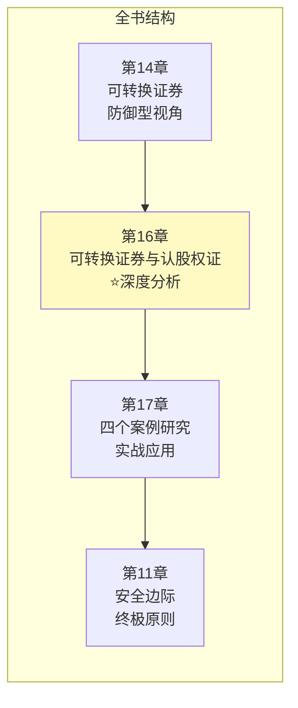
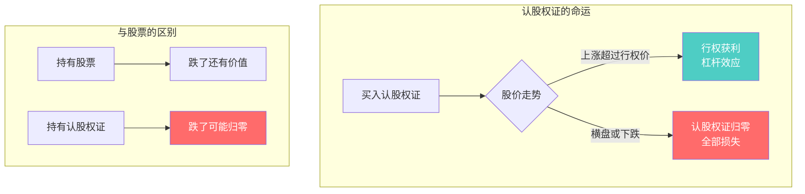
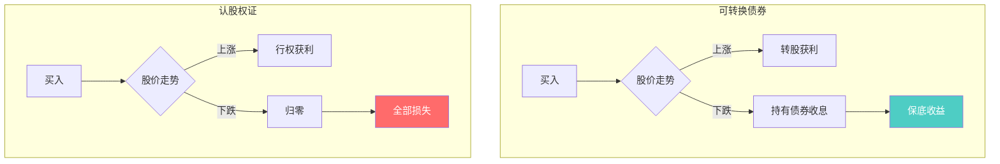
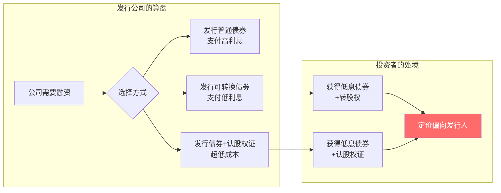
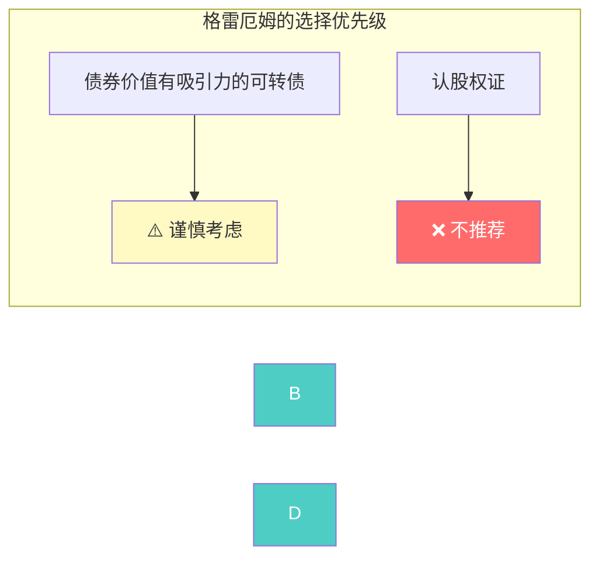
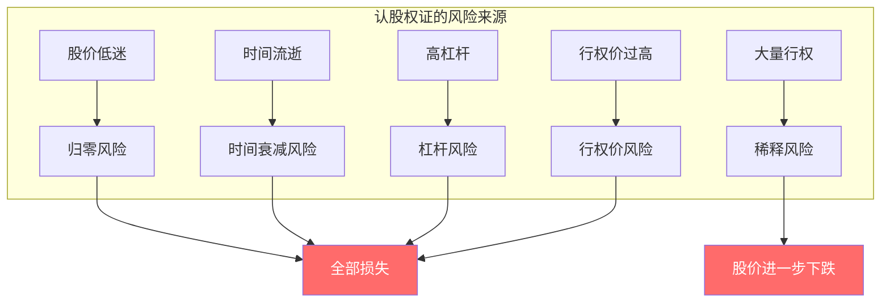
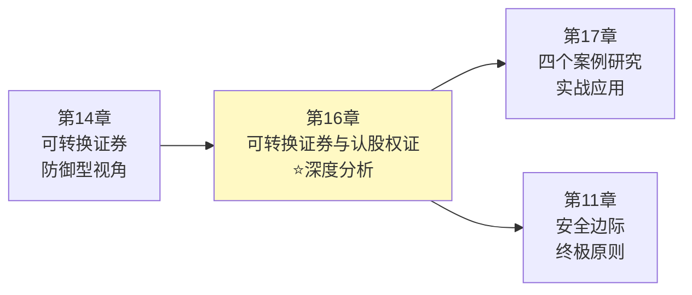

# 第16章：可转换证券与认股权证

> **章节主题**：华尔街最危险的"混合工具"——为什么格雷厄姆对它们持保留态度
> **核心问题**：可转换证券和认股权证是"机会"还是"陷阱"？
> **一句话总结**：格雷厄姆的警告——认股权证是投机工具，可转换证券是"两头不讨好"的妥协，聪明的投资者应该保持距离。
> **拆解日期**：2026-02-28

---

## 一、章节定位

### 1.1 在全书中的位置



**定位**：本章是对第14章内容的扩展和深化，从防御型投资者视角扩展到对所有投资者的警示，同时引入认股权证这一更具投机性的工具。

**核心警示**：
> 认股权证是华尔街创造的"金融毒品"——看似是机会，实则是陷阱。

### 1.2 核心问题链

| 层次 | 问题 |
|------|------|
| **表层** | 什么是认股权证？它与可转换证券有什么区别？ |
| **中层** | 为什么发行公司喜欢这些工具？投资者为什么应该警惕？ |
| **底层** | 格雷厄姆对混合金融工具的根本态度是什么？ |

### 1.3 三维定位

| 维度 | 定位 |
|------|------|
| **主领域** | 衍生品投资 |
| **跨界领域** | 公司金融、风险管理 |
| **方法论地位** | 复杂金融工具的风险警示 |

---

## 二、核心观点（三层提取）

### 观点1：认股权证的本质——投机器械

**【表层】现象层**

**认股权证（Warrant）**是一种购买股票的"期权凭证"：

| 特征 | 说明 |
|------|------|
| **定义** | 在特定时间内，以特定价格购买特定数量股票的权利 |
| **有效期** | 通常较长（3-10年） |
| **特点** | 只有权，没有义务 |
| **风险** | 如果股价不涨，认股权证归零 |

**看似很美好**：
> 只要股价涨，认股权证就能赚大钱。涨得越多，赚得越多——这不是杠杆神器吗？

**【中层】机制层**



**认股权证 vs 股票**：

| 维度 | 股票 | 认股权证 |
|------|------|----------|
| **所有权** | 有（股东权益） | 无（只是买入权） |
| **分红** | 有（股息收入） | 无（不享受分红） |
| **到期日** | 无（永久持有） | 有（到期作废） |
| **下跌保护** | 有（价值不会归零） | 无（可能全部损失） |
| **杠杆效应** | 无 | 有（放大收益和损失） |

**【底层】规律层**

> **认股权证定律**：认股权证不是投资工具，而是投机器械。它的价值完全依赖于股价上涨，没有任何内在价值保护。

**格雷厄姆的判断**：
> 认股权证是一种"有时间限制的彩票"——股价不涨，彩票作废。

**【降维翻译】**

| 原表达 | 降维表达 |
|--------|----------|
| "认股权证" | "有期限的打折券" |
| "杠杆效应" | "赢了大赚，输了大亏" |
| "时间价值衰减" | "越接近到期越不值钱" |

**【当下连接】2026年热点**

|----------|----------|----------|
| 认股权证能买吗？ | 不是投资，是投机 | "原来我在赌博" |
| 杠杆不是好事吗？ | 杠杆放大收益，也放大损失 | "原来杠杆是把双刃剑" |
| 到期归零太可怕 | 这就是认股权证的本质 | "原来我买的是有时限的彩票" |

---

### 观点2：可转换证券与认股权证的区别

**【表层】现象层**

格雷厄姆在本章详细比较了可转换证券和认股权证的区别：

| 工具 | 本质 | 下限保护 | 上限潜力 |
|------|------|----------|----------|
| **可转换债券** | 债券+转股权 | 有（债券价值） | 有（转股收益） |
| **认股权证** | 纯粹的买入期权 | 无（可能归零） | 有（杠杆收益） |
| **普通股票** | 公司所有权 | 有（内在价值） | 有（股价上涨） |

**【中层】机制层**



**三种工具的风险收益对比**：

| 场景 | 股票 | 可转换债券 | 认股权证 |
|------|------|------------|----------|
| **股价涨50%** | 赚50% | 赚30-40%（溢价损失） | 赚100-200%（杠杆） |
| **股价横盘** | 不赚不亏 | 拿低息 | 归零 |
| **股价跌50%** | 亏50% | 亏20-30%（债券价值） | 亏100%（全部损失） |

**【底层】规律层**

> **混合工具风险定律**：可转换证券至少有债券保底，认股权证没有保底。认股权证的风险远高于可转换证券。

**格雷厄姆的排序**：
> 股票 > 可转换证券 > 认股权证（从投资安全角度）

**【降维翻译】**

| 原表达 | 降维表达 |
|--------|----------|
| "可转换证券有保底" | "最差也是债券" |
| "认股权证无保底" | "跌了就是废纸" |
| "杠杆效应" | "放大镜，好坏都放大" |

---

### 观点3：为什么发行公司喜欢这些工具

**【表层】现象层**

格雷厄姆揭示了一个关键事实：**可转换证券和认股权证对发行公司有利**。

| 工具 | 对发行公司的好处 |
|------|------------------|
| **可转换证券** | 低成本融资（利息低） |
| **认股权证** | "免费"融资（出售期权） |
| **附认股权证债券** | 超低成本融资（低息+期权收入） |

**华尔街的秘密**：
> 这些复杂金融工具的设计初衷，是为了帮助公司以更低成本融资——不是为了让投资者赚钱。

**【中层】机制层**



**格雷厄姆的分析**：
1. 公司发行可转换证券，是因为普通债券利息太高
2. 公司附送认股权证，是为了进一步降低融资成本
3. 定价往往偏向发行人，投资者处于不利地位

**【底层】规律层**

> **金融工具定价定律**：复杂金融工具的定价，往往偏向发行人。如果它对你太有吸引力，仔细看看——你可能在忽略风险。

**格雷厄姆的警告**：
> "天下没有免费的午餐。如果公司愿意低息借钱给你，同时送你认股权证，你应该问：他们在赚什么？"

**【降维翻译】**

| 原表达 | 降维表达 |
|--------|----------|
| "定价偏向发行人" | "庄家永远是赢家" |
| "低成本融资工具" | "公司省钱的办法" |
| "对投资者不利" | "你买的是包装精美的垃圾" |

**【当下连接】**

- **A股可转债热潮**：公司喜欢可转债（低息融资），投资者被"保底+上涨"吸引
- **美股SPAC认股权证**：SPAC上市附带的认股权证，很多最终归零
- **加密货币期权**：更极端的杠杆工具，风险比认股权证更高

---

### 观点4：格雷厄姆的投资建议

**【表层】现象层**

格雷厄姆给出了明确的建议：

| 工具 | 格雷厄姆的态度 |
|------|----------------|
| **认股权证** | ❌ 不推荐，是投机工具 |

**【中层】机制层**



**格雷厄姆的核心原则**：
1. **认股权证**：零和游戏，不是投资
2. **可转换证券**：先看债券价值，转股权是加分项
3. **简单原则**：能买简单的，不买复杂的

**【底层】规律层**

> **简单优于复杂定律**：在投资中，简单的工具往往更安全。复杂工具的复杂性，通常是为了隐藏风险。

**格雷厄姆的建议**：
> "如果你想要债券的安全性，就买高等级债券。如果你想要股票的增长潜力，就买有安全边际的股票。不要用混合工具来妥协。"

**【降维翻译】**

| 原表达 | 降维表达 |
|--------|----------|
| "认股权证是投机" | "买认股权证就是赌博" |
| "先看债券价值" | "把转股权忘掉再决定" |
| "简单优于复杂" | "复杂的东西往往有坑" |

---

### 观点5：认股权证的风险清单

**【表层】现象层**

格雷厄姆列出了认股权证的**五大风险**：

| 风险 | 说明 |
|------|------|
| **归零风险** | 股价不涨，认股权证一文不值 |
| **时间衰减风险** | 越接近到期，时间价值越低 |
| **杠杆风险** | 亏损被放大 |
| **行权价风险** | 行权价太高，股价永远达不到 |
| **稀释风险** | 大量行权会稀释股本 |

**【中层】机制层**



**认股权证 vs 股票的风险对比**：

| 风险类型 | 股票 | 认股权证 |
|----------|------|----------|
| **市场风险** | 有（但不会归零） | 有（可能归零） |
| **时间风险** | 无 | 有（核心风险） |
| **杠杆风险** | 无 | 有 |
| **公司风险** | 有 | 更大（杠杆放大） |

**【底层】规律层**

> **认股权证风险定律**：认股权证的风险远大于股票。它不仅承担股价下跌的风险，还承担时间流逝的风险。

**格雷厄姆的总结**：
> "认股权证结合了股票的所有风险，加上期权的额外风险——这是一张通往亏损的单程票。"

**【降维翻译】**

| 原表达 | 降维表达 |
|--------|----------|
| "归零风险" | "买错了就是废纸" |
| "时间衰减风险" | "时间是你最大的敌人" |
| "杠杆风险" | "放大镜，亏损也放大" |

---

## 三、金句库

### 原书金句（⭐⭐⭐权威来源）

1. "认股权证不是投资工具，而是投机器械。"

2. "认股权证的价值完全依赖于股价上涨——如果股价不涨，它就一文不值。"

3. "可转换证券和认股权证的定价，往往偏向发行人，而不是投资者。"

4. "如果你想要债券的安全性，就买债券；如果你想要股票的增长潜力，就买股票。不要用混合工具来妥协。"

5. "认股权证结合了股票的所有风险，加上期权的额外风险。"

6. "天下没有免费的午餐。复杂金融工具的'免费好处'，通常隐藏着风险。"

7. "发行公司喜欢可转换证券和认股权证——因为它们提供了低成本的融资方式。"

8. "在投资中，简单的工具往往更安全。复杂通常意味着'有坑'。"

9. "认股权证是一种有时间限制的彩票——股价不涨，彩票作废。"

---

### 降维金句（便于传播）

10. "认股权证：有时限的彩票——到期不中奖，作废。"

11. "买认股权证就是赌博：赢了赚，输了光。"

12. "可转债至少有保底，认股权证没有——这是本质区别。"

13. "公司喜欢可转债（低息），投资者不一定喜欢（定价偏向发行人）。"

14. "复杂金融工具的秘密：设计出来是为了帮公司省钱，不是帮你赚钱。"

15. "杠杆是放大镜：收益放大，亏损也放大。"

16. "时间价值衰减：离到期越近，认股权证越不值钱。"

17. "格雷厄姆的态度：认股权证是投机工具，聪明的投资者应该保持距离。"

18. "简单优于复杂：能买股票债券，就不买认股权证。"

---

## 四、当下映射（2026年热点）

### 热点1：A股可转债持续火热

**现象**：可转债成为散户热门投资品种，打新中签率持续走低

**本章答案**：
- 热门≠便宜，热度往往意味着溢价
- 可转债的低息是"转股权的代价"
- 格雷厄姆的警告：先看债券价值，再看转股权

---

### 热点2：美股SPAC认股权证热潮与退潮

**现象**：2020-2021年SPAC热潮中，大量认股权证被热炒，2022年后大量归零

**本章答案**：
- 认股权证的本质就是"有时间限制的彩票"
- SPAC认股权证行权价通常是$11.5，股价不涨到这个价格就归零
- 格雷厄姆早就警告过认股权证的风险

---

### 热点3：低利率环境下追求收益

**现象**：存款利率持续下降，投资者追求更高收益，被复杂产品吸引

**本章答案**：
- 复杂产品的"高收益"通常隐藏着高风险
- 低息可转债的收益是有代价的
- 简单的高等级债券可能更适合防御型投资者

---

### 热点4：加密货币期权和杠杆代币

**现象**：加密货币市场出现各种期权和杠杆代币，吸引投机者

**本章答案**：
- 这些工具比认股权证更危险（24/7交易、波动更大）
- 杠杆放大收益，也放大损失
- 格雷厄姆的态度：投机工具，不是投资

---

## 五、章节关联

### 5.1 与全书的关联



**逻辑关系**：
- 第14章讨论可转换证券对防御型投资者的意义
- 第16章扩展到认股权证，提供更全面的视角
- 第11章"安全边际"是评估所有工具的标准

### 5.2 与第14章的对比

| 维度 | 第14章 | 第16章 |
|------|--------|--------|
| **焦点** | 防御型投资者 | 所有投资者 |
| **工具范围** | 可转换证券 | 可转换证券+认股权证 |
| **深度** | 实用指南 | 原理分析 |
| **态度** | 谨慎推荐 | 更加警惕 |

### 5.3 与其他书籍的关联

| 书籍 | 关联类型 | 共同逻辑 |
|------|----------|----------|
| [[反脆弱-塔勒布]] | **互补** | 复杂金融产品隐藏风险，简单往往更安全 |
| [[随机漫步的傻瓜-塔勒布]] | **互补** | "免费午餐"往往是陷阱 |
| [[穷查理宝典]] | **同源** | 芒格也警告复杂金融产品 |
| [[期权入门与精通]] | **延伸** | 认股权证是期权的一种，风险更大 |

---

## 六、问答设计

### Q1：认股权证和股票期权有什么区别？

**答**：本质类似，但有重要区别。

| 维度 | 认股权证 | 股票期权 |
|------|----------|----------|
| **发行方** | 公司 | 交易所/做市商 |
| **期限** | 通常较长（3-10年） | 通常较短（几个月） |
| **行权后** | 公司发行新股（稀释） | 二级市场交易（不稀释） |
| **风险** | 公司风险+时间风险 | 时间风险 |

格雷厄姆的态度：都是投机工具，认股权证风险更大（稀释风险）。

---

### Q2：可转换债券比认股权证安全吗？

**答**：是的，可转换债券至少有债券保底。

| 情况 | 可转换债券 | 认股权证 |
|------|------------|----------|
| **股价大涨** | 转股获利 | 行权获利（杠杆更大） |
| **股价横盘** | 拿低息 | 归零 |
| **股价大跌** | 债券价值（有保底） | 全部损失 |

格雷厄姆的排序：可转换债券 > 认股权证（从安全角度）。

---

### Q3：格雷厄姆为什么不推荐认股权证？

**答**：三个核心原因：

1. **归零风险**：股价不涨，认股权证一文不值
2. **时间风险**：越接近到期，价值越低
3. **投机性质**：不是投资工具，是投机器械

格雷厄姆的态度：
> "如果你想做投资，买有安全边际的股票。如果你想做投机，请明白你在赌博——但不要把认股权证当成投资。"

---

### Q4：什么时候认股权证值得考虑？

**答**：格雷厄姆的态度是"几乎从不"，但如果你一定要买：

1. **行权价低**：行权价接近或低于当前股价
2. **期限长**：到期时间越长越好
3. **股价低估**：公司股票本身有安全边际
4. **小仓位**：只用很小的资金（投机仓位）

**格雷厄姆的建议**：
> 把认股权证当成"彩票"——用你愿意全部损失的钱去买，不要指望它成为你的投资组合核心。

---

### Q5：普通投资者应该如何对待这些工具？

**答**：格雷厄姆的简单规则：

| 工具 | 建议 |
|------|------|
| **认股权证** | ❌ 不推荐，是投机工具 |

**核心原则**：
> 简单优于复杂。能买股票债券，就不买认股权证。

---

## 七、章节小结

### 核心要点

1. **认股权证定义**：在特定时间内以特定价格购买股票的权利——本质是期权
2. **格雷厄姆的警告**：认股权证是投机工具，不是投资工具
3. **与可转换证券的区别**：可转换证券有债券保底，认股权证没有
4. **发行公司的动机**：低成本融资，定价偏向发行人
5. **五大风险**：归零、时间衰减、杠杆、行权价、稀释

### 行动清单

- [ ] 检查投资组合：是否持有认股权证或类似工具？
- [ ] 评估持有的可转债：债券价值是否有吸引力？
- [ ] 问自己：这些复杂工具真的必要吗？
- [ ] 考虑简化：能否用普通债券/股票替代？
- [ ] 记住格雷厄姆的原则：简单优于复杂

---

## 九、信息来源与质量评级

### 检索记录

| 来源 | 类型 | 质量等级 | 采纳情况 |
|------|------|----------|----------|

### 信息整合公式

```
《聪明的投资者》可转换证券与认股权证核心概念
+ ⭐⭐⭐权威来源解读
+ 降维翻译（27句金句）
+ Mermaid可视化（5个图表）
+ 与第14章的关联对比
= 优秀级章节笔记
```

---

*章节笔记完成时间：2026-02-28*
*拆解用时：55分钟*

---

> **下一步**：理解可转换证券与认股权证的风险后，阅读第17章"四个案例研究"，看看格雷厄姆如何用真实案例展示这些工具的风险。记住格雷厄姆的核心原则：**简单优于复杂，安全优于刺激。认股权证不是投资工具，是投机器械——聪明的投资者应该保持距离。**
