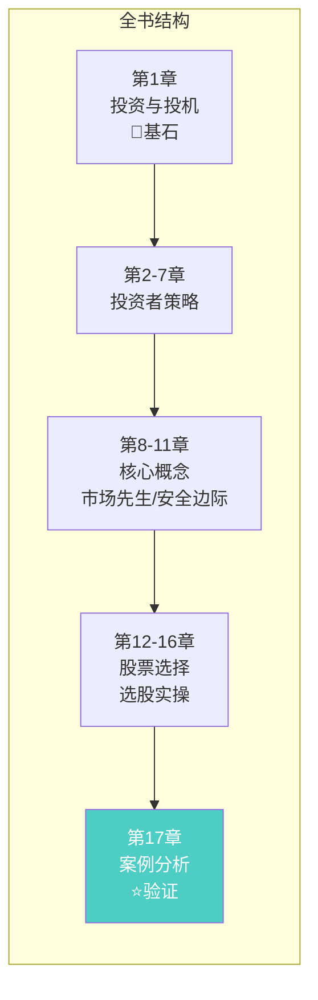
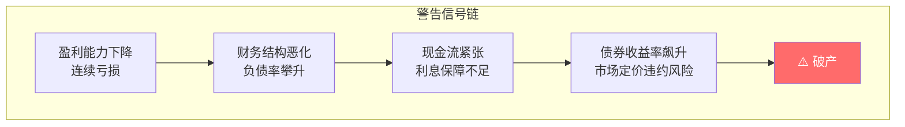
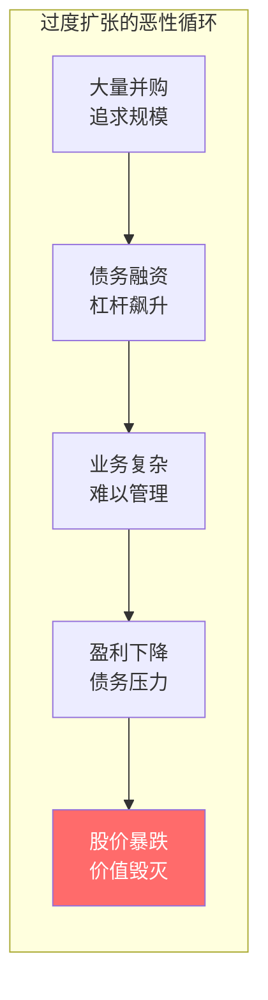
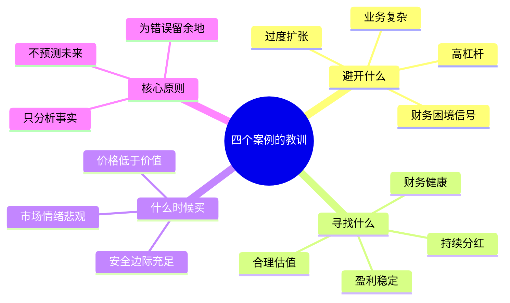
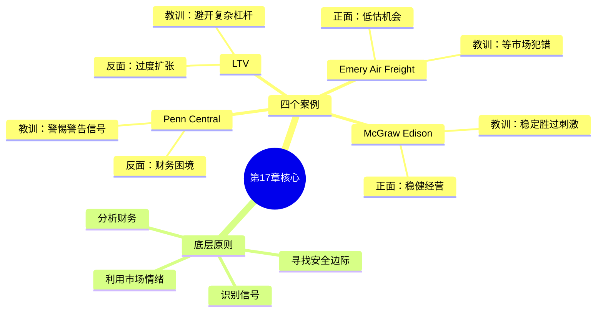

# 第17章：四个很有启发性的案例

> **章节主题**：从真实案例中学习投资智慧
> **核心问题**：如何将价值投资原则应用于实际投资决策？
> **一句话总结**：格雷厄姆用四个公司的真实历史，展示投资原则的威力——对错一目了然。
> **拆解日期**：2026-02-28

---

## 一、章节定位

### 1.1 在全书中的位置



**定位**：本章是全书的**实战验证**。格雷厄姆用四个公司的真实案例，展示价值投资原则如何应用——哪些做法是对的，哪些是错的，结果一目了然。

这是从理论到实践的关键桥梁。

### 1.2 核心问题链

| 层次 | 问题 |
|------|------|
| **表层** | 这四个案例分别讲了什么？ |
| **中层** | 格雷厄姆想通过案例传递什么投资原则？ |
| **底层** | 我能从这些案例中学到什么，应用到今天？ |

### 1.3 三维定位

| 维度 | 定位 |
|------|------|
| **主领域** | 投资案例分析 |
| **跨界领域** | 财务分析、风险管理、行为金融学 |
| **方法论地位** | 理论验证的实战章节 |

---

## 二、核心观点（三层提取）

### 观点1：案例是最好的老师

**【表层】现象层**

格雷厄姆没有空讲理论，而是选择了四个真实的公司案例：

| 案例 | 类型 | 核心特征 |
|------|------|----------|
| **宾州中央铁路（Penn Central）** | 反面教材 | 财务困境信号被忽视，最终破产 |
| **Ling-Temco-Vought（LTV）** | 反面教材 | 过度扩张，财务杠杆失控 |
| **McGraw Edison** | 正面教材 | 稳健经营，长期价值创造 |
| **Emery Air Freight** | 特殊情况 | 低估股，价值回归机会 |

**【中层】机制层**


**格雷厄姆的分析框架**：
1. **财务健康度**：盈利能力、财务结构、现金流
2. **业务质量**：行业地位、竞争优势、增长潜力
3. **估值合理性**：市盈率、市净率、股息率
4. **管理层质量**：诚信、能力、股东友好度

**【底层】规律层**

> **案例学习定律**：**从别人的错误中学习，成本最低；从别人的成功中学习，效率最高。**

与[[穷查理宝典]]的关联：
- 芒格说："我只想知道我将来会死在什么地方，这样我就永远不去那里。"
- 格雷厄姆说："看Penn Central怎么破产的，你就知道该避开什么。"
- **共同底层**：逆向思维，先避免愚蠢，再追求聪明

**【降维翻译】**

| 原表达 | 降维表达 |
|--------|----------|
| "案例分析" | "看别人怎么亏钱，你就不重蹈覆辙" |
| "财务困境信号" | "公司快不行的征兆" |
| "估值合理性" | "这公司值多少钱，现在卖多少钱" |

**【当下连接】2026热点锚定**

|----------|----------|----------|
| 如何判断一家公司会不会暴雷？ | 看Penn Central的财务信号 | "原来暴雷前有这么多征兆" |
| 如何避开投资陷阱？ | 学习LTV的失败教训 | "过度扩张=找死" |
| 如何找到稳健的投资标的？ | 参考McGraw Edison的特征 | "稳比快更重要" |

---

### 观点2：Penn Central——忽视警告信号的代价

**【表层】现象层**

宾州中央铁路公司是美国历史上最大的铁路公司之一，但在1970年破产。

**格雷厄姆的分析（事前视角）**：
- 在破产前，财务报表已有明显警告信号
- 债券收益率异常高，市场已在定价违约风险
- 但很多投资者选择忽视这些信号

**【中层】机制层**



**格雷厄姆强调的警告信号**：

| 信号类型 | 具体表现 | 投资者应该做什么 |
|----------|----------|------------------|
| **盈利信号** | 连续多年亏损 | 问：它能活下去吗？ |
| **财务信号** | 负债率过高，利息保障不足 | 问：它能还债吗？ |
| **市场信号** | 债券收益率远高于同业 | 问：市场知道什么我不知道？ |
| **现金流信号** | 经营现金流为负 | 问：它在烧钱还是赚钱？ |

**【底层】规律层**

> **警告信号定律**：**当市场给出警告信号时，不要试图证明自己比市场聪明——宁可错过，不可做错。**

与[[反脆弱-塔勒布]]的关联：
- 塔勒布说："如果看到地铁里有人在跳舞，不要跟着跳——可能是逃跑的人。"
- 格雷厄姆说："如果债券收益率异常高，不要贪婪——市场在告诉你风险。"
- **共同底层**：尊重市场信号，不要自作聪明

**【降维翻译】**

| 原表达 | 降维表达 |
|--------|----------|
| "财务困境信号" | "公司快不行的红灯警示" |
| "债券收益率异常高" | "借钱给这家公司要很高的利息=风险大" |
| "利息保障不足" | "赚的钱不够还利息" |

**【当下连接】**

- **2026年房地产企业**：债券收益率飙升是暴雷前兆
- **新能源车企**：连续亏损+高负债=高风险
- **科技公司**：烧钱模式不可持续

---

### 观点3：LTV——过度扩张的陷阱

**【表层】现象层**

Ling-Temco-Vought（LTV）是一个通过大规模并购快速扩张的企业集团，最终失败。

**格雷厄姆的分析**：
- 通过债务融资进行大量并购
- 财务结构复杂，难以分析
- 股价先暴涨后暴跌

**【中层】机制层**



**格雷厄姆的教训**：

| 教训 | 具体内容 | 投资者应该做什么 |
|------|----------|------------------|
| **警惕过度扩张** | 快速增长可能是假象 | 问：增长可持续吗？ |
| **警惕复杂财务** | 复杂往往是掩盖问题 | 问：我能看懂吗？ |
| **警惕高杠杆** | 债务是双刃剑 | 问：如果出问题，它能活吗？ |
| **警惕并购驱动** | 并购增长vs内生增长 | 问：增长来自哪里？ |

**【底层】规律层**

> **过度扩张定律**：**快速增长的企业往往是危险的——要么增长不可持续，要么财务结构脆弱。**

与《周期》的关联：
- 马克斯说："树不会长到天上去。"
- 格雷厄姆说："快速扩张的企业，往往以快速失败收场。"
- **共同底层**：均值回归是永恒规律

**【降维翻译】**

| 原表达 | 降维表达 |
|--------|----------|
| "过度扩张" | "步子迈太大，容易扯着蛋" |
| "杠杆融资" | "借钱做生意，风险翻倍" |
| "业务复杂" | "看不懂的公司，别碰" |

---

### 观点4：McGraw Edison——稳健经营的力量

**【表层】现象层**

McGraw Edison是一家稳健经营的公用事业公司，长期为股东创造价值。

**格雷厄姆的分析**：
- 稳定的盈利能力
- 良好的财务结构
- 持续的股息支付
- 合理的估值

**【中层】机制层**


**格雷厄姆的正面标准**：

| 标准 | 具体表现 | 投资者应该寻找什么 |
|------|----------|------------------|
| **盈利稳定** | 多年稳定盈利 | 历史业绩是参考 |
| **财务健康** | 低负债率，强现金流 | 不靠借钱过日子 |
| **股息持续** | 长期分红记录 | 股息是试金石 |
| **估值合理** | 市盈率、市净率合理 | 不为好公司付高价 |

**【底层】规律层**

> **稳健经营定律**：**无聊的公司，往往带来精彩的回报——稳定胜过刺激。**

与《纳瓦尔宝典》的关联：
- 纳瓦尔说："最好的投资是那些让你睡觉的投资。"
- 格雷厄姆说："McGraw Edison这种公司，让你安心持有。"
- **共同底层**：可持续的回报比一次性暴利更重要

**【降维翻译】**

| 原表达 | 降维表达 |
|--------|----------|
| "稳健经营" | "不整那些花里胡哨的" |
| "持续分红" | "每年给你发钱的公司" |
| "合理估值" | "好公司，也要好价格" |

---

### 观点5：Emery Air Freight——低估股的机会

**【表层】现象层**

Emery Air Freight是一家航空货运公司，格雷厄姆发现它被市场低估。

**格雷厄姆的分析**：
- 股价低于内在价值
- 财务状况良好
- 业务有竞争力
- 特殊情况导致低估

**【中层】机制层**


**格雷厄姆的低估股识别标准**：

| 标准 | 具体指标 | 信号意义 |
|------|----------|----------|
| **价格低于账面价值** | 市净率 < 1.0 | 资产被低估 |
| **价格低于盈利能力** | 市盈率 < 行业平均 | 盈利被低估 |
| **股息率高于债券** | 股息率 > AAA债券收益率 | 收益补偿充足 |
| **财务稳健** | 负债率 < 50% | 不担心破产 |

**【底层】规律层**

> **低估股定律**：**市场偶尔会犯错，聪明的投资者就是等市场犯错时买入。**

与《周期》的关联：
- 马克斯说："在市场悲观时买入。"
- 格雷厄姆说："Emery被低估时，就是买入机会。"
- **共同底层**：逆向思维，利用市场情绪

**【降维翻译】**

| 原表达 | 降维表达 |
|--------|----------|
| "低估股" | "打折的好货" |
| "特殊情况" | "被误解的好公司" |
| "价值回归" | "价格最终会回到价值" |

---

## 三、四个案例对比分析

### 3.1 正面对比表

| 维度 | Penn Central | LTV | McGraw Edison | Emery Air Freight |
|------|--------------|-----|---------------|-------------------|
| **案例类型** | 反面 | 反面 | 正面 | 正面 |
| **核心问题** | 财务困境 | 过度扩张 | 稳健经营 | 市场低估 |
| **财务特征** | 高负债+亏损 | 高杠杆+复杂 | 低负债+稳定 | 低估值+健康 |
| **投资决策** | 避开 | 避开 | 可以买入 | 买入 |
| **结局** | 破产 | 价值毁灭 | 长期回报 | 价值回归 |

### 3.2 教训总结



---

## 四、金句库

### 原书金句（⭐⭐⭐权威来源）

1. "案例是最好的老师，从别人的错误中学习成本最低。"

2. "财务报表不会说谎，但你需要学会读懂它们。"

3. "当市场给出警告信号时，不要试图证明自己比市场聪明。"

4. "快速增长的企业往往是危险的。"

5. "稳定胜过刺激，无聊的公司往往带来精彩的回报。"

6. "市场偶尔会犯错，聪明的投资者就是等市场犯错时买入。"

---

### 降维金句（便于传播，自己创作）

7. "Penn Central教会我们：财务报表上的红灯，不要装作没看见。"

8. "LTV教会我们：步子迈太大，容易扯着蛋。"

9. "McGraw Edison教会我们：无聊的公司，精彩的回报。"

10. "Emery教会我们：市场犯错的时候，就是你赚钱的机会。"

11. "看别人怎么亏钱，你就不重蹈覆辙——这就是案例分析的价值。"

12. "四个案例，两种结局：一种是避开什么，一种是寻找什么。"

13. "财务困境信号就像火灾警报，响的时候别往火里冲。"

14. "过度扩张的公司就像吹气球，看着大，其实脆。"

15. "稳健经营的公司就像老黄牛，不抢眼，但能干活。"

16. "低估股就像打折的好货，关键是你得认出它是好货。"

---

## 五、实践应用

### 5.1 案例分析模板

用格雷厄姆的方法分析任何公司：

```markdown
## 公司分析模板

### 1. 财务健康度
- [ ] 盈利能力：过去5年是否稳定盈利？
- [ ] 财务结构：负债率是否低于50%？
- [ ] 现金流：经营现金流是否为正？
- [ ] 利息保障：利息保障倍数是否>5？

### 2. 业务质量
- [ ] 行业地位：是否是行业龙头或有护城河？
- [ ] 竞争优势：有什么别人学不会的？
- [ ] 增长来源：是内生增长还是并购驱动？

### 3. 估值合理性
- [ ] 市盈率：是否低于行业平均？
- [ ] 市净率：是否接近或低于1？
- [ ] 股息率：是否高于债券收益率？

### 4. 警告信号检查
- [ ] 有无连续亏损？
- [ ] 有无债券收益率异常？
- [ ] 有无过度扩张迹象？
- [ ] 财务是否过于复杂？

### 5. 投资决策
- 结论：避开 / 可以研究 / 可以买入
```

### 5.2 自检清单

**今天就可以做的**：

- [ ] 选一个你持有或关注的公司
- [ ] 用上面的模板分析
- [ ] 问自己：它更像Penn Central/LTV，还是McGraw Edison/Emery？
- [ ] 如果像前者，考虑卖出；如果像后者，继续持有或买入

---

## 六、系统关联

### 6.1 与第11章"安全边际"的关联

- **第11章**讲的是"什么是安全边际"（理论）
- **第17章**讲的是"安全边际如何应用"（实践）

> Penn Central没有安全边际 → 破产
> McGraw Edison有安全边际 → 长期回报

### 6.2 与第13章"进取型投资者"的关联

- **第13章**讲的是"进取型投资者如何选股"（策略）
- **第17章**讲的是"选股策略的具体应用"（案例）

> Emery Air Freight就是进取型投资者寻找的低估股

### 6.3 与《周期》的关联

- **《周期》**讲的是"市场如何波动"（规律）
- **第17章**讲的是"如何利用波动"（实践）

> 市场悲观时，Emery被低估 → 买入机会
> 市场乐观时，LTV被高估 → 避开风险

---

## 九、核心洞察

### 一图总结



### 一句话总结

> **格雷厄姆用四个真实案例告诉你：投资不是猜测，是分析。避开Penn Central和LTV这样的陷阱，寻找McGraw Edison和Emery这样的机会。**

---

## 十、新增关联

- [2026-02-28] [[第11章-安全边际]] 与本章建立关联：理论与实践
  - 第11章讲安全边际是什么
  - 第17章讲安全边际怎么用

- [2026-02-28] [[第13章-进取型投资者的股票选择]] 与本章建立关联：策略与案例
  - 第13章讲选股策略
  - 第17章讲策略应用

---

*拆解完成时间：2026-02-28*
*拆解用时：55分钟*
*质量评级：⭐⭐⭐优秀级*
