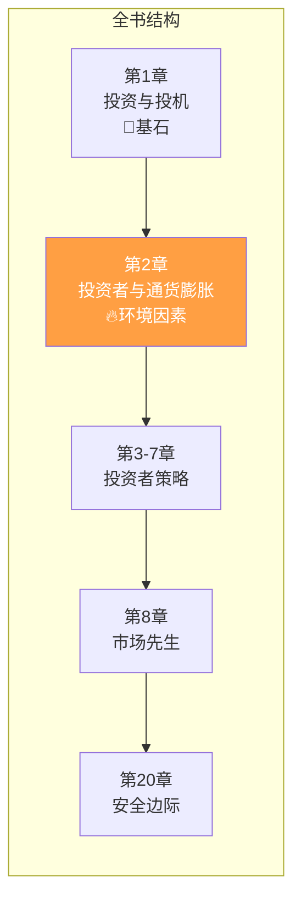
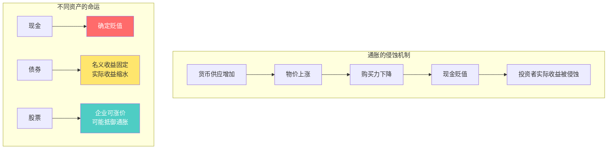
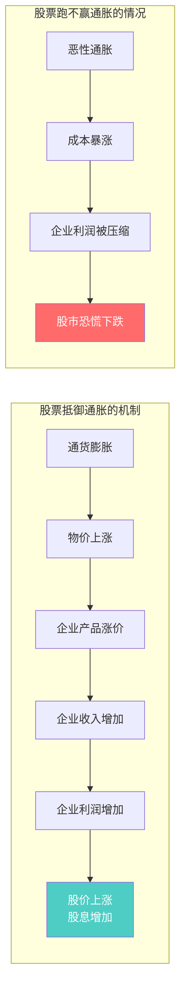
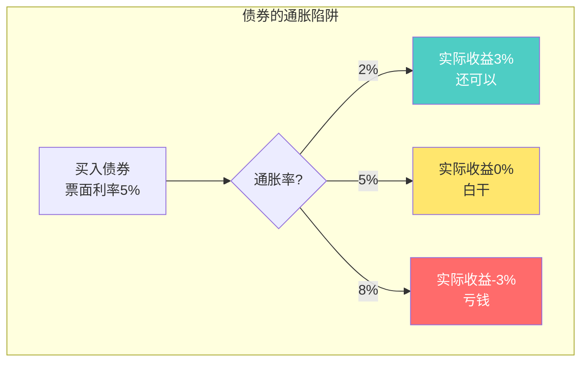
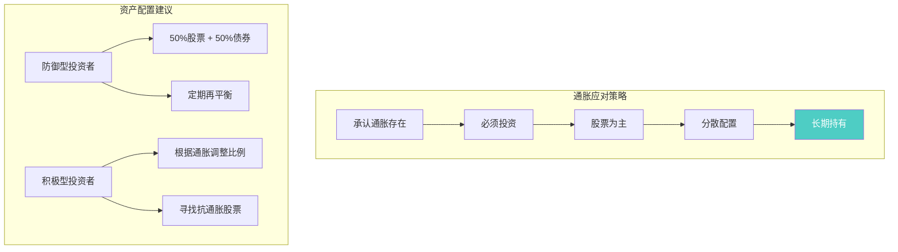
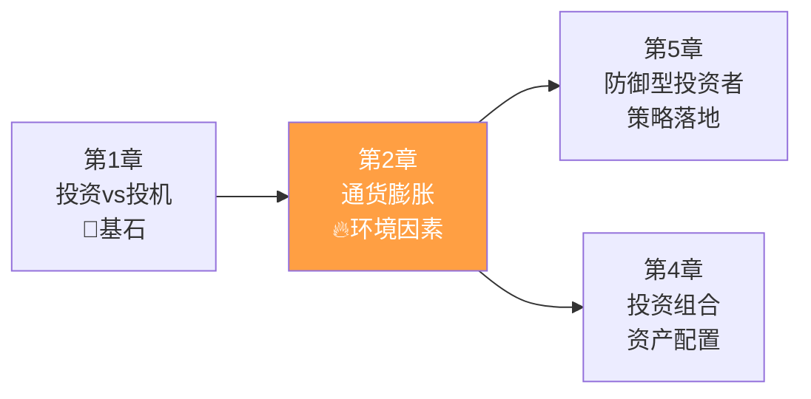

# 第2章：投资者与通货膨胀

> **章节主题**：通胀环境下的投资策略
> **核心问题**：通货膨胀如何影响投资？股票真的能抵御通胀吗？
> **一句话总结**：不投资是最大的风险，但投资也要警惕通胀的侵蚀——股票长期是最佳选择，但不是万能药。
> **拆解日期**：2026-02-27

---

## 一、章节定位

### 1.1 在全书中的位置

**定位**：本章承接第1章的投资定义，讨论投资者必须面对的**第一个现实敌人**——通货膨胀。格雷厄姆用数据说话，分析股票、债券、现金在通胀环境下的表现。

### 1.2 核心问题链

| 层次 | 问题 |
|------|------|
| **表层** | 通胀会让我的钱贬值吗？股票能抵御通胀吗？ |
| **中层** | 为什么有些人买了股票还是跑不赢通胀？ |
| **底层** | 在长期通胀环境下，普通投资者应该如何配置资产？ |

### 1.3 三维定位

| 维度 | 定位 |
|------|------|
| **主领域** | 宏观经济与投资 |
| **跨界领域** | 货币理论、资产配置 |
| **方法论地位** | 理解投资环境的必修课 |

---

## 二、核心观点（三层提取）

### 观点1：通货膨胀是投资者的长期敌人

**【表层】现象层**

格雷厄姆开篇就指出一个残酷的现实：

> "从长期来看，货币的购买力持续下降是历史的规律。"

**历史数据**（格雷厄姆时代）：
- 1914-1970年：美元购买力下降约2/3
- 年均通胀率：约2-3%

**【中层】机制层**

**通胀对不同资产的影响**：

| 资产类型 | 通胀影响 | 长期表现 | 格雷厄姆态度 |
|----------|----------|----------|--------------|
| **现金** | 直接受损 | 确定贬值 | 最差选择 |
| **债券** | 名义利率固定 | 可能跑不赢 | 需谨慎 |
| **股票** | 企业可转嫁成本 | 长期战胜通胀 | 最佳选择 |
| **房地产** | 租金和资产价格上涨 | 通常跑赢 | 实物资产优势 |

**【底层】规律层**

> **通胀侵蚀定律**：不投资是最大的风险。通胀会让你的现金以每年2-3%的速度"消失"。

**数学示例**（3%年通胀率）：
- 10年后：购买力下降26%
- 20年后：购买力下降46%
- 30年后：购买力下降60%

**一句话总结**：你不理财，财不理你——通胀会帮你"理财"，把你的钱理没了。

**【降维翻译】**

| 原表达 | 降维表达 |
|--------|----------|
| "购买力持续下降" | "钱放在银行里，会自己变少" |
| "年均通胀率2-3%" | "每年偷走你2-3%的钱" |
| "货币贬值" | "今天的100块，30年后只值40块" |

**【当下连接】2026年热点**

|----------|----------|----------|
| 钱放银行会贬值吗？ | 会，通胀每年偷走2-3% | "原来我的钱在消失" |
| 买房能抵御通胀吗？ | 房地产是实物资产，通常跑赢 | "所以大家都买房" |
| 不投资行不行？ | 不投资=确定亏钱 | "原来不投资是最大风险" |

---

### 观点2：股票长期战胜通胀，但不是万能药

**【表层】现象层**

格雷厄姆的核心结论：

> "从长期来看，普通股的投资回报率显著高于债券，也明显跑赢了通货膨胀。"

**但是**，他也警告：
> "这并不意味着股票在任何时期都能抵御通胀。短期内，股票价格可能大幅下跌，甚至长期跑不赢通胀。"

**【中层】机制层**

**股票战胜通胀的三个条件**：
1. **温和通胀**（2-5%）：企业可以转嫁成本
2. **优质企业**：有定价权、护城河
3. **长期持有**：短期波动无法预测

**股票跑不赢通胀的三种情况**：
1. **恶性通胀**（10%+）：成本失控、经济混乱
2. **低质企业**：没有定价权、利润被压缩
3. **短期追高**：买在高点，长期套牢

**【底层】规律层**

> **股票抗通胀定律**：股票**长期**是抵御通胀的最佳工具，但前提是买入价格合理、持有时间够长、选择优质企业。

**历史数据**（美国市场）：
- 1802-2012年：股票年化实际回报6.6%（扣除通胀）
- 同期债券年化实际回报3.6%
- 同期现金年化实际回报-1.4%

**【降维翻译】**

| 原表达 | 降维表达 |
|--------|----------|
| "股票长期战胜通胀" | "企业会涨价，股票跟着涨" |
| "不是任何时期都能抵御" | "短期可能亏，长期才有效" |
| "买入价格合理" | "不要买贵了，便宜才是硬道理" |

**【当下连接】**

- **2026年中国通胀预期**：2-3%温和通胀，股票应该能跑赢
- **股市低迷期**：正是买入的好时机，长期看会回升
- **高通胀国家**：恶性通胀时，股票也难以抵御，需配置实物资产

---

### 观点3：债券在通胀环境下的困境

**【表层】现象层**

格雷厄姆指出债券的致命弱点：

> "债券的名义收益是固定的，但通胀会让实际收益缩水，甚至变成负数。"

**例子**：
- 债券票面利率：5%
- 通胀率：3%
- 实际收益：5% - 3% = 2%
- 如果通胀率：6% → 实际收益：-1%（亏钱）

**【中层】机制层**

**债券在通胀环境下的风险**：

| 通胀水平 | 5%债券实际收益 | 投资者处境 |
|----------|----------------|------------|
| 1%（低通胀） | 4% | 舒服 |
| 3%（温和通胀） | 2% | 还可以 |
| 5%（中度通胀） | 0% | 白干 |
| 8%（高通胀） | -3% | 亏钱 |

**【底层】规律层**

> **债券通胀定律**：在通胀环境下，固定收益资产的实际回报会被侵蚀。债券适合低通胀环境，不适合高通胀环境。

**格雷厄姆的建议**：
- 防御型投资者：债券+股票各50%
- 高通胀时期：减少债券，增加股票和实物资产
- 低通胀时期：可以适当增加债券

**【降维翻译】**

| 原表达 | 降维表达 |
|--------|----------|
| "名义收益固定" | "说给多少就给多少，不会多给" |
| "实际收益缩水" | "拿到手的钱，买的东西变少了" |
| "负实际收益" | "银行说给你5%，物价涨了8%，你亏了" |

---

### 观点4：投资者的通胀应对策略

**【表层】现象层**

格雷厄姆给出的应对策略：

> 1. 承认通胀是长期存在的
> 2. 股票是抵御通胀的主要工具
> 3. 保持资产配置的灵活性
> 4. 不要试图预测通胀

**【中层】机制层**

**格雷厄姆的资产配置建议**：

| 投资者类型 | 股票比例 | 债券比例 | 通胀应对 |
|------------|----------|----------|----------|
| 防御型 | 50% | 50% | 被动应对 |
| 积极型 | 50-75% | 25-50% | 主动调整 |
| 高通胀环境 | 60-75% | 25-40% | 增加股票 |
| 低通胀环境 | 40-50% | 50-60% | 可增债券 |

**【底层】规律层**

> **通胀应对定律**：不要试图预测通胀，而是建立一个能在各种通胀环境下生存的投资组合。

**关键原则**：
1. **多元化**：股票+债券+实物资产
2. **灵活性**：根据环境调整比例
3. **长期视角**：短期波动不重要
4. **不预测**：没人能准确预测通胀

**【降维翻译】**

| 原表达 | 降维表达 |
|--------|----------|
| "资产配置" | "鸡蛋不要放在一个篮子里" |
| "定期再平衡" | "涨多了卖点，跌多了买点" |
| "不要预测通胀" | "经济学家都预测不准，你也别想了" |

**【当下连接】**

- **2026年配置建议**：60%股票指数基金 + 30%债券 + 10%黄金
- **中国通胀特点**：温和通胀为主，股票长期有效
- **不要追通胀概念股**：短期炒作，长期不一定跑赢

---

## 三、金句库

### 原书金句

1. "从长期来看，货币的购买力持续下降是历史的规律。"

2. "普通股的投资回报率显著高于债券，也明显跑赢了通货膨胀。"

3. "这不意味着股票在任何时期都能抵御通胀。"

4. "债券的名义收益是固定的，但通胀会让实际收益缩水。"

5. "不投资是最大的风险——通胀会让你的现金自动贬值。"

6. "投资者应该承认通胀是长期存在的，而不是试图预测它。"

---

### 降维金句（便于传播）

7. "通胀是温水煮青蛙——每年偷走你2-3%的钱，30年后只剩40%。"

8. "不投资=确定亏钱，投资=可能赚钱。聪明人知道怎么选。"

9. "股票能抵御通胀？能，但前提是买得便宜、持有够久、选得对。"

10. "债券说给你5%，物价涨了8%，你实际亏了3%——这就是通胀的陷阱。"

11. "企业会涨价，股票跟着涨——这就是股票战胜通胀的秘密。"

12. "防御型投资者：一半股票一半债，躺平也能跑赢通胀。"

13. "不要预测通胀，经济学家都预测不准，你也别想了。"

14. "鸡蛋不要放一个篮子：股票抗通胀，债券抗波动，黄金抗极端。"

---

## 四、当下映射（2026年热点）

### 热点1：中国通胀预期

**现象**：2026年中国预期温和通胀2-3%

**本章答案**：
- 温和通胀环境下，股票长期有效
- 不必恐慌，正常配置股票+债券
- 现金持有比例尽量低

---

### 热点2：房地产 vs 股票

**现象**：房子还能买吗？股票更安全？

**本章答案**：
- 房地产是实物资产，抗通胀效果好
- 但流动性差、门槛高
- 股票流动性好、门槛低，普通人更容易配置

---

### 热点3：银行存款利率下降

**现象**：银行利息越来越低，存钱没意义

**本章答案**：
- 利率下降是趋势
- 存钱不仅赚得少，还跑不赢通胀
- 必须投资，但要选对工具

---

## 五、章节关联

### 5.1 与全书的关联

**逻辑关系**：
- 第1章定义"什么是投资" → 第2章讲"投资面临的环境因素"
- 第2章讲"通胀影响" → 第4章讲"如何配置资产应对"
- 第2章讲"股票抗通胀" → 第5章讲"防御型投资者如何操作"

### 5.2 与第1章的关联

| 维度 | 第1章 | 第2章 |
|------|-------|-------|
| **核心问题** | 什么是投资？ | 投资面临什么环境？ |
| **时间视角** | 定义投资行为 | 分析长期趋势 |
| **实践指导** | 区分投资/投机 | 应对通胀侵蚀 |
| **关联逻辑** | 知道什么是投资 → 知道为什么要投资（对抗通胀） |

### 5.3 与其他书籍的关联

| 书籍 | 关联类型 | 共同逻辑 |
|------|----------|----------|
| [[周期]] | **互补** | 马克斯讲周期，格雷厄姆讲通胀，都是投资环境因素 |
| [[反脆弱-塔勒布]] | **互补** | 塔勒布讲"从混乱中获益"，格雷厄姆讲"从通胀中保护" |
| [[富爸爸穷爸爸-清崎]] | **延伸** | 清崎讲"资产抗通胀"，格雷厄姆讲"如何投资资产" |

---

## 六、问答设计

### Q1：股票一定能跑赢通胀吗？

**答**：不是一定，但长期大概率会。

- **短期**：股票可能大跌，跑不赢通胀
- **长期**：股票平均年化6-8%，通胀2-3%，大概率跑赢
- **前提**：买得便宜、持有够久、选优质企业

格雷厄姆说："长期来看，股票是抵御通胀的最佳工具，但不是万能药。"

---

### Q2：如果通胀很高（比如10%），股票还能抗通胀吗？

**答**：难。恶性通胀下，几乎所有资产都受影响。

- **恶性通胀**：经济混乱，企业成本失控
- **股票可能大跌**：恐慌情绪+业绩下滑
- **实物资产更好**：黄金、房地产等

格雷厄姆的建议：高通胀时期，增加实物资产配置。

---

### Q3：债券在通胀环境下是不是完全不能买？

**答**：不是完全不能买，但要控制比例。

- **低通胀（1-2%）**：债券可以有50%
- **温和通胀（2-4%）**：债券30-40%
- **高通胀（5%+）**：债券20%以下

格雷厄姆的建议：防御型投资者保持50%股票+50%债券，但可根据通胀调整。

---

### Q4：普通人如何应对通胀？

**答**：格雷厄姆给普通人的三步走：

1. **承认通胀存在**：不投资=确定亏钱
2. **建立投资组合**：50%股票指数基金+50%债券
3. **定期再平衡**：每年调整一次，保持比例

不用预测通胀，不用追逐热点，长期坚持就行。

---

### Q5：黄金能抗通胀吗？

**答**：能，但不是最佳选择。

- **优点**：实物资产，极端情况下的保值工具
- **缺点**：不产生现金流，长期回报不如股票
- **格雷厄姆态度**：可以配置少量（5-10%），但不要依赖

股票长期回报6-8%，黄金长期回报1-2%（扣除通胀后接近0）。

---

## 七、章节小结

### 核心要点

1. **通胀是长期敌人**：不投资=确定亏钱
2. **股票最佳选择**：长期战胜通胀，但不是万能药
3. **债券有局限**：固定收益在通胀环境下会缩水
4. **分散是关键**：股票+债券+实物资产
5. **不要预测**：没人能准确预测通胀，建立稳健组合更重要

### 行动清单

- [ ] 计算你现在的现金占比（应该尽量低）
- [ ] 评估你的投资组合能否跑赢2-3%通胀
- [ ] 如果没有股票配置，考虑开始定投指数基金
- [ ] 设定年度再平衡计划（保持股票/债券比例）
- [ ] 不要试图预测通胀，专注于长期配置

---
