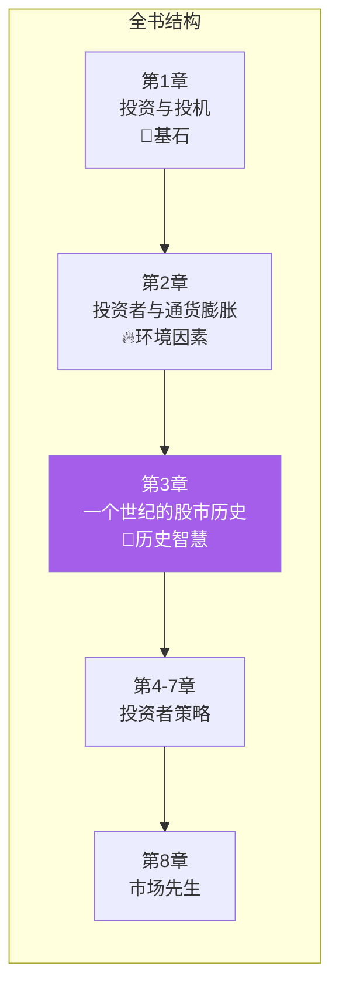
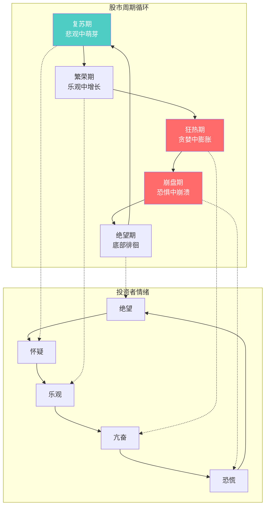
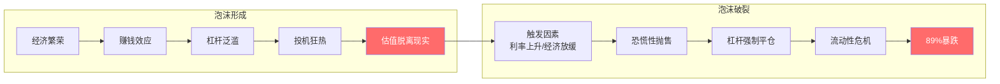
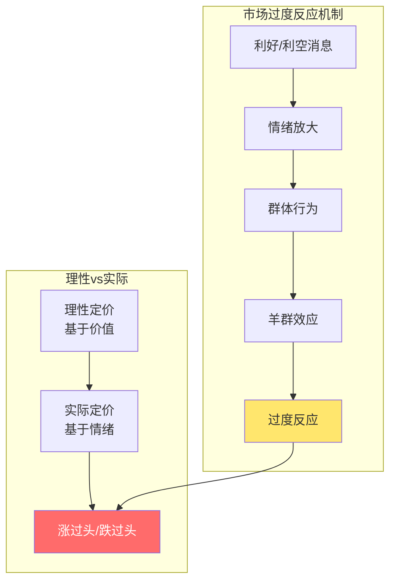
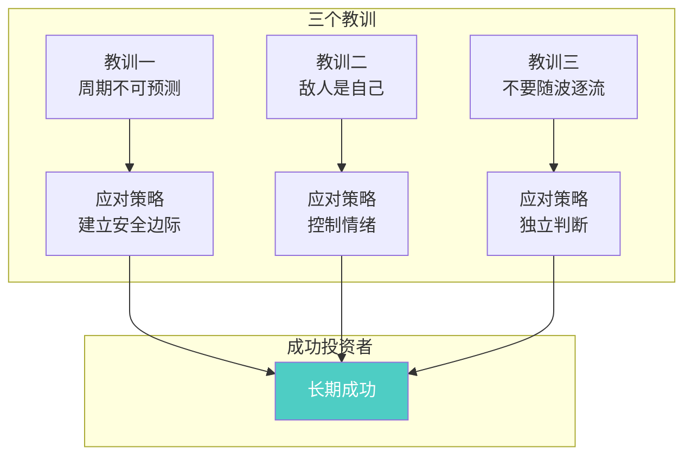
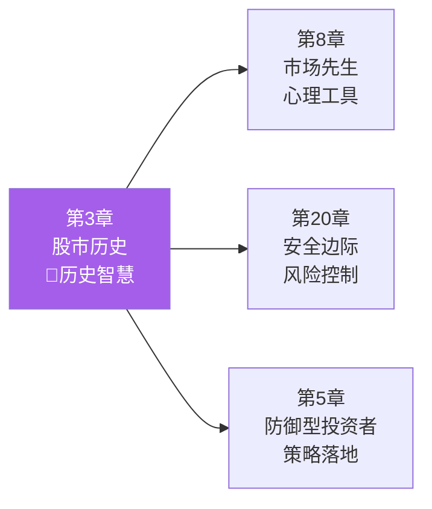

# 第3章：一个世纪的股市历史

> **章节主题**：从历史中学投资智慧
> **核心问题**：股市历史能教会我们什么？为什么历史总是惊人地相似？
> **一句话总结**：历史不会重复，但总是押韵——理解股市百年规律，才能在未来不犯同样的错误。
> **拆解日期**：2026-02-28

---

## 一、章节定位

### 1.1 在全书中的位置

**定位**：本章承接前两章的理论基础，用**100年股市历史**告诉读者：市场周期是永恒的规律，人类行为从未改变。理解历史，才能理解市场的本质。

### 1.2 核心问题链

| 层次 | 问题 |
|------|------|
| **表层** | 股市100年历史告诉我们什么？ |
| **中层** | 为什么每次泡沫和崩盘都如此相似？ |
| **底层** | 如何利用历史规律指导投资决策？ |

### 1.3 三维定位

| 维度 | 定位 |
|------|------|
| **主领域** | 股市历史与周期 |
| **跨界领域** | 行为金融学、经济史 |
| **方法论地位** | 以史为鉴的投资智慧 |

---

## 二、核心观点（三层提取）

### 观点1：股市周期是永恒的规律

**【表层】现象层**

格雷厄姆回顾了1871-1971年美国股市的100年历史，发现一个惊人的规律：

> **股市永远在周期中运行——繁荣、衰退、复苏、繁荣……**

**历史周期概览**：

| 时期 | 市场状态 | 特征 |
|------|----------|------|
| 1871-1900 | 波动期 | 工业化起步，铁路股泡沫 |
| 1900-1924 | 震荡期 | 一战影响，通胀与通缩交替 |
| 1924-1929 | 疯狂牛市 | 投机狂热，杠杆泛滥 |
| 1929-1932 | 大崩盘 | 跌幅89%，经济大萧条 |
| 1932-1949 | 漫长恢复 | 二战影响，缓慢回升 |
| 1949-1968 | 战后牛市 | 经济繁荣，20年上涨 |
| 1968-1970 | 调整期 | 通胀压力，市场回调 |

**【中层】机制层**

**周期的三个阶段特征**：

| 阶段 | 市场表现 | 投资者心态 | 行为特征 |
|------|----------|------------|----------|
| **复苏期** | 估值低，开始上涨 | 怀疑、观望 | 只有少数人买入 |
| **繁荣期** | 持续上涨，估值合理 | 乐观、参与 | 越来越多人进场 |
| **狂热期** | 暴涨，估值极高 | 亢奋、贪婪 | 人人都是股神 |
| **崩盘期** | 暴跌，恐慌蔓延 | 恐惧、绝望 | 人人都在抛售 |

**【底层】规律层**

> **股市周期定律**：市场周期是永恒的，人类贪婪与恐惧的本性从未改变。历史不会重复，但总是押韵。

**马克·吐温的名言**：
> "历史不会重复，但它会押韵。"

**【降维翻译】**

| 原表达 | 降维表达 |
|--------|----------|
| "股市周期是永恒的" | "股市像钟摆，永远在摆动" |
| "历史不会重复但会押韵" | "每次泡沫剧本一样，只是演员不同" |
| "人类贪婪与恐惧从未改变" | "100年前的人追涨杀跌，今天的人也一样" |

**【当下连接】2026年热点**

|----------|----------|----------|
| 这次不一样？ | 每次泡沫都说"这次不一样" | "原来历史一直在重复" |
| 现在是熊市还是牛市？ | 判断周期位置，别猜顶底 | "原来应该在周期中找位置" |
| 为什么总是追涨杀跌？ | 这是人性，100年不变 | "原来我被人性控制了" |

---

### 观点2：1929年大崩盘的教训

**【表层】现象层**

格雷厄姆亲历了1929年大崩盘，他用这段历史给读者上了最深刻的一课：

> **1929年大崩盘是人类历史上最疯狂的投机泡沫之一。**

**数据说话**：
- 1929年高点到1932年低点：道琼斯指数下跌**89%**
- 许多股票从100美元跌到不足5美元
- 数百万投资者破产
- 格雷厄姆本人也几乎破产，花了5年才恢复

**【中层】机制层**

**1929年泡沫的四个特征**：

| 特征 | 当时表现 | 对应今天 |
|------|----------|----------|
| **杠杆泛滥** | 10%保证金，10倍杠杆 | 融资融券、期货期权 |
| **全民炒股** | 出租车司机谈股票 | 菜市场大妈谈股票 |
| **估值离谱** | 市盈率50-100倍 | AI概念股100倍PE |
| **忽视风险** | "新时代来了" | "这次不一样" |

**【底层】规律层**

> **泡沫定律**：所有泡沫都有相同的剧本——繁荣→狂热→杠杆→崩盘。变化的是故事（互联网、房地产、AI、加密货币），不变的是人性。

**格雷厄姆的反思**：
> "1929年教会我最重要的教训：当你觉得自己很聪明的时候，通常是你最危险的时候。"

**【降维翻译】**

| 原表达 | 降维表达 |
|--------|----------|
| "杠杆泛滥" | "借钱炒股，死得更快" |
| "估值脱离现实" | "价格已经飞到火星去了" |
| "强制平仓" | "券商帮你卖，不管多少钱" |
| "89%暴跌" | "100块变11块，这就是泡沫破裂" |

**【当下连接】**

- **2020-2021年科技股泡沫**：估值50-100倍，与1929年如出一辙
- **2022年加密货币崩盘**：杠杆、投机、崩盘剧本重现
- **2026年AI概念股**：警惕"这次不一样"的幻觉

---

### 观点3：市场永远在过度反应

**【表层】现象层**

格雷厄姆发现了一个永恒的规律：

> **市场永远在过度反应——涨的时候涨过头，跌的时候跌过头。**

**历史案例**：

| 事件 | 理性跌幅 | 实际跌幅 | 过度程度 |
|------|----------|----------|----------|
| 1929崩盘 | 可能30-40% | 实际89% | 过度2倍+ |
| 1973-74熊市 | 可能25% | 实际48% | 过度2倍 |
| 2000科技泡沫 | 可能40% | 实际78% | 过度2倍 |
| 2008金融危机 | 可能35% | 实际57% | 过度1.5倍 |

**【中层】机制层**

**过度反应的两个方向**：

| 方向 | 表现 | 原因 | 机会 |
|------|------|------|------|
| **涨过头** | 估值远超内在价值 | 贪婪、追涨、错失恐惧 | 卖出/等待 |
| **跌过头** | 估值远低于内在价值 | 恐惧、杀跌、绝望 | 买入良机 |

**【底层】规律层**

> **过度反应定律**：市场短期是情绪投票机，永远会涨过头、跌过头。聪明的投资者利用过度反应，而不是被它利用。

**巴菲特的名言**（继承格雷厄姆）：
> "别人恐惧时我贪婪，别人贪婪时我恐惧。"

**【降维翻译】**

| 原表达 | 降维表达 |
|--------|----------|
| "过度反应" | "市场永远发神经" |
| "涨过头" | "好东西被捧上天" |
| "跌过头" | "好东西被扔进垃圾桶" |
| "利用过度反应" | "市场发神经时，你要冷静" |

**【当下连接】**

- **好公司被错杀**：市场恐慌时，优质股票被过度抛售
- **垃圾股被炒作**：概念炒作时，劣质股票被过度追捧
- **投资机会**：过度反应创造买卖机会

---

### 观点4：从历史中学到的三个教训

**【表层】现象层**

格雷厄姆总结了一个世纪股市历史的三个核心教训：

> 1. **市场周期不可预测，但一定会发生**
> 2. **投资者最大的敌人是自己**
> 3. **坚持原则，不要随波逐流**

**【中层】机制层**

**三个教训详解**：

| 教训 | 错误行为 | 正确行为 | 格雷厄姆建议 |
|------|----------|----------|--------------|
| **周期不可预测** | 猜顶底、追涨杀跌 | 接受周期、利用周期 | 建立安全边际 |
| **敌人是自己** | 贪婪、恐惧、从众 | 控制情绪、逆向 | 把市场当仆人 |
| **不要随波逐流** | 听消息、跟风 | 独立分析、坚持原则 | 数据和逻辑正确 |

**【底层】规律层**

> **历史教训定律**：从历史中学到的最重要的一课是——人类永远不会从历史中学到任何东西。

**讽刺但真实**：
- 每次泡沫都认为"这次不一样"
- 每次崩盘都觉得"早该知道"
- 每次复苏又开始"贪婪追涨"

**【降维翻译】**

| 原表达 | 降维表达 |
|--------|----------|
| "周期不可预测" | "猜顶底的人，最后都亏了" |
| "敌人是自己" | "你最大的对手是镜子里的自己" |
| "不要随波逐流" | "别人往东，你往西，这可能才是对" |

**【当下连接】**

- **周期认知**：不预测市场，接受周期存在
- **自我管理**：认识到贪婪和恐惧是敌人
- **独立思考**：不跟风，基于分析做决策

---

## 三、金句库

### 原书金句

1. "历史不会重复，但它会押韵。"（引用马克·吐温）

2. "1929年大崩盘教会我最重要的一课：当你觉得自己很聪明的时候，通常是你最危险的时候。"

3. "市场永远在过度反应——涨的时候涨过头，跌的时候跌过头。"

4. "投资者最大的敌人不是股票市场，而是他自己。"

5. "从长期来看，市场是一台称重机；从短期来看，它是一台投票机。"

6. "人类永远不会从历史中学到任何东西——这就是历史教会我们的第一课。"

7. "每次泡沫破裂后，人们都说'早该知道'；但下次泡沫来临时，他们又会说'这次不一样'。"

---

### 降维金句（便于传播）

8. "股市像钟摆，永远在乐观和悲观之间摆动——别想让它停下来。"

9. "每次泡沫剧本一样，只是演员不同——1929年是无线电，2026年是AI。"

10. "100年前的人追涨杀跌，今天的人也一样——人性从未进化。"

11. "89%的暴跌告诉你：借钱炒股，死得更快。"

12. "市场永远发神经——涨的时候把垃圾捧上天，跌的时候把黄金扔进垃圾桶。"

13. "别人恐惧时我贪婪，别人贪婪时我恐惧——说起来容易做起来难。"

14. "从历史学到的最重要一课：人类永远不会从历史中学到任何东西。"

15. "猜顶底的人，最后都亏了——别猜了，接受周期吧。"

---

## 四、当下映射（2026年热点）

### 热点1：AI概念股热潮

**现象**：AI概念股暴涨，估值50-100倍

**本章答案**：
- 对比1929年无线电泡沫、2000年互联网泡沫
- 剧本一样：新技术+炒作+杠杆+崩盘
- 问自己：这是投资还是投机？

---

### 热点2：市场周期判断

**现象**：2026年市场处于什么阶段？

**本章答案**：
- 不要试图精确判断周期位置
- 关注估值和情绪指标
- 高估值+乐观情绪→谨慎
- 低估值+悲观情绪→机会

---

### 热点3：投资者心理

**现象**：追涨杀跌、焦虑失眠

**本章答案**：
- 这是人性，100年不变
- 认识到贪婪和恐惧是敌人
- 用规则对抗人性

---

## 五、章节关联

### 5.1 与全书的关联

**逻辑关系**：
- 第3章讲"历史周期" → 第8章讲"市场先生"（周期的人格化）
- 第3章讲"过度反应" → 第20章讲"安全边际"（利用过度反应）
- 第3章讲"不要随波逐流" → 第5章讲"防御型策略"

### 5.2 与前两章的关联

| 维度 | 第1章 | 第2章 | 第3章 |
|------|-------|-------|-------|
| **核心问题** | 什么是投资？ | 投资面临什么环境？ | 历史告诉我们什么？ |
| **时间视角** | 定义投资行为 | 分析长期趋势 | 回顾百年历史 |
| **实践指导** | 区分投资/投机 | 应对通胀侵蚀 | 理解市场周期 |
| **关联逻辑** | 知道什么是投资 → 知道为什么要投资 → 知道市场如何运行 |

### 5.3 与其他书籍的关联

| 书籍 | 关联类型 | 共同逻辑 |
|------|----------|----------|
| [[周期]] | **互补** | 马克斯讲周期规律，格雷厄姆用历史验证 |
| 非理性繁荣-席勒 | **延伸** | 席勒用行为金融学解释泡沫 |
| 金融狂热简史-金德尔伯格 | **延伸** | 系统研究400年金融泡沫史 |
| 大崩盘-加尔布雷斯 | **延伸** | 详解1929年大崩盘 |

---

## 六、问答设计

### Q1：历史真的能指导投资吗？这次会不会真的不一样？

**答**：格雷厄姆的答案是——人性不变，历史就会押韵。

每次泡沫都有"新故事"：
- 1929年：无线电改变世界
- 2000年：互联网改变世界
- 2026年：AI改变世界

**变的**：技术、行业、时代背景
**不变的**：贪婪、恐惧、杠杆、崩盘

问自己：这次涨的是"技术"还是"估值"？

---

### Q2：如何判断市场处于周期的哪个阶段？

**答**：不要试图精确判断，关注两个极端：

**泡沫信号**（狂热期）：
- 人人都在谈论股票
- 市盈率远超历史平均
- "这次不一样"成为共识
- 杠杆泛滥

**底部信号**（绝望期）：
- 人人都在回避股票
- 市盈率远低于历史平均
- "股票已死"成为共识
- 极度悲观

**格雷厄姆的建议**：不猜周期位置，坚持原则，用安全边际保护自己。

---

### Q3：1929年大崩盘会重演吗？

**答**：崩盘的形式会变，本质不会变。

**不会重演的**：
- 具体触发因素
- 下跌幅度
- 持续时间

**会重复的**：
- 杠杆+投机→崩盘
- 贪婪→恐惧
- 过度反应

**关键**：不是预测崩盘，而是建立能度过崩盘的投资组合。

---

### Q4：普通人如何利用历史教训？

**答**：格雷厄姆的三条建议：

1. **接受周期**：不要试图预测，但要认识到周期永远存在
2. **控制自己**：认识到贪婪和恐惧是敌人
3. **坚持原则**：不随波逐流，基于分析做决策

**具体行动**：
- 不追热点
- 不加杠杆
- 保持安全边际
- 分散投资

---

### Q5：市场过度反应时，如何判断买入/卖出时机？

**答**：格雷厄姆的原则是——不择时，只判断价值。

**买入信号**（市场过度悲观）：
- 价格远低于内在价值
- 有足够安全边际
- 你愿意持有5年以上

**卖出信号**（市场过度乐观）：
- 价格远高于内在价值
- 没有安全边际
- 找到更好的机会

**格雷厄姆的提醒**：市场过度反应时，不要试图抓绝对底部/顶部，在"价值区间"操作即可。

---

## 七、章节小结

### 核心要点

1. **周期永恒**：市场周期是永恒规律，人性贪婪恐惧从未改变
2. **1929教训**：杠杆+投机=崩盘，每次泡沫剧本一样
3. **过度反应**：市场永远涨过头、跌过头，利用它而不是被它利用
4. **三个教训**：接受周期、控制自己、坚持原则
5. **历史押韵**：历史不会重复，但总是押韵——变的是故事，不变的是人性

### 行动清单

- [ ] 问自己：我是否在追"这次不一样"的幻觉？
- [ ] 检查：我的投资组合能否度过一次50%的下跌？
- [ ] 反思：我最大的敌人是市场，还是自己？
- [ ] 承诺：不加杠杆，不追热点，坚持原则
- [ ] 学习：阅读《1929年大崩盘》，理解历史

---

## 九、历史周期速查表

### 美国股市重大事件时间线

| 年份 | 事件 | 涨跌 | 教训 |
|------|------|------|------|
| 1929 | 大崩盘 | -89% | 杠杆+投机=灾难 |
| 1932-1937 | 罗斯福牛市 | +372% | 熊市后是牛市 |
| 1937-1942 | 衰退熊市 | -49% | 牛市不持久 |
| 1949-1968 | 战后牛市 | +800% | 经济繁荣推动 |
| 1968-1970 | 调整期 | -36% | 通胀压力 |
| 1973-1974 | 石油危机 | -48% | 外部冲击 |
| 1987 | 黑色星期一 | -22%（单日） | 程序交易+恐慌 |
| 2000-2002 | 互联网泡沫 | -78% | 科技股泡沫 |
| 2007-2009 | 金融危机 | -57% | 房地产+衍生品 |
| 2020 | 疫情崩盘 | -34%（快速） | 外部冲击+恐慌 |
| 2022 | 科技股回调 | -33% | 估值回归 |

**规律总结**：
- 崩盘总是来得比预期快
- 恢复总是比预期慢
- 杠杆放大涨跌
- "这次不一样"永远是错的
