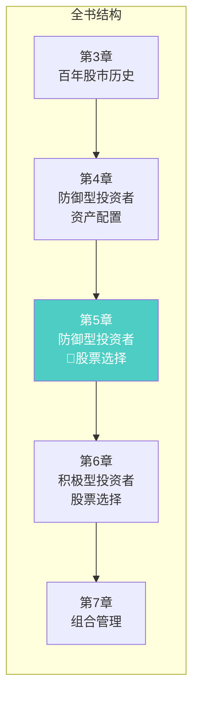
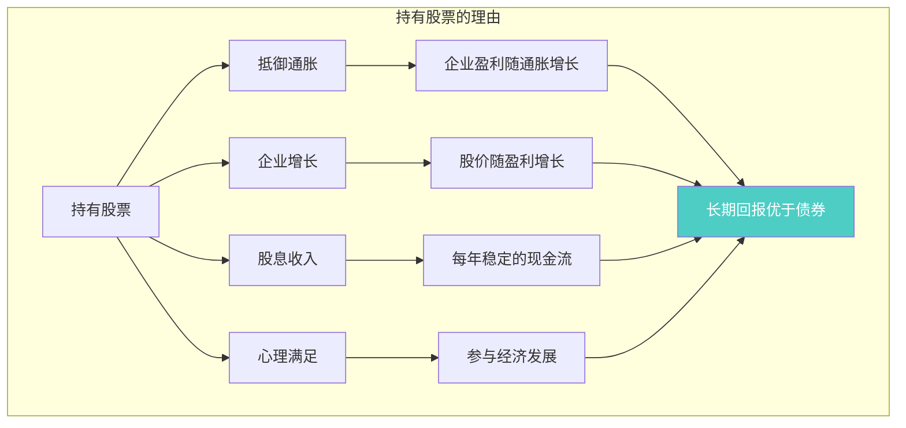
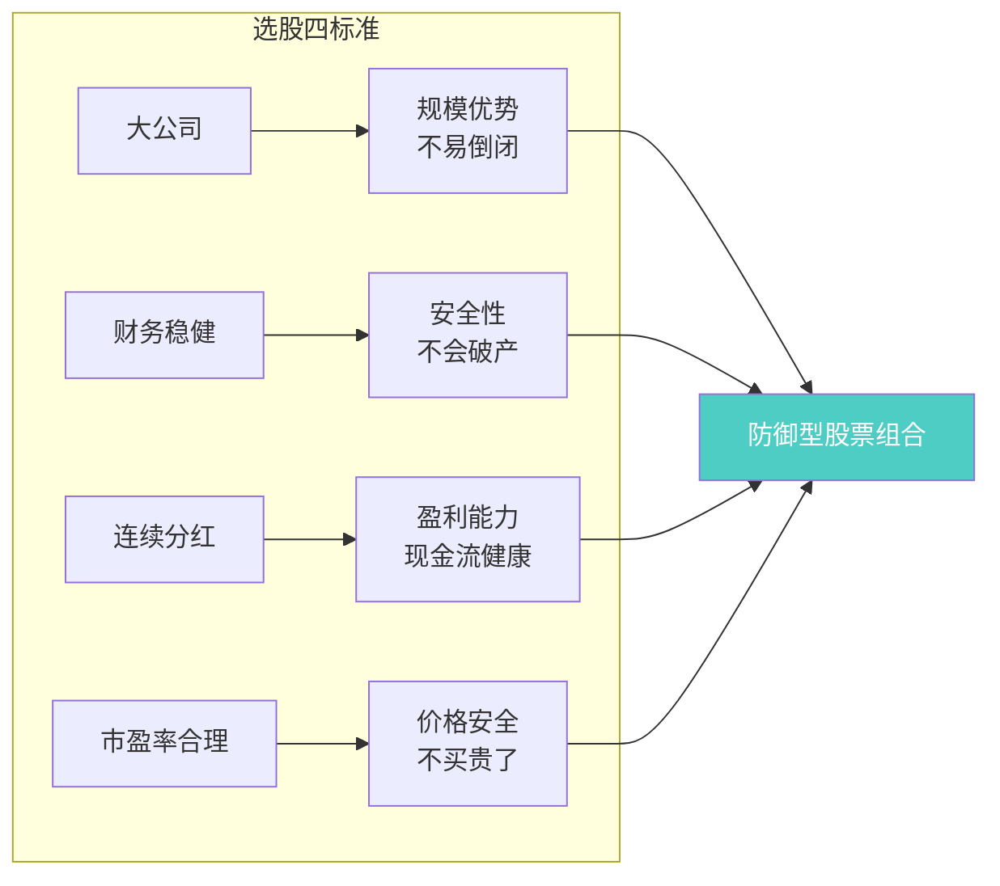
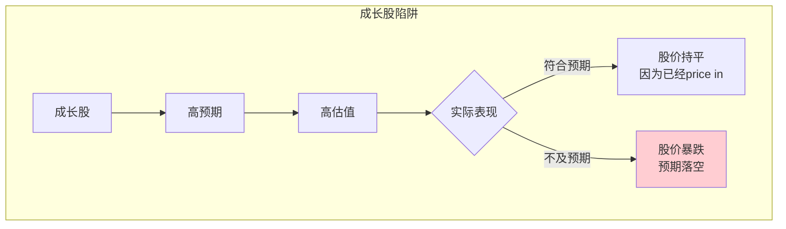
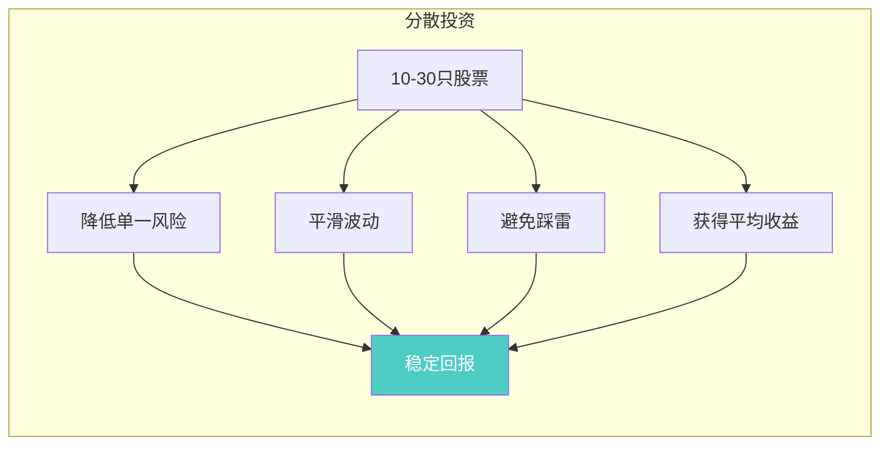
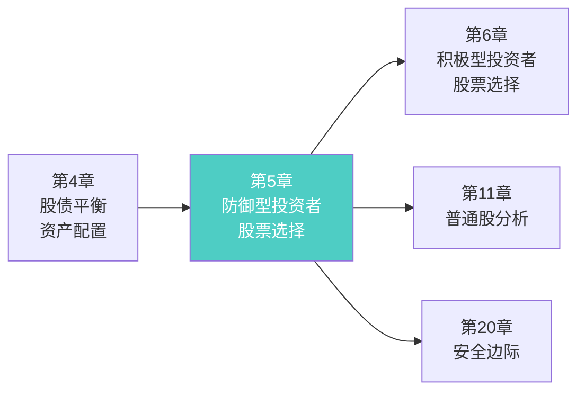
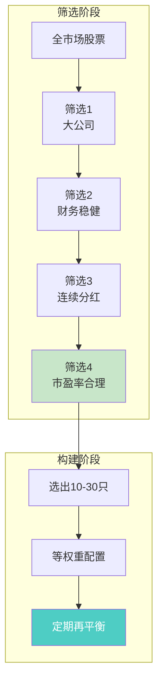

# 第5章：防御型投资者与普通股

> **章节主题**：防御型投资者如何选择普通股
> **核心问题**：普通人应该买什么样的股票？选股标准是什么？
> **一句话总结**：防御型投资者选股的黄金法则——选大公司、财务稳健、连续分红、市盈率合理。
> **拆解日期**：2026-02-28

---

## 一、章节定位

### 1.1 在全书中的位置

**定位**：本章是**防御型投资者的选股指南**。在上一章确定"买多少股票"后，本章解决"买什么股票"。这是全书最实用的选股方法论。

### 1.2 核心问题链

| 层次 | 问题 |
|------|------|
| **表层** | 防御型投资者应该买什么股票？ |
| **中层** | 选股标准是什么？如何筛选？ |
| **底层** | 为什么这些标准能保护投资者？ |

### 1.3 三维定位

| 维度 | 定位 |
|------|------|
| **主领域** | 股票选择 |
| **跨界领域** | 企业分析、风险管理 |
| **方法论地位** | 普通人选股的"操作手册" |

---

## 二、核心观点（三层提取）

### 观点1：持有股票的四大理由

**【表层】现象层**

格雷厄姆明确指出，防御型投资者应该持有股票的四个理由：

> 1. **抵御通胀**：股票是长期抵御通胀的最佳资产
> 2. **提供增长**：股票提供企业增长的收益
> 3. **股息收入**：优质股票提供稳定的股息
> 4. **心理满足**：持有股票让人更有经济参与的感感

**历史数据支撑**：
- 1871-1970年，美国股票年化回报约6.5%（扣除通胀后）
- 同期债券年化回报约2.5%（扣除通胀后）
- 股票的通胀对冲能力远超债券

**【中层】机制层**

**股票vs债券的长期收益对比**：

| 维度 | 股票 | 债券 |
|------|------|------|
| **通胀对冲** | 强 | 弱 |
| **长期增长** | 有 | 几乎没有 |
| **波动性** | 高 | 低 |
| **股息稳定性** | 中等 | 高 |
| **本金安全** | 中等 | 高 |

**【底层】规律层**

> **股票持有定律**：长期来看，股票是抵御通胀和实现财富增长的唯一可靠资产，但前提是选择优质股票并长期持有。

**数学逻辑**：
- 通胀3% + 实际增长3% = 名义增长6%
- 债券名义收益5% - 通胀3% = 实际收益2%
- 股票实际收益是债券的3倍

**【降维翻译】**

| 原表达 | 降维表达 |
|--------|----------|
| "抵御通胀" | "钱会贬值，股票会涨" |
| "企业增长" | "买入好公司，让它帮你赚钱" |
| "股息收入" | "不用卖股票，也能收钱" |
| "长期回报优于债券" | "十年后股票比债券赚得多" |

**【当下连接】2026年热点**

|----------|----------|----------|
| 钱存银行一直在贬值怎么办？ | 买股票，抵御通胀 | "原来存银行是在亏钱" |
| 股票风险太大了不敢买？ | 选对股票，风险可控 | "原来风险可以管理" |
| 债券收益这么低，值得买吗？ | 债券是保命，股票是增值 | "原来要股债搭配" |

---

### 观点2：防御型投资者选股的四项标准

**【表层】现象层**

格雷厄姆给出了防御型投资者选股的**四大黄金标准**：

> 1. **财务稳健**：大公司、财务状况良好
> 2. **持续分红**：连续多年支付股息（建议20年以上）
> 3. **盈利稳定**：过去10年没有亏损
> 4. **价格合理**：市盈率不超过15-20倍

**具体标准**：

| 标准 | 具体要求 | 为什么 |
|------|----------|--------|
| **公司规模** | 营收或资产足够大 | 大公司更稳定，不易倒闭 |
| **财务状况** | 流动比率>2，债务合理 | 财务安全，不会破产 |
| **分红记录** | 连续20年以上分红 | 证明公司盈利稳定 |
| **盈利稳定** | 过去10年每年盈利 | 排除周期性亏损公司 |
| **市盈率** | 不超过15-20倍 | 避免买贵了 |

**【中层】机制层**

**四标准的底层逻辑**：

| 标准 | 保护机制 | 避免的陷阱 |
|------|----------|------------|
| **大公司** | 规模经济、品牌优势 | 小公司倒闭风险 |
| **财务稳健** | 债务可控、流动性好 | 债务危机、破产 |
| **连续分红** | 真实盈利、现金流好 | 纸面富贵、造假 |
| **合理市盈率** | 安全边际 | 高位接盘 |

**【底层】规律层**

> **防御选股定律**：防御型投资者的选股标准不是为了找到"最好的股票"，而是为了排除"有问题的股票"。

**格雷厄姆的智慧**：
> "我们的目标不是要找到最赚钱的股票，而是要找到足够安全、足够稳健的股票。"

**【降维翻译】**

| 原表达 | 降维表达 |
|--------|----------|
| "财务稳健" | "不差钱的公司" |
| "连续分红20年" | "20年都在给股东发钱" |
| "市盈率不超过20倍" | "别买太贵的" |
| "防御型选股" | "先不亏，再想赚" |

**【当下连接】**

| 2026年场景 | 应用标准 |
|------------|----------|
| **AI概念股暴涨** | 市盈率超过100倍？不符合标准，放弃 |
| **新能源股热炒** | 连续分红20年？没有，不符合标准 |
| **银行股低估值** | 大公司+财务稳健+连续分红+低市盈率 = 符合标准 |

---

### 观点3：成长股的陷阱

**【表层】现象层**

格雷厄姆对"成长股"发出警告：

> "成长股的定价往往已经包含了所有未来的增长预期，投资者很难从中获得超额收益。"

**成长股的定义**：
- 过去每股收益增长显著超过平均水平
- 预期未来仍将保持高增长
- 市场给予高估值

**成长股的问题**：
1. **定价过高**：价格已反映所有好消息
2. **预期过高**：稍有不及预期就暴跌
3. **波动剧烈**：情绪化定价，涨跌惊人
4. **难以预测**：谁能保证未来持续增长？

**【中层】机制层**

**成长股 vs 价值股对比**：

| 维度 | 成长股 | 价值股（格雷厄姆推荐） |
|------|--------|------------------------|
| **估值** | 高（市盈率30-100倍） | 合理（市盈率15-20倍） |
| **预期** | 极高 | 适中 |
| **波动** | 大 | 小 |
| **安全边际** | 几乎没有 | 有 |
| **适合人群** | 积极型投资者 | 防御型投资者 |

**【底层】规律层**

> **成长股陷阱定律**：当所有人都认为一家公司会成长时，其股价已经反映了所有预期。买入成长股不是投资未来，而是赌预期兑现。

**格雷厄姆的警告**：
> "防御型投资者应该远离成长股，不是因为成长股不好，而是因为成长股的风险超出了防御型投资者的承受能力。"

**【降维翻译】**

| 原表达 | 降维表达 |
|--------|----------|
| "成长股陷阱" | "好公司不等于好股票" |
| "预期已反映在价格中" | "好消息已经算在价格里了" |
| "稍有不及预期就暴跌" | "没考100分就算退步" |

**【当下连接】**

- **2026年AI热潮**：AI概念股是典型的成长股，估值泡沫严重
- **教训**：好赛道不等于好投资，价格更重要
- **格雷厄姆会怎么做**：等待泡沫破裂，在合理价格买入

---

### 观点4：分散投资的重要性

**【表层】现象层**

格雷厄姆强调分散投资：

> "防御型投资者应该持有10-30只股票，以分散风险。"

**分散的好处**：
1. 降低单一股票风险
2. 平滑收益波动
3. 避免"踩雷"
4. 获得市场平均收益

**【中层】机制层**

**分散程度与风险关系**：

| 持有股票数 | 非系统风险降低 | 管理难度 |
|------------|----------------|----------|
| 1只 | 0% | 低 |
| 5只 | 约50% | 低 |
| 10只 | 约70% | 中 |
| 20只 | 约85% | 中 |
| 30只 | 约90% | 高 |
| 50只+ | 约95% | 很高 |

**【底层】规律层**

> **分散投资定律**：不要把所有鸡蛋放在一个篮子里。分散投资是用"放弃暴利"换取"降低风险"。

**格雷厄姆的建议**：
> "分散投资是防御型投资者最重要的风险管理工具之一。"

**【降维翻译】**

| 原表达 | 降维表达 |
|--------|----------|
| "分散投资" | "别把鸡蛋放一个篮子里" |
| "持有10-30只股票" | "买一打股票，不买单只" |
| "降低非系统风险" | "一家公司倒闭不影响大局" |

---

## 三、金句库

### 原书金句

1. "防御型投资者应该选择那些大型的、知名的、财务稳健的公司。"

2. "我们建议的选股标准包括：适当的企业规模、足够强劲的财务状况、持续稳定的股息支付记录。"

3. "成长股的定价往往已经包含了所有未来的增长预期。"

4. "防御型投资者应该持有10-30只股票，以分散风险。"

5. "股票是长期抵御通胀的最佳资产。"

6. "选择股票的标准不是为了找到最好的股票，而是为了排除有问题的股票。"

7. "市盈率是评估股票价格是否合理的重要指标。"

---

### 降维金句（便于传播）

8. "选股四标准：大公司、不差钱、年年分红、别买贵。"

9. "好公司不等于好股票——价格比质量更重要。"

10. "连续分红20年的公司，不会突然倒闭。"

11. "成长股的陷阱：好消息都在价格里了，坏消息一来就跌。"

12. "防御型选股：先看会不会亏，再看能赚多少。"

13. "市盈率超过20倍？问自己：它真的值这么多钱吗？"

14. "10-30只股票：一只踩雷不影响全局。"

15. "选股不是选秀，不需要最漂亮的，要最稳的。"

---

## 四、当下映射（2026年热点）

### 热点1：AI概念股热潮

**现象**：AI概念股暴涨，市盈率动辄100倍以上

**本章答案**：
- 市盈率超过20倍？不符合防御型投资者标准
- 成长股陷阱：价格已反映所有预期
- 等待泡沫破裂，再考虑买入

---

### 热点2：A股银行股低估值

**现象**：银行股长期低估值，股息率高

**本章答案**：
- 大公司？✓ 中国最大银行
- 财务稳健？✓ 不差钱
- 连续分红？✓ 十几年不断
- 市盈率合理？✓ 只有5-6倍

---

### 热点3：新能源股炒作

**现象**：新能源股暴涨暴跌，波动剧烈

**本章答案**：
- 成长股陷阱的典型
- 预期太高，稍有不及预期就暴跌
- 防御型投资者应该远离

---

## 五、章节关联

### 5.1 与全书的关联

**逻辑关系**：
- 第4章讲"买多少股票" → 第5章讲"买什么股票"
- 第5章讲"防御型选股" → 第6章讲"积极型选股"
- 第5章讲"价格合理" → 第20章讲"安全边际"

### 5.2 与其他书籍的关联

| 书籍 | 关联类型 | 共同逻辑 |
|------|----------|----------|
| [[怎样选择成长股-费雪]] | **对立** | 费雪追成长，格雷厄姆追价值 |
| [[股市真规则-多尔西]] | **延伸** | 多尔西讲护城河，格雷厄姆讲财务稳健 |
| [[富爸爸穷爸爸-清崎]] | **互补** | 清崎讲买资产，格雷厄姆讲如何选资产 |

---

## 六、实操指南

### 6.1 防御型选股流程

### 6.2 具体筛选标准

**A股筛选模板**：

| 标准 | 具体指标 | 筛选值 |
|------|----------|--------|
| **公司规模** | 总市值 | >500亿 |
| **财务稳健** | 资产负债率 | <60% |
| **财务稳健** | 流动比率 | >1.5 |
| **连续分红** | 连续分红年数 | >5年 |
| **市盈率** | PE(TTM) | <20倍 |
| **股息率** | 股息率 | >3% |

**典型符合标准的A股行业**：
- 银行（低估值、高分红）
- 电力（稳定现金流）
- 高速公路（垄断经营）
- 消费龙头（品牌护城河）

### 6.3 选股案例

**案例：某银行股分析**

| 标准 | 检查项 | 结果 |
|------|--------|------|
| 大公司 | 市值万亿级 | ✓ |
| 财务稳健 | 坏账率低、资本充足 | ✓ |
| 连续分红 | 10年+ | ✓ |
| 市盈率 | PE=5倍 | ✓ |

**结论**：符合防御型投资者选股标准

---

## 七、问答设计

### Q1：我有10万元，应该买几只股票？

**答**：建议持有10-15只股票，每只约6000-10000元。这样既分散了风险，又不会太分散导致管理困难。

---

### Q2：A股哪些股票符合格雷厄姆的标准？

**答**：主要集中在以下行业：
- **银行**：工商银行、建设银行等
- **电力**：长江电力、华能国际等
- **高速公路**：宁沪高速、山东高速等
- **消费龙头**：贵州茅台、五粮液（但估值偏高）

---

### Q3：市盈率15-20倍合理吗？A股很多股票市盈率都很高。

**答**：格雷厄姆的标准是保守的。如果A股很难找到低市盈率股票，可以：
1. 适当放宽到25倍
2. 等待市场下跌时买入
3. 选择指数基金替代

---

### Q4：防御型投资者可以买成长股吗？

**答**：格雷厄姆的建议是"远离成长股"。但如果一定要买：
1. 严格控制仓位（不超过组合的20%）
2. 分散到多只成长股
3. 接受更大的波动

---

### Q5：直接买指数基金可以吗？

**答**：完全可以，而且格雷厄姆也推荐。指数基金的好处：
1. 自动分散
2. 管理费低
3. 不用选股
4. 获得市场平均收益

---

## 八、章节小结

### 核心要点

1. **持有股票的理由**：抵御通胀、企业增长、股息收入、心理满足
2. **选股四标准**：大公司、财务稳健、连续分红、市盈率合理
3. **成长股陷阱**：价格已反映预期，稍有不及预期就暴跌
4. **分散投资**：持有10-30只股票，降低单一风险

### 行动清单

- [ ] 列出符合四标准的A股清单
- [ ] 筛选出10-15只股票
- [ ] 检查每只股票的财务指标
- [ ] 等待合理价格分批买入
- [ ] 定期（每季度）检查组合

---

## 新增关联

- [2026-02-28] [[怎样选择成长股-费雪]] 与本章建立关联：对立
  - **关联逻辑**：格雷厄姆强调"价格低于价值"，费雪强调"未来成长潜力"
  - **核心差异**：
    - 格雷厄姆：静态价值、捡烟蒂、价值回归
    - 费雪：动态成长、种树、持续增长
  - **共同主题**：深入研究公司、长期持有、反对短期投机
