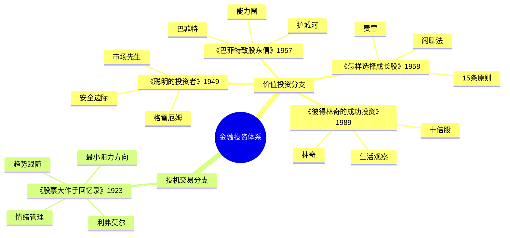

tags: []
# 《股票大作手回忆录》读书笔记

## 这本书要解决什么问题？

**核心困境**：为什么同样的人在市场中反复犯错？如何在投机游戏中保持理性？交易中最大的敌人是谁？投资与投机的本质区别是什么？

**一句话定位**：
> 市场是人性的镜子，投机是与自我的战争。赚多少钱是其次，认识自己才是根本。

**基本信息**：
- 书名：《股票大作手回忆录》（Reminiscences of a Stock Operator）
- 作者：埃德温·勒菲弗（Edwin Lefevre），以杰西·利弗莫尔为原型创作
- 出版：1923年
- 核心人物：杰西·利弗莫尔（Jesse Livermore, 1877-1940）

### 作者站在什么位置说这些话？

| 维度 | 定位 |
|------|------|
| 主领域 | 交易心理学 / 投机哲学 |
| 跨界领域 | 行为金融学、风险管理、决策心理学 |
| 作者背景 | 勒菲弗以利弗莫尔为原型创作的小说体传记 |
| 书籍地位 | "华尔街最经典的投资书籍之一"，《财富》杂志选为人生必读最睿智的书之一 |
| 核心价值 | 不是教你如何预测市场，而是教你如何认识自己 |

### 和其他书有什么关系？

| 关联书籍 | 关联关系 | 共同底层逻辑 |
|----------|----------|--------------|
| [[聪明的投资者-格雷厄姆]] | 对立 | 格雷厄姆：投资=安全边际；利弗莫尔：投机=趋势跟随 |
| [[巴菲特致股东信-巴菲特]] | 对立 | 巴菲特：长期持有+护城河；利弗莫尔：趋势交易+快速获利 |
| [[怎样选择成长股-费雪]] | 对立 | 费雪：长期成长+深度调研；利弗莫尔：短期波动+趋势跟随 |
| [[彼得林奇的成功投资-彼得林奇]] | 互补 | 都强调市场心理和独立思考 |

### 知识网络图

---
tags: []
## 作者的核心论点

### 华尔街没有新鲜事，投机像山岳一样古老

1923年的书中描述的场景，在今天的A股市场天天上演。散户追涨杀跌，机构割韭菜。牛市时人人是股神，熊市时个个是韭菜。AI热潮、加密货币、元宇宙——每一次都是历史押韵。

为什么？因为人性不变。贪婪驱动牛市，恐惧制造熊市，循环往复。技术会变，工具会变，但贪婪和恐惧是永恒的驱动力。

> **人性不变定律**：技术会变，工具会变，但人性不会变。贪婪和恐惧是永恒的驱动力。

投资者和投机者面对同样的市场，应对方式却完全不同。投资者看到市场波动会逆向思考——恐惧时买入。投机者看到市场波动会顺势而为——跟随趋势。但两人都承认一点：你改变不了市场，只能改变自己。

以前我总想预测市场走向，现在我明白，市场不需要预测，只需要理解。人性不变，规律不变，换个包装还是同一个剧本。下次看到新概念、新风口，我不会再觉得"这次不一样"，而是问：贪婪和恐惧又在哪里上演？

但这还没完，作者进一步指出，市场有自己的语言——价格。

### 价格沿阻力最小的方向移动

利弗莫尔发现，价格总是"选择最容易的路"。上涨时突破阻力位很轻松，下跌时支撑位不堪一击。市场不会骗人，骗人的是人的主观判断。

市场就像水，总是沿着阻力最小的路径流动。多方更强就向上，空方更强就向下，势均力敌就横盘。投机交易的关键：识别趋势并跟随趋势。

> **阻力最小定律**：市场就像水，总是沿着阻力最小的路径流动。顺应它，不要对抗它。

投机者（利弗莫尔）识别趋势方向，顺势而为。投资者（格雷厄姆/巴菲特）评估内在价值，等待价格回归价值。两者都不对抗市场，只是应对方式不同。

这个观点打碎了我的一个假设：我以为价格是我"判断"出来的，原来价格是市场"选择"出来的。我不需要证明自己聪明，只需要承认市场比我聪明。下次看到价格走势与我的判断相反，我不会再坚持"我是对的，市场错了"，而是问：阻力最小的方向是哪里？

有了对价格的敬畏，还需要警惕内心最大的敌人——情绪。

### 希望和恐惧是交易者最大的敌人

亏损时抱有"希望"，不肯止损。盈利时害怕"回吐"，过早离场。被这两种情绪左右，失去理性判断。

利弗莫尔说过："我最大的敌人不是市场，而是我自己。"这句话格雷厄姆也说过——"投资者最大的敌人不是股票市场，而是他自己。"两个对手，同一句话。

> **情绪定律**：希望让你承受不该承受的亏损，恐惧让你错过该把握的机会。

这个观点打碎了我对"理性决策"的假设。我以为亏损是因为分析不够，原来是因为情绪在替我做决定。下次遇到亏损持仓，我不会再告诉自己"再等等看"，而是问自己："我是真的看好，还是只是不愿意承认错误？"

控制情绪只是第一步，这引出了另一个问题：既然要管住手，那如何赚大钱？

### 赚大钱靠的是"坐得住"，而不是频繁交易

利弗莫尔说："能够同时判断正确又坚持持有的人很罕见。"大多数人赚小钱就跑，亏钱却死扛。真正的大钱是靠"躺赢"，而不是"折腾"。

Tesla早期投资者坐得住10年，100倍收益。A股散户频繁追涨杀跌，70%亏损。区别不在于谁更聪明，在于谁更能管住自己的手。

> **耐心定律**：赚大钱不是靠频繁交易，而是靠少数几次正确的判断加上长期持有。

投机者和投资者都懂这个道理，只是"持有"的依据不同。投机者：趋势未变就持有，趋势改变就退出。投资者：价值未变就持有，基本面恶化才退出。共同点：耐心持有，不频繁操作。

这打碎了我对"勤奋"的迷信。我以为频繁交易是认真，其实频繁交易是焦虑。真正的功夫不在手，在心。下次想"再操作一次"，我不会再觉得是进取，而是问：我是坐得住，还是坐不住？

耐心只是硬币的一面，另一面是搞清楚你在玩什么游戏。

### 投资和投机的本质差异

格雷厄姆在《聪明的投资者》里给了一个清晰的定义：投资以深入分析为基础，确保本金安全，获得满意回报。不满足这些要求的操作就是投机。

利弗莫尔的投机哲学不同。他认为投机是一门艺术，不是赌博。投机成功 = 趋势识别 + 情绪控制 + 资金管理。

但两个人有一个关键共识：都承认人性是最大的敌人，都强调纪律和耐心，都认为市场短期是情绪驱动的。

> **投资投机定律**：投资赚企业成长的钱，时间是朋友。投机赚市场波动的钱，时间是敌人。

投资者用财报分析、护城河、安全边际。投机者用技术分析、趋势识别、情绪管理。投资者追求稳定合理的回报，投机者承受高风险博取不确定收益。两种游戏，两种心态，不要搞混。

这个观点让我重新审视自己的交易。以前我说"我在投资"，其实是在投机——没有安全边际，没有长期持有，只是在赌方向。下次买入一只股票，我不会再笼统说"看好"，而是明确问：我是赚企业成长的钱，还是赚市场波动的钱？

理解了两种游戏的区别，最后一课是最沉重的一课——利弗莫尔本人的悲剧。

### 四起四落——成功是最大的失败原因

利弗莫尔一生四起四落，1929年做空美股获利1亿美元，最终却破产自杀，留下遗言："我的一生是个失败。"

他的悲剧不是因为投机本身，而是因为一个致命循环：成功 → 过度自信 → 风险意识下降 → 杠杆放大 → 一次大错 → 一切归零。

> **成功陷阱定律**：成功会让人放松警惕，而市场永远在等待你犯错。最大的敌人不是市场，而是成功后的自己。

利弗莫尔的结局是所有投机者的警示。投机可以赚大钱，但如果没有严格的纪律体系，一次失控就能毁掉一切。投资更稳但赚得更慢——这是用利弗莫尔的一生换来的教训。

下次赚了大钱想要"加杠杆搏一把"，我不会再觉得是机会，而是想起利弗莫尔的四起四落——成功后的放纵，才是真正的危险。

---
tags: []
## 这本书的局限

> 利弗莫尔的智慧来自1920年代的美国股市，有它鲜明的时代烙印和个人局限。

| 批评点 | 谁在批评 | 怎么说 | 实际情况 |
|--------|---------|--------|---------|
| 时代局限 | 当代交易员 | 1923年的市场没有算法交易、高频交易，投机环境完全不同 | 核心思想（人性不变、情绪控制）超越时代，但具体方法需要更新 |
| 破产的警示 | 价值投资者 | 利弗莫尔最终破产自杀，他的方法真的可靠吗？ | 悲剧源于过度自信和杠杆过大，不否定趋势跟随本身的价值 |
| 投机不适合大多数人 | 格雷厄姆学派 | 投机需要特殊性格和能力，大多数人应该选择投资 | 确实如此。投资适合大多数人，投机适合少数专业人士 |
| 只有一面之词 | 行为金融学者 | 全书只呈现投机者视角，没有讨论价值投资 | 作为投机经典立场鲜明，但读者需要读对立面 |

**一句话总结局限性**：
> 利弗莫尔教会你认识人性，但他的人生也证明了：认识人性不等于能战胜人性。投机可以赚大钱，但也可能输光一切。对大多数人来说，投资更稳健。

---
tags: []
## 最值得记住的话

**原书说的**：
1. "华尔街没有新鲜事，因为投机像山岳一样古老。"
2. "赚大钱靠的是'坐得住'，而不是频繁交易。"
3. "从来没有一个人因为止损而破产。"
4. "市场永远是对的，意见经常是错的。"
5. "能够同时判断正确又坚持持有的人很罕见。"
6. "亏损是交易的一部分，就像做生意有成本一样。"
7. "不要一次性把所有子弹打完。"
8. "当你看到趋势时，不要问为什么，跟随它就好。"
9. "投机是一门艺术，不是赌博。"
10. "趋势是你的朋友，永远不要与趋势对抗。"
11. "价格沿阻力最小的方向移动。"
12. "希望和恐惧是交易者最大的敌人。"

**翻译成人话**：
1. 市场是人性的镜子，你看到的不是K线，是人心
2. 希望和恐惧，是交易者大脑里最大的两个BUG
3. 频繁交易就像割肉喂鹰，你越折腾，市场越吃你
4. 止损不是认输，是保命
5. 真正的投机大师，不是预测未来，而是应对当下
6. 牛市的尽头是熊市，成功的尽头是失败——这就是人性
7. 最大的敌人不是庄家，不是机构，是你自己的人性
8. 交易的本质不是战胜市场，是战胜自己
9. 华尔街的剧本从来不改，只是演员换了批人
10. 四起四落的不是利弗莫尔，是每一个投机者的一生
11. 投资是做生意，投机是游戏——别搞混了
12. 新手死于追高，老手死于抄底，高手死于杠杆

---
tags: []
## 讲给没读过的人听

杰西·利弗莫尔14岁开始在股票经纪行做记录员，靠观察数字的规律赚到了第一桶金。1929年美股大崩盘，他做空获利1亿美元。但他一生四次破产，最终在1940年饮弹自尽，留下遗言："我的一生是个失败。"

他留下了一些什么？一个核心洞察：华尔街没有新鲜事。因为人性不变，市场就不变。贪婪和恐惧永远在交替。1923年的散户追涨杀跌，今天的散户也在追涨杀跌。

他还发现，交易者最大的敌人不是市场，是自己的情绪。亏损时抱有"希望"，不肯止损，越套越深。盈利时害怕"回吐"，过早离场，错失大牛。希望和恐惧，是交易者大脑里最大的两个BUG。

利弗莫尔用一生证明了一件事：认识人性不难，难的是战胜人性。投机可以赚大钱，但一次失控就能毁掉一切。投资更稳但赚得更慢——这是他用命换来的教训。

---
tags: []
## 用来检验理解的问题

**基础回忆**：
1. Q: "华尔街没有新鲜事"是什么意思？
   A: 技术会变，工具会变，但人性不会变。贪婪和恐惧永远在交替驱动市场周期。

2. Q: "价格沿阻力最小方向移动"是什么意思？
   A: 市场像水，总是走最容易的路。多方更强就向上，空方更强就向下。

3. Q: 利弗莫尔为什么最终破产？
   A: 成功后过度自信，风险意识下降，杠杆放大，一次大错一切归零。四起四落的循环。

**理解验证**：
1. Q: 为什么"希望和恐惧"是交易者最大的敌人？
   A: 希望让亏损者不肯止损，恐惧让盈利者过早离场。两种情绪都让你做出违背纪律的决定。

2. Q: 投资者和投机者的根本区别是什么？
   A: 投资赚企业成长的钱，时间是朋友。投机赚市场波动的钱，时间是敌人。两种游戏，两种心态。

3. Q: 利弗莫尔和格雷厄姆的共同点是什么？
   A: 都承认人性是最大的敌人，都强调纪律和耐心，都认为市场短期是情绪驱动的。

**实际应用**：
1. Q: 你现在持有的股票，你是在投资还是在投机？
   A: 关键问题：你是基于企业价值还是市场趋势做的决策？你打算持有多久？你有止损计划吗？

2. Q: 下次亏损时，你怎么避免"希望"陷阱？
   A: 设定止损线，触及就执行，不给自己"再等等"的机会。

**深度分析**：
1. Q: 利弗莫尔的悲剧能否避免？
   A: 理论上可以——如果他能始终遵守自己制定的纪律。但这正是人性的悖论：认识纪律不难，难的是在成功后依然遵守纪律。

2. Q: 为什么巴菲特读了这本书却选择了投资而非投机？
   A: 巴菲特理解了利弗莫尔的智慧（认识人性），但选择了不同的路径（价值投资）。两者的区别在于：投机需要持续战胜人性，投资只需要在买入时做对一次然后等待。

---
tags: []
## 和其他书的对话

格雷厄姆和利弗莫尔是对手。格雷厄姆说投资要安全边际，利弗莫尔说投机要趋势跟随。格雷厄姆的弟子巴菲特稳健一生，利弗莫尔四起四落。但两个人说过一句几乎一样的话："最大的敌人不是市场，而是我自己。"读了格雷厄姆再去读利弗莫尔，会明白投资和投机是两种完全不同的游戏。

巴菲特是利弗莫尔的反面教材。巴菲特从格雷厄姆那里学到了安全边际，从利弗莫尔那里学到了认识人性，但选择了价值投资的路径。利弗莫尔一生在和市场搏斗，巴菲特一生在和市场做朋友。

费雪和利弗莫尔的区别在于时间。费雪用15条原则找到成长股，然后持有十年。利弗莫尔识别趋势，然后跟随趋势，趋势结束就退出。一个是种树的人，一个是冲浪的人。

彼得林奇和利弗莫尔都强调市场心理和独立思考，但方向不同。林奇从日常生活中发现十倍股，利弗莫尔从K线中发现趋势。一个看生活，一个看市场。

---
tags: []
*拆解日期：2026-02-15*
*下次回访：1周后回顾「讲给没读过的人听」和「检验问题」*