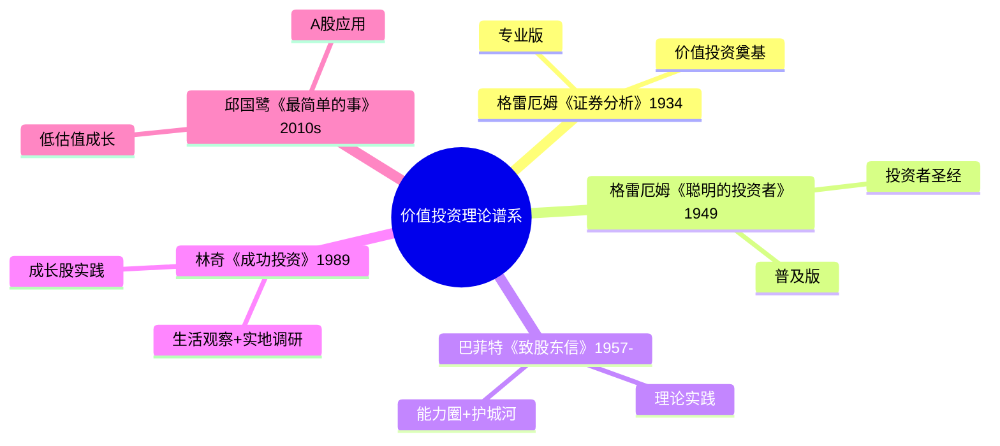

# 《证券分析》读书笔记

## 这本书要解决什么问题？

**核心困境**：1934年，美国股市充满投机、操纵、盲目。投资者如何在波动市场中找到真实价值？如何区分"投资"与"投机"？

**一句话定位**：
> 投资是买得值的资产，投机是赌博。格雷厄姆教你识别区别。

### 作者站在什么位置说这些话？

| 维度 | 定位 |
|------|------|
| 主领域 | 价值投资/证券分析 |
| 跨界领域 | 会计学、财务分析、法律 |
| 作者背景 | 本杰明·格雷厄姆（1894-1976）+ 戴维·多德，哥伦比亚大学教授，"价值投资之父"、"华尔街教父" |
| 历史语境 | 1934年出版，大萧条后市场混乱。格雷厄姆从哥伦比亚大学教授的立场出发，用学术严谨的方法为投资建立了一套可检验的框架 |
| 与《聪明的投资者》关系 | 《证券分析》是专业版，《聪明的投资者》是普及版 |
| 巴菲特评价 | "有史以来最好的投资书籍" |

### 和其他书有什么关系？

| 关联书籍 | 关联关系 | 共同底层逻辑 |
|----------|----------|--------------|
| [[聪明的投资者-格雷厄姆]] | 同作者，普及版 | 《证券分析》是专业版，《聪明的投资者》是写给普通投资者的 |
| [[巴菲特致股东信-巴菲特]] | 师承关系 | 巴菲特说"血管里80%的血液来自格雷厄姆" |
| [[彼得林奇的成功投资-彼得林奇]] | 理论继承 | 林奇的"生活观察"建立在格雷厄姆"基本面分析"之上 |
| [[滚雪球-施罗德]] | 同时代 | 同一投资思想谱系 |
| [[投资中最简单的事-邱国鹭]] | 理论应用 | 邱国鹭的"低估值成长"是格雷厄姆理论在A股的应用 |

### 知识网络图

---

## 作者的核心论点

### 投资vs投机：这是两件完全不同的事

1934年美国股市里，投机者伪装成投资者，投资者不自知地投机。格雷厄姆第一次明确划出界限。

投资是：深入分析基本面、确保本金安全、获得满意的回报。投机是：预测市场波动、承担巨大风险、追求不切实际的回报。投资者的态度是"所有者视角"，投机者的态度是"交易者视角"。

这五个区别看似简单，却是一切投资认知的基础。投资是买下蛋的鸡，投机是买彩票。投资问"这家公司值多少钱"，投机问"股价明天涨还是跌"。

> **格雷厄姆第一定律**：投资必须满足三个条件：深入分析、确保本金安全、获得满意的回报。不满足这三条，就是投机。

这个观点打碎了我对"买股票就是在投资"的假设。追AI概念股涨100%——你深入分析了吗？本金安全吗？如果答案是不，那你不是在投资，是在赌博。大多数人亏钱的根源：自以为在投资，实际在投机。

确定了什么是投资，接下来要问：怎么判断值不值？

### 安全边际：投资的护城河

内在价值100元，股价60元，差额40元——这就是安全边际。格雷厄姆的原话："安全边际是投资成功的基石。"巴菲特更简洁："投资最重要的四个字。"

安全边际公式：（内在价值 - 买入价格）/ 内在价值。示例：内在价值100元，买入价格60元，安全边际40%。这个差额可以缓冲分析错误、市场波动、运气不好、意外事件。

安全边际不是让你赚更多，是让你亏更少。先不亏，再求赚。

> **安全边际定律**：价格与价值的差额就是你的安全垫。这个垫不是让你赚更多，而是让你亏更少。先不亏，再求赚。

下次看到一家公司估值合理但不算便宜，我会问：安全边际够不够？如果内在价值100元，股价95元，我会放弃——5%的缓冲太薄。但如果股价60元，我会认真考虑。

这打碎了我对"好公司值得买"的假设。原来好公司如果买贵了，就是坏投资。安全边际才是决定你能否赚钱的关键——不是公司有多好，是你买得多便宜。

有了安全边际的概念，还需要知道：怎么计算内在价值？

### 内在价值：企业的真实价格

账面价值：资产负债表上的净值（资产 - 负债）。市场价值：股价 x 总股本。内在价值：企业未来现金流的现值。三者完全不同。

格雷厄姆首次系统阐述"内在价值"概念，强调内在价值不等于账面价值，也不等于市场价格。它是一个估计值，需要综合资产价值、盈利能力、增长潜力三要素。

内在价值是客观存在的，但估值是主观判断的。投资者要做的，是尽可能准确地估算内在价值，然后等待市场价格低于这个估算值。

> **内在价值定律**：内在价值是客观存在的，但估值是主观判断的。投资者要做的，是尽可能准确地估算内在价值。

茅台PE=50倍，增长快但估值过高，内在价值难支撑。银行PB=0.5倍，低于账面价值，内在价值可能被低估。这就是2026年的实战场景。

这打碎了我对"估值有标准答案"的迷信。原来估值是一门艺术，不是科学。同样一家公司，10个分析师会算出10个不同的内在价值——关键是你的估算是否足够保守，是否留足安全边际。

估值是技术活，但面对市场波动，你还需要一种心态武器。

### 市场先生：拟人化的市场情绪

格雷厄姆创造了一个寓言：想象你有个合伙人叫"市场先生"，每天给你报价，你可以买也可以卖。他情绪不稳定，有时候极度抑郁（报价很低），有时候极度亢奋（报价很高）。你的任务不是被他影响，而是利用他的情绪。

市场先生抑郁时，他报的价格很低——买入机会。他亢奋时，报的价格很高——卖出机会。他情绪正常时，价格合理——持有观察。

> **市场先生定律**：市场先生是你的仆人，不是你的向导。不要被他情绪影响，要利用他的情绪。他抑郁时买，他亢奋时卖。如果你听从他的建议，你会亏钱。

2026年初大跌——市场先生抑郁，买入优质资产。2026年AI热潮——市场先生亢奋，卖出高估值标的。震荡行情——市场先生情绪波动，持有价值，耐心等待。

大多数人亏钱的原因：被市场先生情绪传染。他抑郁时你也抑郁（割肉），他亢奋时你也亢奋（追高）。格雷厄姆教的是：当他是疯子，你是正常人，你就赢了。

这个观点打碎了我的一个假设：我以为投资需要预测市场走势。现在才明白，你不需要预测市场先生明天的心情，你只需要在他极端抑郁时买入、极端亢奋时卖出。不需要预测，只需要利用。

---

## 这本书的局限

| 批评点 | 谁在批评 | 怎么说 | 实际情况 |
|--------|---------|--------|---------|
| 烟蒂股时代已过 | 成长派投资者 | 现代市场效率提高，捡烟蒂机会减少 | 格雷厄姆方法在极端时刻仍有价值 |
| 内在价值难以量化 | 估值专家 | DCF模型对参数假设极其敏感 | 定性原则+定量分析相结合更现实 |
| 忽视成长因素 | 费雪派投资者 | 过于强调安全边际，错过成长股 | 格雷厄姆后来承认成长投资的价值 |
| 1934年案例过时 | 现代读者 | 历史案例与今天相关性低 | 原则永恒，案例可替换 |

> 格雷厄姆的"捡烟蒂"策略在高效市场时代确实机会减少，但安全边际、市场先生等核心原则仍是投资认知的基石。巴菲特后来的成功证明：格雷厄姆理论+费雪成长思想=更完整的价值投资体系。

---

## 最值得记住的话

**原书说的**：
1. "投资操作是基于深入分析，确保本金安全并获得满意回报。不符合这些要求的操作就是投机。"
2. "价格是你付出的，价值是你得到的。"
3. "安全边际是投资成功的基石。"
4. "市场先生是你的仆人，不是你的向导。"
5. "内在价值是一个估计值，不是精确数字。"
6. "牛市中普通人也能赚钱，熊市中才能看出谁是真正的高手。"

**翻译成人话**：
1. 投资不是预测股价，是买值钱的东西
2. 安全边际就是：花50块买100块的东西
3. 市场先生每天来报价，他抑郁时你买，他亢奋时你卖
4. 内在价值是企业的真实价格，与股价无关
5. 投机者追涨杀跌，投资者等待机会
6. 先不亏，再求赚
7. 价格是你付出的，价值是你得到的
8. 买股票就是买公司的一部分
9. 牛市中人人是股神，熊市中才能看出真本事
10. 不要在激动时做决策

---

## 讲给没读过的人听

你知道什么是投资、什么是投机吗？

格雷厄姆在1934年给出了一条铁标准：投资必须深入分析、确保本金安全、获得满意回报。三条都满足才是投资，否则就是投机。

追涨杀跌？投机。听消息买入？投机。因为你没有深入分析，本金也不安全。

格雷厄姆还发明了一个寓言：想象市场是个情绪不稳定的合伙人，每天给你报价。他抑郁时报低价，亢奋时报高价。你的任务不是跟着他情绪走，而是利用他的情绪——他抑郁时买，他亢奋时卖。

最核心的概念是"安全边际"。花50块买值100块的东西，中间40块是你的安全垫。这个垫不是让你赚更多，是让你亏更少。先不亏，再求赚。

巴菲特说"血管里80%的血液来自格雷厄姆"。读完这本书，你就知道价值投资是怎么来的。

---

## 用来检验理解的问题

**基础回忆**：
1. Q: 格雷厄姆定义的"投资"三个条件是什么？
   A: 深入分析、确保本金安全、获得满意的回报。

2. Q: 什么是"安全边际"？
   A: 价格与内在价值的差额。（内在价值 - 买入价格）/ 内在价值。

3. Q: "市场先生"寓言的核心是什么？
   A: 市场是你的仆人，不是向导。利用他的情绪（抑郁时买，亢奋时卖），不要被他影响。

**理解验证**：
1. Q: 为什么"安全边际不是让你赚更多，是让你亏更少"？
   A: 安全边际是缓冲垫，应对分析错误、市场波动、意外事件。先确保不亏，再追求回报。

2. Q: 内在价值、账面价值、市场价值有什么区别？
   A: 账面价值是资产净值，市场价值是股价x股本，内在价值是未来现金流现值。三者完全不同。

3. Q: 为什么说"牛市中普通人也能赚钱，熊市中才能看出谁是高手"？
   A: 牛市里运气也能赚钱，无法区分能力与运气。熊市检验真正的风险控制能力。

**实际应用**：
1. Q: 用格雷厄姆的标准判断：追AI概念股涨100%是投资还是投机？
   A: 深入分析了吗？本金安全吗？答案都是不——这是投机。

2. Q: 市场先生在2026年AI热潮中的状态是什么？你该怎么应对？
   A: 亢奋状态。应对策略：卖出高估值标的，不要追高。

**深度分析**：
1. Q: 格雷厄姆和费雪的区别是什么？巴菲特如何融合？
   A: 格雷厄姆强调安全边际（当下价值），费雪强调成长潜力（未来价值）。巴菲特融合为"以合理价格买入伟大企业"。

2. Q: 《证券分析》和《聪明的投资者》有什么区别？
   A: 《证券分析》是专业版，技术细节多；《聪明的投资者》是普及版，适合普通投资者。先读普及版建立认知，再读专业版深化技能。

---

## 和其他书的对话

《聪明的投资者》是这本书的普及版姊妹篇。《证券分析》技术细节多，适合专业投资者；《聪明的投资者》概念清晰，适合普通人。巴菲特说"有史以来最好的投资书籍"指的是后者，但如果你想深入，前者的价值更大。

巴菲特的书信是格雷厄姆理论的实战案例。每一封信都在展示安全边际怎么用、市场先生怎么应对、内在价值怎么估算。巴菲特说"血管里80%的血液来自格雷厄姆"，剩下的20%来自哪里？一部分来自费雪的成长股思想，一部分来自他自己的实践。

林奇的方法建立在格雷厄姆理论之上。格雷厄姆教基本面分析，林奇把这套方法生活化——逛商场观察产品，从日常生活中发现机会。格雷厄姆是理论源头，林奇是通俗应用。关联金句："林奇的生活观察建立在格雷厄姆基本面分析之上。"

邱国鹭把格雷厄姆理论搬到A股。他的"低估值成长"本质上是格雷厄姆的安全边际+费雪的成长潜力，适配中国市场的结果。格雷厄姆的理论不是美国专利，是全球通用的价值投资框架。

此外，费思的《海龟交易法则》代表另一条路径。格雷厄姆强调基本面分析、财务数据、护城河、深度研究。费思强调技术分析、价格突破、机械执行、排除情绪。适合分析型的人用格雷厄姆，适合执行型的人用费思。理想状态：基本面选股，技术面择时。

---

*拆解日期：2026-02-14*
*下次回访：1周后回顾「讲给没读过的人听」和「检验问题」*