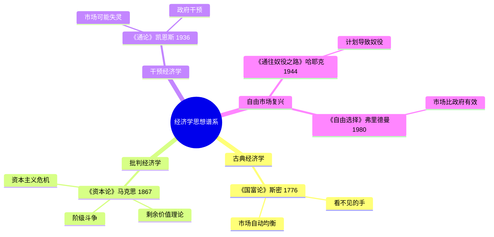

# 《资本论》读书笔记

## 这本书要解决什么问题？

**核心困境**：资本家越来越富，工人越来越穷。为什么？马克思说：因为利润的本质是"剥削"——资本家占有了工人创造的剩余价值。资本主义创造的财富越多，工人的处境反而越艰难。

**一句话定位**：
> 你干8小时，4小时给自己干，4小时给老板白干——这就是剩余价值的秘密。

### 作者站在什么位置说这些话？

| 维度 | 定位 |
|------|------|
| 主领域 | 政治经济学（批判经济学） |
| 跨界领域 | 哲学（辩证法）、历史学（阶级斗争）、社会学（异化理论） |
| 作者背景 | 哲学博士出身，用40年写就这部巨著，被誉为"千年第一思想家" |
| 历史语境 | 1867年出版，工业革命后劳资矛盾尖锐的时代。马克思站在工人阶级立场，输出的是对资本主义整套运行逻辑的系统性批判 |

### 和其他书有什么关系？

| 关联书籍 | 关联关系 | 共同底层逻辑 |
|----------|----------|--------------|
| [[国富论-亚当·斯密]] | 理论对立 | 自由市场创造财富 vs 自由市场创造剥削 |
| [[通论-凯恩斯]] | 互补视角 | 都承认资本主义有内在缺陷，但解决方案不同 |
| [[通往奴役之路-哈耶克]] | 对立镜像 | 马克思预言资本主义崩溃，哈耶克预言社会主义崩溃 |
| [[自由选择-弗里德曼]] | 理论对立 | 市场是解放力量 vs 市场是剥削力量 |

### 知识网络图

---

## 作者的核心论点

### 劳动价值论：一件商品到底值多少钱？

一件衬衫，工厂A机器先进2小时做完，工厂B手工制作8小时做完。值多少钱？马克思说：不看个别劳动时间，看社会平均——4小时。这就是"社会必要劳动时间"。

这个概念其实不复杂。就像考试评分，不看某个学生答了多久，看平均水准。只不过马克思把这个逻辑用在了一切商品上。他说价值不是商品的物理属性，而是人与人之间的关系被物化了。用大白话说就是：干多少活，值多少钱，但这个"多少"是社会平均标准，不是你个人标准。

> **劳动价值定律**：商品的价值由生产该商品的社会必要劳动时间决定，劳动时间是价值的唯一尺度。

这就引出一个让人不舒服的问题：如果你的劳动时间不被社会承认，你的努力就不值钱。AI时代尤其如此——当机器劳动时间远低于人的劳动时间，人就被淘汰了。技术进步的残酷逻辑，马克思150年前就看透了。

下次遇到有人说"我努力了为什么不值钱"，我不会再劝他"继续努力"，而是告诉他：努力不值钱，是社会承认的劳动时间才值钱。你的努力如果不被社会标准认可，就是无效劳动。

理解了价值的来源，下一个问题就更尖锐了：你创造的价值，到底归谁？

### 剩余价值：利润的本质是剥削

这是一个经典的数字拆解。工人日工资200元，8小时创造价值400元。剩余价值 = 400 - 200 = 200元。剩余价值率 = 200 / 200 = 100%。翻译成人话：你干8小时，4小时给自己干，4小时给老板白干。

马克思的逻辑链条是这样的：资本家投入不变资本（机器、原料）和可变资本（工资），工人劳动创造新价值，其中一部分以工资形式还给工人，另一部分——剩余价值——被资本家无偿占有。利润不是"风险回报"，不是"管理报酬"，是"无偿占有"。马克思的原话更加尖锐：资本是"死劳动"，它像吸血鬼一样吸吮"活劳动"。

> **剩余价值定律**：利润的本质是资本家对工人剩余劳动的无偿占有。剩余价值率 = 剩余价值 / 可变资本。

这个观点打碎了我的一个假设。我以前觉得工资是"劳动的报酬"，现在看，工资只是让你活着明天继续干。996的本质就是剩余价值最大化——干得越多，被占有的越多。你以为工资涨了是在进步？不，只要工资涨幅跑不赢你创造的价值增速，你就在被更多地剥削。

利润归了谁，接着要问的是：这个过程把人变成了什么？

### 异化：人变成了工具

马克思在150年前写的打工人的日常，读起来像在写2026年：

- 你造的iPhone不是你的——与产品异化
- 打工是惩罚不是快乐——与劳动异化
- 你觉得自己像个机器——与自己异化
- 同事是对手不是伙伴——与他人异化

马克思的经典描述让人窒息："工人在劳动中不是肯定自己，而是否定自己，不是感到幸福，而是感到不幸，不是自由地发挥自己的体力和智力，而是使自己的肉体受折磨、精神遭摧残。"

为什么会这样？因为私有制让工人与生产资料分离，被迫出卖劳动力，劳动产品属于资本家，于是四种异化接踵而来。

> **异化定律**：在资本主义下，工人与自己的本质、劳动产品、他人相分离。劳动不再是人的自我实现，而是自我否定。

"躺平"文化、精神内耗、职业倦怠、"社畜"自嘲——这些2026年的热词，马克思用一个"异化"就解释了。打工打到后来，你不认识自己了，因为你变成了工具。

这打碎了我对"工作让人成长"的迷信。原来打工不是自我实现，是自我否定。你越努力工作，越不像一个人——这不是你的问题，是系统设计的必然结果。

但马克思的野心不止于诊断。他预言这个系统最终会把自己玩死。

### 资本主义危机：系统必然崩溃

资本家追求利润，提高效率，机器替代工人。工人失业，购买力下降。生产过剩，商品卖不出去。经济危机。小资本破产，大资本扩张（资本集中）。矛盾进一步激化。然后继续循环。

马克思的原话掷地有声："资产阶级不仅锻造了置自身于死地的武器；它还产生了将要运用这武器的人——现代的工人，即无产者。"更简练的版本："资本主义生产了它自己的掘墓人。"

这个预言的底层矛盾是：生产社会化（大规模协作生产）与私人占有制（生产资料归资本家）之间的冲突。个别企业有组织，整个社会无政府。生产无限扩张，消费相对萎缩。生产过剩危机→周期性经济危机→阶级矛盾激化→革命或变革。

> **历史辩证法**：资本主义内部矛盾（生产社会化与私人占有）最终会导致其自我毁灭。资本主义创造了埋葬自己的掘墓人——无产阶级。

下次听到有人抱怨2008金融危机、贫富差距扩大、AI替代人类、零工经济，我会告诉他们：这些马克思150年前就预言了。富人越富穷人越穷——这不是bug，是系统的feature。

---

## 这本书的局限

| 批评点 | 谁在批评 | 怎么说 | 实际情况 |
|--------|---------|--------|---------|
| 劳动价值论有缺陷 | 现代经济学家 | 价值不只由劳动时间决定，还有效用、稀缺性 | 劳动是重要维度，但确实不是唯一维度 |
| 革命预言未实现 | 历史学家 | 西方国家通过改良避免了革命 | 福利国家确实缓解了矛盾，但贫富分化仍在加剧 |
| 忽视市场效率 | 自由市场经济学家 | 计划经济在实践中远不如市场经济 | 苏联的失败印证了批评，但北欧模式证明改良可行 |
| 过于阶级对立 | 社会评论家 | 社会不是只有压迫者和被压迫者 | 中产阶级的崛起确实复杂了阶级分析 |

> 马克思对资本主义的诊断至今锐利，但他开出的药方（暴力革命、无产阶级专政）在20世纪的实践中代价沉重。

---

## 最值得记住的话

**原书说的**：
1. "资本来到世间，从头到脚，每个毛孔都滴着血和肮脏的东西。"
2. "工人生产的财富越多，他的产品数量越多，他自己就越贫穷。"
3. "资本是死劳动，它像吸血鬼一样，只有吮吸活劳动才有生命。"
4. "一切至今存在的社会的历史都是阶级斗争的历史。"
5. "资产阶级不仅锻造了置自身于死地的武器；它还产生了将要运用这武器的人——现代的工人，即无产者。"
6. "哲学家们只是用不同的方式解释世界，而问题在于改变世界。"

**翻译成人话**：
1. 你干8小时，4小时给老板白干
2. 利润不是风险回报，是占有的你的劳动
3. 工资不是你创造的价值，是让你活着的最低成本
4. 老板赚的钱，有一半是你创造但他没给你的
5. 打工打到不认识自己——这就是异化
6. 富人越富穷人越穷——这不是bug，是系统的feature
7. 机器替代工人→失业→危机——150年前的预言
8. 你越努力，老板越有钱——系统设计如此
9. 理解规则，才能打破规则
10. 不是你不够努力，是你没有资本

---

## 讲给没读过的人听

你有没有想过，为什么打工永远不能发财？

马克思在150年前就算清楚了。你每天工作8小时，但只有前4小时是在给自己干——创造的价值刚好等于你的工资。后4小时呢？你创造的价值全部归老板。这就是"剩余价值"。

所以不是你不够努力，是系统设计如此。你创造100元，老板给你30元，剩下70元是他的利润。你干得越多，他赚得越多。

马克思还说了更扎心的话：打工打到后来，你不认识自己了。你觉得自己像个机器，不是人。他管这个叫"异化"。150年前说的，像在说今天的打工人。

他还预言了：富人越富穷人越穷，机器替代工人，周期性危机——这些今天全在发生。他说资本主义创造了埋葬自己的掘墓人。这话对不对，历史还在验证。

---

## 用来检验理解的问题

**基础回忆**：
1. Q: 什么是"社会必要劳动时间"？
   A: 不是个别劳动时间，是生产某种商品的社会平均劳动时间。它决定商品的价值。

2. Q: 剩余价值是怎么产生的？
   A: 工人创造的总价值中，超过工资的部分被资本家无偿占有。剩余价值率 = 剩余价值 / 可变资本。

3. Q: 四种异化分别是什么？
   A: 与产品异化、与劳动异化、与自己异化、与他人异化。

**理解验证**：
1. Q: 为什么马克思说"利润不是风险回报"？
   A: 利润来自工人无偿劳动创造的价值，不是资本家承担风险的补偿。

2. Q: 资本主义的基本矛盾是什么？
   A: 生产社会化与私人占有制之间的矛盾。大规模协作生产但利润被少数人占有。

3. Q: 为什么"躺平"可以用异化理论解释？
   A: 躺平是对异化劳动的消极抵抗——当劳动不再是自我实现而是自我否定，人就会拒绝参与。

**实际应用**：
1. Q: 用剩余价值理论分析"996是福报"这句话。
   A: 996的本质是剩余价值最大化。工作时间越长，被无偿占有的部分越大。

2. Q: AI替代人类是马克思预言的哪一部分？
   A: 资本有机构成提高——机器替代工人→失业→购买力下降→生产过剩危机。

**深度分析**：
1. Q: 马克思和凯恩斯都承认资本主义有缺陷，为什么开出的药方不同？
   A: 马克思认为市场本身就是问题，需要革命；凯恩斯认为市场可以改良，需要政府干预。

2. Q: 为什么马克思的革命预言在西方没有完全实现？
   A: 福利国家、工会运动、中产阶级崛起等因素缓解了阶级矛盾。但贫富分化的趋势仍在持续。

---

## 和其他书的对话

亚当·斯密和马克思是一枚硬币的两面。斯密1776年写《国富论》，说分工让大家都富裕，市场自动协调；马克思1867年写《资本论》，说分工让工人变成零件，市场掩盖剥削。两人都从"劳动"出发，但一个看到的是繁荣，一个看到的是苦难。关联金句说得好："亚当·斯密说分工让大家都富裕，马克思说分工让工人变成零件。"

凯恩斯和马克思是治同一种病的两个医生。凯恩斯说资本主义有病，但能治——政府干预刺激需求就行。马克思说资本主义本身就是病，治不了，只能换。凯恩斯给资本主义开了药方，马克思给它开了死亡证明。关联金句："凯恩斯说政府干预能救市，马克思说市场本身就是问题。"

哈耶克和马克思是两个预言家，预言的方向完全相反。马克思预言资本主义必然崩溃，走向社会主义；哈耶克预言社会主义必然崩溃，通向奴役。关联金句："哈耶克说计划经济通向奴役，马克思说资本主义本身就是奴役。"

弗里德曼是马克思在自由市场维度上的头号对手。弗里德曼辩护市场，说市场是解放的力量；马克思批判市场，说市场是剥削的力量。读这两个人，你才能理解经济学最根本的分歧：市场到底是解放人还是压迫人？

此外，皮凯蒂的《21世纪资本论》用大数据验证了马克思的贫富分化预言——1%的人拥有50%的财富，数据证实了趋势，虽然机制解释不同。

---

*拆解日期：2026-02-14*
*下次回访：1周后回顾「讲给没读过的人听」和「检验问题」*