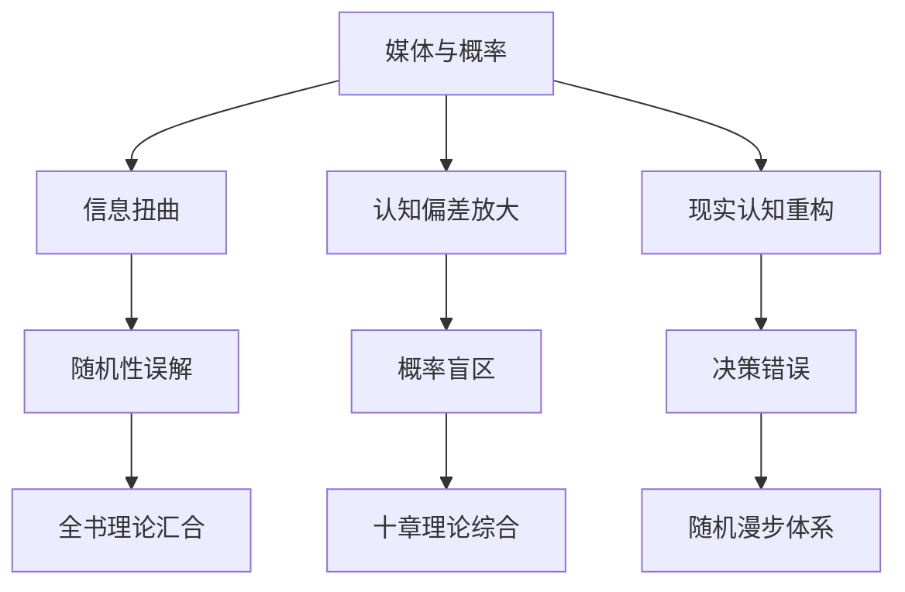

# 第11章 概率与媒体

## 📍 章节定位

### 全书位置
> 本书的最后一章，将前面十章所讨论的所有概念（随机性、概率、归纳谬误、幸存者偏差、非线性现象等）集中应用到媒体环境中。作为总结性的章节，它分析了现代媒体如何扭曲概率认知、放大随机事件的表象、强化人们的认知偏见，是全书理论的实际应用场景和发展归宿。本章揭示了媒体机制如何协同前面各章描述的认知偏差，系统性地误导我们的概率判断。

- **全书核心问题**: 如果成功大部分是运气，我们该怎么活着？
- **本章回答的问题**: 媒体如何操纵和扭曲我们对概率的感知？现代传播机制如何放大随机性造成的认知误区？
- **角色类型**: 传播批判型，整合全书理论于媒体批判
- **论证位置**: 综合应用全书理论，指向现代问题解决

### 章节序列
| 方向 | 章节标题 | 逻辑连接 |
|------|----------|----------|
| 前章 | [[第10章-生活中非线性事物]] | [从系统非线性到传播非线性] |
| 后章 | 完结篇 | [全书理论在媒体情境中的集大成] |

### 一句话定位
> 第11章作为全书的收官之作，揭示了媒体机制如何与人类认知偏差相互作用，系统性地扭曲概率感知，放大随机性对人决策的负面影响。本章将塔勒布的随机性思想与当代媒体环境相结合，为理解信息时代认知挑战提供了综合性框架，是塔勒布不确定性系列思想的完美汇总结尾。

---

## 🎯 核心观点

### 第一层：表层案例
> 章节中提到的具体媒体事件、新闻案例、媒体报道模式

| 案例名称 | 简要描述 | 页码 | 关键引文 |
|----------|----------|------|----------|
| 媒体恐慌周期 | 对偶发事件的过度放大报道 | p.410 | "媒体喜欢放大小概率事件" |
| 专家点评热衷 | 所有突发事件都需要专家解读 | p.415 | "没有专家的时代是可怕的，有专家的时代更可怕" |
| 成功学泛滥 | 各种成功经验被无限放大传播 | p.420 | "失败者不再说话，媒体只听得到成功者" |

### 第二层：中层机制
> 媒体传播与概率认知互相扭曲的运作机制

| 机制名称 | 组成要素 | 因果链条 | 证据来源 |
|----------|----------|----------|----------|
| 传播放大机制 | 受众心理、媒体激励、点击效益 | 事件随机发生→媒体筛选→放大传播→影响认知 | 媒体运作分析 |
| 认知反馈机制 | 概率错觉、模式识别、预期强化 | 媒体信息→认知塑造→预期改变→行为影响 | 行为研究 |
| 效应叠加机制 | 认知偏差、非线性传播、系统放大 | 多重偏差×媒体×时间→系统性误解→决策错误 | 案例综述 |

### 第三层：底层规律
> 信息传播对人类概率认知影响的根本原理

| 规律陈述 | 抽象层级 | 知识连接 | 适用范围 |
|----------|----------|----------|----------|
| 可得性偏差放大随机性认知误差 | 认知心理学 | [[思考快与慢-卡尼曼]] 系统1激活机制 | 决策分析、风险判断 |
| 媒体偏好与真实概率负相关 | 信息科学 + 统计学 | [[反脆弱-塔勒布]] 噪音信息的危害 | 信息消费、媒体素养 |
| 注意力经济扭曲客观信息分配 | 传播学 + 经济学 | [[黑天鹅-塔勒布]] 人为放大低概率事件 | 传播生态、信息架构 |

---

## 💬 降维翻译

### 观点1: 媒体放大效应与真实概率
#### 原文表达
> "媒體報導的頻率與事件發生的概率幾乎完全相反——越罕見的事件被報導得越高頻，越尋常的風險被忽視得越徹底。"
> —— p.410

#### 降维翻译（中学生能懂）
媒体有一个很奇怪的规律：越是不太可能发生的事情，媒体就越喜欢报道；越是常见且实际危险的事情，媒体反而不怎么提。比如飞机失事很少发生但每次发生都会大篇幅报道，而车祸天天发生但很少成为头条。这就让我们对各种风险的感觉产生了错位。

#### 日常类比（奶奶能懂）
就像村里的八卦一样，谁家娶媳妇嫁女儿这种普通事，大家不太关注，但偶尔有个风吹草动就要围观议论大半天。媒体也是这样，正常的事情不会吸引眼球，越是稀奇古怪的事情就越要渲染放大。久而久之，我们以为稀奇事很多，平常事很少，其实正好相反。

#### 检验
- Q: 如果一个中学生问为什么看新闻会觉得世界很危险？
- A: 因为媒体主要报道极端案例，日常普通事件不会成为新闻，所以我们接收到的信息比例和真实世界是相反的。

### 观点2: 媒体制造的确定性幻觉
#### 原文表达
> "媒體給每一件偶發事件都配上了一個專家解釋，讓我們以為隨機性是可以解釋的。"
> —— p.415

#### 降维翻译（中学生能懂）
每次发生随机事件后，都会有大量的专家给出分析和解释，仿佛这些随机的事件都是有原因可寻、有规律可循的。这让我们产生了一个错觉，好像随机的事件其实并不是随机的，只是因为我们不够聪明才看不到规律。

#### 日常类比（奶奶能懂）
就像有人中了彩票，就会有一大堆人分析他以前的买彩票规律、生活习惯、甚至是星座属相等等，仿佛他中奖是有某种必然原因。但实际上就是运气好，但大家总觉得要说出来个所以然才行。媒体为了有话说，就必须找人说出个理由，不管这个理由站不站得住脚。

#### 检验
- Q: 如果一个中学生问为什么专家总能解释突发事情？
- A: 因为媒体需要给观众一个交代，即使是随机事件也要找出个说法来满足人们的需求，但这并不代表随机事件真有什么深刻原因。

---

## ✨ 金句库

### 原书金句
| 金句 | 页码 | 适用场景 |
|------|------|----------|
| "媒体喜欢报道飞机失事，从不报道平稳飞行" | p.410 | 媒体批判案例 |
| "没有专家的年代可怕，有专家的年代更可怕" | p.415 | 权威质疑 |
| "专家解释让随即变成有规律" | p.420 | 认知误区 |
| "媒体是概率盲的放大器" | p.425 | 理论概括 |
| "轰动事件是平静事件的影子" | p.430 | 对比认知 |
| "新闻制造恐惧，而统计数据安慰我们" | p.435 | 媒介对比 |
| "媒体偏好与概率成反比" | p.440 | 传播规律 |
| "媒体放大小概率，忽略大概率" | p.445 | 风险认知 |
| "新闻是概率的敌人" | p.450 | 观念反转 |
| "专家把随机包装成逻辑" | p.455 | 批评权威 |

### 降维金句
| 金句 | 来源观点 | 适用场景 |
|------|----------|----------|
| 罕见事件成头条 | 注意力偏差 | 报道偏好分析 |
| 日常风险被忽视 | 客观认知 | 风险评估方法 |
| 媒体扭曲客观概率 | 信息操控 | 媒体素养 |
| 专家习惯性解释 | 权威依赖 | 独立判断意识 |
| 随机被包装因果 | 叙事谬误 | 因果理性 |
| 轰动代替统计学 | 感性替代理性 | 分析思维 |
| 点击率扭曲真相 | 商业逻辑 | 经济模型批判 |
| 无事不登新闻纸 | 新闻定义 | 新闻本质认知 |
| 概率不敌故事性 | 传播选择 | 信息筛选原则 |
| 言之凿凿非真理 | 怀疑主义 | 理性辨析能力 |

## 🔗 当下映射

### 💰 财富应用
| 场景 | 具体行动 | 预期效果 | 风险提示 |
|------|----------|----------|----------|
| 投资决策不受媒体影响 | 减少对新闻事件的情绪化应对 | 避免被短期波动干扰长期策略 | 可能错过某些重要信息 |
| 金融市场信息过滤 | 区分媒体噪音与真实风险信号 | 提高投资决策的质量和稳定性 | 需要较高专业判断力 |
| 理性投资心态建设 | 建立独立的价值判断体系 | 减少市场噪音引发的情绪波动 | 需要时间和实践锤炼 |

### 💼 职场应用
| 场景 | 具体行动 | 所需能力 | 适用职级 |
|------|----------|----------|----------|
| 决策独立性维护 | 减少对新闻和外部舆论的依赖 | 独立分析能力 | 所有管理层 |
| 信息源质量管理 | 区分有价值的报道与噪音资讯 | 媒体素养能力 | 中高层管理者 |
| 危机应对策略 | 识别媒体放大效应对业务的影响 | 风险意识和应变能力 | 高管层 |

### 🏠 生活应用
| 场景 | 具体行动 | 可行性 | 见效时间 |
|------|----------|--------|----------|
| 新闻消费升级 | 减少被动接受媒体制造的焦虑 | 高，需要自律 | 1周开始显现 |
| 信息获取习惯重塑 | 有选择地接触高质量信息源 | 高，需持续努力 | 1个月明显改善 |
| 概率思维培育 | 在日常事件中保持统计视角 | 中，需要训练 | 3个月形成习惯 |

### 72小时行动计划
1. 今天可以做的第一件事：暂停一段时间社交媒体和新闻的使用，观察对日常思考是否带来改变
2. 本周内可以尝试的事：选择几个信息源进行分析，评估其报道的平衡性和客观性
3. 需要准备资源才能做的事：建立个人的独立信息分析框架，减少对外部解读的依赖性

---

## 🕸️ 章节关联

### 向上关联 → 整书
- **贡献**: 总结并应用全书前十章理论于现代媒体环境，形成完整的随机性理论体系
- **位置**: 全书的集大成者，将前面所有理论统一应用于信息时代的问题

### 横向关联 → 章节间
| 章节编号 | 章节标题 | 关联类型 | 连接描述 |
|----------|----------|----------|----------|
| 第10章 | [[生活中非线性事物]] | 承接 | 从非线性系统到非线性传播 |
| 全书 | [[随机漫步的傻瓜-塔勒布-拆解记录]] | 综合 | 整合前10章理论 |
| 第4章 | [[随机性、信息和噪音]] | 呼应 | 验证媒体噪音的问题 |

### 向下关联 → 具体应用
| 应用场景 | 难度 | 前置知识 |
|----------|------|----------|
| 高效信息筛选方法 | 高 | 媒体素养+统计思维 |
| 独立判断能力养成 | 高 | 系统性认知框架 |
| 概率思维日常实践 | 中 | 概率基础+实践 |

### 跨书关联 → 知识网络
| 书籍 | 概念 | 关系 | 备注 |
|------|------|------|------|
| [[反脆弱-塔勒布]] | 噪音过滤 | 深化 | 本章概念的发展运用方向 |
| [[黑天鹅-塔勒布]] | 媒体放大效应 | 应用 | 对极端事件的传播机制分析 |
| [[传播学理论]] | 媒介影响认知 | 支撑 | 信息传播效果的社会学研究 |
| [[娱乐至死-波兹曼]] | 媒体对思维的影响 | 一致 | 媒体形式对内容理解的影响 |

### 关联可视化

---

## ❓ 问答设计

### Q1: 媒体为什么会扭曲概率认知？(记忆型)
**认知层次**: 记忆
**难度**: 低
**答案要点**:
- 媒体追求关注度
- 罕见事件更能吸引眼球
- 有违统计真实性的传播倾向

### Q2: 为什么说媒体是随机性的放大器？(理解型)
**认知层次**: 理解
**难度**: 中
**答案要点**:
- 用线性叙事包装随机事件
- 过度放大小概率事件影响
- 让不确定性显得可预测

### Q3: 如何建立有效的媒体信息筛选机制？(应用型)
**认知层次**: 应用
**难度**: 高
**答案要点**:
- 降低新闻消费频率
- 多方信息交叉验证
- 统计基础保持判断

### Q4: 媒体与认知偏差如何相互作用？(分析型)
**认知层次**: 分析
**难度**: 高
**答案要点**:
- 媒体利用已存偏见传播
- 认知偏差加强媒体效应
- 形成恶性循环放大机制

### Q5: 如何在信息泛滥时代保持理性？(评价型)
**认知层次**: 评价
**难度**: 高
**答案要点**:
- 培养媒介批判意识
- 坚持独立思考原则
- 建立数据判断框架

### Q6: 媒体环境下的新认知系统应如何构建？(创造型)
**认知层次**: 创造
**难度**: 高
**答案要点**:
- 构建概率导向的认知框架
- 建立媒体验证核查机制
- 创建理性思维保护屏障

### Q7: 事件罕见度与被报道频率的关系？(记忆型)
**认知层次**: 记忆
**难度**: 低
**答案要点**:
- 负相关关系
- 罕见事件更易被报道
- 日常事件不被关注

### Q8: 媒体叙事对风险管理的影响？(理解型)
**认知层次**: 理解
**难度**: 中
**答案要点**:
- 转移风险注意力
- 曲解概率评估
- 搅乱应对策略

### Q9: 如何衡量信息的真实影响？(应用型)
**认知层次**: 应用
**难度**: 高
**答案要点**:
- 对比历史数据
- 评估统计显着性
- 忽略短期波动

### Q10: 媒体传播机制的系统性缺陷？(分析型)
**认知层次**: 分析
**难度**: 高
**答案要点**:
- 商业驱动模式
- 注意力争夺逻辑
- 简化复杂事件

### Q11: 新媒体环境下的信息处理难题？(分析型)
**认知层次**: 分析
**难度**: 高
**答案要点**:
- 信息过载更加严重
- 来源验证困难
- 多重传播放大误差

### Q12: 构建现代化的认知防火墙应包含哪些维度？(创造型)
**认知层次**: 创造
**难度**: 高
**答案要点**:
- 算法推荐干预机制
- 媒体素养教育系统
- 概率思维培养方案

### Q13: 专家言论在媒体中扮演什么角色？(理解型)
**认知层次**: 理解
**难度**: 中
**答案要点**:
- 提供确定性幻觉
- 将随机包装为规律
- 满足观众期待

### Q14: 如何设计媒体消费的健康模式？(应用型)
**认知层次**: 应用
**难度**: 高
**答案要点**:
- 设定固定信息摄入窗口
- 选择高质量信息源
- 保持离线思考时间

### Q15: 理性与感性在信息时代的比重关系？(评价型)
**认知层次**: 评价
**难度**: 高
**答案要点**:
- 需要更多理性克制感性
- 平衡水是关键
- 避免被情绪绑架决策

---
