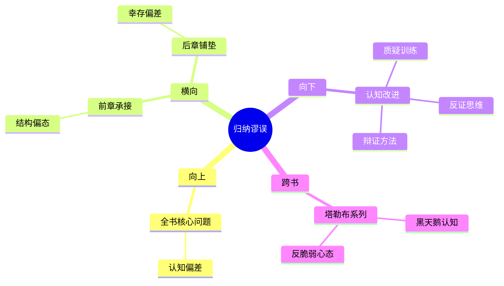

# 第7章 归纳法的问题

## 📍 章节定位

### 全书位置
> 本书在前面几章分别从数学、信息、生存和结构角度分析随机性后，深入哲学层面探讨人类认知模式中最根本的错误之一——归纳法谬误。本章从休谟的哲学质疑出发，探讨我们从个别经验中推导普遍定律的不合理性，揭示人类大脑认知结构中存在的系统性偏差，是全书认知批判的哲学高度所在。

- **全书核心问题**: 如果成功大部分是运气，我们该怎么活着？
- **本章回答的问题**: 为什么我们极易从有限经验中归纳出错误的规律？归纳思维如何导致我们高估技能、低估运气？
- **角色类型**: 认知批判型，从哲学根源上剖析人类认知的局限性
- **论证位置**: 揭示认知谬误的根本机制，为全面理解随机性提供哲学基础

### 章节序列
| 方向 | 章节标题 | 逻辑连接 |
|------|----------|----------|
| 前章 | [[第6章-偏态与不对称]] | [从结构不对称到认知谬误根源] |
| 后章 | [[第8章-幸存者偏差]] | [从归纳谬误到统计偏差现象] |

### 一句话定位
> 第7章从哲学高度揭示人类认知模式中的根本缺陷——归纳谬误，说明我们从有限经验中得出普遍结论的不可靠性，奠定了塔勒布对人类认知体系批判的哲学根基，是理解"成功源于运气"这一理念的认识论基础。

---

## 🎯 核心观点

### 第一层：表层案例
> 章节中的经典案例、历史典故、实验结果

| 案例名称 | 简要描述 | 页码 | 关键引文 |
|----------|----------|------|----------|
| 感谢火鸡 | 每天都被喂养却在感恩节被杀死 | p.245 | "火鸡归纳出农场主对它有益的规律，直到被宰杀" |
| 黑天鹅发现 | 欧洲人以为天鹅都是白的 | p.250 | "一个反例就推翻了普遍归纳的结论" |
| 多年连胜记录 | 网球选手或投资人的连续成功 | p.255 | "连胜不一定代表技能优势" |

### 第二层：中层机制
> 归纳谬误形成的认知机制

| 机制名称 | 组成要素 | 因果链条 | 证据来源 |
|----------|----------|----------|----------|
| 确认偏误机制 | 先验信念、选择性注意、证实倾向 | 预设观点→筛选信息→证实信念→强化偏误 | 心理学实验 |
| 模式错觉机制 | 顺序数据、模式认知、因果虚构 | 重复事件→模式拟合→因果假设→规律认同 | 神经科学研究 |
| 样本幻觉机制 | 有限经验、过度概括、统计误判 | 少数事例→归纳结论→普遍应用→错误预测 | 认知科学 |

### 第三层：底层规律
> 深层认知规律与人类思维方式

| 规律陈述 | 抽象层级 | 知识连接 | 适用范围 |
|----------|----------|----------|----------|
| 确定性需求驱动归纳冲动 | 认知心理学 + 神经科学 | [[思考快与慢-丹尼尔·卡尼曼-拆解记录]] 系统1寻求模式 | 管理决策、投资判断 |
| 有限理性制约认知质量 | 行为经济学 + 决策理论 | [[黑天鹅-塔勒布-拆解记录]] 认知局限性 | 学术研究、政策制定 |
| 因果幻觉根植于脑结构 | 神经科学 + 进化心理学 | [[反脆弱-塔勒布-拆解记录]] 认知脆弱性 | 日常生活、科学探索 |

---

## 💬 降维翻译

### 观点1: 感谢火鸡的讽喻
#### 原文表达
> "火雞每天都在為人類對牠好的信念而找到「證據」。每一次餵食，都會加強牠對人類友善的看法。感謝的感覺越來越強烈，直到感恩節那天到來。"
> —— p.245

#### 降维翻译（中学生能懂）
这个例子说明，我们经常把重复出现的好事当作是某种不变的规律，直到突然出现一个相反的例子打破我们的认知。就像一只火鸡每天都被人类喂食，就认为人类是友好的，却没有意识到感恩节那天会被宰杀。

#### 日常类比（奶奶能懂）
就像有人说"某某地方从来没出过事"，然后有一天出大事了。或者是天天都平安无事，就觉得永远不会出事似的。其实我们只看到了局部，看不到全貌，容易被表面现象迷惑。

#### 检验
- Q: 如果一个中学生问你"为什么会犯归纳错误"？
- A: 因为我们倾向于相信一直重复的事就是规律，但我们看到的例子太少，可能还没有遇到例外的情况。

### 观点2: 因果与关联的混淆
#### 原文表达
> "我們的大腦不善於區分因果關係與單純的時間先後順序關係。兩件事接連發生，我們就認定前者導致後者。"
> —— p.248

#### 降维翻译（中学生能懂）
大脑很容易把先后发生的两件事情当作原因和结果。比如今天我穿了某件衣服考试考好了，下次考试我就想再穿这件衣服，但实际上这两件事可能是没关系的。

#### 日常类比（奶奶能懂）
就像老人常说"喜鹊叫必有好事"、"乌鸦叫必有坏事"，其实这些都没科学依据。只是大脑喜欢寻找规律，不管这个规律是真的还是假的。

#### 检验
- Q: 如果一个中学生问你怎么区分因果和关联？
- A: 关联是两件事一起发生，因果是一个事导致另一个事。要多观察，还需要科学实验证明。

---

## ✨ 金句库

### 原书金句
| 金句 | 页码 | 适用场景 |
|------|------|----------|
| "归纳问题困扰了哲学家三百年" | p.240 | 学术讨论 |
| "我们是被设计来错误理解现实的" | p.242 | 认知革命 |
| "故事比现实更合理" | p.245 | 叙事谬误 |
| "我们热爱因果关系" | p.248 | 心理特点 |
| "模式识别是人类天性" | p.250 | 认知本能 |
| "火鸡的问题也是我们的问题" | p.252 | 普适警示 |
| "经验不是可靠的老师" | p.255 | 教育反思 |
| "归纳让人类成为傻瓜" | p.258 | 认知批判 |
| "重复强化错觉" | p.260 | 管理警告 |
| "黑天鹅一只就可颠覆一切" | p.265 | 风险提醒 |

### 降维金句
| 金句 | 来源观点 | 适用场景 |
|------|----------|----------|
| 重复不等于规则 | 感谢火鸡 | 投资判断 |
| 经验会欺骗我们 | 归纳谬误 | 决策提醒 |
| 故事不等于事实 | 叙事谬误 | 理性思维 |
| 因果常被误判 | 关联混淆 | 批判认知 |
| 习惯强化偏误 | 确认偏误 | 偏误纠正 |
| 安全感觉不真 | 平稳期风险 | 风险意识 |
| 归纳是原始算法 | 神经机制 | 认知升级 |
| 模式可能为幻 | 模式错觉 | 审慎判断 |
| 相继非因果 | 顺序谬误 | 分析思维 |
| 荷兰人也有黑球 | 概率假设 | 反范式化 |

## 🔗 当下映射

### 💰 财富应用
| 场景 | 具体行动 | 预期效果 | 风险提示 |
|------|----------|----------|----------|
| 投资决策反思 | 避免因过去业绩判断未来表现 | 减少基于历史趋势的投资错误 | 需要更多的前瞻性分析 |
| 风险管控机制 | 重视反面证据，质疑成功因素 | 运用压力测试评估极端情形 | 容易陷入过度保守 |
| 资产配置策略 | 降低对历史相关性关系的依赖 | 提高组合抵御黑天鹅事件的能力 | 短期跟踪误差可能增大 |

### 💼 职场应用
| 场景 | 具体行动 | 所需能力 | 适用职级 |
|------|----------|----------|----------|
| 绩效评估改进 | 不只看业绩结果，分析实现路径 | 归因分析能力、批判思维 | 中高层管理者 |
| 人才选拔优化 | 考察长期模式而非短期表现 | 深度洞察力、历史分析 | HR及决策层 |
| 经验学习机制 | 质疑表面成功经验的可复制性 | 案例分析能力、理性思维 | 所有管理层 |

### 🏠 生活应用
| 场景 | 具体行动 | 可行性 | 见效时间 |
|------|----------|--------|----------|
| 生活习惯审视 | 检查是否将偶然好运当作有效方法 | 高，需自我反省 | 2-4周开始改变 |
| 决策思考方式 | 在形成常规模式前提醒自己质疑 | 中，需要刻意训练 | 1个月建立习惯 |
| 反面思考训练 | 主动寻找证据反驳自己观点 | 中，违反自然倾向 | 3-6个月见效 |

### 72小时行动计划
1. 今天可以做的第一件事：回顾近期的一个"成功"决定或判断，思考是否可能存在归纳谬误
2. 本周内可以尝试的事：找出一个你认为确定无疑的认知，主动寻找反驳它的证据
3. 需要准备资源才能做的事：学习基础的认知科学和行为经济学知识，以更好认识人类思维局限

---

## 🕸️ 章节关联

### 向上关联 → 整书
- **贡献**: 为前几章提出的认知误区提供哲学理论支撑，解释了为什么要质疑统计结论和过往经验
- **位置**: 全书的认知基石，解释了人们为何错误理解随机性的根本原因

### 横向关联 → 章节间
| 章节编号 | 章节标题 | 关联类型 | 连接描述 |
|----------|----------|----------|----------|
| 第6章 | [[第6章-偏态与不对称]] | 承接 | 从偏态结构到认知根源分析 |
| 第8章 | [[第8章-幸存者偏差]] | 呼应 | 归纳谬误加剧幸存者偏误 |
| 第3章 | [[第3章-从数学角度思考]] | 深化 | 数学思维是对抗归纳谬误的工具 |

### 向下关联 → 具体应用
| 应用场景 | 难度 | 前置知识 |
|----------|------|----------|
| 认知偏差修复 | 高 | 心理学基础 |
| 决策框架重构 | 高 | 统计知识+实践 |
| 批判思维培养 | 中 | 反思意愿+训练 |

### 跨书关联 → 知识网络
| 书籍 | 概念 | 关系 | 备注 |
|------|------|------|------|
| [[黑天鹅-塔勒布-拆解记录]] | 认知谬误 | 发展 | 本书概念的延伸和深化 |
| [[思考快与慢-丹尼尔·卡尼曼-拆解记录]] | 系统1系统2 | 补充 | 对认知机制的神经科学说明 |
| [[反脆弱-塔勒布-拆解记录]] | 认知脆弱性 | 呼应 | 处理不确定性认知的应对 |
| [[乌合之众-勒庞-拆解记录]] | 群体思维谬误 | 扩展 | 个体谬论在群体中的放大 |

### 关联可视化

---

## ❓ 问答设计

### Q1: 什么是归纳谬误？(记忆型)
**认知层次**: 记忆
**难度**: 低
**答案要点**:
- 从个别经验推出普遍结论
- 忽略例外情况的可能性
- 认为重复模式必然延续

### Q2: 为什么人类容易犯归纳谬误？(理解型)
**认知层次**: 理解
**难度**: 中
**答案要点**:
- 确定性需求驱动
- 大脑寻求模式的本能
- 演化适应的副产品

### Q3: 如何在投资中避免归纳谬误？(应用型)
**认知层次**: 应用
**难度**: 高
**答案要点**:
- 重视反面证据
- 质疑持续趋势
- 进行压力测试

### Q4: 归纳谬误对科研方法有什么启示？(分析型)
**认知层次**: 分析
**难度**: 高
**答案要点**:
- 要寻找反证而非正例
- 区分相关与因果关系
- 慎重推广研究结论

### Q5: 归纳谬误是否完全要避免？(评价型)
**认知层次**: 评价
**难度**: 高
**答案要点**:
- 完全回避不现实
- 需要在效率与准确间平衡
- 应保持警觉和灵活性

### Q6: 在人工智能时代如何克服归纳谬误？(创造型)
**认知层次**: 创造
**难度**: 高
**答案要点**:
- 设计偏差检测机制
- 建构多元化思维模型
- 创建反脆弱学习系统

### Q7: 感谢火鸡问题的启发意义？(理解型)
**认知层次**: 理解
**难度**: 中
**答案要点**:
- 持续良好态势不代表永久
- 历史数据可能有盲区
- 风险往往被高收益掩盖

### Q8: 确认偏误如何助长归纳谬误？(分析型)
**认知层次**: 分析
**难度**: 中
**答案要点**:
- 筛选符合观点的信息
- 忽略相矛盾的数据
- 强化既有错误认知

### Q9: 如何训练自己的反归纳思维？(应用型)
**认知层次**: 应用
**难度**: 高
**答案要点**:
- 主动搜寻反面证据
- 建立质疑问句库
- 设置认知核查点

### Q10: 归纳谬误与黑天鹅事件的关系？(分析型)
**认知层次**: 分析
**难度**: 高
**答案要点**:
- 忽视小概率事件的后果
- 过度依赖过往统计模式
- 未能预设极端情形

### Q11: 哲学家休谟如何看待归纳问题？(记忆型)
**认知层次**: 记忆
**难度**: 中
**答案要点**:
- 归纳推理缺乏逻辑保证
- 超出经验和理性的结合
- 概然推理不是必然推理

### Q12: 叙事谬误与归纳谬误有何区别？(理解型)
**认知层次**: 理解
**难度**: 中
**答案要点**:
- 归纳是统计推理错误
- 叙事是因果构建错误
- 两者常互相强化

### Q13: 儿童如何形成归纳思维方式？(分析型)
**认知层次**: 分析
**难度**: 高
**答案要点**:
- 模式化学习是必要手段
- 但需要教育加以引导
- 过度归纳需要纠正

### Q14: 如何评估模型的归纳风险？(应用型)
**认知层次**: 应用
**难度**: 高
**答案要点**:
- 进行跨时间样本测试
- 设计压力测试情景
- 检验泛化能力

### Q15: 归纳谬误的认知神经基础是什么？(评价型)
**认知层次**: 评价
**难度**: 高
**答案要点**:
- 快速决策的进化优势
- 降低不确定性的心智功能
- 不适应现代复杂性挑战

---
