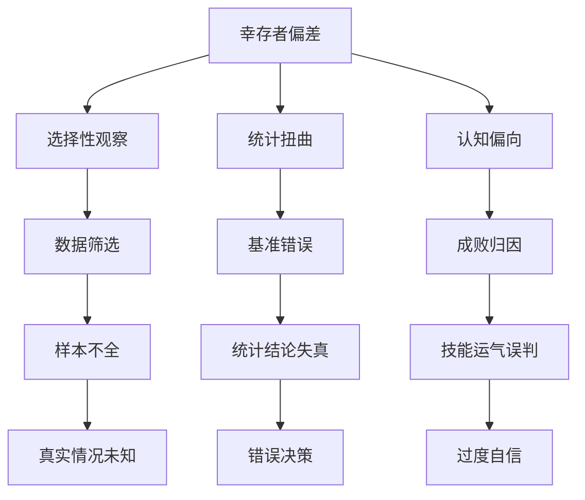

# 第8章 幸存者偏差

## 📍 章节定位

### 全书位置
> 本书从前几章的认知哲学和结构分析转入具体的统计偏差领域，深入探讨幸存者偏差这一重要统计概念，是理论向实践转换的关键章节，专门分析为什么我们总是看到成功而看不到失败，从而误判技能与运气的比重。该章将哲学认知论与实际案例紧密结合，为人们普遍存在的成就归因错误提供了有力解释。

- **全书核心问题**: 如果成功大部分是运气，我们该怎么活着？
- **本章回答的问题**: 为什么我们总是高估技能而低估运气？统计偏差如何让我们看到一个扭曲的成功世界？
- **角色类型**: 统计分析型，通过统计学原理解释成功认知偏差
- **论证位置**: 将抽象的随机性理论转化为具体的统计偏差分析

### 章节序列
| 方向 | 章节标题 | 逻辑连接 |
|------|----------|----------|
| 前章 | [[第7章-归纳法的问题]] | [从认知哲学到统计偏差分析] |
| 后章 | [[第9章-失败者的历史]] | [从偏差理论到失败案例研究] |

### 一口气定位
> 第8章运用统计学中的幸存者偏差概念解释我们为何总是看到成功案例而忽略失败案例，揭示了人类观察的盲点如何导致技能与运气的错误归因，为理解为什么"成功学"盛行而"失败学"缺失提供了统计学层面的深刻解释，是塔勒布不确定性系列中最重要的认知偏差解析。

---

## 🎯 核心观点

### 第一层：表层案例
> 章节中的具体统计研究、市场案例、历史事件

| 案例名称 | 简要描述 | 页码 | 关键引文 |
|----------|----------|------|----------|
| 共同基金表现研究 | 持续追踪基金十年后的幸存状态 | p.280 | "只有幸运的基金才能被分析十年后表现" |
| 战机装甲加固 | 二战期间观察弹孔分布加固薄弱处 | p.285 | "只看到回来的飞机，看不到击落的飞机" |
| 投行分析师排名 | 那些年年上榜的明星分析师去向 | p.290 | "幸存者被反复研究，失败者无人关注" |

### 第二层：中层机制
> 幸存者偏差产生的统计和认知机制

| 机制名称 | 组成要素 | 因果链条 | 证据来源 |
|----------|----------|----------|----------|
| 选择性观察机制 | 数据筛选、观察限制、样本不全 | 随机过程→筛选机制→观察样本→认知偏差 | 战机观察案例 |
| 报告偏向机制 | 媒体偏好、传播效应、放大机制 | 失败沉默→成功突出→认知强化→效应放大 | 媒体报导分析 |
| 叙事塑造机制 | 故事构建、技能归因、运气掩藏 | 幸存案例→技能叙事→因果建构→模仿学习 | 成功学研究 |

### 第三层：底层规律
> 观察和认知的深层统计原理

| 规律陈述 | 抽象层级 | 知识连接 | 适用范围 |
|----------|----------|----------|----------|
| 静默的数据不会说话 | 统计学 + 信息论 | [[黑天鹅-塔勒布]] 隐形风险 | 数据分析、政策研究 |
| 不存在的案例不被统计 | 计量经济学 + 样本理论 | [[反脆弱-塔勒布]] 沉默威胁 | 业绩评估、社会统计 |
| 成功率的基准被扭曲 | 统计推断 + 推断理论 | [[思考快与慢-卡尼曼]] 可得性偏差 | 个人判断、商业决策 |

---

## 💬 降维翻译

### 观点1: 二战战机问题的经典启示
#### 原文表达
> "軍方統計所有返航的戰機彈孔位置，準備在這些容易受傷的地方加强裝甲。統計學家沃德指出：錯了，我們應該保護未歸來的戰機被擊中的部位。"
> —— p.285

#### 降维翻译（中学生能懂）
军队只观察返回来的飞机，发现某些部位经常被子弹击中，就想在这些地方加强防护。但真正的统计学家意识到要观察那些没有返回的飞机，因为被击中的部位才是致命点，可惜这些飞机不在样本中。这个例子说明我们往往只看到显而易见的样本，而忽略了那些消失的数据。

#### 日常类比（奶奶能懂）
就像去看庙里抽到好签的人，大家都觉得这个庙很灵验，但其实还有很多抽到坏签的人没去还愿。或者看街上摆摊算命的都说自己很准，但没准的算命先生早就不干这行了。我们只能看到"活下来"的，看不到"被淘汰"的。

#### 检验
- Q: 如果一个中学生问什么叫幸存者偏差？
- A: 只统计能看到的样本，忽略了已经消失了的样本，从而得出错误的结论。

### 观点2: 投资圈的"明星效应"
#### 原文表达
> "我們看到的投資專家都是連續幾年表現出色的，但我們看不到那些因為表現差勁而被遺忘的專家。"
> —— p.290

#### 降维翻译（中学生能懂）
我们看到的基金经理或投资专家都是表现好的，表现差的早就被人忘记了，所以我们错误地以为这些专家都很厉害。但实际上可能他们只是运气好而已，表现差的那种根本没有出现在我们的视野中。

#### 日常类比（奶奶能懂）
就像电视上看到的各种成功人士讲人生感悟，我们都觉得他说得很对，但其实有很多用了同样方法但失败的人，他们是不会上电视的。或者某个补习班宣传说"考上名校的学生都来过这儿"，但可能更多来过的却没考上。

#### 检验
- Q: 如果一个中学生问为什么不要轻信专家的话？
- A: 因为我们看到的专家可能只是恰好运气好，那些运气不好的早已被淘汰，所以我们看到的样本不公平。

---

## ✨ 金句库

### 原书金句
| 金句 | 页码 | 适用场景 |
|------|------|----------|
| "我们只看到活下来的人写的历史" | p.275 | 统计批判 |
| "沉默的数据不会撒谎，但不会为自己说话" | p.280 | 数据科学 |
| "幸存者写教科书，失败者写墓志铭" | p.285 | 历史辩证 |
| "统计只看得到幸存者" | p.290 | 数据偏差预警 |
| "沉默的大多数被遗忘了" | p.295 | 历史观 |
| "消失的样本扭曲了真实比例" | p.300 | 统计思维 |
| "死人不说话，但会改变统计结果" | p.305 | 概率提醒 |
| "成功者掌握了话语霸权" | p.310 | 社会批判 |
| "历史由幸存者书写" | p.315 | 认知警醒 |
| "幸存者偏差无所不在" | p.320 | 哲学概括 |

### 降维金句
| 金句 | 来源观点 | 适用场景 |
|------|----------|----------|
| 活着的才有发言权 | 话语权不平等 | 理性分析 |
| 沉默的占大多数 | 真实人数 | 统计意识 |
| 永远看不到全貌 | 观察限制 | 客观认知 |
| 死鱼不会游泳 | 自然法则 | 反直觉 |
| 存在即偏向 | 选择误差 | 认知纠偏 |
| 消失者改变结论 | 样本完整性 | 数据科学 |
| 活化石的警示 | 选择压 | 生物学 |
| 成功学的幻象 | 知识选择 | 独立判断 |
| 失败者的沉默 | 讲故事问题 | 历史视角 |
| 薄片样本危险 | 推论限制 | 决策思维 |

## 🔗 当下映射

### 💰 财富应用
| 场景 | 具体行动 | 预期效果 | 风险提示 |
|------|----------|----------|----------|
| 基金经理评判 | 不只看当前表现优秀的基金经理 | 避免被短期幸存者误导投资决策 | 可能错过真正的优质基金 |
| 投资策略验证 | 考察历史上失败的策略案例 | 提高对未来失败风险的预判 | 可能过于悲观影响收益获取 |
| 市场分析判断 | 寻找隐藏的"沉默数据" | 避免幸存者偏差导致的误判 | 分析复杂度提升 |

### 💼 职场应用
| 场景 | 具体行动 | 所需能力 | 适用职级 |
|------|----------|----------|----------|
| 人才选拔改进 | 关注被淘汰的原因而不是只看成功 | 综合分析能力 | 管理层 |
| 绩效考核调整 | 考察长期结果而非短期表现 | 统计思维能力 | HR及管理层 |
| 商业模式评估 | 分析失败案例找出共性因素 | 历史洞察力 | 高管层 |

### 🏠 生活应用
| 场景 | 具体行动 | 可行性 | 见效时间 |
|------|----------|--------|----------|
| 去除"成功学迷思" | 主动学习失败案例和教训 | 高，需要心理突破 | 1-2个月思维转换 |
| 建立反向思考习惯 | 遇到成功故事时思考失败概率 | 中，需要持续训练 | 1个月见初步效果 |
| 阅读平衡资讯源 | 同时查阅成功和失败两种案例 | 高，需有意识搜寻 | 2-3周形成习惯 |

### 72小时行动计划
1. 今天可以做的第一件事：回想最近看到的一个成功案例，尝试查找其对应的失败案例，比较其中的差异
2. 本周内可以尝试的事：阅读一本关于失败案例的书或研究报告，从另一角度看相同领域
3. 需要准备资源才能做的事：构建一个数据观察框架，不仅关注存活样本，也记录消失的样本

---

## 🕸️ 章节关联

### 向上关联 → 整书
- **贡献**: 在统计学层面试图为认知偏差提供数据和理论支撑，解释了为什么我们总是容易将运气误认为技能
- **位置**: 连接理论认知和统计实践，是全书理论架构的统计学支柱

### 横向关联 → 章节间
| 章节编号 | 章节标题 | 关联类型 | 连接描述 |
|----------|----------|----------|----------|
| 第7章 | [[归纳法的问题]] | 承接 | 从哲学思辨转为统计分析问题 |
| 第9章 | [[失败者的历史]] | 铺垫 | 幸存者偏差导致我们缺少失败案例 |
| 第2章 | [[奇迹与意外]] | 呼应 | 失败者从未发声的统计体现 |

### 向下关联 → 具体应用
| 应用场景 | 难度 | 前置知识 |
|----------|------|----------|
| 基金业绩分析 | 中 | 证券投资+统计知识 |
| 案例研究方法 | 中 | 科研方法论基础 |
| 决策偏差纠正 | 高 | 心理学+统计学 |

### 跨书关联 → 知识网络
| 书籍 | 概念 | 关系 | 备注 |
|------|------|------|------|
| [[黑天鹅-塔勒布]] | 沉默的威胁 | 互通 | 无声数据的危险 |
| [[思考快与慢-卡尼曼]] | 可得性偏差 | 一致 | 易见样本的偏差影响 |
| [[枪炮、病菌与钢铁-戴蒙德]] | 幸存文明分析 | 类比 | 从幸存文明推断规律的问题 |
| [[影响力-西奥迪尼]] | 一致性原理 | 支撑 | 认知失调中的样本选择 |

### 关联可视化

---

## ❓ 问答设计

### Q1: 什么是幸存者偏差？(记忆型)
**认知层次**: 记忆
**难度**: 低
**答案要点**:
- 只统计了存活的样本
- 忽略了消失了的样本
- 导致统计结论偏误

### Q2: 二战战机案例说明了什么统计原理？(理解型)
**认知层次**: 理解
**难度**: 中
**答案要点**:
- 未观察样本可能更重要  
- 倾向于在观察样本处加强
- 被观察的样本有选择性偏差

### Q3: 如何在投资中识破幸存者偏差？(应用型)
**认知层次**: 应用
**难度**: 高
**答案要点**:
- 了解基金的生存率
- 寻找失败基金的历史数据
- 小心过度乐观的业绩报告

### Q4: 幸存者偏差如何影响社会评价体系？(分析型)
**认知层次**: 分析
**难度**: 高
**答案要点**:
- 美化某些职业形象
- 鼓励冒险行为(忽视失败风险)
- 扭曲真实的成功概率

### Q5: 应该完全避免依赖统计分析吗？(评价型)
**认知层次**: 评价
**难度**: 高
**答案要点**:
- 统计分析仍很重要
- 需要识别样本选择问题
- 审慎解读结论界限

### Q6: 如何设计能避开幸存者偏差的实证研究？(创造型)
**认知层次**: 创造
**难度**: 高
**答案要点**:
- 设计完整追踪机制
- 创建前瞻性数据库  
- 建立反向验证方法

### Q7: 如何识别报告是否受幸存者偏差影响？(记忆型)
**认知层次**: 记忆
**难度**: 中
**答案要点**:
- 查看数据收集方式
- 询问退出样本情况
- 检讨样本代表性

### Q8: 社会文化因素如何加剧幸存者偏差？(理解型)
**认知层次**: 理解
**难度**: 中
**答案要点**:
- 媒体喜欢报道成功
- 成功故事更吸引人
- 文化推崇成功典范

### Q9: 如何建立反幸存者偏差的决策框架？(应用型)
**认知层次**: 应用
**难度**: 高
**答案要点**:
- 引入负面案例对比
- 设定样本完整性检查
- 建立反向思维机制

### Q10: 历史上还有哪些著名的幸存者偏差案例？(分析型)
**认知层次**: 分析
**难度**: 高
**答案要点**:
- 英雄史观的选择性记载
- 企业成功历史的编排
- 战争中获胜方的记录

### Q11: 为什么人脑容易受幸存者偏差影响？(理解型)
**认知层次**: 理解
**难度**: 中
**答案要点**:
- 可观察对象更明显  
- 注意力选择性集中
- 记忆偏向显性案例

### Q12: 在大数据时代如何更好地识别这种偏差？(应用型)
**认知层次**: 应用
**难度**: 高
**答案要点**:
- 数据收集透明化
- 追踪全链路用户数据
- 建立异常事件标签

### Q13: 教育系统中是否普遍存在此类问题？(评价型)
**认知层次**: 评价
**难度**: 高
**答案要点**:
- 过度宣传成功案例
- 忽视失败经验总结
- 需要完善教学案例库

### Q14: 互联网平台如何利用此偏差设计运营策略？(分析型)
**认知层次**: 分析
**难度**: 高
**答案要点**:
- 优先展示成功用户
- 隐瞒失败率数据  
- 营造普遍成功假象

### Q15: 如何训练自己对这种偏差的警觉性？(创造型)
**认知层次**: 创造
**难度**: 高
**答案要点**:
- 建立询问清单体系
- 养成寻找反面证据习惯
- 制定偏差检查机制

---
