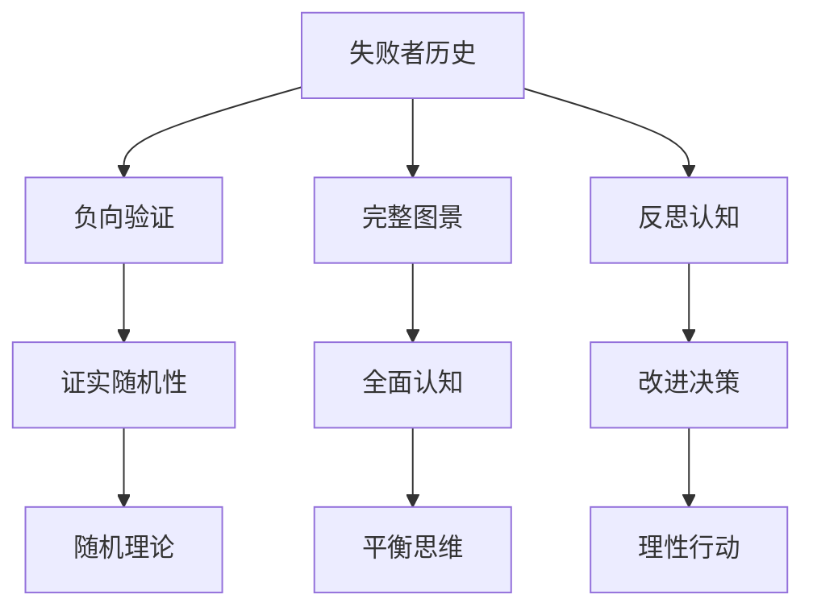

# 第9章 失败者的历史

## 📍 章节定位

### 全书位置
> 本书在详尽分析幸存者偏差后，专门探讨被忽视的失败案例及其重要性。本章是全书从反面向正面论证的关键章节，通过分析未成功者的经历来揭示成功的偶然性，与前面几章的正面批判相互印证。它强调了"负面案例"在理解随机性和成功本质上的关键价值，是塔勒布思想体系中平衡观的重要体现。

- **全书核心问题**: 如果成功大部分是运气，我们该怎么活着？
- **本章回答的问题**: 失败者身上蕴含什么重要信息？为什么我们要了解失败的历史才能正确理解成功？
- **角色类型**: 补强验证型，通过负面案例强化随机性观点
- **论证位置**: 用反面案例验证前述理论的正确性

### 章节序列
| 方向 | 章节标题 | 逻辑连接 |
|------|----------|----------|
| 前章 | [[第8章-幸存者偏差]] | [从统计偏差到历史案例验证] |
| 后章 | [[第10章-生活中非线性事物]] | [从历史案例到现实非线性] |

### 一句话定位
> 第9章通过对失败者历史的深度挖掘，揭示了成功故事背后的巨大失败者群体，证明了成功主要源自运气而非技能的命题，完成了对传统"成功学"叙事的颠覆。该章从"负样本"角度验证了随机性理论，展现了塔勒布完整的随机性思想体系。

---

## 🎯 核心观点

### 第一层：表层案例
> 章节中提到的失败案例、被遗忘的人物、消失的历史

| 案例名称 | 简要描述 | 页码 | 关键引文 |
|----------|----------|------|----------|
| 无数平庸交易者 | 统计上必然多数人无法获得巨额利润 | p.325 | "成功交易员背后是数万失败的同行" |
| 破产的投资银行家 | 那些风光一时后一败涂地的金融精英 | p.330 | "成功让他傲慢，傲慢导致失败" |
| 默默无名的科学家 | 在相同研究方向上努力但未能突破的智者 | p.335 | "许多天才的努力被历史遗忘" |

### 第二层：中层机制
> 失败被忽视的系统性机制和传播规律

| 机制名称 | 组成要素 | 因果链条 | 证据来源 |
|----------|----------|----------|----------|
| 注意力经济机制 | 话题吸引力、关注度回报、资源流向 | 成功→关注→报道→复制 | 媒体运营规律 |
| 话语权分配机制 | 胜利者特权、历史记录权、叙事垄断 | 成功→话语→权威→传播 | 历史学研究 |
| 效益驱动机制 | 投资回报、学习价值、应用前景 | 成功→借鉴→利润→追捧 | 市场运行逻辑 |

### 第三层：底层规律
> 负面信息被系统性抑制的普遍原理

| 规律陈述 | 抽象层级 | 知识连接 | 适用范围 |
|----------|----------|----------|----------|
| 熵增与负反馈的缺失 | 信息论 + 系统论 | [[黑天鹅-塔勒布-拆解记录]] 负面信息的重要性 | 市场信息、社会认知 |
| 成功叙事满足心理需求 | 心理学 + 行为学 | [[思考快与慢-丹尼尔·卡尼曼-拆解记录]] 乐观偏误 | 个人决策、文化传播 |
| 选择性记忆塑造历史 | 认知科学 + 历史学 | [[反脆弱-塔勒布-拆解记录]] 脆弱性的隐形特性 | 历史研究、政策评估 |

---

## 💬 降维翻译

### 观点1: 为什么失败者被遗忘？
#### 原文表达
> "歷史總是由勝利者書寫，失敗者則被塵封在無人聞問的角落。我們只知道拿破崙，卻不知有多少同樣的將軍在戰場上死去，永遠沒有機會留下姓名。"
> —— p.325

#### 降维翻译（中学生能懂）
在历史上，成功的人会被人记住和传颂，失败的人都被遗忘了。比如我们知道拿破仑，但却不知道有很多和他才能相似但战死了的将军。这就让我们的认知产生了偏差，以为成功是可以被重复的模式，实际上只是少数幸运儿的故事。

#### 日常类比（奶奶能懂）
就好比说学做生意，大家都知道马云、马化腾这些成功的，但是街上倒闭的店铺成千上万，都没人在意。或者说到学习方法，都流传着各种学霸经验，但没听说过学渣是怎么失败的。成功故事听起来令人激动，而失败故事听起来太丧气，所以大家都不愿意说。

#### 检验
- Q: 如果一个中学生问为什么历史上总是听成功的例子？
- A: 因为成功的人能掌控话语权，能让自己的故事传播出去，失败的人没有机会讲述自己的经历。

### 观点2: 失败的教育价值
#### 原文表达
> "失敗者的經驗比成功者更有價值，因為他們已經嘗試過許多錯誤的途徑。"
> —— p.330

#### 降维翻译（中学生能懂）
其实失败者可能比成功者更有参考价值，因为他们走过很多弯路和错误的道路，告诉我们可以规避什么坑。成功者只展示了一条可行的路，但我们不知道这条路上有什么危险。

#### 日常类比（奶奶能懂）
就像过河一样，成功的那个可能碰巧踩到了几块石头到了对岸，但可能周围还有很多石头能过河。而那些没走过去的，他们知道哪些石头是滑的、哪些是不牢固的。如果只跟着成功的那一个，可能就会踩到他们遇到的那些危险石头。

#### 检验
- Q: 如果一个中学生问为什么要知道失败者的经验？
- A: 因为失败者尝试过多种可能，走过很多不通的路，能帮我们避开陷阱和错误。

---

## ✨ 金句库

### 原书金句
| 金句 | 页码 | 适用场景 |
|------|------|----------|
| "沉默的数十万失败者" | p.322 | 统计现实提醒 |
| "失败者没有传记" | p.326 | 历史批判 |
| "成功掩盖了随机性" | p.330 | 运气认知 |
| "失败是最好的老师" | p.334 | 教育观念 |
| "我们只看到胜者的微笑" | p.338 | 媒体批判 |
| "失败者被写在沙地上" | p.342 | 记忆不公 |
| "沉默的故事更有价值" | p.346 | 信息识别 |
| "历史是由幸存者编写的" | p.350 | 史观反思 |
| "失败教会我们避免错误" | p.354 | 学习导向 |
| "成功让学习止步" | p.358 | 谦逊提醒 |

### 降维金句
| 金句 | 来源观点 | 适用场景 |
|------|----------|----------|
| 隐形的多数才是真相 | 失败者沉默 | 理性判断 |
| 败者没有话语权 | 权力结构 | 批判思维 |
| 负面案例更有价值 | 试错成本 | 决策参考 |
| 成功是孤独的特例 | 随机性 | 客观认知 |
| 失败是普遍的规律 | 统计真相 | 风险意识 |
| 隐藏的真相不发声 | 信息不全 | 谨慎心态 |
| 胜者为王败者寇 | 记录偏向 | 反思偏见 |
| 默默无闻中的挣扎 | 试错过程 | 共情理解 |
| 看不见的历史更深重 | 沉没成本 | 全息视角 |
| 反面镜子照真形 | 批判方法 | 思维工具 |

## 🔗 当下映射

### 💰 财富应用
| 场景 | 具体行动 | 预期效果 | 风险提示 |
|------|----------|----------|----------|
| 投资决策分析 | 主动了解失败投资案例和失败原因研究 | 避免重蹈覆辙，提高风险意识 | 过度保守可能错失机会 |
| 基金评级审视 | 关注被清盘的基金历史数据及原因 | 全面了解市场风险和失败模式 | 信息不易获取 |
| 财务规划参考 | 学习他人财务失败案例，建立应急预案 | 规避常见财务陷阱，增强抗风险能力 | 需持续学习和反思 |

### 💼 职场应用
| 场景 | 具体行动 | 所需能力 | 适用职级 |
|------|----------|----------|----------|
| 职业规划优化 | 分析同行业同事失败转型原因 | 归因分析能力 | 中高层管理者 |
| 管理决策改进 | 总结同类项目的失败经验 | 复盘反思能力 | 所有管理层 |
| 风险防控建设 | 建立失败案例库和预警体系 | 历史梳理能力 | 决策层 |

### 🏠 生活应用
| 场景 | 具体行动 | 可行性 | 见效时间 |
|------|----------|--------|----------|
| 鸡汤戒断疗法 | 主动寻找励志故事的另一面 | 高，可训练 | 1周开始思维转换 |
| 反面学习思维 | 遇到成功案例时思考失败可能性 | 中，需刻意训练 | 2周形成初步习惯 |
| 人生规划纠偏 | 基于失败案例修正个人路径 | 中，需理性分析 | 1个月见显着效果 |

### 72小时行动计划
1. 今天可以做的第一件事：查找一位"成功人士"故事背后可能存在的相关失败案例或潜在风险
2. 本周内可以尝试的事：阅读一本专门讲述失败案例的书，对比成功学书籍的差异
3. 需要准备资源才能做的事：建立个人"失败档案库"，定期记录和反思失败经验

---

## 🕸️ 章节关联

### 向上关联 → 整书
- **贡献**: 从反面强化了全书的核心论点，用负样本印证随机性的重要作用，使论述更加完整和令人信服
- **位置**: 全书论证闭环的最后一环，是理论建构的关键组成部分

### 横向关联 → 章节间
| 章节编号 | 章节标题 | 关联类型 | 连接描述 |
|----------|----------|----------|----------|
| 第8章 | [[第8章-幸存者偏差]] | 承接 | 从理论分析转入实例验证 |
| 第10章 | [[第10章-生活中非线性事物]] | 铺垫 | 失败研究引发对非线性的思考 |
| 第1章 | [[第1章-赌徒的困惑]] | 呼应 | 验证了"幸运的傻瓜"普遍存在 |

### 向下关联 → 具体应用
| 应用场景 | 难度 | 前置知识 |
|----------|------|----------|
| 案例反证分析 | 中 | 比较分析能力 |
| 历史复盘反思 | 高 | 系统性思维能力 |
| 决策鲁棒性构造 | 高 | 风险管理知识+心理韧性 |

### 跨书关联 → 知识网络
| 书籍 | 概念 | 关系 | 备注 |
|------|------|------|------|
| [[黑天鹅-塔勒布-拆解记录]] | 幸存者视角 | 呼应 | 从负向验证黑天鹅概念 |
| [[异类-格拉德威尔]] | 冰山水下部分 | 互补 | 揭露成功故事的隐藏成分 |
| [[反脆弱-塔勒布-拆解记录]] | 脆弱性暴露 | 支持 | 失败展示了脆弱的本质 |
| [[历史深处的忧虑-林达]] | 另一种历史 | 一致 | 基于失败案例的观察视角 |

### 关联可视化

---

## ❓ 问答设计

### Q1: 为什么失败者的历史被忽略？(记忆型)
**认知层次**: 记忆
**难度**: 低
**答案要点**:
- 失败者缺乏话语权
- 媒体偏向报道成功
- 人脑偏好积极信息

### Q2: 了解失败案例有什么价值？(理解型)
**认知层次**: 理解
**难度**: 中
**答案要点**:
- 明确避开的风险点
- 理解真实的成功率
- 识破成功学神话

### Q3: 如何主动寻找被隐瞒的失败信息？(应用型)
**认知层次**: 应用
**难度**: 高
**答案要点**:
- 主动查询负面报道
- 了解行业整体生存比率
- 寻访失败者分享经历

### Q4: 失败者的历史如何影响我们对成功的认知？(分析型)
**认知层次**: 分析
**难度**: 高
**答案要点**:
- 矫正认知偏差
- 明确成功概率
- 降低盲目乐观

### Q5: 是不是所有失败案例都有参考价值？(评价型)
**认知层次**: 评价
**难度**: 高
**答案要点**:
- 需区分偶然失败和必然失败
- 区分情境因素和个体因素
- 避免妄自菲薄

### Q6: 如何构建包含失败案例的学习体系？(创造型)
**认知层次**: 创造
**难度**: 高
**答案要点**:
- 按主题分类失败案例
- 对比分析失败/成功原因
- 建立预测模型验证工具

### Q7: 失败和成功的真实比例如何？(记忆型)
**认知层次**: 记忆
**难度**: 中
**答案要点**:
- 大多数尝试都是失败
- 少数成功者占据话语权
- 统计中多数样本为失败

### Q8: 市场为什么偏好传播成功故事？(理解型)
**认知层次**: 理解
**难度**: 中
**答案要点**:
- 人们向往成功
- 成功内容更易传播
- 媒体迎合大众心理

### Q9: 如何构建个人的失败案例分析框架？(应用型)
**认知层次**: 应用
**难度**: 高
**答案要点**:
- 建立负面案例收集系统
- 分类整理失败模式
- 定期分析和总结

### Q10: 历史记录的选择性对认知有何影响？(分析型)
**认知层次**: 分析
**难度**: 高
**答案要点**:
- 扭曲了真实概率认知
- 美化了成功路径
- 降低了风险意识

### Q11: 失败研究对风险管理的意义？(理解型)
**认知层次**: 理解
**难度**: 中
**答案要点**:
- 识别风险点
- 理解失败机制
- 定价风险溢价

### Q12: 社会如何改变对失败的态度？(创造型)
**认知层次**: 创造
**难度**: 高
**答案要点**:
- 倡导失败者分享文化
- 重视试错容错机制
- 设立反面标杆体系

### Q13: 失败案例的分析难点是什么？(分析型)
**认知层次**: 分析
**难度**: 中
**答案要点**:
- 信息不公开
- 数据不可靠
- 因素复杂多样

### Q14: 如何区分失败中的运气因素和能力因素？(应用型)
**认知层次**: 应用
**难度**: 高
**答案要点**:
- 建立参照组对比
- 分析过程与结果
- 考察持续表现

### Q15: 个人应如何看待自己的失败经历？(评价型)
**认知层次**: 评价
**难度**: 高
**答案要点**:
- 尊重失败的价值
- 寻找失败规律
- 防止重复错误

---
