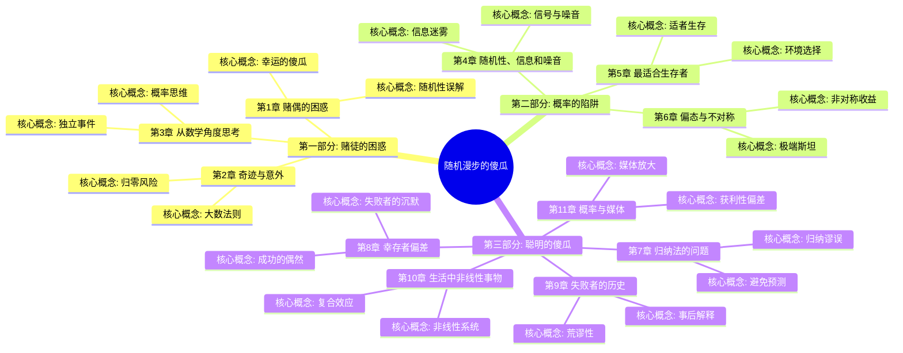
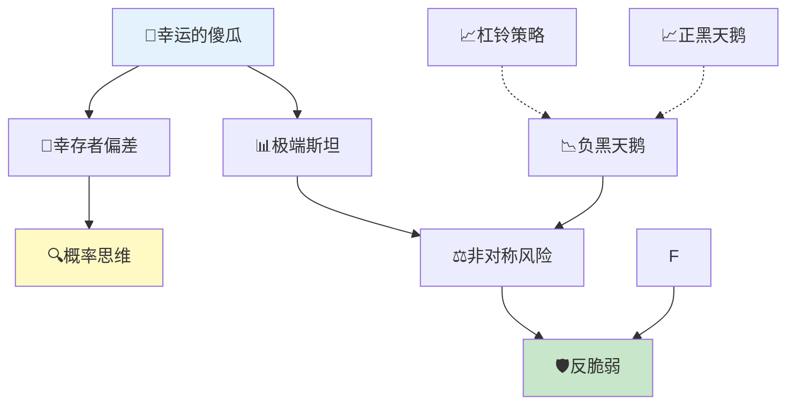

# 《随机漫步的傻瓜》 - 章节导航

> 作者: 纳西姆·尼古拉斯·塔勒布
> 总章节: 11章
> 最后更新: 2026-02-27
> 关联书籍: [[黑天鹅-塔勒布]]、[[反脆弱-塔勒布]]、[[非对称风险-塔勒布]]

---

## 📚 章节结构（Mermaid Mindmap）

---

## 🔗 核心概念关联图

---

| 章节 | 标题 | 状态 | 完成日期 | 核心收获 |
|------|------|------|----------|----------|

---

## 🚀 快速跳转

### 按章节跳转
- [[第1章-赌徒的困惑]]
- [[第2章-奇迹与意外]]
- [[第3章-从数学角度思考]]
- [[第4章-随机性、信息和噪音]]
- [[第5章-最适合生存者]]
- [[第6章-偏态与不对称]]
- [[第7章-归纳法的问题]]
- [[第8章-幸存者偏差]]
- [[第9章-失败者的历史]]
- [[第10章-生活中非线性事物]]
- [[第11章-概率与媒体]]

### 按主题跳转
- 塔勒布不确定性系列
- 极端斯坦与平均斯坦
- 黑天鹅理论
- 反脆弱思想
- [[非对称风险-塔勒布]]
- 幸运的傻瓜
- [[第8章-幸存者偏差]]

### 相关资源
- [[随机漫步的傻瓜-塔勒布]] - 主拆解笔记
- 塔勒布不确定性系列 - 四本书关联
- [[黑天鹅-塔勒布]] - 第二部
- [[反脆弱-塔勒布]] - 第三部
- [[非对称风险-塔勒布]] - 第四部
