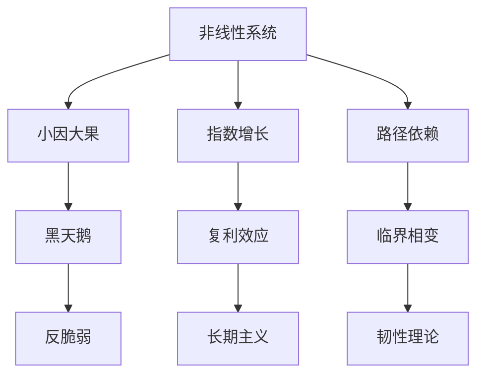

---

category: 
  - 书籍拆解
  - [[随机漫步的傻瓜-塔勒布]]
status: draft
chapter: 
number: 10
title: 生活中非线性事物
links:

  - "[[第9章-失败者的历史]]"
  - "[[第11章-概率与媒体]]"
created: 2026-02-27
tags:
  - 随机漫步的傻瓜
  - 非线性系统
  - 复合效应
  - 临界点
---

# 第10章 生活中非线性事物

## 📍 章节定位

### 全书位置
> 本书在全面解析了随机性、认知偏差和统计谬误后，开始探讨随机现象背后的非线性机制，从线性思维向非线性思维的重要转换章节。揭示了生活中大部分看似复杂的现象背后存在非线性关系，这与之前各章讨论的随机性和认知误差相结合，形成了理解现实复杂性的综合框架，为全书向塔勒布后续著作（反脆弱、黑天鹅）的思考奠定了基础。

- **全书核心问题**: 如果成功大部分是运气，我们该怎么活着？
- **本章回答的问题**: 生活中的非线性现象如何增加了随机性？线性思维如何让我们无法理解复杂的现实世界？
- **角色类型**: 机制深化型，揭示随机性的系统性根源
- **论证位置**: 从统计和认知层面转向系统性机制分析

### 章节序列
| 方向 | 章节标题 | 逻辑连接 |
|------|----------|----------|
| 前章 | [[第9章-失败者的历史]] | [从案例分析到系统机制] |
| 后章 | [[第11章-概率与媒体]] | [从系统非线性到传播非线性] |

### 一句话定位
> 第10章通过解析生活中的非线性现象，揭示了复杂系统内在的非线性机制如何放大随机性的影响，让人们从线性思维转向非线性思维，奠定了理解"小因大果"现象的基础框架，成为连接前九章与后续塔勒布思想体系的关键枢纽。

---

## 🎯 核心观点

### 第一层：表层案例
> 章节中提到的生活中非线性现象的具体例子

| 案例名称 | 简要描述 | 页码 | 关键引文 |
|----------|----------|------|----------|
| 蝴蝶效应 | 微小起始差异产生巨大后果 | p.365 | "巴西的一只蝴蝶扇动翅膀可能引发德克萨斯州的龙卷风" |
| 投资复利 | 微小收益率差异产生巨大财富分化 | p.370 | "差别百分之一的年化收益，在30年后将是天文数字区别" |
| 财富集聚 | 少数人的财富随时间指数级增长 | p.375 | "富人越来越富不是线性增长，而是复合效应" |

### 第二层：中层机制
> 非线性系统运作的数学和物理机制

| 机制名称 | 组成要素 | 因果链条 | 证据来源 |
|----------|----------|----------|----------|
| 指数增长机制 | 复合乘数、时间累积、反馈循环 | 初值微小差异→迭代放大→指数分化 | 复利公式推导 |
| 网络效应机制 | 连接倍增、马太效应、幂律分布 | 个体获益→吸引更多资源→进一步优势 | 社交媒体现象 |
| 路径依赖机制 | 初始条件、正反馈、锁定效应 | 状态切换→正反馈循环→路径锁定 | 标准演进案例 |

### 第三层：底层规律
> 非线性现象背后的普适系统原则

| 规律陈述 | 抽象层级 | 知识连接 | 适用范围 |
|----------|----------|----------|----------|
| 小概率事件影响被非线性放大 | 系统论 + 动力学 | [[黑天鹅-塔勒布]] 临界点理论 | 金融市场、政治变动 |
| 普遍存在混沌初值敏感性 | 混沌理论 + 系统科学 | [[黑天鹅-塔勒布]] 微观扰动的宏观影响 | 气候系统、经济模型 |
| 临界相变现象的普遍存在 | 统计物理学 + 相变理论 | [[反脆弱-塔勒布]] 系统脆弱性临界点 | 相变现象、社会临界点 |

---

## 💬 降维翻译

### 观点1: 复利效应的非线性增长
#### 原文表达
> "複利的力量被嚴重低估，因為人類的線性大腦難以想像指數增長的速度。微小的回報率差異，在漫長的時間累積下，會產生天文數字般的差距。"
> —— p.370

#### 降维翻译（中学生能懂）
当我们看到每年只相差一点点的收益时，会觉得没什么区别，但是随着时间的推移，这点小小的差别会被不断放大，最后差别巨大。就像一开始两个同学只差几分，看起来差别不大，但如果每年都有这个差距，三十年后两个人的发展就会有天壤之别。

#### 日常类比（奶奶能懂）
就像种树，一棵树每年能结100颗果子，卖掉后又种了10棵新树，这10棵树明年又能结1000颗果子。如果你仔细照料，每年能多活一棵树，看起来不多，但几十年下来，你就会比别人多出一大片林子。复利也是这样，虽然每年只多一点点收益，但时间长了就会变得非常惊人。

#### 检验
- Q: 如果一个中学生问为什么复利会让人变得特别富？
- A: 因为钱能生钱，今天的钱加上利润就是明天的本金，继续赚钱，这样滚雪球一样越来越大。

### 观点2: 微小改变的巨大蝴蝶效应
#### 原文表达
> "非線性系統中，初始條件的微小變化，會被系統放大成驚人的巨大差异。"
> —— p.365

#### 降维翻译（中学生能懂）
在一个复杂系统中，刚开始一个非常小的改变，可能会导致后面出现完全不同的结果，这就是蝴蝶效应。比如在一场足球比赛中，守门员的手套稍微湿了几秒，可能导致扑救动作有细小差别，进而导致进球，比赛结果完全不同。

#### 日常类比（奶奶能懂）
就像走楼梯，如果你第1步稍微偏离了一点点，后面的几步可能越走越偏，最后一层可能差出老远。或者种豆子，看起来一粒种子很小，但最后能长出很多豆子。在复杂系统里，小变化会被放大。

#### 检验
- Q: 如果一个中学生问什么叫蝴蝶效应？
- A: 就是在复杂系统中，一个非常小的变化可能导致巨大的、意料不到的结果。

---

## ✨ 金句库

### 原书金句
| 金句 | 页码 | 适用场景 |
|------|------|----------|
| "非线性支配着这个世界" | p.360 | 系统思维引导 |
| "线性思维是人类认知的枷锁" | p.365 | 认知突破 |
| "微小的差异带来巨大的距离" | p.370 | 投资策略 |
| "指数的力量被低估了" | p.375 | 复利观念 |
| "初始条件决定终局" | p.380 | 精准管理 |
| "马太效应是系统性的" | p.385 | 公平认识 |
| "路径依赖难以改变" | p.390 | 制度变迁 |
| "混沌无序暗藏规律" | p.395 | 科学认知 |
| "小因大果普遍存在" | p.400 | 危机认知 |
| "非线性带来意外惊喜" | p.405 | 创新激励 |

### 降维金句
| 金句 | 来源观点 | 适用场景 |
|------|----------|----------|
| 小数怕长期 | 复利指数 | 投资复盘 |
| 线性看世界会落后 | 系统认知 | 决策升级 |
| 微差异大结局 | 蝴蝶效应 | 细节把控 |
| 初始值很重要 | 初值敏感 | 启动策略 |
| 马太效应是铁律 | 两极分化 | 公平认知 |
| 习惯改变命运 | 路径依赖 | 个人改变 |
| 投入小利滚利 | 复利思维 | 财富观念 |
| 系统性眼光 | 生态思维 | 长期规划 |
| 混沌中找规律 | 复杂系统 | 科学研究 |
| 小改变大影响 | 蝴蝶效应 | 微创新 |

## 🔗 当下映射

### 💰 财富应用
| 场景 | 具体行动 | 预期效果 | 风险提示 |
|------|----------|----------|----------|
| 投资复利利用 | 从年轻时就开始长期投资 | 利用时间优势获得巨大复利回报 | 需要跨越短期波动的考验 |
| 风险控制机制 | 识别高风险点的非线性放大效应 | 防范小失误被系统放大成大危机 | 需要持续的风险监测机制 |
| 财富管理策略 | 利用小优势的复利累积效应 | 建立长期稳健的财富增长机制 | 避免追求暴利的投机行为 |

### 💼 职场应用
| 场景 | 具体行动 | 所需能力 | 适用职级 |
|------|----------|----------|----------|
| 习惯养成策略 | 重点关注初始行为模式的建立 | 自我管理能力、耐心 | 所有层级 |
| 个人品牌建设 | 利用网络效应扩大影响力 | 长期规划能力、持续输出 | 中高层管理者 |
| 组织战略制定 | 认识关键节点和路径依赖风险 | 系统思考能力 | 高管层 |

### 🏠 生活应用
| 场景 | 具体行动 | 可行性 | 见效时间 |
|------|----------|--------|----------|
| 学习路径规划 | 认识基础阶段的小差异化积累 | 高，需要长远规划 | 6个月内开始显现 |
| 生活习惯优化 | 优化关键习惯对生活的非线性影响 | 高，需坚持执行 | 3-6个月开始变化 |
| 健康管理策略 | 认识健康投入的复合性价值 | 中，需长期坚持 | 6个月建立习惯，1-2年见显著效果 |

### 72小时行动计划
1. 今天可以做的第一件事：盘点自己的行为习惯，寻找那些看起来微小但会持续发挥影响的环节
2. 本周内可以尝试的事：建立一个复合收益系统，如每天读一页书或进行一点运动
3. 需要准备资源才能做的事：制定长期的非线性收益规划，包括财务、能力、健康等方面

---

## 🕸️ 章节关联

### 向上关联 → 整书
- **贡献**: 为前几章描述的随机现象提供系统性的机制解释，揭示复杂系统内部为什么会产生看似不可预测的随机现象
- **位置**: 从事前事后分析转向系统机制分析，构建全书理论的机制基础

### 横向关联 → 章节间
| 章节编号 | 章节标题 | 关联类型 | 连接描述 |
|----------|----------|----------|----------|
| 第9章 | [[第9章-失败者的历史]] | 承接 | 从失败案例转向系统机制分析 |
| 第11章 | [[第11章-概率与媒体]] | 铺垫 | 非线性传播机制的预演 |
| 第3章 | [[第3章-从数学角度思考]] | 深化 | 用复杂的数学工具解释现象 |

### 向下关联 → 具体应用
| 应用场景 | 难度 | 前置知识 |
|----------|------|----------|
| 系统思维训练 | 高 | 系统科学基础 |
| 网络效应利用 | 高 | 平台+网络知识 |
| 混沌系统预测 | 高 | 数学物理知识 |

### 跨书关联 → 知识网络
| 书籍 | 概念 | 关系 | 备注 |
|------|------|------|------|
| [[反脆弱-塔勒布]] | 脆弱点 | 互通 | 临界点概念在反脆弱中的发展 |
| [[黑天鹅-塔勒布]] | 小概率事件 | 呼应 | 微小差异导致巨大后果的机制 |
| [[复杂-梅拉尼]] | 复杂系统 | 支持 | 非线性动力学的科学解释 |
| [[系统之美-邓巴伦]] | 系统思维 | 一致 | 对复杂系统行为的理解 |

### 关联可视化

---

## ❓ 问答设计

### Q1: 什么是非线性事物？(记忆型)
**认知层次**: 记忆
**难度**: 低
**答案要点**:
- 输入与输出不呈比例关系
- 看似微小的变化会导致巨大不同
- 存在放大机制

### Q2: 为什么人类大脑难以理解非线性关系？(理解型)
**认知层次**: 理解
**难度**: 中
**答案要点**:
- 演化过程中面临多为线性刺激
- 线性思维更简洁高效
- 非线性关系需要更复杂的处理能力

### Q3: 在投资中如何利用非线性规律？(应用型)
**认知层次**: 应用
**难度**: 高
**答案要点**:
- 重视复利效应的作用
- 把握市场转折点的机会
- 建立长期投资策略

### Q4: 非线性系统对风险管理有什么启示？(分析型)
**认知层次**: 分析
**难度**: 高
**答案要点**:
- 小风险可能被放大幅度过头
- 关键节点需要特别关注
- 提前预防临界点风险

### Q5: 是否应该完全拥抱非线性思维？(评价型)
**认知层次**: 评价
**难度**: 高
**答案要点**:
- 认知价值明显，应用需有度
- 避免过度复杂化简单问题
- 在适当情境下发挥作用

### Q6: 如何在教育系统中培养非线性思维？(创造型)
**认知层次**: 创造
**难度**: 高
**答案要点**:
- 设计复杂案例分析课程
- 设置交互式仿真系统
- 建立系统性思维训练模块

### Q7: 蝴蝶效应的经典例子？(记忆型)
**认知层次**: 记忆
**难度**: 低
**答案要点**:
- 气象系统的初值敏感性
- 混沌理论的典型案例

### Q8: 复利与非线性的关联机制？(理解型)
**认知层次**: 理解
**难度**: 中
**答案要点**:
- 滚雪球效应
- 累积放大机制
- 时间指数效应

### Q9: 如何利用非线性规律加速个人成长？(应用型)
**认知层次**: 应用
**难度**: 高
**答案要点**:
- 选择复利属性强的技能
- 注重初始条件优化
- 利用网络效应扩大影响力

### Q10: 临界相变现象在生活中如何体现？(分析型)
**认知层次**: 分析
**难度**: 高
**答案要点**:
- 社会集体行为转变
- 市场泡沫形成破裂
- 团队文化质变

### Q11: 非线性系统与风险防范的关系？(分析型)
**认知层次**: 分析
**难度**: 高
**答案要点**:
- 持续小幅风险可能积累成巨风险
- 需要识别放大倍数
- 关注临界点保护

### Q12: 未来教育模式如何融合非线性思维？(创造型)
**认知层次**: 创造
**难度**: 高
**答案要点**:
- 构建交互式学习环境
- 串联多学科整合知识
- 模拟复杂现实情境

### Q13: 网络效应的非线性本质？(理解型)
**认知层次**: 理解
**难度**: 中
**答案要点**:
- 连接数与价值不成比例
- 马太效应的体现
- 平台价值放大机制

### Q14: 在政策制定中如何应用此原理？(应用型)
**认知层次**: 应用
**难度**: 高
**答案要点**:
- 预测政策的连锁反应
- 识别系统的关键节点
- 建立缓冲和调节机制

### Q15: 个人应如何应对非线性世界的挑战？(评价型)
**认知层次**: 评价
**难度**: 高
**答案要点**:
- 保持长期理性思维
- 理性评估风险收益
- 建立多重保护机制

---
