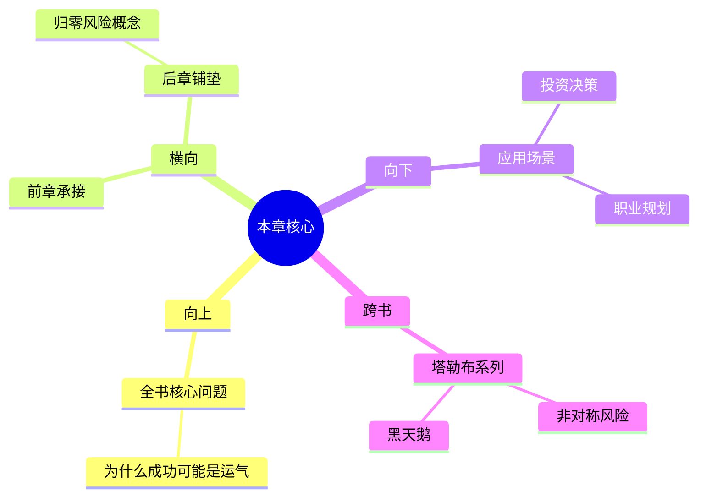

---

category: 
  - 书籍拆解
  - [[随机漫步的傻瓜-塔勒布]]
status: draft
chapter: 
number: 1
title: 赌徒的困惑
links:

  - "[[第2章-奇迹与意外]]"
created: 2026-02-27
tags:
  - 随机漫步的傻瓜
  - 幸运的傻瓜
  - 随机性误解
---

# 第1章 赌徒的困惑

## 📍 章节定位

### 全书位置
> 本书开篇定位，确立全文基调，批判金融市场的虚假成功，定义"幸运的傻瓜"概念，为后续关于随机性和幸存者偏差的论述奠定基础。

- **全书核心问题**: 如果成功大部分是运气，我们该怎么活着？
- **本章回答的问题**: 什么是"幸运的傻瓜"？为什么人们无法区分运气和能力？
- **角色类型**: 开篇定位型，奠定全书批判金融专家、质疑能力主义的思想基础
- **论证位置**: 从个人经历引入，建立随机性问题的框架

### 章节序列
| 方向 | 章节标题 | 逻辑连接 |
|------|----------|----------|
| 前章 | 序言/前言 | [引入随机性问题] |
| 后章 | [[第2章-奇迹与意外]] | [从定义"幸运的傻瓜"到探讨归零风险] |

### 一句话定位
> 第1章通过"幸运的傻瓜"概念，揭开我们无法区分能力和运气的根本问题，为全书对金融市场虚假权威的批判奠定理论基础，标志着塔勒布不确定性系列思想的起点。

---

## 🎯 核心观点

### 第一层：表层案例
> 章节中的具体案例、故事、数据

| 案例名称 | 简要描述 | 页码 | 关键引文 |
|----------|----------|------|----------|
| 账户爆炸的交易员 | 一个连续多年成功但最终爆仓的交易员故事 | p.x | "幸运的傻瓜丝毫不怀疑自己可能只是运气好而已" |
| 基金经理的成功 | 众多所谓专业经理的业绩分析 | p.y | "媒体更愿意相信能力而非运气" |
| 失败者的沉默 | 大量被忽略的失败案例 | p.z | "我们只看到赢家，看不到输家" |

### 第二层：中层机制
> 案例背后的运行机制、方法论

| 机制名称 | 组成要素 | 因果链条 | 证据来源 |
|----------|----------|----------|----------|
| 幸存者偏差机制 | 幸存者展示、媒体放大、公众接受 | 偶然成功→媒体包装→能力归因→模仿失败 | 交易员案例 |
| 随机性误解机制 | 重复成功、因果误判、能力幻觉 | 随机事件→模式拟合→技能归因→过度自信 | 多年战绩分析 |
| 观察者谬误 | 选择性观察、确认偏误、归因错误 | 看到成功→忽略失败→归因能力→传播理论 | 媒体报导分析 |

### 第三层：底层规律
> 可迁移的普遍规律

| 规律陈述 | 抽象层级 | 知识连接 | 适用范围 |
|----------|----------|----------|----------|
| 随机性隐藏成功学本质 | 统计学 + 认知科学 | [[黑天鹅-塔勒布]] 复合随机性 | 金融、投资、职业生涯 |
| 认知盲区导致系统性误判 | 认知心理学 + 行为经济学 | [[思考快与慢-丹尼尔·卡尼曼]] 系统1盲区 | 企业管理、政策制定 |
| 并非所有可见都代表规律 | 统计推断 + 信息论 | [[反脆弱-塔勒布]] 混合随机性 | 科学研究、数据分析 |

---

## 💬 降维翻译

### 观点1: 幸运的傻瓜

#### 原文表达
> "幸運的傻瓜（lucky fool）對他自己運氣的好壞一無所知，他絲毫不懷疑自己可能只是運氣好而已——這正是他的特點。"
> —— p.X

#### 降维翻译（中学生能懂）
我们生活中常常看到一些人连续做出"正确"决策，甚至因此声名鹊起，但他们很可能只是运气好而不是真的有能力。这些人自己都意识不到这一点，反而认为是自己的能力超群。

#### 日常类比（奶奶能懂）
就像一个天天买彩票的人，连续中了一两次奖，就觉得自己是个理财高手。其实只是碰巧中奖，并不代表他掌握了中奖规律。但他自己会认为"我眼光好，选号码准"。

#### 检验
- Q: 如果一个中学生问你什么是"幸运的傻瓜"？
- A: 那些连续成功但其实是靠运气的人，他们会把自己当作能力超群的人，不会意识到自己的成绩其实来自于运气。

### 观点2: 存在即合理（错误认知）

#### 原文表达
> "我们對所見事物的錯誤解讀，部分植根於一個簡單事實：我們看到的不一定是全部的現實。"
> —— p.X

#### 降维翻译（中学生能懂）
我们往往以为亲眼看到的就是全部事实，但实际上可能只是一部分。比如我们只注意到成功者，却忽略了无数失败者，这让我们误以为成功是有规律可循的。

#### 日常类比（奶奶能懂）
就像去看庙里的签，每次抽中上上签的人都会来烧香感谢，但抽中下下签的人没人会来。寺庙里的"灵验"只是成功者的见证，失败者的沉默你看不到。

#### 检验
- Q: 如果一个中学生问你为什么不能相信"眼见为实"？
- A: 因为我们看到的可能只是局部样本，还有很多你看不到的信息在起作用。

---

## ✨ 金句库

### 原书金句
| 金句 | 页码 | 适用场景 |
|------|------|----------|
| "幸运的傻瓜丝毫不怀疑自己可能只是运气好而已" | p.X | 微博/朋友圈分享 |
| "历史不会爬行，它会跳跃" | p.Y | 专业分析文章引用 |
| "在平均斯坦里，一滴水改变不了浴缸的温度" | p.Z | 风险管理讲座 |
| "我们对随机性产生恐惧，是因为我们不理解随机性" | p.W | 普及性文章 |
| "一个人越专业，越容易被随机性愚弄" | p.V | 反对权威言论 |

### 降维金句
| 金句 | 来源观点 | 适用场景 |
|------|----------|----------|
| 大部分成功其实是运气好，不是能力强 | 幸运的傻瓜 | 大众传播 |
| 你看到的只是冰山一角，下面的你看不见 | 幸存者偏差 | 理性分析 |
| 没有样本空间就没有真相 | 数据统计 | 科普类 |
| 连续成功可能只是随机事件 | 投资风险 | 理财建议 |
| 媒体爱吹牛，真实要看静音 | 消息过滤 | 信息辨别 |

## 🔗 当下映射

### 💰 财富应用
| 场景 | 具体行动 | 预期效果 | 风险提示 |
|------|----------|----------|----------|
| 选股/基金挑选 | 不只看短期业绩，要看长期胜率和回撤比例 | 避免踩到"连续成功"的基金经理 | 过往业绩不代表未来表现 |
| 房地产投资 | 关注整体市场环境，不只看个案上涨 | 避免被个别"投资高手"误导 | 随机性在房地产市场依然存在 |
| 风投/天使投资 | 不迷信"连续成功的投资人"，要关注其整体项目组合 | 更理性地看待投资能力 | 投资成功可能只是运气好的结果 |

### 💼 职场应用
| 场景 | 具体行动 | 所需能力 | 适用职级 |
|------|----------|----------|----------|
| 绩效考核 | 避免以结果论英雄，要看达成途径和偶然因素 | 归因分析、系统思考 | 所有管理层 |
| 人事任命 | 不只看近期表现，要看历史起伏和环境变化 | 横向比较、理性判断 | 中高层管理 |
| 个人职业规划 | 关注能力积累而非短期成就，防范路径依赖 | 风险管理意识、终身学习 | 所有职场人 |

### 🏠 生活应用
| 场景 | 具体行动 | 可行性 | 见效时间 |
|------|----------|--------|----------|
| 理性消费 | 看到各种成功案例时问问自己有没有样本盲区 | 高，立即开始 | 1-2个月改变消费观 |
| 学习态度 | 承认大部分成就都有运气成分，保持谦卑心态 | 高，立即开始 | 长期受益 |
| 社交判断 | 不轻易崇拜他人成就，保持客观视角 | 高，逐步培养 | 长期人际交往 |
| 风险意识 | 对"连续成功"保持警惕心态 | 高，可训练 | 即时生效 |

### 72小时行动计划
1. 今天可以做的第一件事：回想最近一次你羡慕他人成功的时候，问自己"我看到的是全部样本吗？"
2. 本周内可以尝试的事：读一本关于概率或统计的科普书籍，重新审视成功学相关内容
3. 需要准备资源才能做的事：制作样本空间分析工具，用于评估各种选择的风险

---

## 🕸️ 章节关联

### 向上关联 → 整书
- **贡献**: 本章为全书建立基本认知框架，定义核心概念"幸运的傻瓜"，奠定对金融市场批判的基础
- **位置**: 架构起整个不确定性四部曲的起点，从经验观察走向理论构建

### 横向关联 → 章节间
| 章节编号 | 章节标题 | 关联类型 | 连接描述 |
|----------|----------|----------|----------|
| 第2章 | [[第2章-奇迹与意外]] | 接续 | 将"幸运的傻瓜"概念扩展到归零风险 |
| 第7章 | [[第7章-归纳法的问题]] | 递进 | 从现象描述到方法论批判 |
| 第8章 | [[第8章-幸存者偏差]] | 呼应 | 提前预警但此处仅初步提出 |

### 向下关联 → 具体应用
| 应用场景 | 难度 | 前置知识 |
|----------|------|----------|
| 独立思考训练 | 中 | 概率基础知识 |
| 认知偏误避免 | 中 | 自省能力 |
| 投资决策优化 | 高 | 金融知识+概率思维 |

### 跨书关联 → 知识网络
| 书籍 | 概念 | 关系 | 备注 |
|------|------|------|------|
| [[非对称风险-塔勒布]] | 切肤之痛 | 支持 | 别相信没承担后果专家的建议 |
| [[黑天鹅-塔勒布]] | 认知谬误 | 早期 | 本书是黑天鹅理论雏形 |
| [[思考快与慢-丹尼尔·卡尼曼]] | 系统1盲区 | 一致 | 人都容易被随机性迷惑 |
| [[反脆弱-塔勒布]] | 幸存者统计 | 对应 | 从破坏中看系统的脆弱/韧性 |

### 关联可视化

---

## ❓ 问答设计

### Q1: 什么是"幸运的傻瓜"？(记忆型)
**认知层次**: 记忆
**难度**: 低
**答案要点**:
- 连续成功但实际依靠运气的人
- 本人完全意识不到只是运气好
- 反而认为是自己能力超群

### Q2: 为什么我们容易混淆运气和能力？(理解型)
**认知层次**: 理解  
**难度**: 中
**答案要点**:
- 幸存者偏差：只看到成功者，看不到失败者
- 认知盲区：大脑倾向于寻找因果关系
- 媒体放大：成功案例被反复传播强化

### Q3: 如何在实际投资中避开"幸运的傻瓜"陷阱？(应用型)
**认知层次**: 应用
**难度**: 高
**答案要点**:
- 全面考察历史绩效（包括失败案例）
- 分析成功背后的真实原因
- 考虑随机性因素的作用比例

### Q4: 这种随机性误解会对资本市场产生什么系统性影响？(分析型)
**认知层次**: 分析
**难度**: 高
**答案要点**:
- 鼓励过度投机行为
- 破坏风险定价准确性
- 增加市场整体系统性风险

### Q5: 如果一切都是随机的，还有必要努力吗？(评价型)
**认知层次**: 评价
**难度**: 中
**答案要点**:
- 随机性强调的是能力可能被误判，不是完全否定努力
- 仍要提高自身能力，但要学会控制风险
- 区别可控的因素和不可控的外部影响

### Q6: 如何用概率思维重新规划个人成长轨迹？(创造型)
**认知层次**: 刻
**难度**: 高
**答案要点**:
- 设计多元化的成长路径
- 为每个目标设计风险控制措施
- 建立长期视角而非短期追求数字

---
