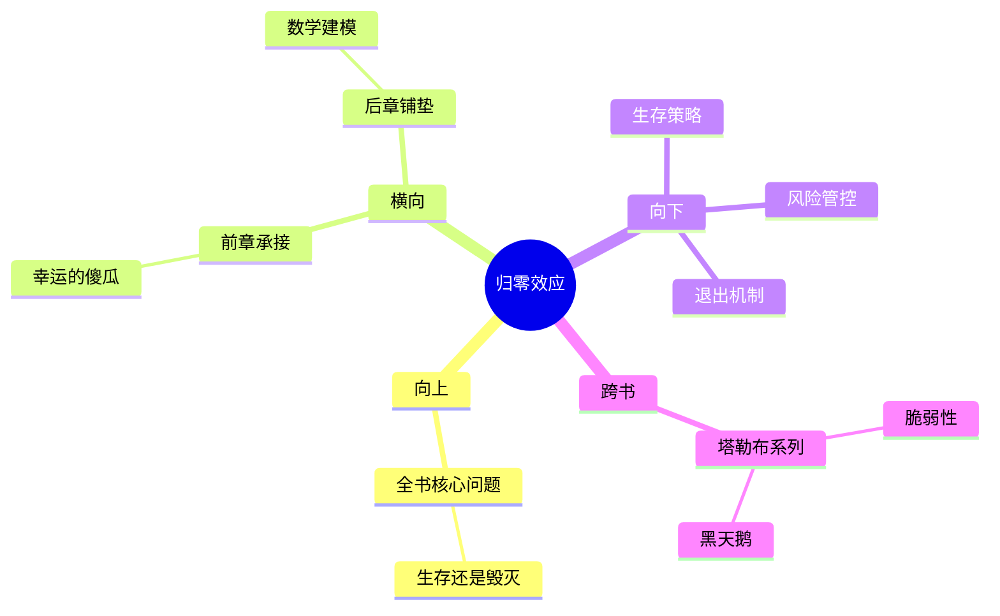

---

category: 
  - 书籍拆解
  - [[随机漫步的傻瓜-塔勒布]]
status: draft
chapter: 
number: 2
title: 奇迹与意外
links:

  - "[[第1章-赌徒的困惑]]"
  - "[[第3章-从数学角度思考]]"
created: 2026-02-27
tags:
  - 随机漫步的傻瓜
  - 奇迹与意外
  - 归零风险
  - 生存偏差
---

# 第2章 奇迹与意外

## 📍 章节定位

### 全书位置
> 本书承接开篇"幸运的傻瓜"理念，并进一步深化随机性的不可预测性和归零概念，从哲学思辨转向更具体的现实风险，强调重复的小概率事件最终会导致不可避免的结果。

- **全书核心问题**: 如果成功大部分是运气，我们该怎么活着？
- **本章回答的问题**: 为什么看似不可能的"奇迹"会在大量重复中成为必然？个体在重复风险中的生存问题如何影响我们的决策？
- **角色类型**: 核心深化型，承接第一章的概率思辨，深化到归零机制和生存问题
- **论证位置**: 在定义"幸运的傻瓜"后，进一步阐述随机性在重复博弈中的必然显现

### 章节序列
| 方向 | 章节标题 | 逻辑连接 |
|------|----------|----------|
| 前章 | [[第1章-赌徒的困惑]] | [从定义"幸运的傻瓜"到探讨重复博弈中的生存风险] |
| 后章 | [[第3章-从数学角度思考]] | [将哲学思考转化为数学分析工具] |

### 一句话定位
> 第2章深入探讨随机事件在重复中必然会显现的结果，特别是归零风险，通过"奇迹"与"意外"的概念诠释个体生存问题如何在概率机制下演变为集体统计规律，为后续章节中对金融市场风险的批判提供根本框架。

---

## 🎯 核心观点

### 第一层：表层案例
> 章节中的具体案例、故事、数据

| 案例名称 | 简要描述 | 页码 | 关键引文 |
|----------|----------|------|----------|
| 俄罗斯轮盘赌 | 重复参与最终会导致必然的死亡 | p.45 | "如果你一直挥舞着胳膊，迟早会有炸弹落下" |
| 失败者的沉默 | 大量失败案例未被观察 | p.52 | "失败者从未有机会发声" |
| 幸运者的故事 | 侥幸生存下来的案例被误读 | p.55 | "只有那些活下来的人才能写书" |

### 第二层：中层机制
> 案例背后的运行机制、方法论

| 机制名称 | 组成要素 | 因果链条 | 证据来源 |
|----------|----------|----------|----------|
| 归零效应机制 | 重复风险、不可逆损失、生存约束 | 单次小概率事件→重复操作→必然发生→系统归零 | 俄罗斯轮盘赌案例 |
| 幸存者偏差机制 | 群体基数、筛选过程、观测限制 | 海量个体→随机筛选→幸存者凸显→模式误读 | 失败者沉默现象 |
| 时间累积机制 | 小概率、时间维度、复合效应 | 低概率单次事件→长时期重复→累积结果→必然显现 | 概率论基本原理 |

### 第三层：底层规律
> 可迁移的普遍规律

| 规律陈述 | 抽象层级 | 知识连接 | 适用范围 |
|----------|----------|----------|----------|
| 时间消解小概率 | 数学统计学 + 系统论 | [[黑天鹅-塔勒布]] 极值理论 | 金融风险、保险、生存策略 |
| 存在偏见导致认知盲区 | 心理学 + 认知科学 | [[思考快与慢-丹尼尔·卡尼曼]] 可得性偏差 | 投资判断、政策制定 |
| 系统相变的突现法则 | 复杂系统 + 突变理论 | [[反脆弱-塔勒布]] 非线性系统 | 组织管理、生态演化 |

---

## 💬 降维翻译

### 观点1: 归零效应

#### 原文表达
> "如果你一直在跟俄罗斯轮盘赌搏斗，尽管你在第一次时运气很好，只要你继续玩下去，最终轮盘会转到那颗子弹，然后一切都结束了。"
> —— p.45

#### 降维翻译（中学生能懂）
不管多么幸运，只要一直冒险做一件事，迟早会碰到那种致命的结果。就像赌徒，即使运气好赢了很多次，但如果一直赌下去，总有一天会输光所有。关键在于，一旦输了，你就没机会再翻本了。

#### 日常类比（奶奶能懂）
就像小孩子玩火，第一次没烧伤，第二次也没事，但只要一直玩下去，肯定有一天会被烫伤。那些"没出事"的经历并不能说明玩火是安全的，只是还没轮到严重后果罢了。

#### 检验
- Q: 如果一个中学生问你什么是归零效应？
- A: 做有风险的事情，哪怕概率很小，只要重复足够多，几乎一定会出事，而且有时候出事就把你彻底搞垮。

### 观点2: 幸存者偏差

#### 原文表达
> "我们只看见活下来的人撰写的自传和论文，却无法听到那些死者的声音 —— 他们的声音被埋在了历史中。"
> —— p.52

#### 降维翻译（中学生能懂）
我们只看得到成功的案例，因为失败的人没机会说话了。这就让我们误以为成功是有某种规律的，其实可能只是运气好而已。

#### 日常类比（奶奶能懂）
就像考试，只有考上了的人才到处说"我是怎么学成的"，那些落榜的都没有机会分享经验。如果你只听上岸者的经验，你就容易误以为按照他们的方法就一定能成功。

#### 检验
- Q: 如果一个中学生问你怎么理解"看不见的真相"？
- A: 失败的人没有机会告诉我们失败的原因，我们只能听到成功者的声音，但这并不完整。

---

## ✨ 金句库

### 原书金句
| 金句 | 页码 | 适用场景 |
|------|------|----------|
| "如果你一直挥舞着胳膊，迟早会有炸弹落下" | p.45 | 风险警示类文章 |
| "只有幸存者才知道历史" | p.55 | 理性分析评论 |
| "奇迹只是尚未发生的灾难" | p.58 | 风险投资领域 |
| "我们看到的不是一个随机样本，而是经过筛选的样本" | p.62 | 数据分析普及 |
| "死亡的存在改变了所有事情" | p.65 | 临终关怀/生存哲学 |

### 降维金句
| 金句 | 来源观点 | 适用场景 |
|------|----------|----------|
| 重复小概率事件，必然导致结果显现 | 归零效应 | 风险管理培训 |
| 赌徒能说话，火死了不能开口 | 幸存者偏差 | 反成功学 |
| 时间是最无情的统计师 | 时间累积 | 理性分析 |
| 一着不慎，满盘皆输 | 一次性归零 | 谨慎提醒 |
| 看见的只是冰山一角 | 观察偏见 | 理性思维 |

## 🔗 当下映射

### 💰 财富应用
| 场景 | 具体行动 | 预期效果 | 风险提示 |
|------|----------|----------|----------|
| 投资高杠杆产品 | 设置绝对止损线，避免归零风险 | 保障本金可持续性 | 火山爆发式的亏损 |
| 基金经理挑选 | 考察其投资组合的最大回撤和爆仓历史 | 识别真实的技能而非运气 | 过往成功可能是幸存者偏差 |
| 职业发展风险 | 保持核心竞争力，避免all-in单一技能 | 分散职业归零风险 | 技能过时可能面临归零 |

### 💼 职场应用
| 场景 | 具体行动 | 所需能力 | 适用职级 |
|------|----------|----------|----------|
| 岗位风险评估 | 识别职位的结构性归零风险 | 前瞻性思维 | 中高层管理 |
| 职业技能布局 | 多元化技能结构，降低单一风险 | 学习适应能力 | 所有职场人 |
| 组织变革应对 | 评估公司商业模式可持续性 | 直觉判断能力 | 高管/中层 |

### 🏠 生活应用
| 场景 | 具体行动 | 可行性 | 见效时间 |
|------|----------|--------|----------|
| 危险行为识别 | 避免任何形式的重复性高风险活动 | 高，需自制力 | 立即可行 |
| 概率思维养成 | 在做决定时考虑最坏情况 | 高，逐步训练 | 1个月形成习惯 |
| 信息来源多样化 | 主动寻找失败案例进行对比学习 | 高，需意识转变 | 2-4周见效 |

### 72小时行动计划
1. 今天可以做的第一件事：列出自己目前面临的重复性风险活动，并设置风险管控点
2. 本周内可以尝试的事：阅读一份失败企业的案例分析，与成功案例对比
3. 需要准备资源才能做的事：建立风险监控表格，定期检查自己的各项风险敞口

---

## 🕸️ 章节关联

### 向上关联 → 整书
- **贡献**: 以"归零效应"加深读者对随机性不可规避性的理解，为全书的风险管理和防范框架提供理论支持
- **位置**: 整个不确定性理论的重要基石，连接了个人认知到系统风险的桥梁

### 横向关联 → 章节间
| 章节编号 | 章节标题 | 关联类型 | 连接描述 |
|----------|----------|----------|----------|
| 第1章 | [[第1章-赌徒的困惑]] | 承接 | 将"幸运的傻瓜"现象深化到必然归零机制 |
| 第3章 | [[第3章-从数学角度思考]] | 铺垫 | 提供数学工具对重复随机事件进行量化 |
| 第6章 | [[第6章-偏态与不对称]] | 呼应 | 从不对称效应解释归零风险的不可逆性 |

### 向下关联 → 具体应用
| 应用场景 | 难度 | 前置知识 |
|----------|------|----------|
| 退出策略设计 | 高 | 概率基础+风险控制 |
| 反脆弱系统构建 | 高 | 复杂系统理论 |
| 投资风险评估 | 中 | 基础金融知识 |

### 跨书关联 → 知识网络
| 书籍 | 概念 | 关系 | 备注 |
|------|------|------|------|
| [[反脆弱-塔勒布]] | 脆弱性 | 延伸 | 归零是脆弱性的终极体现 |
| [[黑天鹅-塔勒布]] | 稀有事件 | 呼应 | 极低概率事件的大影响 |
| [[非对称风险-塔勒布]] | 损失函数 | 对应 | 不同风险类型的损失模式 |
| [[周期]] | 现实校验 | 支持 | 周期末端的归零风险极高 |

### 关联可视化

---

## ❓ 问答设计

### Q1: 什么是归零效应？(记忆型)
**认知层次**: 记忆
**难度**: 低
**答案要点**:
- 在重复的随机事件中，即使是小概率的不良事件，随着时间推移必然会发生
- 一旦发生就会导致整个系统或参与者彻底退出
- 完全区别于普通的风险事件

### Q2: 为什么幸存者偏差会误导我们的判断？(理解型)
**认知层次**: 理解  
**难度**: 中
**答案要点**:
- 我们只看得见成功者，看不见失败者
- 成功者的特点可能是巧合，不代表因果关系
- 统计学上的选择性偏差导致结论偏离真实情况

### Q3: 在职业规划中如何避免"归零效应"？(应用型)
**认知层次**: 应用
**难度**: 高
**答案要点**:
- 建立多元化技能矩阵
- 设置风险管控阈值
- 保持持续学习和适应能力

### Q4: 归零效应如何影响整个社会系统的稳定性？(分析型)
**认知层次**: 分析
**难度**: 高
**答案要点**:
- 导致系统脆弱性增加
- 形成系统性风险聚集
- 可能引发连锁反应

### Q5: 如何平衡收益追求与归零风险控制？(评价型)
**认知层次**: 评价
**难度**: 高
**答案要点**:
- 杠铃策略在其中的应用
- 概率思维的重要性
- 系统性风险防范

### Q6: 面对归零风险，我们如何重新构建人生的哲学基础？(创造型)
**认知层次**: 创造
**难度**: 高
**答案要点**:
- 从追求胜利到追求生存的思维转变
- 建立反脆弱的人生系统
- 发展适应不确定性的价值观

### Q7: 归零效应的数学原理是什么？(记忆型)
**认知层次**: 记忆
**难度**: 中
**答案要点**:
- 伯努利独立试验
- 大数定律
- 概率收敛至必然

### Q8: 为什么人们很难理解"小概率长期化为必然"？(理解型)
**认知层次**: 理解
**难度**: 中
**答案要点**:
- 人类时间感知有限
- 直观难以理解长期复合效应
- 确认偏误影响判断

### Q9: 如何构建抵御归零效应的防护机制？(应用型)
**认知层次**: 应用
**难度**: 高
**答案要点**:
- 冗余备份
- 隔离分区
- 容错设计

### Q10: 归零效应如何影响人类的心理与行为模式？(分析型)
**认知层次**: 分析
**难度**: 高
**答案要点**:
- 短期利益驱动行为
- 认知偏差固化
- 风险偏好错位

---
