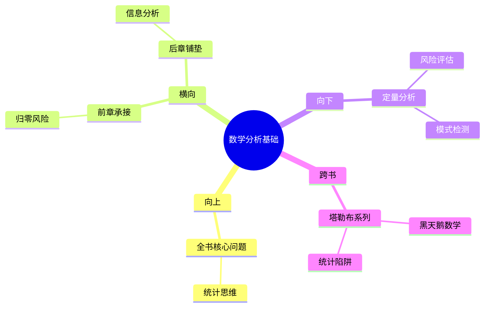

---

category: 
  - 书籍拆解
  - [[随机漫步的傻瓜-塔勒布]]
status: draft
chapter: 
number: 3
title: 从数学角度思考
links:

  - "[[第2章-奇迹与意外]]"
  - "[[第4章-随机性、信息和噪音]]"
created: 2026-02-27
tags:
  - 随机漫步的傻瓜
  - 概率思维
  - 独立事件
  - 大数法则
---

# 第3章 从数学角度思考

## 📍 章节定位

### 全书位置
> 从哲学思辨转向定量分析的转折章节，运用数学和概率理论工具，为前面提出的"随机性"和"归零效应"问题提供严谨的数值基础和解释框架，同时也是后续章节中风险度量和统计分析的数学基础。

- **全书核心问题**: 如果成功大部分是运气，我们该怎么活着？
- **本章回答的问题**: 如何用严谨的概率工具分析随机性？为什么在有限次数中运气占据主导地位？大数法则如何发挥作用但需要极长时间？
- **角色类型**: 理论构建型，用数学工具证实前面章节中的直觉和哲学思考
- **论证位置**: 从哲学思辨向定量分析的过渡，提供数学基础支撑

### 章节序列
| 方向 | 章节标题 | 逻辑连接 |
|------|----------|----------|
| 前章 | [[第2章-奇迹与意外]] | [从归零风险现象到数学概率解析] |
| 后章 | [[第4章-随机性、信息和噪音]] | [从数学概率到真实信息环境中的应用] |

### 一句话定位
> 第3章为前期的哲学思辨提供了坚实的数学基础，通过概率论和数理统计工具解释随机性背后的数学机制，为个体在不确定环境中做出理性质衡提供数学框架，奠定了塔勒布不确定性系列的量化分析基础。

---

## 🎯 核心观点

### 第一层：表层案例
> 章节中的具体案例、数据、数学示例

| 案例名称 | 简要描述 | 页码 | 关键引文 |
|----------|----------|------|----------|
| 硬币投掷实验 | 演示概率收敛需要极大的样本数 | p.75 | "即使是一枚完美的硬币，也需要上万次投掷才能接近50%的概率" |
| 交易者的模拟实验 | 展示在纯随机市场中仍有少数成功者 | p.78 | "在1000个随机交易者中，总有几个会连续成功" |
| 大数法则演示 | 说明频率趋近概率需要漫长过程 | p.82 | "时间是我们对抗随机性的最大敌人也是朋友" |

### 第二层：中层机制
> 数据背后的数学逻辑和统计机制

| 机制名称 | 组成要素 | 因果链条 | 证据来源 |
|----------|----------|----------|----------|
| 小样本效应机制 | 样本规模、随机波动、趋势拟合 | 有限次数→显著偏离→假象形成→误判强化 | 硬币投掷实验 |
| 择优统计机制 | 选择机制、幸存者筛选、能力误判 | 随机群体→结果分析→筛选成功者→归因能力 | 交易者模拟实验 |
| 概率收敛机制 | 重复次数、随机扰动、统计稳定 | 初期波动→渐进收敛→稳定表现→真实规律 | 大数法则演示 |

### 第三层：底层规律
> 普适性数学原理和认知原则

| 规律陈述 | 抽象层级 | 知识连接 | 适用范围 |
|----------|----------|----------|----------|
| 人类认知时间尺度vs统计收敛时间尺度不匹配 | 数学统计学 + 认知科学 | [[黑天鹅-塔勒布]] 肥尾分布 | 风险评估、业绩分析 |
| 随机游走中的局部趋势不等于全局趋势 | 随机过程 + 分形理论 | [[随机漫步的傻瓜-塔勒布]] 全书核心 | 投资决策、政策评估 |
| 理性决策需要统计样本的充分性 | 统计推理 + 决策理论 | [[反脆弱-塔勒布]] 决策框架 | 科学实验、商业评估 |

---

## 💬 降维翻译

### 观点1: 小样本中的虚假规律

#### 原文表达
> "在一个小样本中，随机性会产生'假模式'，使得纯粹的运气看起来像是真正的技能。在真实生活中，我们面对的往往是少量事件，而不是数学家假设的理想无穷序列。"
> —— p.75

#### 降维翻译（中学生能懂）
在数学理论中，如果我们进行无限次试验，最终的结果会趋向于真实的概率。比如扔硬币扔无限次，正反面出现次数会趋近于各占一半。但实际上我们只能做有限次试验，所以经常会出现某些时间段连续出现一面这种情况，并不代表这面更容易出现，纯粹是运气好或运气差。很多人误把这种暂时的偏差当成了真实规律。

#### 日常类比（奶奶能懂）
就像抽签，如果一共只有10支签，而且都是一等奖，你第一次就抽到一等奖，这并不说明你手气特别好，或者有什么特殊技巧，单纯是运气好。但如果抽10万次，那各种结果出现的比例才会接近真实概率。

#### 检验
- Q: 如果一个中学生问你为什么不能凭几次结果就下结论？
- A: 因为次数太少，运气成分太大，只有试验很多次以后，真实规律才会显现出来。

### 观点2: 大数法则的时间壁垒

#### 原文表达
> "大多数人对'大数'的理解还停留在千位数，但实际上，要达到真正的统计数据学意义，可能需要百万甚至千万次的实验。这意味着在个体一生中，我们永远无法积累足够的数据来验证任何模式。"
> —— p.82

#### 降维翻译（中学生能懂）
我们以为几十次或者几百次试验就叫"大数据"了，但在统计学上，真正的"大"数字通常要上百万次。这就意味着，我们每个人生命有限，根本做不完这么多次试验，所以我们得出的结论很可能不是基于足够的数据。

#### 日常类比（奶奶能懂）
就像判断天气好坏，你觉得最近一个月都很暖和，于是认定今年冬天会很暖，但这只是1/12年的数据。要真正了解气候变化，可能需要观察几十年上百年，而我们人类寿命就这么长，观察时间相对太短了。

#### 检验
- Q: 如果一个中学生问你为什么有时统计数据欺骗人？
- A: 因为我们能观察的时间相对于自然规律来说太短了，样本数量不够大，所以看到的可能只是运气的结果。

---

## ✨ 金句库

### 原书金句
| 金句 | 页码 | 适用场景 |
|------|------|----------|
| "即使是一枚完美的硬币，在一百次投掷中也可能表现出强烈的不对称性" | p.76 | 概率分析评论 |
| "我们生活的空间太小，时间太短，无法验证任何模式" | p.80 | 批判性思维 |
| "数学是一种思考工具，而不是计算工具" | p.85 | 理性思维提倡 |
| "在有限的样本中，统计学家可能会看到错误的规律" | p.88 | 科学精神倡导 |
| "概率不等于频率，直到时间趋于无穷" | p.90 | 专业分析引用 |

### 降维金句
| 金句 | 来源观点 | 适用场景 |
|------|----------|----------|
| 少数几次表现不能判断真实能力 | 小样本效应 | 投资决策风险提醒 |
| 实验次数不够多，结果可能作数 | 概率收敛 | 反对草率结论 |
| 我们生命太短，不足以验证规律 | 时间壁垒 | 保持谦逊心态 |
| 看似规律的可能只是随机现象 | 假模式 | 避免刻板印象 |
| 运气和能力短期内难以区分 | 随机性 | 客观判断标准 |

## 🔗 当下映射

### 💰 财富应用
| 场景 | 具体行动 | 预期效果 | 风险提示 |
|------|----------|----------|----------|
| 投资策略调整 | 不根据短期绩效选择基金或交易员 | 避免被虚假技能所迷惑 | 短期内确实有波动 |
| 风险收益评估 | 放大观察时间维度，要求更多样本数据 | 更客观评价实际表现 | 长时间跨度难以把握 |
| 投研框架构建 | 重视过程分析胜过结果分析 | 减少幸存者偏差影响 | 结果导向文化根深蒂固 |

### 💼 职场应用
| 场景 | 具体行动 | 所需能力 | 适用职级 |
|------|----------|----------|----------|
| 绩效考核改革 | 减少短期指标权重，增加过程监控 | 系统性思考 | 管理岗位 |
| 人才评定改进 | 关注能力结构胜过短期业绩 | 长期视角判断 | HR及高管 |
| 决策模式优化 | 放宽评估时间窗口，增加容错性 | 耐心等待结果 | 领导层 |

### 🏠 生活应用
| 场景 | 具体行动 | 可行性 | 见效时间 |
|------|----------|--------|----------|
| 概率思维训练 | 面对现象时主动考虑样本大小问题 | 高，易训练 | 立即可尝试 |
| 随机性接纳 | 正视运气在成功中起到的作用 | 高，需要心态 | 1-3个月适应 |
| 远期决策规划 | 延长评估周期，减少短期压力 | 高，逐步培养 | 3-6个月显效 |
| 数据分析能力 | 主动搜集更大样本支持判断 | 中，需要资源 | 半年建立基本能力 |

### 72小时行动计划
1. 今天可以做的第一件事：回想最近一次因为几件事就得出某种"规律"的经验，分析是否存在样本量不足的情况
2. 本周内可以尝试的事：选择一个长期判断（如同事的能力、朋友的可靠性），列出需要多少样本才能得出可信结论
3. 需要准备资源才能做的事：学习基础的统计学知识，了解常见分布及其收敛特性

---

## 🕸️ 章节关联

### 向上关联 → 整书
- **贡献**: 为前两章提出的现象提供了严格数学模型，奠定了全书统计分析的科学基础，并预示了后续章节中对媒体和专家意见的数学解构
- **位置**: 承接哲学思考向实践应用转换的枢纽章节，连接抽象理论到具体应用

### 横向关联 → 章节间
| 章节编号 | 章节标题 | 关联类型 | 连接描述 |
|----------|----------|----------|----------|
| 第2章 | [[第2章-奇迹与意外]] | 承接 | 用数学证明为什么归零效应存在 |
| 第4章 | [[第4章-随机性、信息和噪音]] | 铺垫 | 概率论为基础分析信息噪音比例 |
| 第6章 | [[第6章-偏态与不对称]] | 递进 | 概率分布在非对称场景下的数学表现 |

### 向下关联 → 具体应用
| 应用场景 | 难度 | 前置知识 |
|----------|------|----------|
| 数据分析框架 | 中 | 基础统计知识 |
| 投资决策体系 | 高 | 概率统计+风险管理 |
| 风险度量模型 | 高 | 数理统计+金融工程 |

### 跨书关联 → 知识网络
| 书籍 | 概念 | 关系 | 备注 |
|------|------|------|------|
| [[黑天鹅-塔勒布]] | 大数法则失效 | 延伸 | 肥尾分布下收敛时间无限长 |
| [[思考快与慢-丹尼尔·卡尼曼]] | 小数定理 | 一致 | 人都不喜欢统计思维 |
| [[非对称风险-塔勒布]] | 期望损失计算 | 应用 | 用数学工具评估不对称风险 |
| [[反脆弱-塔勒布]] | 误差函数 | 延伸 | 统计模型本身的脆弱性 |

### 关联可视化

---

## ❓ 问答设计

### Q1: 什么是小样本效应？(记忆型)
**认知层次**: 记忆
**难度**: 低
**答案要点**:
- 在数据样本量较小时，随机性会显现明显的"假模式"
- 容易把运气误认为是技能
- 需要足够大的样本量才能验证真实概率

### Q2: 为什么数学理论和实际情况之间存在差异？(理解型)
**认知层次**: 理解  
**难度**: 中
**答案要点**:
- 理论往往假设无限次实验
- 实际中人类生命和时间有限
- 小样本中的波动可能掩盖真实规律

### Q3: 在实际生活中如何克服小样本效应？(应用型)
**认知层次**: 应用
**难度**: 高
**答案要点**:
- 主动搜集更多样本
- 关注过程而非结果
- 延长评估周期

### Q4: 大数法则在现实中受到哪些限制？(分析型)
**认知层次**: 分析
**难度**: 高
**答案要点**:
- 具体事件发生的实际频次不足
- 时间成本过高
- 环境变量改变破坏收敛条件

### Q5: 如何理性看待短期成功和长期能力关系？(评价型)
**认知层次**: 评价
**难度**: 高
**答案要点**:
- 短期成功可能是运气主导
- 需要足够时间窗口验证
- 能力建设优于短期结果

### Q6: 如何构建适应小样本局限性的决策框架？(创造型)
**认知层次**: 创造
**难度**: 高
**答案要点**:
- 建立多层次评估标准
- 风险容忍机制
- 持续校准和迭代机制

### Q7: 小样本中的"假规律"对人类思维的影响如何？(分析型)
**认知层次**: 分析
**难度**: 中
**答案要点**:
- 强化确认偏误
- 促成错误归因
- 加固既有偏见

### Q8: 时间维度如何影响我们的概率判断？(理解型)
**认知层次**: 理解
**难度**: 中
**答案要点**:
- 人类生命周期相对于自然规律太短
- 期望在有限时间内验证无限过程
- 容易被短期波动迷惑

### Q9: 在缺乏足够数据时应该如何决策？(应用型)
**认知层次**: 应用
**难度**: 高
**答案要点**:
- 基于理论建模
- 设定风险上限
- 保持调整能力

### Q10: 统计学基础如何影响我们的世界观？(评价型)
**认知层次**: 评价
**难度**: 高
**答案要点**:
- 重新认识因果与关联
- 正视随机性的存在
- 建立概率性思维

### Q11: 大数法则的收敛速度取决于哪些因素？(记忆型)
**认知层次**: 记忆
**难度**: 中
**答案要点**:
- 概率分布类型
- 事件独立性程度
- 容忍误差水平

### Q12: 如何设计实验来验证小样本效应？(创造型)
**认知层次**: 创造
**难度**: 高
**答案要点**:
- 模拟不同样本规模
- 比较收敛过程
- 分析偏差产生的边界条件

---
