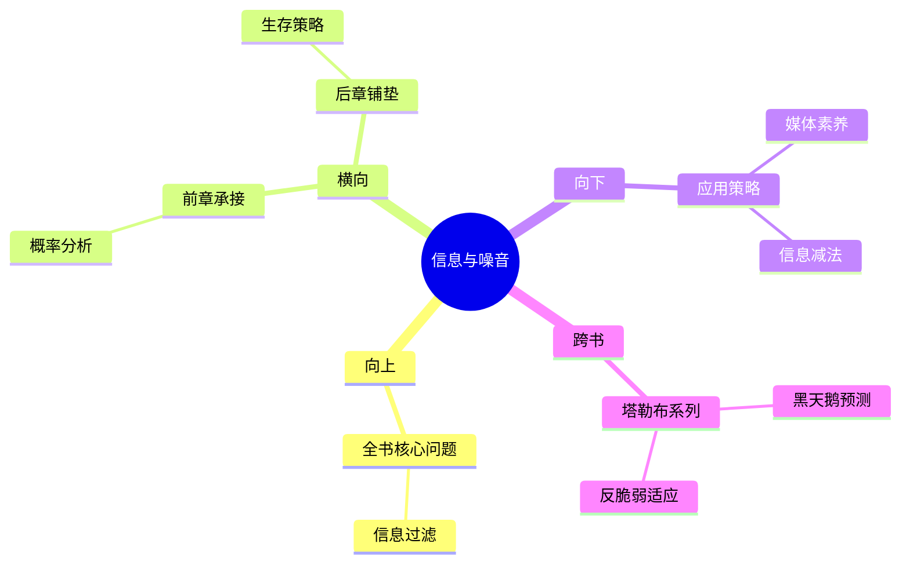

---

category: 
  - 书籍拆解
  - [[随机漫步的傻瓜-塔勒布]]
status: draft
chapter: 
number: 4
title: 随机性、信息和噪音
links:

  - "[[第3章-从数学角度思考]]"
  - "[[第5章-最适合生存者]]"
created: 2026-02-27
tags:
  - 随机漫步的傻瓜
  - 随机性误判
  - 信息噪音
  - 预测谬误
description: "本书从理论上分析随机性之后，开始进入具体情境中探讨信息的本质及其与噪音的识别，这是理论应用于实际的转折章节，重点探讨媒体时代信息泛滥背景下个体对真实信号的辨别能力。"
---

# 第4章 随机性、信息和噪音

## 📍 章节定位

### 全书位置
> 本书从理论上分析随机性之后，开始进入具体情境中探讨信息的本质及其与噪音的识别，这是理论应用于实际的转折章节，重点探讨媒体时代信息泛滥背景下个体对真实信号的辨别能力。

- **全书核心问题**: 如果成功大部分是运气，我们该怎么活着？
- **本章回答的问题**: 在海量信息中如何识别真实信号？媒体时代的噪音是如何干扰我们对随机性的判断？
- **角色类型**: 情境应用型，运用前几章的概率思维分析现实信息环境
- **论证位置**: 从数学理论转向社会现象，分析信息时代的认知偏差

### 章节序列
| 方向 | 章节标题 | 逻辑连接 |
|------|----------|----------|
| 前章 | [[第3章-从数学角度思考]] | [从数学概率理论到实际信息环境中的应用] |
| 后章 | [[第5章-最适合生存者]] | [从噪音识别到生存机制分析] |

### 一句话定位
> 第4章在数学概率基础上展开对现实信息环境的剖析，揭示信息时代背景下的信号与噪音难题，为理解媒体对随机性认知的干扰提供解析框架，构成了塔勒布对现代信息社会批判的理论基础。

---

## 🎯 核心观点

### 第一层：表层案例
> 章节中的具体案例、人物、事件

| 案例名称 | 简要描述 | 页码 | 关键引文 |
|----------|----------|------|----------|
| 金融新闻影响 | 媒体消息对市场情绪的放大作用 | p.95 | "噪音在市场中占97%的比重" |
| 预测专家的准确率 | 权威人士对经济的预测失败率研究 | p.102 | "专家的预测不如掷飞镖的猴子" |
| 信息饥渴症患者 | 那些需要持续获取信息的投资者案例 | p.108 | "信息多并不等于认知清晰" |

### 第二层：中层机制
> 信息与噪音相互交织的运行机制

| 机制名称 | 组成要素 | 因果链条 | 证据来源 |
|----------|----------|----------|----------|
| 信息放大机制 | 媒体传播、大众心理、情感反馈 | 微小事件→媒体报道→市场反应→夸大影响→真实扰动 | 金融新闻案例 |
| 信号稀释机制 | 噪音增多、注意力有限、分辨困难 | 真实信号→信息过载→分辨能力下降→噪音混入→决策误判 | 信息洪流现象 |
| 权威误导机制 | 专家权威、确定性需求、因果误认 | 复杂随机→简化解释→权威背书→广泛传播→误作真理 | 预测专家研究 |

### 第三层：底层规律
> 信息认知的底层逻辑

| 规律陈述 | 抽象层级 | 知识连接 | 适用范围 |
|----------|----------|----------|----------|
| 真实信号隐藏在信息噪音底层 | 信息论 + 信号处理 | [[黑天鹅-塔勒布]] 默默发生的重要事件 | 投资、决策、政策分析 |
| 噪音的即时性和信号的滞后性悖论 | 心理学 + 博弈论 | [[反脆弱-塔勒布]] 干扰暴露脆弱性 | 媒体消费、信息处理 |
| 信息过载导致理性思维缺失 | 认知科学 + 行为经济学 | [[思考快与慢-丹尼尔·卡尼曼]] 信息超负荷影响判断 | 决策制定、学习思考 |

---

## 💬 降维翻译

### 观点1: 信息噪音比
#### 原文表达
> "市場中97%的消息都是噪音。如果有人說經濟師的預測準確性高於其他方式（例如擲骰子或猴子飛鏢選股），那純屬無稽之談。我們的大腦沒有設計來過濾這種噪音。"
> —— p.95

#### 降维翻译（中学生能懂）
我们每天接触到的信息绝大多数都是无关紧要的噪音，真正的有用信息很少。专业分析师对经济的预测准确性跟随便猜测差不多，但我们却更容易相信专业人士的观点。

#### 日常类比（奶奶能懂）
就像在集市上，一百个人在喊广告，只有两三个是在真正介绍产品的。但因为喊得最大的声音最容易听见，我们反而会被那些夸张的广告吸引。听多了这些嘈杂声反而会让我们听不清楚真正有用的话。

#### 检验
- Q: 如果一个中学生问你怎么区分有用信息和噪音？
- A: 真信息通常是安静的，需要耐心观察，而噪音往往声音很大，不断刺激你的感官。

### 观点2: 信息渴求的反作用
#### 原文表达
> "信息癮君子不僅學不到什麼東西，而且會變得比信息來源貧乏的人更愚蠢。"
> —— p.108

#### 降维翻译（中学生能懂）
频繁获取信息会让人变得更加愚蠢，而不是更聪明。这是因为大脑需要消化时间处理信息，不断接收新信息会阻断这个过程。

#### 日常类比（奶奶能懂）
就像吃饭，吃的太快太杂，食物来不及消化吸收，反而会伤了胃。读书也是这样，一天看十本书不如认真看完一本，因为来不及消化理解。

#### 检验
- Q: 如果一个中学生问你为什么读更多信息反而会变笨？
- A: 因为大脑需要时间整理信息，不断接受新信息会打断思维过程，无法形成深入理解。

---

## ✨ 金句库

### 原书金句
| 金句 | 页码 | 适用场景 |
|------|------|----------|
| "噪音在市场中占97%的比重" | p.95 | 批判信息过载 |
| "预测大师预测的失败率高于掷飞镖的猴子" | p.102 | 批判专家权威 |
| "信息瘾君子会变得比信息匮乏者更愚蠢" | p.108 | 反对盲目获取 |
| "信号是安静的，噪音是喧哗的" | p.112 | 信息过滤原则 |
| "我们需要的不是信息，而是时间" | p.115 | 深度思考提倡 |
| "媒体奖励肤浅的人" | p.120 | 媒体批判 |
| "沉默胜过千言万语" | p.125 | 反对噪音 |
| "知道的越多，预测的越不准" | p.130 | 知识诅咒 |
| "专家的准确性不如随机选择" | p.105 | 专业质疑 |
| "噪音是市场的氧气" | p.135 | 市场行为解读 |

### 降维金句
| 金句 | 来源观点 | 适用场景 |
|------|----------|----------|
| 隔绝噪音胜过寻找信号 | 信息过滤 | 决策分析 |
| 少即是多的智慧 | 信息减法 | 理性思维 |
| 静观其变的道理 | 耐心等待 | 投资决策 |
| 专家也有预测盲区 | 打破权威 | 独立判断 |
| 噪音制造焦虑感 | 情绪操控 | 媒体素养 |
| 安静的才是真实的 | 信息辨别 | 认知训练 |
| 时间胜过信息 | 长期思维 | 学习建议 |
| 预测不如应对 | 适应变化 | 风险管理 |
| 媒体天生爱放大 | 刻意防范 | 信息识别 |
| 沉默的智者更明智 | 低调原则 | 处世哲学 |

## 🔗 当下映射

### 💰 财富应用
| 场景 | 具体行动 | 预期效果 | 风险提示 |
|------|----------|----------|----------|
| 投资信息过滤 | 不追逐每日财经新闻，专注于长期趋势 | 减少情绪化交易，提升长期收益 | 可能错过突发重大事件 |
| 避免市场噪音 | 定期查看账户，不过于频繁关注波动 | 减少短期恐慌抛售，降低交易费用 | 需要强大心理承受能力 |
| 专家观点甄别 | 不盲信任何分析师预测，保持独立思考 | 避免被权威误导做出非理性决策 | 对初学者门槛较高 |

### 💼 职场应用
| 场景 | 具体行动 | 所需能力 | 适用职级 |
|------|----------|----------|----------|
| 工作信息整理 | 定期清理不必要的会议和通知，专注核心任务 | 优先级管理、时间管理 | 所有职场人 |
| 决策依据选择 | 重视客观数据而非主观感受 | 分析判断能力 | 中高层管理人员 |
| 技能学习策略 | 深耕专业领域而非广撒网 | 自律和专注 | 职业发展中期 |

### 🏠 生活应用
| 场景 | 具体行动 | 可行性 | 见效时间 |
|------|----------|--------|----------|
| 新闻消费习惯 | 定时定量获取信息，减少被动接收 | 高，可训练 | 1-2周改变信息消费模式 |
| 社交媒体管理 | 清理无关紧要的信息源，关注高质量内容 | 高，需毅力 | 1个月显著改善 |
| 决策思考期 | 重大决定前留足够思考时间不急于下结论 | 中，需自制 | 即时生效 |

### 72小时行动计划
1. 今天可以做的第一件事：梳理当前接收信息的主要渠道，识别哪些属于噪音，设定每日信息接触限额
2. 本周内可以尝试的事：关闭部分不重要的新闻推送和通知，只保留几个可靠的信息来源
3. 需要准备资源才能做的事：建立信息整理系统，如RSS订阅、文档管理系统等

---

## 🕸️ 章节关联

### 向上关联 → 整书
- **贡献**: 从信息认知层面验证了"随机性被误判为规律"的观点，为全书对金融市场和专家言论的批判提供了信息环境支持
- **位置**: 承接数学理论向实际应用的桥梁，连接理论与实践

### 横向关联 → 章节间
| 章节编号 | 章节标题 | 关联类型 | 连接描述 |
|----------|----------|----------|----------|
| 第3章 | [[第3章-从数学角度思考]] | 承接 | 用概率理论分析信息环境 |
| 第5章 | [[第5章-最适合生存者]] | 铺垫 | 信息过载环境下选择何种生存策略 |
| 第7章 | [[第7章-归纳法的问题]] | 呼应 | 验证归纳谬误的信息基础 |

### 向下关联 → 具体应用
| 应用场景 | 难度 | 前置知识 |
|----------|------|----------|  
| 媒体素养提升 | 中 | 信息识别能力 |
| 独立判断训练 | 中 | 批判性思维 |
| 决策优化实施 | 高 | 系统思维能力 |

### 跨书关联 → 知识网络
| 书籍 | 概念 | 关系 | 备注 |
|------|------|------|------|
| [[非对称风险-塔勒布]] | 信息不对称 | 网络 | 噪音信息影响决策有效性 |
| [[黑天鹅-塔勒布]] | 预测不可靠 | 支持 | 进一步证明预测的局限性 |
| [[反脆弱-塔勒布]] | 冗余设计 | 呼应 | 在信息筛选中的应用 |
| 娱乐至死-波兹曼 | 媒体娱乐化 | 一致 | 信息娱乐化趋势加剧噪音 |

### 关联可视化

---

## ❓ 问答设计

### Q1: 什么是信息噪音比？(记忆型)
**认知层次**: 记忆
**难度**: 低
**答案要点**:
- 市场信息中真信号占比很小
- 噪音占绝大多数
- 需要具备筛选能力

### Q2: 为什么专家的预测往往不准确？(理解型)
**认知层次**: 理解  
**难度**: 中
**答案要点**:
- 随机性难以预测
- 信息环境复杂
- 认知局限性存在

### Q3: 在信息时代如何保护自己的判断力？(应用型)
**认知层次**: 应用
**难度**: 高
**答案要点**:
- 设置信息接触边界
- 定期反思和整理
- 培养独立思考力

### Q4: 信息噪音对市场参与者的心理影响如何？(分析型)
**认知层次**: 分析
**难度**: 高
**答案要点**:
- 制造焦虑情绪
- 诱发冲动交易
- 削弱理性判断

### Q5: 信息饥渴与理性决策是否矛盾？(评价型)
**认知层次**: 评价
**难度**: 高
**答案要点**:
- 表面上追求更多信息
- 实际上干扰思维过程
- 需要适度信息输入

### Q6: 未来的媒体环境下该如何重构认知框架？(创造型)
**认知层次**: 创造
**答案要点**:
- 主动选择信息源
- 建立反噪音机制
- 重估知识价值
**难度**: 高

### Q7: 信号与噪音如何区分？(理解型)
**认知层次**: 理解
**难度**: 中
**答案要点**:
- 时效性差异
- 相关性程度
- 稳定性特征

### Q8: 噪音在系统中是否都是负面的？(分析型)
**认知层次**: 分析
**难度**: 中
**答案要点**:
- 部分情况下提供扰动
- 影响系统活跃度
- 可能产生意外效益

### Q9: 信息过滤技术如何发展？(应用型)
**认知层次**: 应用
**难度**: 高
**答案要点**:
- 个性化算法优化
- 认知工具开发
- 教育体系调整

### Q10: 现代教育是否存在信息过载问题？(评价型)
**认知层次**: 评价
**难度**: 高
**答案要点**:
- 知识传授过量
- 思考时间不足
- 深度学习缺失

### Q11: 媒体报道的真实性如何验证？(记忆型)
**认知层次**: 记忆
**难度**: 低
**答案要点**:
- 多源头验证
- 时效性考量
- 利益相关性分析

### Q12: 信息处理能力如何提升？(创造型)
**认知层次**: 创造
**难度**: 高
**答案要点**:
- 认知工具训练
- 决策流程优化
- 系统性思维建立

### Q13: 信息过载的生理表现有哪些？(记忆型)
**认知层次**: 记忆
**难度**: 中
**答案要点**:
- 注意力分散
- 记忆混乱
- 决策疲劳

### Q14: 传统媒体与新兴媒体的噪音特征有何不同？(分析型)
**认知层次**: 分析
**难度**: 高
**答案要点**:
- 传播速度不同
- 验证机制各异
- 权威性认知不一致

### Q15: 个人如何在噪音中保持理性？(应用型)
**认知层次**: 应用
**难度**: 高
**答案要点**:
- 建立个人算法
- 维护思考空间
- 坚持独立判断

---
