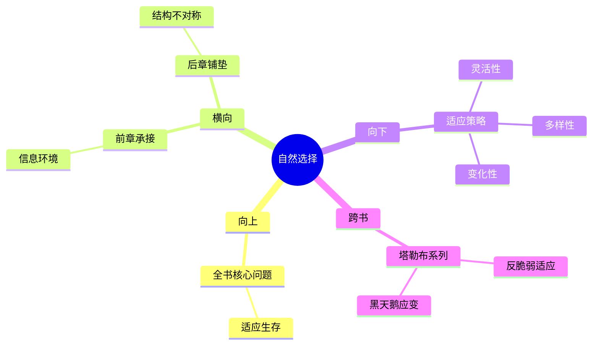

---

category: 
  - 书籍拆解
  - [[随机漫步的傻瓜-塔勒布]]
status: draft
chapter: 
number: 5
title: 最适合生存者
links:

  - "[[第4章-随机性、信息和噪音]]"
  - "[[第6章-偏态与不对称]]"
created: 2026-02-27
tags:
  - 随机漫步的傻瓜
  - 自然选择
  - 环境适应
  - 生存机制
description: "本书在分析了随机性和信息噪音的基础上，开始探讨适应环境的生存机制问题，从达尔文进化理论出发，阐释真正的\"生存者\"往往不是最强壮或最聪明的，而是最能适应随机变化的个体，为理解人类个体和社会组织的生存逻辑提供理论基础。"
---

# 第5章 最适合生存者

## 📍 章节定位

### 全书位置
> 本书在分析了随机性和信息噪音的基础上，开始探讨适应环境的生存机制问题，从达尔文进化理论出发，阐释真正的"生存者"往往不是最强壮或最聪明的，而是最能适应随机变化的个体，为理解人类个体和社会组织的生存逻辑提供理论基础。

- **全书核心问题**: 如果成功大部分是运气，我们该怎么活着？
- **本章回答的问题**: 什么样的个体或组织更容易在随机环境中生存？环境变化如何改变"最优生存者"的定义？
- **角色类型**: 机制分析型，从演化机制层面解释适应与生存的根本逻辑
- **论证位置**: 探讨生存机制，是前几章的进一步延伸，为应对随机性提供生存策略

### 章节序列
| 方向 | 章节标题 | 逻辑连接 |
|------|----------|----------|
| 前章 | [[第4章-随机性、信息和噪音]] | [从噪音环境到适者生存机制] |
| 后章 | [[第6章-偏态与不对称]] | [从生存机制到收益结构分析] |

### 一句话定位
> 第5章运用演化生物学视角阐释在充满随机性的环境中，"最适合生存"的个体并非最优秀或最强大者，而是对环境变动适应性最佳者，为应对不确定性提供了新的生存哲学视角。

---

## 🎯 核心观点

### 第一层：表层案例
> 章节中的具体案例、生物现象、历史事件

| 案例名称 | 简要描述 | 页码 | 关键引文 |
|----------|----------|------|----------|
| 恐龙灭绝 | 强大物种在环境突变中的淘汰 | p.145 | "最强的没有灭亡，最能适应的存活下来" |
| 细菌繁殖 | 微生物在抗生素压力下的适应 | p.150 | "随机变异带来生存优势" |
| 企业生死 | 市场动荡中的公司兴衰周期 | p.155 | "大企业可能输给更有灵活性的小企业" |

### 第二层：中层机制
> 适应与生存的基本运作机制

| 机制名称 | 组成要素 | 因果链条 | 证据来源 |
|----------|----------|----------|----------|
| 环境选择机制 | 环境变动、个体差异、筛选过程 | 环境压力→个体差异→选择存活→基因传递 | 生物演化实例 |
| 随机适应机制 | 随机变异、适应测试、优势巩固 | 突变现象→环境检验→适应性增强→传承机制 | 生物随机突变理论 |
| 灵活性竞争优势 | 应变能力、资源调配、快速学习 | 小规模组织→快速响应→灵活调整→竞争优势 | 企业案例分析 |

### 第三层：底层规律
> 普适性的演化与生存规律

| 规律陈述 | 抽象层级 | 知识连接 | 适用范围 |
|----------|----------|----------|----------|
| 最适存者非最强存者 | 演化学 + 行为学 | [[反脆弱-塔勒布]] 环境适应性 | 生存竞争、组织变革 |
| 随机变异为演化的驱动力 | 突变论 + 系统论 | [[黑天鹅-塔勒布]] 突发因素的重要性 | 技术创新、社会演进 |
| 环境变动重塑游戏规则 | 动态系统 + 平衡理论 | [[非对称风险-塔勒布]] 外部环境的决定性作用 | 市场竞争、政策变迁 |

---

## 💬 降维翻译

### 观点1: 最适者生存的真正含义
#### 原文表达
> "達爾文的'最適者生存'並不是'最強者的存活'。在隨機的環境變動中，最能改變和調整的個體，才是最後存活下來的。"
> —— p.145

#### 降维翻译（中学生能懂）
达尔文说的"适者生存"不是说最强壮的活下来，而是指那些能够随着环境变化而改变自己的生物能活下来。也就是说，灵活应对变化的能力比硬实力更重要。

#### 日常类比（奶奶能懂）
就像竹子虽然看着不如橡树结实，但遇到暴风雨反而不容易被折断，因为它能弯曲适应风力。橡树虽然强壮却容易被风雨折断。人体也一样，经常锻炼的人身体素质好，更能抵抗疾病。

#### 检验
- Q: 如果一个中学生问什么叫"适者生存"？
- A: 那个不是说最强的胜利，而是说最能适应环境变化的才能活到最后。

### 观点2: 随机变异在适应中的作用
#### 原文表达
> "生物進化的驅動力來自隨機的基因突變，而不是有序的計劃。"
> —— p.150

#### 降维翻译（中学生能懂）
生物进化不是因为它们计划要变成什么样，而是因为随机出现了各种变化，其中有用的变化会被保留下来，这就是进化的动力。

#### 日常类比（奶奶能懂）
就像做菜一样，有时本来是意外加错了调料，却意外炒出很好的味道，从此就按照这个方法来做菜。很多好东西都是意外发现的。

#### 检验
- Q: 如果一个中学生问进化是按计划进行的吗？
- A: 不是的，进化很大程度上是通过偶然的变异产生的，能适应环境的变异就留下来了。

---

## ✨ 金句库

### 原书金句
| 金句 | 页码 | 适用场景 |
|------|------|----------|
| "适者生存不是强者生存" | p.145 | 批判强者思维 |
| "变化比计划更重要" | p.150 | 环境适应 |
| "随机变异创造了多样性" | p.155 | 创新鼓励 |
| "僵化系统在变化中崩溃" | p.160 | 组织管理 |
| "柔韧胜过刚强" | p.165 | 策略指导 |
| "意外创造了进化的可能性" | p.170 | 风险认知 |
| "环境塑造了生存者" | p.175 | 外部环境重要性 |
| "最优解随环境而变" | p.180 | 策略调整 |
| "固定策略易被淘汰" | p.185 | 灵活应对 |
| "适者来自随机探索" | p.190 | 创新探索 |

### 降维金句
| 金句 | 来源观点 | 适用场景 |
|------|----------|----------|
| 活着的比死去的重要 | 适者生存 | 存在哲学 |
| 适应力胜过生产力 | 生存优先 | 组织转型 |
| 多样化防范单一化风险 | 变异优势 | 投资策略 |
| 弹性系统抗风险 | 抗打击性 | 工程防御 |
| 环境决定规则 | 外部变化 | 决策依据 |
| 变通才是王道 | 灵活策略 | 经营理念 |
| 柔软才能长寿 | 柔性优势 | 养生道理 |
| 精细化不如弹性化 | 适应优先 | 运营模式 |
| 多元策略保安全 | 风险分散 | 生活哲学 |
| 适应变化者得天下 | 变化思维 | 商业竞争 |

## 🔗 当下映射

### 💰 财富应用
| 场景 | 具体行动 | 预期效果 | 风险提示 |
|------|----------|----------|----------|
| 投资组合构建 | 分散投资不同行业的资产配置 | 适应不同经济环境，提高生存几率 | 管理成本可能增加 |
| 业务模式多样化 | 不依赖单一收入来源或客户 | 在市场变化中保持稳定经营 | 运营管理复杂化 |
| 策略随市场调整 | 定期评估并动态调整投资策略 | 适应市场结构和政策变化 | 过度频繁调整可能错失机会 |

### 💼 职场应用
| 场景 | 具体行动 | 所需能力 | 适用职级 |
|------|----------|----------|----------|
| 技能多元化发展 | 不局限于单一专业技能 | 持续学习能力 | 所有层级 |
| 组织架构柔性化 | 建立敏捷反应团队 | 快速协调能力 | 管理层 |
| 职业路径开放化 | 保持职业转换和转型灵活性 | 自我觉察能力 | 中高层管理 |

### 🏠 生活应用
| 场景 | 具体行动 | 可行性 | 见效时间 |
|------|----------|--------|----------|
| 学会接受变化 | 不抗拒生活中出现的意外状况 | 高，需修炼心态 | 3个月心态调适 |
| 建立灵活作息 | 不过分依赖固定的日程安排 | 高，需养成新习惯 | 1个月见效 |
| 多元社交圈扩展 | 拥有不同类型的朋友关系 | 高，需投入精力 | 2-3月见雏形 |

### 72小时行动计划
1. 今天可以做的第一件事：评估自己的当前技能构成，识别过度依赖某个特定技能或领域的状况
2. 本周内可以尝试的事：探索一项全新的技能或领域，尝试将其纳入自己的能力范围内
3. 需要准备资源才能做的事：构建个人/组织的多元化策略，并持续评估和调整

---

## 🕸️ 章节关联

### 向上关联 → 整书
- **贡献**: 从生物学演化角度解释了个体在随机环境中的生存机制，验证了前面几章关于"环境主导"和"适应胜于设计"的观点
- **位置**: 从现象描述向机制解释的转折，是全书理论体系的核心组成部分

### 横向关联 → 章节间
| 章节编号 | 章节标题 | 关联类型 | 连接描述 |
|----------|----------|----------|----------|
| 第4章 | [[第4章-随机性、信息和噪音]] | 承接 | 从信息环境分析转入生存适应探讨 |
| 第6章 | [[第6章-偏态与不对称]] | 呼应 | 适者在非对称收益环境中需要不同策略 |
| 第8章 | [[第8章-幸存者偏差]] | 递进 | 适者生存与幸存者偏差有内在联系 |

### 向下关联 → 具体应用
| 应用场景 | 难度 | 前置知识 |
|----------|------|----------|
| 生态系统设计 | 高 | 系统思维 |
| 组织生存模型 | 高 | 管理理论 |
| 个人发展策略 | 中 | 自我认知 |

### 跨书关联 → 知识网络
| 书籍 | 概念 | 关系 | 备注 |
|------|------|------|------|
| [[反脆弱-塔勒布]] | 环境冲击下的适应性 | 呼应 | 体现了反脆弱的核心思想 |
| [[黑天鹅-塔勒布]] | 环境中的突变因素 | 承接 | 解释如何应对黑天鹅事件 |
| [[自私的基因-道金斯]] | 演化机制 | 网络 | 补充演化的微观机制 |
| 基业长青-科林斯 | 企业长寿之道 | 一致 | 企业持久成功的重要因素 |

### 关联可视化

---

## ❓ 问答设计

### Q1: 什么是最适者而非最强者？(记忆型)
**认知层次**: 记忆
**难度**: 低
**答案要点**:
- 适者是适应环境的个体
- 不一定是最强壮的
- 灵活性比力量更重要

### Q2: 为什么最强大的物种在环境变化中可能被淘汰？(理解型)
**认知层次**: 理解
**难度**: 中
**答案要点**:
- 过度专业化缺乏灵活性
- 需要固定环境条件维持优势
- 环境改变时无法快速适应

### Q3: 如何在职业生涯中运用适者生存原理？(应用型)
**认知层次**: 应用
**难度**: 高
**答案要点**:
- 保持技能多样化
- 培养学习适应力
- 关注环境变化信号

### Q4: 适者生存机制如何影响市场竞争格局？(分析型)
**认知层次**: 分析
**难度**: 高
**答案要点**:
- 破坏性创新重塑规则
- 大型企业面临灵活对手挑战
- 市场规则不断演进

### Q5: 过度适应是否也会造成风险？(评价型)
**认知层次**: 评价
**难度**: 高
**答案要点**:
- 特定适应可能降低通用性
- 环境变化过大时失效
- 需要平衡专门化与灵活性

### Q6: 如何构建能够适应未来变化的韧性组织？(创造型)
**认知层次**: 创造
**难度**: 高
**答案要点**:
- 构建多元试错机制
- 培养学习型组织文化
- 设计弹性组织架构

### Q7: 随机变异在演化中的作用机制是什么？(记忆型)
**认知层次**: 记忆
**难度**: 中
**答案要点**:
- 提供多样性输入
- 增加环境匹配概率
- 促进创新突破

### Q8: 环境变化的幅度如何影响最适者的类型？(理解型)
**认知层次**: 理解
**难度**: 中
**答案要点**:
- 小幅度变化偏好细微调整
- 大幅度变化偏好根本重构
- 幅度决定了适应策略的选择

### Q9: 在快速变化的环境下如何培养适应性？(应用型)
**认知层次**: 应用
**难度**: 高
**答案要点**:
- 快速试错迭代机制
- 多样化储备能力建设
- 建立环境监测反馈系统

### Q10: 生物演化与文化传播演化是否遵循相同机制？(分析型)
**认知层次**: 分析
**难度**: 高
**答案要点**:
- 都有变异选择传承机制
- 文化传播速度更快
- 智能干预机制存在

### Q11: 最优适应是否意味着效率最高？(评价型)
**认知层次**: 评价
**难度**: 中
**答案要点**:
- 适应往往增加冗余成本
- 高效率系统通常脆弱
- 平衡适应与效率是艺术

### Q12: 何时应该放弃现有策略进行完全变革？(创造型)
**认知层次**: 创造
**难度**: 高
**答案要点**:
- 建立临界点监测机制
- 设计变革窗口评估模型
- 创建平行路径测试方案

### Q13: 适者生存原理如何应用于风险控制模型？(应用型)
**认知层次**: 应用
**难度**: 高
**答案要点**:
- 建立多层次备份机制
- 实施动态对冲策略
- 创建环境压力测试

### Q14: 市场竞争与生物竞争有何异同？(分析型)
**认知层次**: 分析
**难度**: 高
**答案要点**:
- 相似: 环境选择机制
- 不同: 竞争者可能合作
- 时效: 市场变化更迅速

### Q15: 品格与能力在适者生存中各自扮演什么角色？(评价型)
**认知层次**: 评价
**难度**: 高
**答案要点**:
- 能力决定短期表现
- 品格决定长期合作
- 综合评价更具适应性

---
