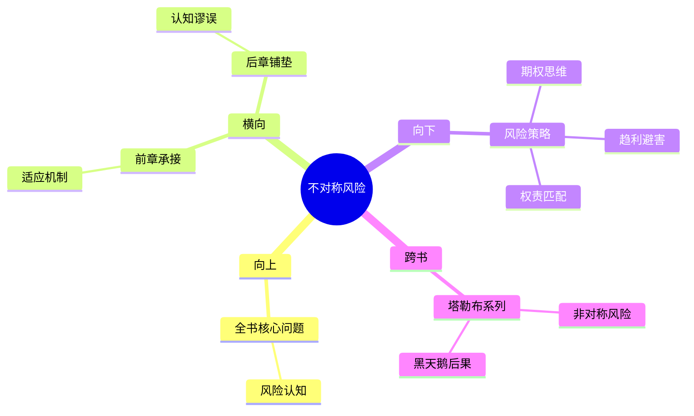

---

category: 
  - 书籍拆解
  - [[随机漫步的傻瓜-塔勒布]]
status: draft
chapter: 
number: 6
title: 偏态与不对称
links:

  - "[[第5章-最适合生存者]]"
  - "[[第7章-归纳法的问题]]"
created: 2026-02-27
tags:
  - 随机漫步的傻瓜
  - 偏态分布
  - 不对称风险
  - 收益结构
---

# 第6章 偏态与不对称

## 📍 章节定位

### 全书位置
> 本书在探讨了随机性和适应性生存策略基础上，转向更深层次的收益-风险不对称分析，这是从基础概率思维向高级风险理解的关键章节，通过偏态分布的数学框架，揭示了传统对称性思维在复杂环境中的局限，为投资和生活决策提供新的风险收益理解框架。

- **全书核心问题**: 如果成功大部分是运气，我们该怎么活着？
- **本章回答的问题**: 在不对称的收益结构下，如何理解和应对风险？为什么传统的对称风险思维存在误区？
- **角色类型**: 结构分析型，深度分析风险-收益不对称的机制和影响
- **论证位置**: 将前几章的概率和适应性理论转化为实用的风险决策模型

### 章节序列
| 方向 | 章节标题 | 逻辑连接 |
|------|----------|----------|
| 前章 | [[第5章-最适合生存者]] | [从适应性原理到不对称收益结构分析] |
| 后章 | [[第7章-归纳法的问题]] | [从结构分析到认知谬误探讨] |

### 一句话定位
> 第6章透过偏态分布的数学镜头解析收益与风险的不对称结构，揭示传统统计理论忽视的极端事件影响，为在不完美信息环境下进行决策提供了风险收益不对称的量化分析框架，构成了塔勒布风险管理体系的核心概念。

---

## 🎯 核心观点

### 第一层：表层案例
> 章节中的具体例子、投资场景、历史事件

| 案例名称 | 简要描述 | 页码 | 关键引文 |
|----------|----------|------|----------|
| 期权交易实例 | 不对称收益风险的职业选择 | p.195 | "看涨期权给了你不平衡的权利" |
| 银行家奖金结构 | 普通员工和银行家的风险不对称 | p.200 | "他们拿走了所有的期权" |
| 石油泄漏事故 | 风险与收益的不对称分配 | p.205 | "公司收益有限，灾害赔偿无穷" |

### 第二层：中层机制
> 不对称风险收益的运作机制

| 机制名称 | 组成要素 | 因果链条 | 证据来源 |
|----------|----------|----------|----------|
| 期权机制 | 收益上界、损失下界、成本控制 | 投入确定→收益潜力巨大→风险控制上限 | 期权交易市场 |
| 风险转移机制 | 杠杆工具、制度安排、激励不对称 | 上行收益个人化→下行损失社会化 | 银行业案例 |
| 结构锁定机制 | 市场地位、监管盲区、信息优势 | 系统重要性→道德风险→套利机会 | 金融机构案例 |

### 第三层：底层规律
> 决定风险收益结构的普适原理

| 规律陈述 | 抽象层级 | 知识连接 | 适用范围 |
|----------|----------|----------|----------|
| 不对称结构决定行为动机 | 行为经济学 + 激励理论 | [[非对称风险-塔勒布]] 奖惩不对等 | 制度设计、组织管理 |
| 极端值颠覆分布形态 | 统计学 + 概率论 | [[黑天鹅-塔勒布]] 肥尾特征 | 风险评估、金融建模 |
| 损失厌恶重塑参与规则 | 心理学 + 决策论 | [[思考快与慢-丹尼尔·卡尼曼]] 损失敏感 | 个体决策、风险选择 |

---

## 💬 降维翻译

### 观点1: 风险与收益的不对称结构
#### 原文表达
> "傳統統計學假設事件是對稱分布的，但它們通常不是。大多數重要的事件呈現偏態分布，這意味著正面和負面結果的機率與影響度不均等。"
> —— p.195

#### 降维翻译（中学生能懂）
平时我们学习的概率分布是左右对称的，但现实中很多重要事件的发生并不是这样的。好的结果和坏的结果出现概率不一样，带来的影响也不一样。就像赌博，赢钱和输钱的概率可能不同，而且输光了就破产，赢多了收益也有限制。

#### 日常类比（奶奶能懂）
这就像做生意，赚了钱老板独享，亏了账股东买单。又或者打工，干得好最多涨点工资，干得不好饭碗不保。收益和风险完全不对等，这是不公平的游戏。

#### 检验
- Q: 如果一个中学生问为什么有些看起来公平的事实际上不公平？
- A: 因为收益和损失的天花板和地板不对等，赢能赢多少、输会输多少其实差别很大。

### 观点2: 期权思维在日常生活中的应用
#### 原文表达
> "我們應該以看漲期权的心態來生活：付出一小部分確定的代價，換取獲得大收益的可能性，同時確保損失有限。"
> —— p.200

#### 降维翻译（中学生能懂）
这是一种用最小的代价获取最大收益机会的思维方式，要确保自己的最大损失是有限的，同时保持获得巨大利润的可能性。

#### 日常类比（奶奶能懂）
就像买彩票，花很少的钱就可以中大奖的机会，最坏情况就是损失这笔钱，但最好情况可能是中大奖。或者学习新技能，投入时间和学费，最差也就白学了，但学会之后可能大幅提升收入。

#### 检验
- Q: 如果一个中学生问怎么做决策才能既安全又有发展机会？
- A: 就是用有限的成本去换取无限的可能，确保底线损失的同时追求上限增长。

---

## ✨ 金句库

### 原书金句
| 金句 | 页码 | 适用场景 |
|------|------|----------|
| "世界不是一个对称的世界" | p.195 | 破除平均主义迷思 |
| "真正的风险藏在不对称结构中" | p.200 | 风险识别原则 |
| "期权给的不是结果，而是选择权利" | p.205 | 决策权力思维 |
| "不对称让聪明人利用愚者" | p.210 | 警惕剥削结构 |
| "小概率大影响的事件被低估" | p.215 | 尾部风险提醒 |
| "盈亏不平衡是世界常态" | p.220 | 袖珍投资指南 |
| "黑天鹅喜欢不对称的猎物" | p.225 | 危机防护提醒 |
| "风险分担应该公平对待" | p.230 | 制度设计建议 |
| "偏态让你重新认识正态" | p.235 | 统计思维颠覆 |
| "有限损失带来无限可能" | p.240 | 策略设计原则 |

### 降维金句
| 金句 | 来源观点 | 适用场景 |
|------|----------|----------|
| 不平等等于陷阱 | 风险结构认识 | 金融防骗 |
| 期权思维最聪明 | 概念应用 | 决策思维 |
| 损失有限最重要 | 安全意识 | 投资保护 |
| 极值得到被忽视 | 统计盲区 | 风险提醒 |
| 右偏分布机会多 | 策略选择 | 投资机遇 |
| 左偏分布危险多 | 规避风险 | 防范意识 |
| 上限下限需看清 | 极值思维 | 合理工序 |
| 代价收益要算清 | 成本思维 | 资源配置 |
| 对称幻想需打破 | 认知升级 | 理性思维 |
| 概率影响两分离 | 深度分析 | 专业分析 |

## 🔗 当下映射

### 💰 财富应用
| 场景 | 具体行动 | 预期效果 | 风险提示 |
|------|----------|----------|----------|
| 投资组合优化 | 采用期权思维，注重收益风险比例优化 | 控制下行风险，保持上行潜力 | 期权策略复杂的理解和操作 |
| 职业选择策略 | 选择上升空间大、失业损失可控的工作 | 平衡收入潜力与就业安全性 | 容易忽视隐含风险 |
| 合约条款审查 | 仔细评估合约中的风险收益对称性 | 避免不利的不对称结构 | 可能错过某些有利机会 |

### 💼 职场应用
| 场景 | 具体行动 | 所需能力 | 适用职级 |
|------|----------|----------|----------|
| 激励机制设计 | 优化奖惩结构，确保权责一致 | 结构设计能力、平衡思维 | 管理层 |
| 风险责任分配 | 确保风险承担与收益享有匹配 | 制度分析能力 | 决策层 |
| 业绩考核改进 | 避免过度强调业绩而忽视代价 | 权衡思维能力 | 所有管理层次 |

### 🏠 生活应用
| 场景 | 具体行动 | 可行性 | 见效时间 |
|------|----------|--------|----------|
| 契约风险识别 | 仔细审阅各类服务或购买合同 | 中，需学习法律常识 | 1个月形成初步能力 |
| 选择学习机会 | 投资回报率前考虑最坏情况 | 高，容易受情绪影响 | 立即可训练 |
| 关系动态思考 | 关注人际互动中的权责分配 | 中，涉及心理因素 | 逐渐见效 |

### 72小时行动计划
1. 今天可以做的第一件事：检查你现在正在做的一个重要决策，分析其中的风险收益是否对等，是否有限制最大损失的措施
2. 本周内可以尝试的事：学习基础的期权概念以及其在现实生活中的应用模式，了解收益与风险的不对称性
3. 需要准备资源才能做的事：制定长期的风险管理框架，确保收益风险结构的合理性

---

## 🕸️ 章节关联

### 向上关联 → 整书
- **贡献**: 在风险视角下深化了对随机性的理解，揭示了表面随机下的结构性偏斜，是全书风险思维的核心组成部分
- **位置**: 从宏观认知到微观操作的关键桥梁，将哲学思辨转向具体风险管理

### 横向关联 → 章节间
| 章节编号 | 章节标题 | 关联类型 | 连接描述 |
|----------|----------|----------|----------|
| 第5章 | [[第5章-最适合生存者]] | 承接 | 从生存机制转向结构分析 |
| 第7章 | [[第7章-归纳法的问题]] | 铺垫 | 为理解认知谬误提供结构基础 |
| 第9章 | [[第9章-失败者的历史]] | 呼应 | 结构性风险导致系统性失败 |

### 向下关联 → 具体应用
| 应用场景 | 难度 | 前置知识 |
|----------|------|----------|
| 制度设计优化 | 高 | 结构认知+博弈论基础 |
| 期权策略实施 | 中 | 金融知识储备 |
| 不对称风险防范 | 中 | 风险意识+判断力 |

### 跨书关联 → 知识网络
| 书籍 | 概念 | 关系 | 备注 |
|------|------|------|------|
| [[非对称风险-塔勒布]] | 风险分担 | 呼应 | 后续专著深化本章概念 |
| [[黑天鹅-塔勒布]] | 肥尾效应 | 支持 | 从肥尾理解偏态分布 |
| 选择与风险 | 风险态度 | 网络 | 阐述不同情况下的风险偏好 |
| 行为经济学 | 展望理论 | 一致 | 损失厌恶的心理根基 |

### 关联可视化

---

## ❓ 问答设计

### Q1: 什么是偏态分布？(记忆型)
**认知层次**: 记忆
**难度**: 低
**答案要点**:
- 分布左右不对称
- 大概率小影响vs小概率大风险
- 不符合传统的正态分布

### Q2: 为什么对称思考会误导决策？(理解型)
**认知层次**: 理解
**难度**: 中
**答案要点**:
- 忽略了极端值的影响力
- 认为正负面事件概率相等
- 对小概率高影响事件估计不足

### Q3: 如何应用期权思维调整个人决策？(应用型)
**认知层次**: 应用
**难度**: 高
**答案要点**:
- 设定最大损失额度
- 追求不成比例的收益机会
- 降低试错门槛

### Q4: 不对称结构如何影响社会制度安排？(分析型)
**认知层次**: 分析
**难度**: 高
**答案要点**:
- 利益私有化与风险社会化
- 短期利益驱动vs长期风险积累
- 权责不对等引发道德风险

### Q5: 如何在不对称世界中维护公正？(评价型)
**认知层次**: 评价
**难度**: 高
**答案要点**:
- 建立权责透明的监督机制
- 限制风险转移的制度设计
- 强化风险承担的文化价值观

### Q6: 设计公平的不对称结构需要考虑哪些要素？(创造型)
**认知层次**: 创造
**难度**: 高
**答案要点**:
- 明确权责边界
- 构建立体监控框架
- 设计正向激励机制

### Q7: 偏态分布与正态分布的根本差异？(记忆型)
**认知层次**: 记忆
**难度**: 中
**答案要点**:
- 中心极限定理的适用性
- 极值出现的概率分布
- 峰度和偏度参数

### Q8: 金融市场上常见的不对称模式有哪些？(理解型)
**认知层次**: 理解
**难度**: 中
**答案要点**:
- 卖空限制与上涨自由
- CEO薪酬与投资者损失
- 做市商的结构优势

### Q9: 如何识别隐藏的风险不对称？(应用型)
**认知层次**: 应用
**难度**: 高
**答案要点**:
- 列出正反两面的情景
- 分析各方损益比例
- 检查是否对等承担

### Q10: 损失厌恶的根源来自何处？(分析型)
**认知层次**: 分析
**难度**: 高
**答案要点**:
- 神经科学研究
- 演化心理学角度
- 决策心理机制

### Q11: 风险-收益不对称如何影响企业战略？(分析型)
**认知层次**: 分析
**难度**: 高
**答案要点**:
- 创新投资决策
- 市场进入策略
- 并购重组考量

### Q12: 如何建立动态的风险收益评估系统？(创造型)
**认知层次**: 创造
**难度**: 高
**答案要点**:
- 建立实时监控机制
- 实施动态调整算法
- 引入情景模拟分析

### Q13: 偏态风险的社会影响有哪些？(理解型)
**认知层次**: 理解
**难度**: 中
**答案要点**:
- 信用泡沫生成
- 系统性风险积累
- 贫富差距扩大

### Q14: 个人如何在制度性不对称中保护利益？(应用型)
**认知层次**: 应用
**难度**: 高
**答案要点**:
- 提升风险识别能力
- 构建多元化保护机制
- 寻求替代性权益保障

### Q15: 不对称风险与长期可持续性关系如何？(评价型)
**认知层次**: 评价
**难度**: 高
**答案要点**:
- 短期利益侵蚀长期根基
- 资源错配与风险积累
- 代际公平考量

---
