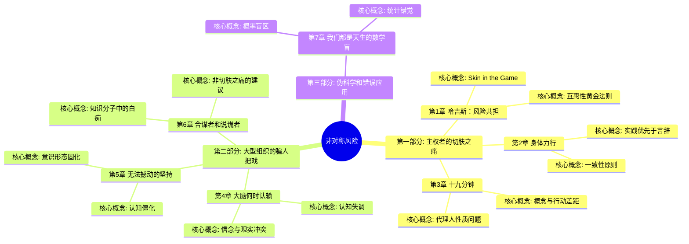
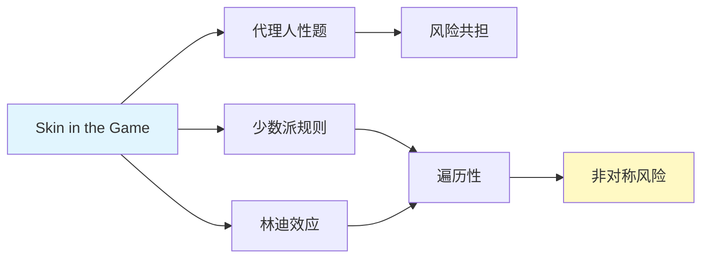

# 《非对称风险》- 章节导航

> 作者: 纳西姆·尼古拉斯·塔勒布（Nassim Nicholas Taleb）
> 总章节: 7章
> 最后更新: 2026-02-27

---

## 📚 章节结构（Mermaid Mindmap）

---

## 🔗 核心概念关联图

---

| 章节 | 标题 | 状态 | 完成日期 | 核心收获 |
|------|------|------|----------|----------|

---

## 🚀 快速跳转

### 按章节跳转
- [[第1章-哈吉斯]]
- [[第2章-身体力行]]
- [[第3章-十九分钟]]
- [[第4章-大脑何时认输]]
- [[第5章-无法撼动的坚持]]
- [[第6章-合谋者和说谎者]]
- [[第7章-我们都是天生的数学盲]]

### 按主题跳转
- [[Skin in the Game]]
- [[代理人问题]]
- [[少数派规则]]
- [[林迪效应]]
- [[遍历性]]
- [[知识分子中的白痴]]
- [[遍历性]]
- [[IYI]]

### 相关资源
- [[非对称风险-塔勒布-拆解记录]] - 主拆解笔记
- [[塔勒布不确定性哲学]]
