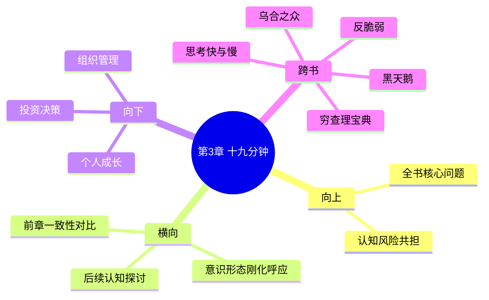

# 第3章 十九分钟

## 📍 章节定位

### 全书位置
> 本书第三章，探讨信念与现实脱节的现象，展示当意识形态凌驾于现实之上时产生的非对称风险——人们宁可扭曲现实也不放弃旧有的理论框架

- **全书核心问题**: 如何在不确定的世界里做出好的决策？
- **本章回答的问题**: 为什么人们宁愿扭曲现实也不修正错误的信念？这种认知僵化如何导致系统性风险？
- **角色类型**: 概念深化/认知警示
- **论证位置**: 探讨信念体系僵化的风险，为第6章的"知识分子中的白痴"概念奠定基础

### 章节序列
| 方向 | 章节标题 | 逻辑连接 |
|------|----------|----------|
| 前章 | [[第2章-身体力行]] | 从前章的言行一致性挑战到信念与现实的对立 |
| 后章 | [[第4章-大脑何时认输]] | 探讨认知失调的深化问题 |

### 一句话定位
> 第3章揭示信念体系的顽固性——当现实与意识形态冲突时，大脑倾向于重塑现实而非修正信念，这种认知僵化是系统性风险的重要来源。

---

## 🎯 核心观点

### 第一层：表层案例
> 章节中的具体案例、故事、数据

| 案例名称 | 简要描述 | 页码 | 关键引文 |
|----------|----------|------|----------|
| 科学家的预言失败 | 科学家拒绝承认预测错误 | p.91-120 | "现实会被抛弃" |
| 十九分钟会议 | 美国土木工程师学会讨论中对现实的否认 | p.91-120 | "我们只讨论理论概念" |
| 金融市场的认知盲区 | 模型与现实的巨大差距却被忽略 | p.91-120 | "我们的模型无法预测黑天鹅" |
| 专家会议 | 闭门研讨不涉及实际问题 | p.91-120 | "理论至上，忽视实践" |

### 第二层：中层机制
> 案例背后的运行机制、方法论

| 机制名称 | 组成要素 | 因果链条 | 证据来源 |
|----------|----------|----------|----------|
| 信念惯性机制 | 已有理论框架 | 既有信念→选择性接收→现实歪曲 | 科学界案例 |
| 专业身份束缚 | 学术地位/声誉 | 专业声誉→捍卫理论→忽视反证 | 土木工程师案例 |
| 群体确认偏误 | 同行评议体系 | 群体内共识→外部现实→选择性忽略 | 学术团体案例 |
| 认知失调调节 | 逻辑冲突与维护需求 | 事实冲突→心理不适→信念强化 | 心理机制案例 |

### 第三层：底层规律
> 可迁移的普遍规律

| 规律陈述 | 抽象层级 | 知识连接 | 适用范围 |
|----------|----------|----------|----------|
| 理论刚化定律 | 认知科学/心理学 | [[思考快与慢-拆解记录]] | 学科发展 |
| 意识形态保护机制 | 社会学/人类学 | [[黑天鹅-塔勒布-拆解记录]] | 信念体系稳定性 |
| 专业保守定理 | 组织行为学 | [[反脆弱-塔勒布-拆解记录]] | 决策群体行为 |

---

## 💬 降维翻译

### 观点1: 信念惯性导致的认知陷阱

#### 原文表达
> "We humans have a remarkable ability to ignore reality when it contradicts our beliefs. The stronger the belief, especially the professional kind—but not limited to it—the narrower the window of tolerance for possible variation in people's thinking." —— p.105

#### 降维翻译（中学生能懂）
当现实和我们坚信的想法有冲突时，大多数人更愿意相信自己的看法是对的，而现实是有问题的。特别是当我们靠这个"专业"吃饭的时候，这种倾向会更明显。

比如有些人坚信某个投资策略万无一失，就算实际亏了钱，他们也会想办法解释说"只是暂时的，过段时间就好了"，而不去反思策略本身可能有问题。

#### 日常类比（奶奶能懂）
就像一个老中医，一直认为某种药特别有效，但用了之后病人好了还是没好，他都会有办法解释：要是病好了，就是这个药的作用；要是没好，就会说"是因为你没有按时吃药"或者"症状严重需要更多时间"。反正现实永远被他的理论包装，他也不会觉得自己的理论有问题。

又比如一些专家，一直预测股市要涨，结果跌得很惨，但他们还是会找借口:"是受到某些临时因素影响""大趋势还是好的"，而不承认自己判断错了。

#### 检验
- Q: 如果一个中学生问你这是什么意思？
- A: 就是我们有时候宁可扭曲现实来符合自己原有的想法，也不愿意修改原有的想法来适应现实，特别是当原有的想法关系到我们的专业或声誉时。

### 观点2: 群体思维的保护机制

#### 原文表达
> "Experts often fall into the trap of confirming their theories rather than testing them against reality. In closed circles of experts, dissenting views get filtered out, and the consensus becomes a self-reinforcing echo chamber." —— p.95

#### 降维翻译（中学生能懂）
专业人士更容易被困在自己的一套理论里，不愿意接受外面的新信息。因为在一个专家圈子里，大家为了维护自己的权威，往往互相支持彼此的观点，而不是互相挑刺验证真伪。

这就导致了一个可怕的情况：一群"专家"聚在一起开会，不是为了找出真理，而是为了证明他们本来就是对的。

#### 日常类比（奶奶能懂）
就像一个村里的算命先生，他们都有自己的理论和门派，互相会聚会交流，但讨论的都是"咱们的理论有多厉害"、"某某人验证了咱们的准确性"，而不会说"哎，上次预测错了，要不要改改理论？"。

再比如一些理财群，在股市上涨时大家都是"大师"，互相吹捧，预测得多准多准；但遇到暴跌时，他们会找各种理由解释（政策、国际形势、等等），而不反思自己的方法可能有问题。

#### 检验
- Q: 如果一个中学生问你怎么发现这个问题？
- A: 当一群人总是互相称赞、很少争论，而且对反面意见充耳不闻，这时他们的观点就需要格外警惕了。

---

## ✨ 金句库

### 原书金句
| 金句 | 页码 | 适用场景 |
|------|------|----------|
| "我们只讨论理论概念" | p.100 | 批评脱离实际 |
| "现实会被抛弃" | p.105 | 认知偏误 |
| "理论越宏大，越容易脱离现实" | p.110 | 理论陷阱 |
| "专业身份成了认知牢笼" | p.115 | 身份束缚 |
| "我们只接受符合已有信念的信息" | p.95 | 选择性认知 |
| "理论家可以轻易忽视实践检验" | p.108 | 专家批判 |
| "群体中异见者被边缘化" | p.112 | 组织警告 |

### 降维金句
| 金句 | 来源观点 | 适用场景 |
|------|----------|----------|
| 当理论与现实打架时，理论总是赢 | 信念惯性 | 批评教条主义 |
| 专业名声越大，纠错越困难 | 专业束缚 | 决策预警 |
| 闭门造车的专家越信越歪 | 群体思维 | 警惕同温层 |
| 预防医学的专家从不认错 | 认知僵化 | 专家识别 |
| 愈强的信仰愈窄的视野 | 信念刚化 | 认知警示 |
| 所谓权威往往最难认错 | 专业束缚 | 权威审视 |
| 成功反而让人更固执 | 成功陷阱 | 自我反省 |
| 越是专业的越可能失真 | 专业偏见 | 信息审查 |
| 专家会议通常是证实大会 | 群体确认 | 决策过程 |
| 实话往往没人爱听 | 现实冲突 | 沟通难题 |
| 理论的完美掩盖现实的缺陷 | 理论僵化 | 现实主义 |
| 学术声望可能损害现实感知 | 专业陷阱 | 职业风险 |
| 专业身份成为认知发展的枷锁 | 理论包袱 | 职业发展 |

## 🔗 当下映射

### 💰 财富应用
| 场景 | 具体行动 | 预期效果 | 风险提示 |
|------|----------|----------|----------|
| 选择理财顾问 | 避免只听单一理论框架的投资建议 | 减少理论僵化风险 | 可能错过长期收益 |
| 金融决策参考 | 多元化信源，避免信息茧房 | 提升决策质量 | 需要更多信息处理时间 |
| 投资策略调整 | 建立验证和纠错机制 | 减少认知盲点 | 需要承认错误的勇气 |
| 资产配置 | 灵活调整，不受单一理论束缚 | 风险适应性提高 | 可能错过特定时机 |
| 投资学习 | 保持质疑精神，定期反思理论 | 持续进步能力 | 时间精力投入 |

### 💼 职场应用
| 场景 | 具体行动 | 所需能力 | 适用职级 |
|------|----------|----------|----------|
| 参与会议讨论 | 主动引入外部观点和质疑声音 | 多元化思考能力 | 任何层级 |
| 决策制定 | 定期反思和验证决策前提 | 反思能力 | 中高层管理者 |
| 团队建设 | 避免同质化人才招聘 | 多元化招聘技能 | 人事/管理者 |
| 专业发展 | 保持开放心态学习新方法 | 学习适应能力 | 各级员工 |
| 组织改进 | 建立制度鼓励异见表达 | 管理能力 | 高级管理层 |

### 🏠 生活应用
| 场景 | 具体行动 | 可行性 | 见效时间 |
|------|----------|--------|----------|
| 避免固执己见的家庭争执 | 主动寻求外部建议或第三方观点 | 中 | 一周内可见效果 |
| 持续学习心态 | 为自己的论点寻找反驳论据 | 中 | 立即可执行 |
| 亲子教育 | 鼓励孩子质疑自己的育儿方法 | 中 | 长期培养 |
| 朋友圈选择 | 保持与不同背景的朋友交往 | 高 | 立即可实行 |
| 社区参与 | 了解不同群体的观点和需求 | 高 | 持续进行 |

### 72小时行动计划
1. [今天开始] 检查自己最近是否有"理论优先于现实"的思考模式
2. [24-48小时] 寻找并倾听至少三个与自己观点不同的声音
3. [48-72小时] 对一个长期持有的信念进行反思性评估
4. [72小时结束] 建立月度反思机制，定期审视自己的信念系统

---

## 🕸️ 章节关联

### 向上关联 → 整书
- **贡献**: 本章揭示了信念系统如何抵抗现实修正，为全书的风险共担概念提供了认知基础 - 不仅需要利益共担，还需要认知开放
- **位置**: 认知障碍层面的分析，支撑风险共担实践的深层原因

### 横向关联 → 章节间
| 章节编号 | 章节标题 | 关联类型 | 连接描述 |
|----------|----------|----------|----------|
| 第2章 | [[身体力行]] | 对比 | 前章强调实践检验真实性，本章强调信念体系抗拒现实 |
| 第4章 | [[大脑何时认输]] | 延伸 | 深入探讨认知失调的神经科学机制 |
| 第5章 | [[无法撼动的坚持]] | 呼应 | 共同揭示意识形态僵化的顽固性 |
| 第6章 | [[合谋者和说谎者]] | 递进 | 为知识分子中的白痴概念提供认知科学依据 |

### 向下关联 → 具体应用
| 应用场景 | 难度 | 前置知识 |
|----------|------|----------|
| 认知偏差识别 | 中 | 基础心理学知识 |
| 决策机制优化 | 高 | 判断心理学 |
| 组织文化设计 | 高 | 组织行为学 |
| 研究方法改革 | 高 | 专业领域知识 |
| 社会制度改进 | 高 | 制度设计理论 |

### 跨书关联 → 知识网络
| 书籍 | 概念 | 关系 | 备注 |
|------|------|------|------|
| [[思考快与慢-拆解记录]] | 确认偏误 | 支持 | 与卡尼曼的认知偏差研究呼应 |
| [[黑天鹅-塔勒布-拆解记录]] | 未知的未知 | 延伸 | 认知僵化加剧了对黑天鹅事件的忽略 | 
| [[反脆弱-塔勒布-拆解记录]] | 抗冲击性 | 互补 | 反脆弱需要认知灵活性，而刚化认知不具备 |
| [[穷查理宝典-拆解记录]] | 多元思维模型 | 对照 | 强调多维度思考vs单一理论依赖 |
| [[03-Resources/书籍拆解/1-拆解记录/乌合之众-勒庞-拆解记录]] | 群体思维 | 对应 | 从社会心理学角度理解群体认知盲点 |

### 关联可视化

---

## ❓ 问答设计

### Q1: 什么是"十九分钟"的含义？(记忆型)
**认知层次**: 记忆
**难度**: 低
**答案要点**:
- 指美国土木工程师学会会议中，对实际问题的讨论只有19分钟
- 而大部分时间用于理论概念的阐述
- 象征对现实的回避，对理论的偏向

### Q2: 为什么专业身份会成为认知的牢笼？(理解型)
**认知层次**: 理解
**难度**: 中
**答案要点**:
- 专业身份关乎声誉和经济收入
- 承认错误意味着对既有的专业形象构成威胁
- 既得利益使专业人士更倾向于维护旧理论

### Q3: 如何在实际投资中避免认知刚化陷阱？(应用型)
**认知层次**: 应用
**难度**: 中
**答案要点**:
- 设置硬性的止损条件
- 定期回顾决策过程
- 主动寻找质疑自身策略的观点

### Q4: 群体确认偏误如何加重认知刚化？(分析型)
**认知层次**: 分析
**难度**: 中
**答案要点**:
- 同质化群体相互强化既有观点
- 不符合共识的观点被边缘化
- 形成信息茧房效应

### Q5: 认知刚化是否在任何情况下都是负面的？(评价型)
**认知层次**: 评价
**难度**: 高
**答案要点**:
- 适度的信念坚持有利决策稳定
- 但在剧变环境中会带来风险
- 需要平衡信念坚定性与认知灵活性

### Q6: 非专家是否也会有认知刚化现象？(理解型)
**认知层次**: 理解
**难度**: 中
**答案要点**:
- 是的，专家身份不是认知刚化的必要条件
- 任何影响个人身份认知的观点都会遭遇抵制
- 日常生活中也普遍存在确认偏误

### Q7: 如何建立有效的外部视角机制来克服认知刚化？(应用型)
**认知层次**: 应用
**难度**: 中
**答案要点**:
- 定期咨询不同背景的专业人士
- 实施"唱反调专员"制度或机制
- 设立硬性的时间节点或条件进行回顾

### Q8: 认知刚化与专业自信之间的界限如何把握？(分析型)
**认知层次**: 分析
**难度**: 高
**答案要点**:
- 自信关注方法的正确性而非结果的完美
- 刚化表现为拒绝一切反驳
- 真正的专业自信包含对未知的认知

### Q9: 在民主决策过程中如何平衡多元观点与决策效率？(评价型)
**认知层次**: 评价
**难度**: 高
**答案要点**:
- 设置合理的辩论时间和决策时间界限
- 建立基于结果的问责机制
- 平衡开放性和决断性

### Q10: 哪些情况下需要格外警惕认知刚化的影响？(应用型)
**认知层次**: 应用
**难度**: 中
**答案要点**:
- 高度变化的市场环境
- 重大长期决策制定
- 面对反常信号的解读

### Q11: 在教育过程中应当如何培养认知灵活性？(创造型)
**认知层次**: 创造
**难度**: 高
**答案要点**:
- 重视批判思维的培养
- 体验式学习与理论教学并重
- 建立容错的学习环境

### Q12: 科学革命的发生与认知刚化突破之间有何关系？(分析型)
**认知层次**: 分析
**难度**: 高
**答案要点**:
- 科学革命通常伴随认知刚化的打破
- 新范式的建立需要推翻旧的权威理论
- 需要外在压力促进内部认知更新

### Q13: 认知刚化与意识形态极化的关联如何理解？(分析型)
**认知层次**: 分析
**难度**: 高
**答案要点**:
- 都表现为对不同观点的抗拒
- 意识形态极化是认知刚化的社会形态
- 需要制度机制引导理性对话

### Q14: 专业机构如何建立防范认知刚化的制度？(创造型)
**认知层次**: 创造
**难度**: 高
**答案要点**:
- 设立独立验证和评估部门
- 定期进行全面回顾和外部审计
- 引入外部专家的长期评议

### Q15: 个人如何在职业生涯中防范专业身份的认知束缚？(应用型)
**认知层次**: 应用
**难度**: 中
**答案要点**:
- 保持跨领域的学习和交流
- 设立定期的自我质疑机制
- 寻找不同背景的导师或同伴

---
