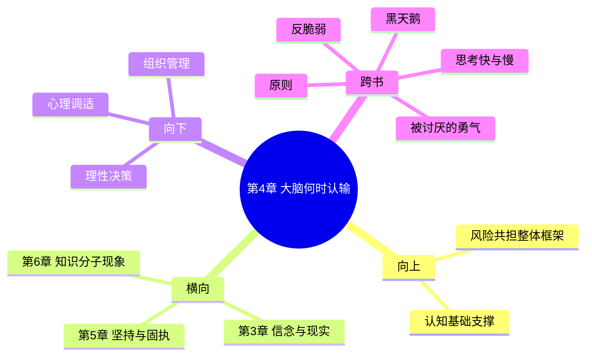

# 第4章 大脑何时认输

## 📍 章节定位

### 全书位置
> 本书第四章，从神经科学角度解析认知刚化的生理机制，揭示为何人在面对确凿反面证据时仍坚持原有信念——这为理解非对称风险提供了生物学基础

- **全书核心问题**: 如何在不确定的世界里做出好的决策？
- **本章回答的问题**: 认知刚化背后的生物学机制是什么？大脑为什么会产生"皮质醇劫持"？这种生理反应如何导致非理性的决策？
- **角色类型**: 科学机制探究/神经科学基础
- **论证位置**: 针对第3章"十九分钟"现象的生物学解释，从生理角度深化我们对认知僵化的理解

### 章节序列
| 方向 | 章节标题 | 逻辑连接 |
|------|----------|----------|
| 前章 | [[第3章-十九分钟]] | 从认知现象深入到生理机制 |
| 后章 | [[第5章-无法撼动的坚持]] | 继续探讨认知僵化现象的社会和心理学后果 |

### 一句话定位
> 第4章用神经科学原理解释了第3章的现象——大脑为什么会产生"认知防御"，并在面对事实冲击时优先保护自我认知而非接纳现实，这种生理机制是个人和社会层面非对称风险的重要根源。

---

## 🎯 核心观点

### 第一层：表层案例
> 章节中的具体案例、故事、数据

| 案例名称 | 简要描述 | 页码 | 关键引文 |
|----------|----------|------|----------|
| 股评家的预测失误 | 持续预测失误但仍不愿认错的金融分析师 | p.121-150 | "皮质醇让我们逃避现实" |
| 政治信仰的顽固 | 两党选民对相反数据的不同解读 | p.121-150 | "信念优先于事实" |
| 投资者的沉没成本谬误 | 明知错误投资却不肯止损的交易者 | p.121-150 | "情感投入让人难以前进" |
| 宗教预言的落空 | 预言失败后信徒反而更坚定的例子 | p.121-150 | "认知失调创造更多信念" |
| 经济学家的模型失灵 | 持续使用失效理论研究者 | p.121-150 | "理论比现实更坚固" |

### 第二层：中层机制
> 案例背后的运行机制、方法论

| 机制名称 | 组成要素 | 因果链条 | 证据来源 |
|----------|----------|----------|----------|
| 皮质醇劫持机制 | 威胁-恐惧-防御反应 | 信念冲击→皮质醇分泌→理性抑制→防御反应 | 神经科学研究 |
| 认知失调缓解 | 不一致信息的重构 | 事实与信念冲突→认知紧张→信念合理化 | 费斯廷格理论 |
| 情绪优先处理 | 情绪系统优先于理性系统 | 重要信念受挑战→情感中心激活→理性中心受限 | 大脑生理结构 |
| 自我保护机制 | 身份认同与认知一致 | 专业声誉+错误预言→认知重建→信念加固 | 心理学研究 |

### 第三层：底层规律
> 可迁移的普遍规律

| 规律陈述 | 抽象层级 | 知识连接 | 适用范围 |
|----------|----------|----------|----------|
| 情绪脑主导定律 | 神经科学/进化心理学 | [[思考快与慢-拆解记录]] | 一切重大决策场景 |
| 认知防御第一原则 | 生理学/心理学 | [[黑天鹅-塔勒布-拆解记录]] | 风险评估和应对 |
| 信念惯性守恒定理 | 心理物理学 | [[周期-拆解记录]] | 市场预测和行为判断 |

---

## 💬 降维翻译

### 观点1: 大脑的生理防御机制如何干扰理性决策

#### 原文表达
> "We have a system by which reality is filtered through our emotional responses. When faced with evidence that threatens our identity and beliefs, the brain, particularly the limbic system, goes into defense mode. The release of cortisol essentially blocks the prefrontal cortex, the part responsible for rational decision-making." —— p.135

#### 降维翻译（中学生能懂）
人的大脑有个自我保护机制：当遇到可能推翻你已知东西的信息时，大脑的情感中心会首先被激活，释放一种叫"皮质醇"的压力荷尔蒙，这个东西就像一把锁，把你大脑中负责理性思考的部分给锁住了。所以你就不太能正常思考和接受新信息了。

这就好比是你特别爱吃辣椒，有一天听说吃辣椒会导致胃癌，这时候你的情绪就会上来，然后身体开始分泌这种让你变得非理性的物质，让你开始排斥这些信息，而不是冷静分析真假。

#### 日常类比（奶奶能懂）
就像小孩摔倒了，摔疼了之后会本能地打地、骂地，觉得是地面的错，虽然明明是自己不小心。因为承认自己不小心会伤害到孩子的自尊心，大脑就想办法转移注意力，把错误归咎于地面。大人也是这样的，当别人质疑他们深信的东西时，他们就会本能抵触，很难冷静听下去。

又比如，一个炒股亏了很多钱的人，看到亏钱的事实就会心跳加速、血压升高，这时候脑子就不灵光了，不想面对现实，反而会说"是暂时的波动，过两天就好"，而不会去检查自己方法到底对不对。因为承认自己方法不对，比面对亏损更痛苦，所以大脑选择保护这种脆弱的自我。

#### 检验
- Q: 如果一个中学生问你这是什么机制？
- A: 大脑会为了保护自我概念而关闭理性思考功能，让人在面对事实不符的信念时，变得更非理性而不是更理性。

### 观点2: 皮质醇劫持如何加剧非对称风险

#### 原文表达
> "The cortisol response is not random: it's designed to help us survive. But in modern times of complex information processing, this same system can make us stick to false beliefs with dangerous tenacity, creating asymmetric risk exposure where we ignore evidence that contradicts our favored narratives." —— p.140

#### 降维翻译（中学生能懂）
我们大脑的这套保护机制原来是用来帮我们在原始环境下活命的，比如遇到老虎就会立刻逃跑。但现在用在复杂的信息处理上却产生了副作用：当我们面对和既有信念冲突的信息时，大脑会让我们更紧抓原本的信念，而不去接受可能导致信念改变的事实。这就增加了我们犯大错的概率，特别是在需要理性分析的投资、政治或商业决策中。

#### 日常类比（奶奶能懂）
就像一个人总是相信某种偏方能治百病，哪怕听到好几个权威医院的诊断都说那个方子有问题，他也会更加强化自己"偏方最有效"的信念。因为承认偏方没用，就等于承认自己这些年都白花了钱和时间，还要承认自己不够聪明，这对自我形象是个沉重打击。所以大脑会自动帮这个人过滤这些让他不舒服的信息。

再比如说，某些专家一直预测某个股市走向，结果事实和预测完全相反，但为了维护专业形象，他们的大脑会产生一种保护机制，让他们更坚持原来的预测，甚至会扭曲新的信息来证明自己没错。

#### 检验
- Q: 为什么会这样？大脑不是用来思考的吗？
- A: 大脑的首要任务是保护我们的情绪安全感，而不是追求客观真相。在进化过程中，情绪安全比事实准确更重要；但在现代复杂环境中，这就成了思维的障碍。

---

## ✨ 金句库

### 原书金句
| 金句 | 页码 | 适用场景 |
|------|------|----------|
| "皮质醇让我们逃避现实" | p.130 | 认知偏差解释 |
| "信念优先于事实" | p.135 | 信仰机制分析 |
| "情感投入让人难以前进" | p.140 | 决策盲区揭示 |
| "认知失调创造更多信念" | p.145 | 心理防御机制 |
| "大脑为了保护自我而选择非理性" | p.125 | 生物学基础 |
| "皮质醇劫持本质上是大脑的保护机制" | p.132 | 神经科学解释 |
| "情感系统比理性系统反应更快" | p.136 | 思维机制 |
| "大脑的自我欺骗能力令人惊叹" | p.142 | 认知局限性 |

### 降维金句
| 金句 | 来源观点 | 适用场景 |
|------|----------|----------|
| 大脑为了保护面子会选择变蠢 | 皮质醇劫持 | 决策警惕 |
| 情绪优先于理智是进化遗留 | 情绪脑主导 | 理性训练 |
| 伤自尊的信息自动被打脸屏蔽 | 防御机制 | 信息处理 |
| 投入越多沉没成本越难放手 | 沉没成本谬误 | 投资止损 |
| 事实冲击强烈时大脑会锁死 | 认知僵化 | 争辩提醒 |
| 自我防护机制反而有害成长 | 恐惧驱动 | 个人发展 |
| 确证偏误是大脑的节能模式 | 情感舒适区 | 认知升级 |
| 承认错误是生理上很难的事 | 生理阻力 | 自我挑战 |
| 亏损让人变得格外非理性 | 交易心理 | 风险控制 |
| 投资者的敌人力是自己的大脑 | 反身性 | 交易纪律 |
| 自我认知冲击会激发防御模式 | 心理防御 | 决策情绪管理 |
| 情绪波动中不宜做决策 | 情绪影响 | 理性决策 |
| 皮质醇是大脑的非理性开关 | 生理基础 | 决策情绪控制 |

## 🔗 当下映射

### 💰 财富应用
| 场景 | 具体行动 | 预期效果 | 风险提示 |
|------|----------|----------|----------|
| 投资亏损心理管理 | 设置预设止损线，不在恐慌情绪中做决策 | 降低情绪化损失 | 可能错过反弹 |
| 消费冲动控制 | 理性思考期：面对大额消费等待24小时 | 避免情绪化购物 | 时效性强的促销错失 |
| 理财错误纠偏 | 恰当时机进行投资复盘，避免在亏损时立即回顾 | 改善决策逻辑 | 时间成本投入 |
| 金融学习 | 学会在压力下保持冷静分析能力 | 提升抗风险能力 | 需要长期锻炼 |
| 市场判断 | 避免在高压力时刻改变投资策略 | 减少非理性转换 | 可能错失机会 |

### 💼 职场应用
| 场景 | 具体行动 | 所需能力 | 适用职级 |
|------|----------|----------|----------|
| 接受负面反馈 | 训练自己在听到批评时暂停2秒钟呼吸平稳 | 情绪自我调节能力 | 任何层级 |
| 团队冲突管理 | 避免在情绪激烈时做决策，延缓讨论 | 群体情绪管理 | 团队管理者 |
| 战略决策调整 | 设立不受个人情感投入影响的第三方评审机制 | 组织设计能力 | 高级管理层 |
| 批评文化建设 | 营造允许犯错和学习的组织氛围 | 领导力 | 各级管理者 |
| 认知盲点管理 | 定期寻求反面的建议和观点 | 自我反思能力 | 各级员工 |

### 🏠 生活应用
| 场景 | 具体行动 | 可行性 | 见效时间 |
|------|----------|--------|----------|
| 改善争辩习惯 | 学会"暂停-呼吸-重述"三步骤 | 中 | 一周起效 |
| 慢性决策制定 | 重要决定给自己24小时冷静期 | 高 | 立即可用 |
| 避免认知陷阱 | 主动搜索与自己观点相反的高质量内容 | 中 | 一周起效 |
| 情绪管理 | 学习冥想和正念练习 | 中 | 2-4周见效 |
| 人际关系 | 在争议中先倾听再回应 | 高 | 立即可用 |

### 72小时行动计划
1. [立即执行] 下次情绪激烈时，暂停并深呼吸5次，感受大脑变化
2. [24小时内] 列出3个当前持有的重要信念，并为每个找一个异议观点
3. [48小时内] 重新审视一个近期做出的重要决策，判断是否有皮质醇劫持的因素
4. [72小时内] 设立一个定期反省的机制，监控自己的认知防御模式

---

## 🕸️ 章节关联

### 向上关联 → 整书
- **贡献**: 为"风险共担"理念奠定了心理学基础——若个体没有开放心态接纳反馈，再好的激励机制也可能失效
- **位置**: 认知层面的底层机制，影响风险共担的实际效果

### 横向关联 → 章节间
| 章节编号 | 章节标题 | 关联类型 | 连接描述 |
|----------|----------|----------|----------|
| 第3章 | [[十九分钟]] | 扩展 | 从表面现象深入到生理机制 |
| 第5章 | [[无法撼动的坚持]] | 延续 | 继续探讨拒绝承认错误的深层原因 |
| 第6章 | [[合谋者和说谎者]] | 支撑 | 为知识分子中的白痴现象提供神经科学解释 |

### 向下关联 → 具体应用
| 应用场景 | 难度 | 前置知识 |
|----------|------|----------|
| 个人理性训练 | 中 | 基础自我觉察能力 |
| 组织决策优化 | 高 | 群体行为学知识 |
| 投资心理管理 | 中 | 投资经验基础 |
| 人际关系改善 | 中 | 情绪智力基础 |
| 学习效率提升 | 中 | 基础心理学认知 |

### 跨书关联 → 知识网络
| 书籍 | 概念 | 关系 | 备注 |
|------|------|------|------|
| [[思考快与慢-拆解记录]] | 系统1系统2 | 延伸 | 提供更深层次的神经科学解释 |
| [[黑天鹅-塔勒布-拆解记录]] | 认知盲区 | 强化 | 揭示了认知盲区的生理成因 |
| [[反脆弱-塔勒布-拆解记录]] | 压力适应 | 互补 | 某些认知机制有助于适应不确定性，但也有阻碍 |
| [[原则-瑞·达利欧-拆解记录]] | 透明度和原则体系 | 互促 | 达利欧的反思原则可对抗本章提及的认知缺陷 |
| [[被讨厌的勇气-拆解记录]] | 课题分离 | 互补 | 提供超越认知缺陷的心理调节方法 |

### 关联可视化

---

## ❓ 问答设计

### Q1: 什么是皮质醇劫持？为什么会发生？(记忆型)
**认知层次**: 记忆
**难度**: 低
**答案要点**:
- 皮质醇是一种应激激素，当大脑感知到威胁到核心信念的风险时会大量分泌
- 这种激素会抑制前额叶皮层（理性思考区域）的功能
- 在原始环境中有助生存，但现在会导致非理性决策

### Q2: 为什么人们在面对明显错误时反而更坚持信念？(理解型)
**认知层次**: 理解
**难度**: 中
**答案要点**:
- 认知失调带来心理痛苦，大脑启动防御机制缓解痛苦
- 情绪中心接管理性思维，防止信念瓦解带来的身份危机
- 这是进化过程形成的情绪调节机制

### Q3: 如何在交易决策中预防皮质醇劫持的影响？(应用型)
**认知层次**: 应用
**难度**: 中
**答案要点**:
- 预设立场：事先设置好止损和止盈点
- 时间距离：在情绪激动时不做出重大决策
- 外部制衡：寻求独立第三方的客观意见

### Q4: 皮质醇劫持现象与个体差异有哪些关联？(分析型)
**认知层次**: 分析
**难度**: 中
**答案要点**:
- 自我认同强度与皮质醇反应显著正相关
- 过往创伤经历会影响应激反应阈值
- 人格特质（如开放性、尽责性）影响调节能力

### Q5: 皮质醇劫持机制在社会层面上有何积极意义？(评价型)
**认知层次**: 评价
**难度**: 高
**答案要点**:
- 提供心理缓冲，避免认知崩塌
- 维持一定稳定性，减少过度变通
- 但副作用可能带来严重非对称风险

### Q6: 认知失调理论与皮质醇机制如何共同解释信念坚持现象？(理解型)
**认知层次**: 理解
**难度**: 中
**答案要点**:
- 认知失调是心理层面的描述，皮质醇是生理层面的机制
- 两者协同工作：心理不适引发生理反应，生理反应强化心理防御
- 共同作用使得个体维持信念一致性

### Q7: 如何设计个人决策流程减少皮质醇劫持影响？(应用型)
**认知层次**: 应用
**难度**: 中
**答案要点**:
- 建立"决策前冷静期"惯例
- 创建多维度评估指标，不过度依赖单一信念
- 制定"异常情况下的决策暂停机制"

### Q8: 专业身份投入越多越不容易接受批评，背后机制如何解释？(分析型)
**认知层次**: 分析
**难度**: 高
**答案要点**:
- 身份认同与信念高度耦合
- 认可错误等于威胁整体身份架构
- 生理机制放大了这种威胁感受

### Q9: 皮质醇劫持与确认偏误有何异同？(分析型)
**认知层次**: 分析
**难度**: 中
**答案要点**:
- 同：都倾向于选择性接受信息
- 异：劫持是急性防御，偏误是慢性选择
- 机制不同但互相加强

### Q10: 如何利用对皮质醇机制的理解改进组织学习？(应用型)
**认知层次**: 应用
**难度**: 中
**答案要点**:
- 营造心理安全环境，减少信念威胁感受
- 分离绩效与认同，避免过度绑定
- 设置外部监督和复盘机制

### Q11: 进化角度如何看待皮质醇系统的价值与局限？(创造型)
**认知层次**: 创造
**难度**: 高
**答案要点**:
- 价值：在信息稀缺环境下维持认知稳定性
- 局限：在复杂快速变化环境下产生系统性偏误
- 需要在现代环境中建立人工补偿机制

### Q12: 个体如何通过认知训练降低皮质醇劫持的影响程度？(创造型)
**认知层次**: 创造
**难度**: 高
**答案要点**:
- 练习冥想和其他情绪调节技术
- 建立多框架决策思维模式  
- 定期进行强制性的逆向思考训练

### Q13: 在政策制定层面如何规避集体的认知僵化风险？(创造型)
**认知层次**: 创造
**难度**: 高
**答案要点**:
- 设立制度化的反对声音机制
- 建立结果导向的问责体系
- 聘请外部专家进行定期评估

### Q14: 皮质醇劫持如何影响市场参与者的行为？(应用型)
**认知层次**: 应用
**难度**: 中
**答案要点**:
- 造成非理性情绪化交易
- 妨碍对市场信号的准确理解
- 导致错误的止损和止盈时机

### Q15: 如何通过物理方法缓解皮质醇对决策的不良影响？(应用型)
**认知层次**: 应用
**难度**: 中
**答案要点**:
- 深呼吸和冥想练习
- 适当的身体活动缓解压力
- 充足的睡眠恢复大脑功能

---
