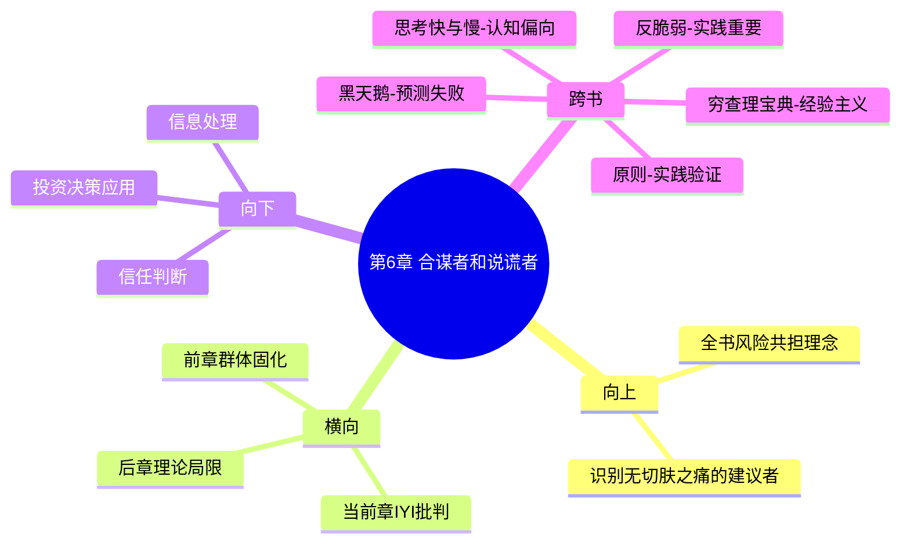

# 第6章 合谋者和说谎者

## 📍 章节定位

### 全书位置
> 本书第六章，揭示"知识分子中的白痴"（IYI - Intellectual Yet Idiot）现象，批判脱离实践的理论建构者——他们是前几章所探讨的风险不共担、认知僵化、群体固执等问题的具体体现者

- **全书核心问题**: 如何在不确定的世界里做出好的决策？
- **本章回答的问题**: 为什么许多精英知识分子常常提供有害建议？"知识分子中的白痴"有何特征？他们的理论脱离实际如何制造系统性风险？
- **角色类型**: 批判反思/实践验证
- **论证位置**: 风险共担的具体应用，用以识别无切肤之痛的理论建构者

### 章节序列
| 方向 | 章节标题 | 逻辑连接 |
|------|----------|----------|
| 前章 | [[第5章-无法撼动的坚持]] | 从群体认知固执到知识精英的脱离实际 |
| 后章 | [[第7章-我们都是天生的数学盲]] | 延伸探讨理论建构的局限性 |

### 一句话定位
> 第6章通过"知识分子中的白痴"概念总结了前述章节的问题——那些没有自身利益牵扯、缺乏实践经验的知识分子，正是系统性风险的主要制造者，因为他们的建议无需承担后果。

---

## 🎯 核心观点

### 第一层：表层案例
> 章节中的具体案例、故事、数据

| 案例名称 | 简要描述 | 页码 | 关键引文 |
|----------|----------|------|----------|
| IYI的典型特征 | 缺乏实践背景却偏好复杂理论的学者 | p.181-210 | "他们从未用自己的钱赌过预言" |
| 沙滩上的哲学家 | 仅凭理论无法解决实际问题的空谈 | p.181-210 | "现实需要脚踏实地" |
| 代理人性题案例 | 与普通民众无关联的政策制定者 | p.181-210 | "决策者不承担后果" |
| 风险建模专家 | 不考虑现实复杂性的模型构建者 | p.181-210 | "理论与实践的鸿沟" |
| 媒体评论员 | 缺乏一线经验却指点江山的理论家 | p.181-210 | "键盘上的将军" |

### 第二层：中层机制
> 案例背后的运行机制、方法论

| 机制名称 | 组成要素 | 因果链条 | 证据来源 |
|----------|----------|----------|----------|
| IYI生成机制 | 理论训练+脱离实践 | 学术训练→理论崇拜→实践缺失 | 各类学术案例 |
| 验证缺失机制 | 观点发表+无后果承担 | 建议发出→短期影响→无追踪责任 | 政策制定案例 |
| 复杂性伪装机制 | 复杂表述+简洁回避 | 简单真理→复杂外衣→公众迷惑 | 媒体及学术案例 |
| 声誉获取机制 | 理论输出+公众赞誉 | 理论建构→媒体曝光→专业权威 | 名家访谈案例 |
| 价值错配机制 | 个人收益+社会风险 | 个人声望→公众受损→无人负责 | 各行业专家案例 |

### 第三层：底层规律
> 可迁移的普遍规律

| 规律陈述 | 抽象层级 | 知识连接 | 适用范围 |
|----------|----------|----------|----------|
| 理论与实践分离定律 | 认识论 | [[黑天鹅-塔勒布-拆解记录]] | 学术与实践关系 |
| 知识精英风险制造原理 | 社会学 | [[反脆弱-塔勒布-拆解记录]] | 决策体系设计 |
| 脱离现实的系统性危害定理 | 行政学 | [[周期-拆解记录]] | 组织管理 |
| 专业权威与实践脱钩律 | 行为学 | [[思考快与慢-拆解记录]] | 专家评估准则 |
| 切肤之痛与建议可信度原则 | 统计学 | [[非对称风险-塔勒布-拆解记录]] | 专家可信度判断 |

---

## 💬 降维翻译

### 观点1: "知识分子中的白痴"(IYI)的识别特征

#### 原文表达
> "The IYI (Intellectual Yet Idiot) class of people are the ones who live in the 'real world' (as they tend to call it) without actually understanding what goes on there. They are often educated, speak three languages, hold university positions, but have never run a small business, and never managed a real-life emergency." —— p.190

#### 降维翻译（中学生能懂）
有些所谓的"知识分子"，看起来学问很高，懂得很多理论，会说几国外语，甚至在大学里教书，但是从来没有真正参与过实际的工作，比如运营一家小店，处理一次紧急突发事件，或者用自己的钱去做投资赌自己的判断。他们只是在象牙塔里研究现实，而不是真正了解现实。

就像一些经济学者，从来没做过生意，却教别人怎么赚钱；一些军事评论员，从来没上过战场，却评头论足地指挥战争。他们提出的建议往往是脱离实际的，但因为他们有"专家"的帽子，反而误导了很多人。

#### 日常类比（奶奶能懂）
就像有个厨师，只看菜谱、研究美食理论、能说出各种烹饪方法的大道理，但一辈子都没真正下厨炒过一道菜，这样的厨师给你的做菜建议就不可信。因为他不知道鸡蛋掉地上有多响，不知道火候掌握不好菜有多苦。

还有一些干部，从村里一步步干起来的，知道百姓生活需要什么；另一种是直接从大学毕业就当干部的，虽然学历高、理论强，但因为没有经历过基层艰苦生活，提的方案往往不接地气。

投资也是这样，一些分析师从没亏过钱，只在研究报告上指点江山，他们很难深刻体会市场波动对真实财富的冲击，给出的建议就未必靠谱。

#### 检验
- Q: 如果一个中学生问你什么是IYI？
- A: 就是那些理论一堆但没实践过的人，他们说得一套一套的，但要让他们做一件事往往做不来，因为他们没真正体验过实际情况。

### 观点2: IYI制造系统风险的机制

#### 原文表达
> "The IYI can generate risks from their models and theories that they themselves will not be exposed to. The harm they cause is usually to others who bear the consequences of their ideas." —— p.195

#### 降维翻译（中学生能懂）
"知识分子中的白痴"提出的一些理论和建议，如果出了问题造成损失，他们自己不用承担后果，但普通百姓却要承受这些损失。这就造成了一种"收益归他，风险归你"的局面。

比如一些政策研究专家，提出一些看似完美的改革方案，万一实施后出问题，他们顶名声受损，但受影响的老百姓却要承担实际损失。这种情况很危险，因为他们没有"切肤之痛"，就不会特别谨慎。

#### 日常类比（奶奶能懂）
就像一些人给邻居家小孩出主意："你们家孩子该打一顿了"，"你们家孩子得上这个兴趣班"、"你们家孩子不该那么惯着"。说的都很好听，但他们自己家里没小孩，就算建议错了也不用承担责任和后果。

再比如股市分析师，建议你买什么股票，万一亏了钱，他自己不用承担损失；但如果你听了他的建议买入亏损，就只能自己承担。如果这个分析师用自己钱投资跟他建议的保持一致，那他的建议就更可信了了。

还有些人喜欢指点别人的婚姻和教育方式，讲得头头是道，但等你真出了问题找他们求助时，他们自己家庭可能也是一地鸡毛。

#### 检验
- Q: 如果一个中学生想知道怎么避开IYI的建议，该如何判断？
- A: 看这个人有没有用自己的钱、时间、名誉等等去赌他所说的建议是否可靠。

---

## ✨ 金句库

### 原书金句
| 金句 | 页码 | 适用场景 |
|------|------|----------|
| "他们从未用自己的钱赌过预言" | p.185 | 专家识别 |
| "现实需要脚踏实地" | p.190 | 批评空谈理论 |
| "决策者不承担后果" | p.195 | 代理人性题 |
| "理论应该服务现实，而非复杂化现实" | p.200 | 实践导向 |
| "复杂性常常是一个弱点的标志" | p.205 | 简洁力量 |
| "他们生活在象牙塔里却自称现实主义者" | p.188 | 讽刺IYI |
| "专业声誉比实用效果更重要" | p.192 | 专家动机 |
| "理论比经验更好验证" | p.202 | 理论偏好机制 |

### 降维金句
| 金句 | 来源观点 | 适用场景 |
|------|----------|----------|
| 未用自己的钱赌的预言，仅供参考 | 风险共担 | 投资建议 |
| 手艺人的知识胜过博士的理论 | 实践检验 | 学术与实用 |
| 复杂的建议往往是不自信的掩饰 | 简洁原则 | 沟通高效 |
| 从未受伤的医生不能教你养生 | 实践检验 | 专业建议 |
| 说一套做一套的人要小心 | 言行一致 | 诚信判断 |
| 没有切肤之痛的话可听听就算 | 风险共担 | 信息筛选 |
| 脸都不要的人建议特别不靠谱 | 自我认知 | 可信度评估 |
| 讲大道理的人不一定懂实际操作 | 理论实践 | 能力判断 |
| 从没实践过的专家建议需谨慎 | 经验验证 | 信息处理 |
| 专家的理论应有实践案例支撑 | 验证原则 | 判断标准 |
| 言论自由但后果仍需自理 | 责任共担 | 专家责任 |
| 复杂性不代表先进性 | 简洁原则 | 理论评估 |
| 学院派出身的建议要小心实践适用 | 理论实践分割 | 专家识别 |

## 🔗 当下映射

### 💰 财富应用
| 场景 | 具体行动 | 预期效果 | 风险提示 |
|------|----------|----------|----------|
| 专家建议判别 | 了解财经评论员的投资组合配置 | 过滤纯理论家 | 可能忽略有价值信息 |
| 投资信息筛选 | 关注与自己投资组合相似的分析师观点 | 提升建议可靠性 | 需结合其他信息维度 |
| 理财产品选择 | 优选实际使用者较多的产品推荐渠道 | 降低风险暴露 | 仍需自我风险评估 |
| 风险评估 | 避免仅依赖理论模型，需参考现实数据 | 增强风险控制 | 理论仍有参考价值 |
| 投资决策 | 优先考虑实践经验丰富者的建议 | 降低踩雷风险 | 纯理论或有价值 |

### 💼 职场应用
| 场景 | 具体行动 | 所需能力 | 适用职级 |
|------|----------|----------|----------|
| 项目风险评估 | 优先采纳有实践案例支撑的建议 | 验证判断能力 | 任何技术职位 |
| 团队专家引进 | 选拔有相关实际经验而非仅理论背景的专家 | 人才评估能力 | 管理层职位 |
| 战略制定咨询 | 引入有过战略实施失误经验的顾问 | 风险感知能力 | 高层决策者 |
| 决策流程优化 | 减少纯理论咨询，增加一线实践调研 | 信息收集能力 | 中层管理 |
| 内部培训设计 | 优选来自实践一线的培训内容 | 识别能力 | HR/TD |

### 🏠 生活应用
| 场景 | 具体行动 | 可行性 | 见效时间 |
|------|----------|--------|----------|
| 识别IYI建议 | 对那些从没有实践过的建议保持距离 | 高 | 立即开始 |
| 学习方法优化 | 亲近实践者而非理论家 | 高 | 2周见效 |
| 家庭建议甄别 | 更相信有相关亲身经历的家庭成员建议 | 高 | 即刻实施 |
| 消费选择 | 优先参考真实使用者而非营销文案 | 高 | 立即可用 |
| 个人成长 | 吸取从实践中磨练出的智慧 | 高 | 持续性 |

### 72小时行动计划
1. [今天开始] 回顾近期听取的建议，区分哪些建议者有相关的实践经验
2. [24小时内] 评估当前主要依赖的信息来源，判断是否存在IYI风险
3. [48小时内] 主动寻找有实战经验而非纯理论背景的意见来源
4. [72小时内] 建立判断专家是否为IYI的检查清单

---

## 🕸️ 章节关联

### 向上关联 → 整书
- **贡献**: 本章集中展示了前几章理论在社会层面的应用实例——IYI群体正是缺乏切肤之痛、认知僵化的典型代表，他们的建议是系统性风险的重要来源
- **位置**: 从概念原理到具体人群描述，明确风险共担的实践应用场景

### 横向关联 → 章节间
| 章节编号 | 章节标题 | 关联类型 | 连接描述 |
|----------|----------|----------|----------|
| 第5章 | [[第5章-无法撼动的坚持]] | 递进 | 群体信念固执的具体实践者表现 |
| 第4章 | [[第4章-大脑何时认输]] | 延伸 | 缺乏切肤之痛的脑神经反应模式 |
| 第7章 | [[第7章-我们都是天生的数学盲]] | 支撑 | 为后续统计谬误问题提供实践背景 |
| 第2章 | [[第2章-身体力行]] | 对照 | IYI正是缺少身体力行的代表 |
| 第3章 | [[第3章-十九分钟]] | 验证 | IYI是理论脱离实践的典型例子 |

### 向下关联 → 具体应用
| 应用场景 | 难度 | 前置知识 |
|----------|------|----------|
| 信息源可信度评估 | 低+ | 基础判断能力 |
| 专家意见采信 | 中 | 独立验证能力 |
| 投资建议筛选 | 中 | 风险意识 |
| 学习资源整合 | 低+ | 信息处理能力 |
| 政策判断 | 中 | 社会分析能力 |

### 跨书关联 → 知识网络
| 书籍 | 概念 | 关系 | 备注 |
|------|------|------|------|
| [[黑天鹅-塔勒布-拆解记录]] | 专家预测失误 | 一致 | 理论家的预测能力经常失败 |
| [[反脆弱-塔勒布-拆解记录]] | 实践验证 | 支持 | 强调必须通过实践来验证理论 |
| [[穷查理宝典-拆解记录]] | 实践经验重要性 | 一致 | 经验主义与理论主义的区分 |
| [[思考快与慢-拆解记录]] | 一致性偏差 | 批评 | 指出理论家的思维定势问题 |
| [[原则-章节拆解/_导航]] | 实践探索 | 对照 | 强调在实践中学习和验证 |

### 关联可视化

---

## ❓ 问答设计

### Q1: 什么是"知识分子中的白痴"IYI？(记忆型)
**认知层次**: 记忆
**难度**: 低
**答案要点**:
- 指只擅长理论分析却不具备实践经验的群体
- 有学术头衔但缺乏现实世界的真实体验
- 喜欢复杂理论但其建议往往脱离实际

### Q2: IYI为什么会制造风险？(理解型)
**认知层次**: 理解
**难度**: 中
**答案要点**:
- 他们提出的建议无需承担实施后果
- 缺乏实践经验导致理论脱离实际
- 用复杂模型掩盖对现实的无知

### Q3: 如何在投资决策中避开IYI的建议？(应用型)
**认知层次**: 应用
**难度**: 中
**答案要点**:
- 了解分析师是否持有相似的投资仓位
- 关注建议与实际操作的一致性
- 寻找有实际投资经验的专家来源

### Q4: IYI现象背后的社会学原理是什么？(分析型)
**认知层次**: 分析
**难度**: 中
**答案要点**:
- 学术界与实践界的激励机制错位
- 理论产出比实践验证更容易获得声望
- 专业化分工造成了理论与实践的脱节

### Q5: IYI是否在所有领域都表现同样危害？(评价型)
**认知层次**: 评价
**难度**: 高
**答案要点**:
- 在需要精确建模的自然科学领域危害较小
- 在涉及复杂人际、经济活动领域危害较大
- 需要区分纯理论与应用理论的需求不同

### Q6: 为什么IYI喜欢使用复杂的术语和模型？(理解型)
**认知层次**: 理解
**难度**: 中
**答案要点**:
- 复杂性有助于掩饰缺乏实践经验
- 便于建立行业准入壁垒
- 获得同行认可和专业声望

### Q7: 在政策制定中如何平衡理论专家与实践经验者？(应用型)
**认知层次**: 应用
**难度**: 中
**答案要点**:
- 建立多方专家委员会，包括实践者参与
- 试点机制：小范围实践后再推广
- 设置后果评估与责任制相结合

### Q8: 如何避免自己在学习过程中变成IYI？(应用型)
**认知层次**: 应用
**难度**: 中
**答案要点**:
- 学习与实践同步进行
- 定期反思理论与现实的差距
- 主动寻找和承担风险来验证认知

### Q9: IYI现象是否与发展中国家的特殊国情相关？(分析型)
**认知层次**: 分析
**难度**: 高
**答案要点**:
- 可能在知识结构与实践环境匹配度较差的地区更严重
- 相对封闭的知识传承体系可能加剧此现象
- 需要制度设计来促进理论与实践结合

### Q10: 什么情况下理论工作者的作用不可或缺？(评价型)
**认知层次**: 评价
**难度**: 中
**答案要点**:
- 纯科学、数学等领域
- 长期战略规划
- 趋势预判研究
- 但必须接受实践检验

### Q11: 如何设计制度来减少IYI型政策的出台？(创造型)
**认知层次**: 创造
**难度**: 高
**答案要点**:
- 政策制定者需具备相关实践经历要求
- 引入结果责任制，与政策效果挂钩
- 建立政策实验与反馈机制

### Q12: 媒体在放大IYI影响力中起到了什么作用？(分析型)
**认知层次**: 分析
**难度**: 高
**答案要点**:
- 更愿意选择表达能力强的理论家参与采访
- 复杂观点比朴素智慧更有话题性
- 亟需加强对专家实践背景的考察

### Q13: 如何在教育体系中避免批量制造IYI？(创造型)
**认知层次**: 创造
**难度**: 高
**答案要点**:
- 改革课程设置，增加实习实践比例
- 邀请有实践经验的专家参与教学
- 重视案例教学法和问题导向学习

### Q14: 个人如何在日常生活中识别IYI？(应用型)
**认知层次**: 应用
**难度**: 中
**答案要点**:
- 观察其个人投资或业务行为
- 询问其以往预测准确率
- 看是否敢于用自己的财产验证其理论

### Q15: IYI对市场效率可能产生什么影响？(分析型)
**认知层次**: 分析
**难度**: 高
**答案要点**:
- 理论模型可能制造虚假繁荣
- 复杂模型掩盖真正的风险
- 影响投资者基于错误信息做出判断

---
