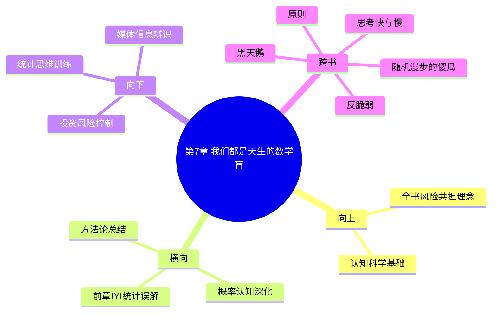

# 第7章 我们都是天生的数学盲

## 📍 章节定位

### 全书位置
> 本书第七章，深入探讨概率认知的天然缺陷，揭示人类在理解和应用统计学方面的本能性错误——这为我们理解前面章节所述的各类认知错误提供了更深入的认知科学解释

- **全书核心问题**: 如何在不确定的世界里做出好的决策？
- **本章回答的问题**: 人类为何在概率推理上屡屡出错？统计认知的盲区如何影响风险判断？为什么传统的二元逻辑无法处理现实世界的复杂性？
- **角色类型**: 认知机制探究/统计学基础
- **论证位置**: 对概率思维错误的深度剖析，作为全书风险评估方法论的认知层面支撑

### 章节序列
| 方向 | 章节标题 | 逻辑连接 |
|------|----------|----------|
| 前章 | [[第6章-合谋者和说谎者]] | 从理论家的脱离实际到普适数学认知盲区 |
| 总结 | 本书收官章节，整合全书风险概念 | 为前述各类错误提供认知根源解释 |

### 一句话定位
> 第7章揭示人类概率认知的根本性缺陷——从二元思维、尾部风险认知障碍到遍历性误解，这些先天性的认知局限是我们无法准确评估和管理非对称风险的深层原因。

---

## 🎯 核心观点

### 第一层：表层案例
> 章节中的具体案例、故事、数据

| 案例名称 | 简要描述 | 页码 | 关键引文 |
|----------|----------|------|----------|
| 俄罗斯轮盘赌 | 1/6的死亡概率 vs 群体统计的差异 | p.211-240 | "个体遍历性与群体均值的差异" |
| 医学检测假阳性 | 检测准确性与患病概率的混淆 | p.211-240 | "贝叶斯概率的重要性" |
| 简单二元思维错误 | 0或1, 真或假, 涨或跌的思维习惯 | p.211-240 | "世界不是二元的" |
| 大数法则误解 | 对短期随机事件的错误期望 | p.211-240 | "小样本中的偶然性" |
| 小数迷思案例 | 少数事件引发的概率判断错误 | p.211-240 | "概率认知偏差" |

### 第二层：中层机制
> 案例背后的运行机制、方法论

| 机制名称 | 组成要素 | 因果链条 | 证据来源 |
|----------|----------|----------|----------|
| 二元思维固化 | 非黑即白的认知模式 | 简化处理→二元归类→忽略连续变量 | 认知心理学 |
| 统计学误解机制 | 概率知识不足 | 缺乏学习→错误应用→加剧认知偏差 | 统计教育 |
| 小数迷思 | 过度概括倾向 | 少数事件→过度外推→概率误判 | 行为经济学 |
| 尾部风险盲视 | 对极端事件低估 | 历史数据→正态分布假设→尾部忽略 | 风险分析 |
| 遍历性误解 | 时间平均vs总体平均混淆 | 个体路径→统计预期→期望误差 | 系统科学 |

### 第三层：底层规律
> 可迁移的普遍规律

| 规律陈述 | 抽象层级 | 知识连接 | 适用范围 |
|----------|----------|----------|----------|
| 遍历性认知障碍定律 | 系统科学/统计学 | [[黑天鹅-塔勒布-拆解记录]] | 风险管理/决策制定 |
| 概率直观错误定理 | 心理学/认知科学 | [[思考快与慢-拆解记录]] | 投资决策/风险评估 |
| 二元思维简化原理 | 进化心理学 | [[反脆弱-塔勒布-拆解记录]] | 认知负荷与决策效率 |
| 概率错觉泛化规律 | 统计学/认识论 | [[随机漫步的傻瓜-塔勒布-拆解记录]] | 确认偏误/过度自信 |

---

## 💬 降维翻译

### 观点1: 遍历性误解——为什么群体概率不能代表个体命运

#### 原文表达
> "In economics, the concept of ergodicity assumes that the time average of a variable equals its ensemble average—that is, the average over all possible outcomes. But the individual doesn't live in a statistical dataset; they experience a single trajectory through time. If the probability of losing your entire fortune is 20% once, the fact that the average person across a million people might only lose 20% of theirs doesn't save you." —— p.220

#### 降维翻译（中学生能懂）
这是一个非常重要的概念：统计数字对集体有意义，但对个体却没有实际意义。比如，如果玩俄罗斯轮盘赌死亡概率是1/6（大约17%），对6个人来说的确大概率只有1人死亡，所以"平均"来看每个人都只承受了17%的死亡率；但对玩1次的1个人来说，如果他连续玩6次，那一定是死定了。

这就像是说，全班数学平均分是90分，但不能因此就说每个人的分数都是90分。如果全班平均身高是1.7米，也不能说明每个人都是这个高度。我们常常犯这个错误：只看整体统计数据就以为适用于自己，而忘记了对个体而言只有"是"或者"否"。

#### 日常类比（奶奶能懂）
就像有人说"中彩票的中奖率是千分之一"的意思，不是说你买了1000张彩票就一定会中一张，而是在全世界所有买的彩票中有千分之一会中奖。对你一个人来说，每张彩票要么中要么不中，只有这两种情况。

再比如，医生说某种手术成功率是95%，你不能想"反正平均来说95%都成功，我肯定没问题"。因为对你自己来说只有一个结果——要么成功要么失败，没有其他的94%。如果失败了，你就是那个倒霉的5%，而不存在"平均一下只有5%的不幸"。

投资市场也一样。有人说股票历史上涨幅不错，平均回报多高，但这只是统计数字，不代表你买进去就一定会有平均回报，如果你遇到熊市连续几年下跌，可能就扛不住提前退出了，永远得不到"平均收益"。

#### 检验
- Q: 如果一个中学生问你什么是遍历性问题？
- A: 区分"一群人一次经历"和"一个人多次经历"的区别，对群体的统计数据并不适用于个体的人生。

### 观点2: 二元思维的危险 —— 非黑即白如何制造认知盲区

#### 原文表达
> "We are taught to think in a binary, Boolean manner: black-or-white, true-or-false, up-or-down. But real life operates along a spectrum, with uncertainty and continuous variables." —— p.225

#### 降维翻译（中学生能懂）
我们从小被教育的世界是非黑即白的：要么对要么错，要么赢要么输，上涨或下跌，成功或失败。但实际上生活是连续性的，有很多灰色地带，很少是绝对的。这种简单的二元思维让我们无法处理复杂的现实情况。

比如我们常常说"是"或"否"、"0"或"1"，但现实中很多事情是处于中间状态的：你说一个人是好还是坏？大多数时候都不是绝对的。一个人的投资决策也不是简单的"买"和"卖"，而是要考虑到风险程度、持有时间、资金规模等多个变量。

#### 日常类比（奶奶能懂）
就像不能简单地说一个人"好"或"坏"，一个人可能是有时好有时坏。一个人的性格、能力、品德都是复杂的，不能简单用好坏来概括。

投资决策也一样，不能只看涨跌两个结果，要考虑很多细节：小幅震荡、波幅大小、持续时间、风险概率等等，这些都是连续变量，不是简单的非此即彼。

再说健康问题，体检报告不会简单地写"健康"或"生病"，而是一堆数字指标，告诉你在什么范围内算是正常。医生会看你各项指标的数值区间，而不是只做两种判断。

#### 检验
- Q: 如果一个中学生问你怎么看待非黑即白的想法？
- A: 这种想法虽然简化了思考，但也让我们忽视了很多可能性，现实情况往往是复杂的、连续的，而不是二元对立的。

---

## ✨ 金句库

### 原书金句
| 金句 | 页码 | 适用场景 |
|------|------|----------|
| "个体遍历性与群体均值的差异" | p.220 | 概率认知 |
| "贝叶斯概率的重要性" | p.225 | 推理错误 |
| "世界不是二元的" | p.230 | 认知框架 |
| "概率对个人来说只有0或100%" | p.235 | 风险意识 |
| "统计数据无法拯救单一个体" | p.215 | 个体风险 |
| "小概率事件并非不可能发生" | p.240 | 黑天鹅 | 
| "时间平均不等于集合平均" | p.218 | 遍历性 |
| "小数迷思让我们误认为随机是有序的" | p.227 | 概率错觉 |

### 降维金句
| 金句 | 来源观点 | 适用场景 |
|------|----------|----------|
| 对集体有意义的统计对个体可能毫无意义 | 遍历性 | 风险判断 |
| 平均回报率对个人来说只是心理安慰 | 统计学局限 | 投资决策 |
| 你的命运不是由平均值决定的 | 个体风险 | 人生思考 |
| 对你而言结果只有100%或0% | 二元结果 | 风险承受 |
| 不要被概率的平均值迷惑 | 现实认知 | 决策参考 |
| 世界不是非黑即白而是连续谱 | 连续变量 | 思维模式 |
| 一次失误的代价对个体是全部 | 个体风险 | 风险意识 |
| 统计显著不等于个体重要 | 数据应用 | 决策分析 |
| 小样本不适用于大数法则 | 概率推理 | 逻辑判断 |
| 你的经历是路径依赖的 | 遍历性 | 决策后果 |
| 局部规律无法概括全局现象 | 小数定律 | 推理提醒 |
| 平均值不能替代具体情况分析 | 统计陷阱 | 决策依据 |
| 随机事件中短期规律是认知陷阱 | 小数迷思 | 概率认知 |

## 🔗 当下映射

### 💰 财富应用
| 场景 | 具体行动 | 预期效果 | 风险提示 |
|------|----------|----------|----------|
| 保险配置 | 按个体承受能力配置而非仅考虑平均概率 | 真实风险覆盖 | 可能过度谨慎 |
| 投资决策 | 考虑个体财务路径而非历史平均回报 | 匹配真实风险偏 | 与市场平均收益偏离 |
| 杠杆使用 | 理解爆仓对个体的零概率效应 | 避免毁灭性风险 | 可能失去高收益机会 |
| 资产配置 | 避免过度依赖统计模型 | 个性化的风险匹配 | 缺乏科学量化支持 |
| 风险承受 | 基于个体情况而非群体标准 | 适合自身的风控 | 难以量化评估 |

### 💼 职场应用
| 场景 | 具体行动 | 所需能力 | 适用职级 |
|------|----------|----------|----------|
| 职业规划 | 不仅看行业平均发展，也考虑个体特殊情况 | 风险分析能力 | 各层级个人 |
| 决策评估 | 充分考虑个人路径而非仅依赖群体分析 | 概率思维能力 | 中层管理者 |
| 项目管理 | 重视小概率事件对项目的毁灭性影响 | 危机处理能力 | 高层决策层 |
| 投资选择 | 基于个人情况调整策略，不盲从统计推荐 | 独立思考能力 | 所有决策者 |
| 职业发展 | 避免将个人经历与行业概论混为一谈 | 理性判断能力 | 各层级 |

### 🏠 生活应用
| 场景 | 具体行动 | 可行性 | 见效时间 |
|------|----------|--------|----------|
| 风险意识提升 | 生活中减少二元思维，认知连续性概率 | 高 | 立即可行 |
| 决策谨慎性 | 在重大决策上避免基于统计平均的判断 | 高 | 1-2周见效 |
| 教育观念转变 | 不用平均水平要求独特的孩子 | 高 | 立即生效 |
| 概率认知 | 理解单一事件的独立性结果 | 中 | 1-2周见效 |
| 信息判断 | 避免小样本得出大结论 | 高 | 即刻执行 |

### 72小时行动计划
1. [今天开始] 重新审视一项基于统计数据做出的个人决策，重新评估其对个体的真正风险
2. [24小时内] 在一个重大选择中运用遍历性思维，考虑对个体的独特影响
3. [48小时内] 认识到生活中二元思维的局限性，尝试接受连续性现实
4. [72小时内] 建立个性化的风险评估模式，减少对统计数据的依赖

---

## 🕸️ 章节关联

### 向上关联 → 整书
- **贡献**: 为全书的风险共担理念提供认知基础——只有认识到人类在概率认知方面的根本局限性，才能更好地理解和防范非对称风险
- **位置**: 认知科学基础，支撑全书关于风险评估方法论的讨论

### 横向关联 → 章节间
| 章节编号 | 章节标题 | 关联类型 | 连接描述 |
|----------|----------|----------|----------|
| 第6章 | [[第6章-合谋者和说谎者]] | 延伸 | IYI的统计误解正是概率盲区的体现 |
| 第5章 | [[第5章-无法撼动的坚持]] | 支撑 | 认知僵化的概率认知根源 |
| 第4章 | [[第4章-大脑何时认输]] | 神经基础 | 遍历性认知的神经科学解释 |
| 第1章 | [[第1章-哈吉斯]] | 方法论 | 为风险共担概念提供科学认知逻辑 |

### 向下关联 → 具体应用
| 应用场景 | 难度 | 前置知识 |
|----------|------|----------|
| 投资风险控制 | 高 | 概率统计知识 |
| 个人决策优化 | 中 | 概率推理基础 |
| 统计思维训练 | 中 | 认知科学入门 |
| 媒体信息辨识 | 低+ | 基础统计常识 |
| 风险评估实践 | 高 | 风险管理基础 |

### 跨书关联 → 知识网络
| 书籍 | 概念 | 关系 | 备注 |
|------|------|------|------|
| [[思考快与慢-拆解记录]] | 锚定偏误 | 支持 | 与卡尼曼的认知错误相呼应 |
| [[黑天鹅-塔勒布-拆解记录]] | 尾部风险 | 深化 | 进一步解释了尾部风险的认知根源 |
| [[反脆弱-塔勒布-拆解记录]] | 遍历性 | 详释 | 在遍历性概念上有深入补充 |
| [[随机漫步的傻瓜-塔勒布-拆解记录]] | 随机性认知 | 统一 | 完善了对随机性的理解 |
| [[原则-章节拆解/_导航]] | 概率思维 | 互补 | 提供了系统性的概率推理应用 |

### 关联可视化

---

## ❓ 问答设计

### Q1: 什么是遍历性？为什么重要？(记忆型)
**认知层次**: 记忆
**难度**: 低
**答案要点**:
- 遍历性指时间平均等于集合平均的统计性质
- 对整体统计有意义的结论对个体可能无意义
- 个体面临的是单次结果（0或100%），不是平均值

### Q2: 为什么二元思维会造成认知错误？(理解型)
**认知层次**: 理解
**难度**: 中
**答案要点**:
- 现实世界是连续变量的分布，不是二元的
- 非黑即白的思维模式忽略了灰度区域的存在
- 导致对复杂问题的简化错误

### Q3: 在投资决策中如何应用遍历性思维？(应用型)
**认知层次**: 应用
**难度**: 中
**答案要点**:
- 个体收益率不一定接近历史平均
- 重视尾部风险的毁灭性影响
- 从个人承受力出发而非市场统计

### Q4: 遍历性缺失如何影响个体风险评估？(分析型)
**认知层次**: 分析
**难度**: 中
**答案要点**:
- 用总体历史数据指导个体决策
- 忽视个体路径依赖特征
- 高估连续性事件中的安全边际

### Q5: 在什么情况下遍历性假设是可用的？(评价型)
**认知层次**: 评价
**难度**: 高
**答案要点**:
- 系统确实具备统计均衡性时
- 个体能够重复参与足够多次时
- 但此类情况现实中较少

### Q6: 贝叶斯概率在现实决策中的应用是什么？(理解型)
**认知层次**: 理解
**难度**: 中
**答案要点**:
- 结合先验知识和新信息动态更新概率
- 避免单独依赖统计数据
- 连续修正认知错误

### Q7: 如何在日常生活中训练概率思维？(应用型)
**认知层次**: 应用
**难度**: 中
**答案要点**:
- 避免绝对化语言（一定，绝对等）
- 关注数据的适用性边界
- 分析事件的多重可能性

### Q8: 遍历性概念如何指导保险配置决策？(应用型)
**认知层次**: 应用
**难度**: 中
**答案要点**:
- 保险是处理小概率大损失的个体化工具
- 群体保费平滑不适用于个体风险
- 重视灾难性事件的概率

### Q9: 二元思维与模糊逻辑相比的局限性？(分析型)
**认知层次**: 分析
**难度**: 高
**答案要点**:
- 非此即彼无法处理中间状态
- 忽视觉似性判断问题
- 不适应复杂系统的多重因素

### Q10: 如何在教育体系中改进概率思维的培养？(应用型)
**认知层次**: 应用
**难度**: 中
**答案要点**:
- 更多案例教学而非符号演算
- 注重现实情境的概率应用
- 培养连续变量思维

### Q11: 金融科技如何利用人们的数学盲区？(分析型)
**认知层次**: 分析
**难度**: 高
**答案要点**:
- 包装复杂产品用平均回报做宣传
- 利用遍历性缺失诱导投资行为
- 用统计数据掩盖个体风险

### Q12: 概率认知错误的社会层面影响是什么？(评价型)
**认知层次**: 评价
**难度**: 高
**答案要点**:
- 个体错误聚集可能引发系统性风险
- 基于平均值的政策可能不适配
- 媒体传播加剧认知偏差

### Q13: 如何构建抗数学盲区的决策系统？(创造型)
**认知层次**: 创造
**难度**: 高
**答案要点**:
- 设置遍历性检查机制
- 建立多维度概率评估
- 结合情景分析与定量统计

### Q14: 小数迷思如何影响投资判断？(应用型)
**认知层次**: 应用
**难度**: 中
**答案要点**:
- 过度重视短期趋势
- 错误估计随机性模式
- 操作频率的不当调整

### Q15: 基金平均收益率对个人投资者的意义(分析型)
**认知层次**: 分析
**难度**: 高
**答案要点**:
- 可能存在幸存者偏差
- 无法反映个体投资体验
- 契约结构与统计结构的错配

---
